<!-- _class: lead -->
<!-- _paginate: false -->
<!-- _footer: "" -->

# Microsoft Foundry を SI で使う

## 技術選定とアーキテクチャ判断の基準

2026-09 改訂(第 4 版)/ 課内共有
本リポジトリの調査(survey)+実装検証(labs)の入口となる資料

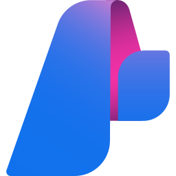

<!-- 発表の位置づけ: 課内で Foundry を調査した人はいるが情報が未集約、プロジェクト事例がなくアーキ検討に困っている、という状況への回答。この資料は全体の入口で、詳細はすべて survey の HTML に整備済み、と最初に伝える。第 4 版(2026-09-29)で最新状況に同期し、アーキ図を日本語+処理番号つきに描き直した。 -->

---

<!-- header: "§0 はじめに" -->

# 今日のゴール

持ち帰るのは機能の知識ではなく、3 つの「判断能力」

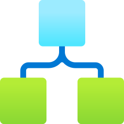

① 決める順序
後戻りコストの大きい順に <b>5 つのゲート(G1〜G5)</b>で閉じる

② 当たりの付け方
要件の言葉を <b>5 家族・22 パターン+選定 3 軸</b>に当てて 1〜2 案に絞る

③ 見積もりの現実
<b>「やってくれないこと」と廃止期限</b>を工数・リスクに乗せる

方針全機能の暗記は不要 —「<b>どこを見れば載っているか</b>」が分かれば提案は書ける

用語略語は初出でスペルアウトし、巻末の<b>付録 A7 に用語集</b>を用意した

2 層目の全体像: <a href="../survey/README.md">survey/README.md</a> — docs/survey/README.md

<!-- ゴールは知識の網羅ではなく判断力。3 つの判断能力を最後にもう一度出すので、ここでは骨組みだけ覚えてもらえばよい。以降のセクション §2 が①、§3〜§4 が②、§5 が③に対応する。 -->

---

# 資料の全体像(2 層構成)

この資料は入口(1 層目)— 詳細は 2 層目の調査資産と、動くコードに降りられる

このスライド(1 層目) 判断の骨組みだけを 45 分で

→

features その機能は<b>使えるのか</b> GA / プレビューを約 200 機能・出典つき。<b>月次更新</b>

architecture <b>どう組むか</b> 公式リファレンス+22 パターン+運用・移行。<b>四半期更新</b>

casebook <b>どこで詰まるか</b> 要件シナリオ 12 本+詰まりどころ索引 約 160

proposal <b>どう提案するか</b> ヒアリング・コスト手順・日本規制・公開事例

labs+選定ガイド 実装で<b>実証できたこと</b> 動くコード 17 本+<b>実行ガイド(runbook)</b>

- 各スライドの下部に、該当する 2 層目へのリンクとリポジトリ内パスを常設してある
- 「公式ドキュメント調査(survey)」と「実装検証(labs)」は**出典を分離** — 提案書で根拠を二本立てにできる

詳細: <a href="../survey/features/html/index.html">features</a> / <a href="../survey/architecture/html/index.html">architecture</a> / <a href="../survey/casebook/html/index.html">casebook</a> / <a href="../survey/proposal/html/index.html">proposal</a> / <a href="../../labs/runbooks.html">labs 実行ガイド</a> — docs/survey/README.md

<!-- どの資料がどの問いに答えるかだけ覚えてもらう。features は「使えるか」、architecture は「どう組むか」、casebook は「どこで詰まるか」、proposal は「どう提案するか」。labs は 2026-09 に全ラボへ実行ガイド(Markdown と人間確認用 HTML)を整備した。 -->

---

<!-- header: "§1 Foundry の現在地" -->

# 前提: Ignite 2025 の改称

検索で出てくる情報の大半は旧名義 — 新旧対応を頭に入れて読む

ブランドAzure AI Studio / Azure AI Foundry→Microsoft Foundry

付帯 AI サービスAzure AI Services→Foundry Tools

エージェント APIAssistants API(Threads / Runs)— 2026-08-26 廃止済→Responses API(Agents v2)

リソースモデルHub + Azure OpenAI + AI Services→Foundry リソース(単一)

SDK<code>azure-ai-inference</code> 等 — 2026-08-26 廃止済→<code>azure-ai-projects</code> 2.x + <code>openai</code>

ドキュメント/azure/ai-foundry/→/azure/foundry/(新)+ /azure/foundry-classic/

- 対応表なしで検索すると、**廃止済み API の記事で設計してしまう**(メンバーの過去調査も旧名義の可能性)

詳細: <a href="../survey/features/html/index.html">features/index(前提知識の節)</a> — docs/survey/features/README.md

<!-- 調査情報が未集約になる一因がこの改称。「Azure AI Foundry」で検索して出てくる記事はほぼ旧世代。Assistants API と azure-ai-inference は 2026-08-26 に廃止済みなので、それを前提にした記事は設計の根拠にしない。 -->

---

# 機能の全体像(8 カテゴリ)

全機能は 8 カテゴリの「地図」に整理済み — 位置だけ覚えれば引ける

01 プラットフォーム基盤
リソース / プロジェクト / アクセス制御 / ネットワーク / IaC

02 モデル
OpenAI / Claude / Grok 等 / デプロイタイプ / Model router / Foundry Local

03 Agent Service
Responses API / prompt・hosted エージェント / Memory / Routines / A2A

04 ツール・ナレッジ
File Search / AI Search / MCP / Toolbox / Foundry IQ

05 観測・評価
トレーシング / 評価器 / クラウド評価 / AI Red Teaming

06 ガードレール
コンテンツフィルター / Prompt Shields / 根拠性検出 / PII 検出

07 Foundry Tools
Speech(Voice Live)/ Document Intelligence / Content Understanding

08 開発者サーフェス
v1 API / SDK / azd / Bicep / Agent Framework / Dev Pack

- 各カテゴリとも GA / プレビュー+操作手段(ポータル / CLI / SDK / REST)を**全行出典つき**で整理済み

詳細: <a href="../survey/features/html/index.html">features/index</a> — docs/survey/features/01〜08-*.md

<!-- 個々の機能はこの場で覚えなくてよい。「この 8 分類のどこかに載っている」と分かればよい。番号は features のファイル番号と一致している。 -->

---

# GA / プレビューの現実

「GA」を鵜呑みにしない — 選定に効く 4 つの現実(2026-09 時点)

1 GA / プレビューは機能単位で混在
ポータルは GA でも中身はバラバラ。体系的な一覧は公式 <b>Feature readiness at GA</b> が唯一 — 提案前に必ず引く。公式ページ間の表記揺れ(例: Tool search は Azure ブログ GA / Learn プレビュー)は<b>GA 一覧表を正</b>とする

2 GA でも足元が動き続けている
2026-09 に GA 第 2 波(GA Routines・A2A v1.0)。一方で hosted エージェントは 07 に GA したばかりで旧基盤は 08-20 終了済、ビジュアル Workflows は<b>プレビューのまま 12-01 廃止</b>

3 CLI は一級市民ではない
専用の <code>az foundry</code> は存在しない。多くの機能が「ポータル+SDK / REST のみ」— 自動化の見積もりに直接効く。導入は <b>Foundry Dev Pack</b>(09-15 発表)で一括化

4 Claude(Anthropic)は独自制約つき
Opus 5.5 / Sonnet 5.5 まで GA(US Data Zone)。ただし Anthropic SDK+Marketplace 課金+<b>Foundry 組み込みコンテンツフィルター非適用</b>

詳細: <a href="../survey/features/html/index.html">features/index(ハイライトの節)</a> — docs/survey/features/README.md

<!-- この 4 点は提案の失敗パターンに直結する。特に④フィルター非適用の Claude と②Workflows 廃止は後のスライドでも繰り返し出てくる。GA=一般提供、SLA つきの正式リリースという意味も一言添える。2026-09-28 に claude-sonnet-5-5 が追加された。 -->

---

# 公式リファレンスアーキテクチャ

公式 3 本のうち本番の出発点は Baseline Chat 一択(Basic は PoC 用)

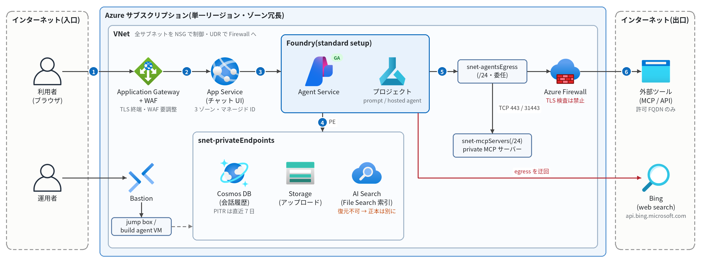

1利用者は唯一の公開入口 App Gateway へ

2WAF を通過しチャット UI(App Service)へ

3Private Endpoint 経由でエージェントを呼ぶ

4会話・ファイル・索引は自サブスクの PE 先に保持

5外部ツール呼び出しは egress サブネットから

6Firewall が許可した FQDN だけ外へ出す

詳細: <a href="../survey/architecture/html/01-official-baselines.html">architecture/01-official-baselines</a> — docs/survey/architecture/01-official-baselines.md

<!-- 公式リファレンスは 3 本: 公式-A Basic Chat(PoC 専用。記事自身が本番非推奨と明言)/ 公式-B Baseline Chat(上図。本番の出発点)/ 公式-C Landing Zones 版(全社共通基盤〈hub-spoke〉向け。実装コードは削除済み)。「公式の推奨構成はどれか」と聞かれたら Baseline 一択。公式-B は Well-Architected Framework が「AI ワークロードの推奨アーキテクチャ」と名指ししている。それ以外の「ガイド」「ソリューションアイデア」を事例記事と同様にリファレンスとして引用しない、という区別が提案の信頼性を作る。図の番号の流れは 2 層目の同図に説明がある。 -->

---

<!-- header: "§2 判断①: 決める順序" -->

# 判断①: 5 つのゲート

構成の決定は「後戻りコストの大きい順」— 5 つのゲートを上から閉じる

後戻りコスト 大 ▲

G1 データ・規制そのデータを、どこで、誰に処理させてよいかモデル・デプロイタイプ・外部ツール可否が決まる

G2 ネットワーク閉域か、パブリックか使える Foundry 機能の一覧が決まる(<b>後付け不可</b>)

G3 制御明示的な分岐・承認・再開が要るかポータル完結か、コードファーストかが決まる

G4 統合既存システムとの主従はどちらかプラットフォームとして使うか、部品として使うか

G5 ライフサイクルいつまで、誰が保守するかプレビュー可否・IaC の作り込み度が決まる

後戻りコスト 小 ▼

- 機能比較表から入ると G1 / G2 の手戻りで壊れる — **上から順に閉じる**のがこのガイドの背骨

詳細: <a href="../survey/architecture/html/03-decision-guide.html">architecture/03-decision-guide</a> — docs/survey/architecture/03-decision-guide.md

<!-- 「何から決めればいいか分からない」への回答がこの 5 ゲート。左帯の濃淡が後戻りコストの大きさ。以降のスライドは全部この順序の上に載っている。 -->

---

# G1 データ・G2 ネットワーク

G1・G2 は後付けできない — 最初のヒアリングで確定させる 4 点

閉域構成は作成後に変更できない 制約
BYO VNet 注入(自前の仮想ネットワークへの組み込み)は<b>リソース作成時のみ</b>。後から閉域要件が出ると作り直し

閉域では使えない機能が多い 閉域
トレース(VNet はプレビュー)/ Memory / 画像生成 / ブラウザ自動化など。File Search は公式表「対応」でも実測で失敗。<b>「閉域で使えない機能の一覧」から設計を始める</b>

「国内処理の完結」は選択肢が 1 系統 制約
geography 型(Standard / Regional Provisioned を Japan East / West に配置)のみ。<b>APAC Data Zone は APAC 域内のどこでも処理されうるため不可</b>。Global 比の価格プレミアムあり

Web 検索はコンプライアンス境界の外 制約
Grounding with Bing は DPA(Microsoft のデータ保護補遺)対象外・別課金。<b>規制業種では原則不可</b>として扱う

詳細: <a href="../survey/architecture/html/07-usecase-regulated-edge.html">architecture/07-usecase-regulated-edge</a> — docs/survey/architecture/07-usecase-regulated-edge.md

<!-- ヒアリングの地雷質問「閉域は要件か希望か」「データを国外に出せるか」はここに直結する。曖昧なまま構成を書かない。4 枚とも「あとで発覚すると作り直し」になる系。 -->

---

# G3〜G5 と机上決定

事例がなくても構成は机上で決められる — 公式が「試作省略可」と明言

G3 制御
分岐・ループ・承認・再開の明示制御が要るなら<b>コードファースト</b>

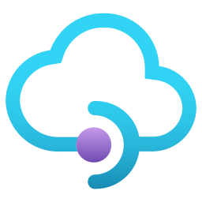

G4 統合
既存システムが主なら「<b>モデルとツールだけ借りる</b>」構成(Responses API のみ利用)

G5 ライフサイクル
顧客内製・非開発者運用なら<b>ポータル中心</b>。プレビュー許容度もここで確定

CAF(Cloud Adoption Framework: Microsoft のクラウド導入方法論)の明言 — 「Skip prototyping: <b>Yes</b>(複数試作の比較は不要)」「クリティカルな業務ロジックには決定的ワークフローを強制せよ(Foundry / MAF=Microsoft Agent Framework)」

- 実測が要るのは**品質とコストの実額だけ** — そこは評価ハーネスで回帰可能にする

詳細: <a href="../survey/architecture/html/11-decision-frameworks.html">architecture/11-decision-frameworks</a> — docs/survey/architecture/11-decision-frameworks.md

<!-- 「事例がないからアーキを決められない」への直接の回答がこのスライド。公式フレームワーク(CAF / Azure Architecture Center)が 2025-12 以降に整備され、机上で決められる範囲が大きく広がった。 -->

---

<!-- header: "§3 判断②: 要件 → パターンの当たり付け" -->

# 判断②: 推奨構成マップ

要件の言葉をまず 5 つの家族に当て、家族ごとの「本線」から始める

A 社内ナレッジ・RAG

本線<b>A2</b> AI Search 自前索引(部署ごとに見える文書を絞れる)

小さく始める <b>A1</b> File Search / M365 主体 <b>A4</b> / 複数ソース横断 <b>A5</b> Foundry IQ

B 業務自動化

本線<b>B2</b> 承認付き自動化(MAF hosted agent)

参照系だけ <b>B1</b> / 日単位の待ち <b>B3</b> / 権限分離 <b>B4</b> / ビジュアル保守 <b>B5</b>

C 顧客向け公開

本線<b>C1</b> 公開+WAF+APIM

複数顧客に販売 <b>C2</b> マルチテナント SaaS / 部門払い出し <b>C3</b>

D 規制・閉域・エッジ

本線<b>D1</b> BYO VNet(標準セットアップ)

政府クラウド <b>D2</b> / クラウドに出せない <b>D3</b> エッジ・切断

E 特化型

類型で決まる<b>E1</b> 音声 / <b>E2</b> 文書処理 / <b>E3</b> バッチ

<b>E4</b> 画像・動画生成 / <b>E5</b> Teams・M365 / <b>E6</b> 追加学習

- 完全版の一覧は**付録 A1**、要件の言葉からの逆引きは**付録 A6**。以降、本線と分岐点を図で見ていく

詳細: <a href="../survey/architecture/html/index.html">architecture/index(選定早見表)</a> — docs/survey/architecture/README.md

<!-- 全部は説明しない。「要件を聞いたらこの地図のどれかに落とし、緑の本線から始める」という使い方だけ伝え、A・B・C・D を代表として次のスライドから図で深掘りする。 -->

---

# A1: 最小構成で始める

部門 FAQ 程度なら A1 — prompt エージェントの設定だけで動く

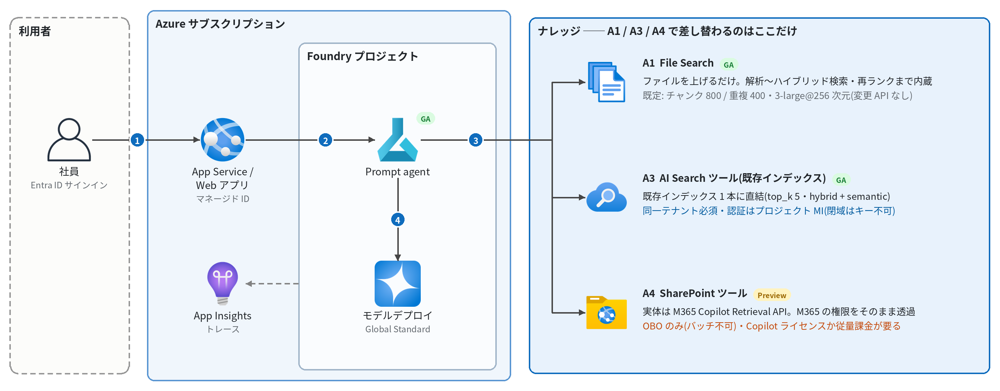

1社員が Entra ID でサインインして質問

2Web アプリがマネージド ID で agent を呼ぶ(Responses API)

3agent が A1 / A3 / A4 のどれかで検索

4モデルが検索結果から引用付きで回答

詳細: <a href="../survey/architecture/html/04-usecase-chat-rag.html">architecture/04-usecase-chat-rag</a> — docs/survey/architecture/04-usecase-chat-rag.md

<!-- SI 案件で一番多い類型。A1 で始め、権限制御や品質の要件が出たら次の A2 に上げる、という段取りごと覚えてもらう。File Search は埋め込み・チャンク設定が固定で、日本語の長文・表主体文書で品質が出ないことがある。 -->

---

# A2: 本番の標準形

「部署ごとに見える文書が違う」なら A2 一択 — AI Search 自前索引

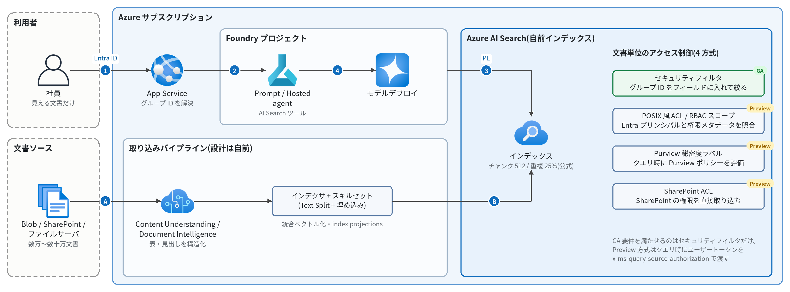

A文書を CU / DI で構造化して取り込む

Bインデクサがチャンク化・埋め込み・権限を投影

1社員が Entra ID でサインインして質問

2アプリがグループ ID を検索フィルタに反映

3agent が Private Endpoint 経由でハイブリッド検索

4権限内のチャンクだけを使ってモデルが回答

詳細: <a href="../survey/architecture/html/04-usecase-chat-rag.html">architecture/04-usecase-chat-rag</a> — docs/survey/architecture/04-usecase-chat-rag.md

<!-- A2 は GA 要件を満たしつつユーザーごとの文書絞り込み(セキュリティトリミング)ができる方式。PoC 段階で難しい文書 20〜30 件の検索品質を測ってから方式を確定する。 -->

---

# A: ナレッジの持たせ方 5 分岐

「データの場所と権限」で決まる — 上から順に聞けば 1 つに落ちる

ユーザーごとに見える文書が違う?はい →<b>A2</b> AI Search 自前索引(本番の標準形)

M365 / SharePoint が主データ源?はい →<b>A4</b> SharePoint ツール(権限透過。ライセンス前提・プレビュー)

既存の AI Search 索引資産がある?はい →<b>A3</b> AI Search ツール直結(索引設計は自前で持ち続ける)

複数ソースを複数エージェントで共有?はい →<b>A5</b> Foundry IQ(ナレッジベース API は GA・ポータルはプレビュー)

どれでもない(小規模・静的データ)→<b>A1</b> File Search 最小構成

⚠ Azure OpenAI On Your Data は 2026-10-14 廃止(あと約 2 週間) — 「モデルが直接データを読む」構成の既存提案書は要更新(移行先: Agent Service+Foundry IQ)

詳細: <a href="../survey/architecture/html/04-usecase-chat-rag.html">architecture/04-usecase-chat-rag</a> — docs/survey/architecture/04-usecase-chat-rag.md

<!-- RAG は「どれが優れているか」ではなく「データの場所・権限・運用体制でどれに落ちるか」。上から順に聞いていけば 1 つに落ちる。On Your Data 廃止は過去の提案書を持っているメンバーに一番効く情報。Foundry IQ の Serverless(Developer tier)は 2026-09-13 から課金開始済みなので PoC でも無料前提にしない。 -->

---

# B2: 承認付き業務自動化

「承認してから実行」は B2 — 承認待ちで止まり再開できる MAF ワークフロー

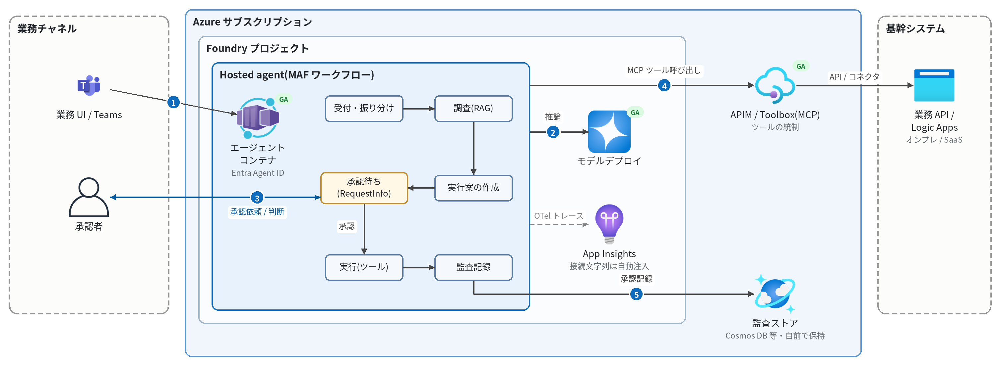

1業務 UI から依頼(Responses API)

2調査・実行案の作成でモデルを呼ぶ

3承認待ちで停止し、承認者へ依頼

4承認後、MCP 経由で基幹システムを操作

5誰が・いつ・何を承認したかを自前ストアへ

詳細: <a href="../survey/architecture/html/05-usecase-agent-automation.html">architecture/05-usecase-agent-automation</a> — docs/survey/architecture/05-usecase-agent-automation.md

<!-- 「AI に業務をやらせたいが勝手に実行されるのは困る」という要望はほぼ B2。HITL(Human-in-the-Loop)= 処理の途中に人の承認を挟む構成。承認ステップの設計(誰が・どの粒度で承認するか)が要件定義の中心になる。参照系(読み取りだけ)なら B1 のツール呼び出し構成で足りる。トレースは業務監査ログではないので、⑤の承認記録は自前ストアに残す。 -->

---

# B3: 長時間・確実な再開

承認待ちが日単位なら B3 — 再起動をまたいで確実に再開する

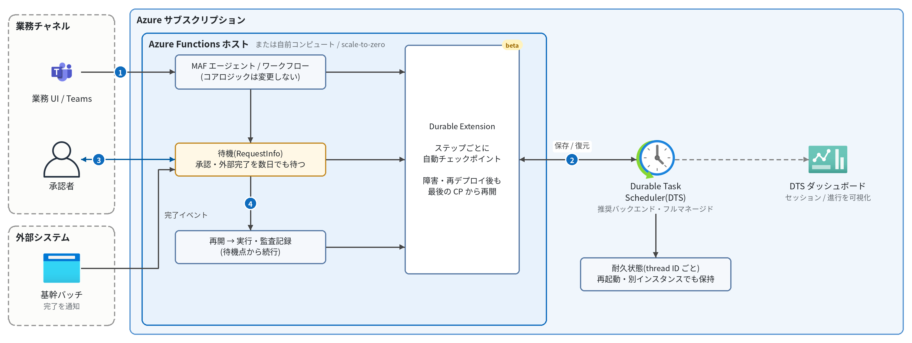

1業務 UI から依頼し、ワークフローを開始

2ステップごとの状態を DTS に保存(障害時は復元)

3承認者へ依頼し、数時間〜数日でも待つ

4承認・外部完了のイベントで待機点から再開

詳細: <a href="../survey/architecture/html/05-usecase-agent-automation.html">architecture/05-usecase-agent-automation</a> — docs/survey/architecture/05-usecase-agent-automation.md

<!-- B2 で足りるかをまず問い、待ち時間が日単位なら B3。DTS = Durable Task Scheduler(永続実行のスケジューラ)。hosted エージェントの中で完結させたい場合の公式手段は long-running hosted agents(プレビュー)で、DTS とは別系統。 -->

---

# B4: マルチエージェント

権限を領域ごとに分けたいときだけ B4 — まず単一で始める

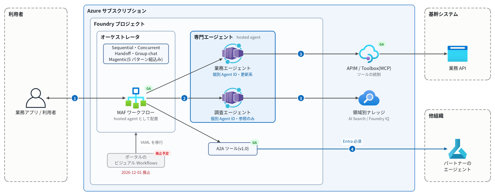

1業務アプリから依頼(Responses API)

2MAF がパターンに沿って専門エージェントへ振り分け

3各エージェントが自分の ID・権限でツール / ナレッジを使う

4他組織のエージェントへは A2A v1.0 で委譲

詳細: <a href="../survey/architecture/html/05-usecase-agent-automation.html">architecture/05-usecase-agent-automation</a> — docs/survey/architecture/05-usecase-agent-automation.md

<!-- 組織・権限の分離要件が出てから拡張する方向で提案する。エージェント間連携は A2A(v1.0 の a2a 型が 2026-09 に GA、v0.3 はプレビュー)。協調の型は §4 で扱う。 -->

---

# B5: ビジュアル Workflows 廃止

ビジュアル Workflows は 12-01 廃止 — ビジュアル保守が要件なら B5

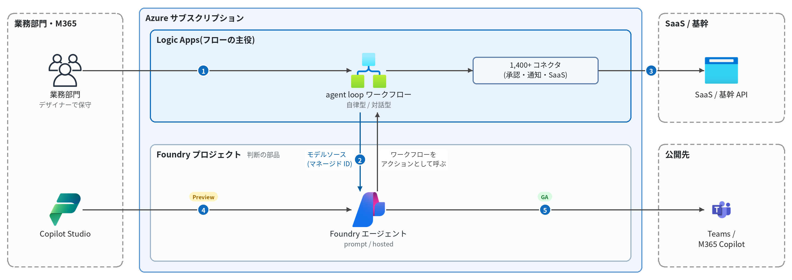

1業務イベントでフローが起動(業務部門が保守)

2判断部分は Foundry をモデルソースに使う

3コネクタで承認・通知・SaaS 操作を実行

4Copilot Studio から Foundry エージェントを呼ぶ

5Foundry エージェントを Teams / M365 Copilot に公開

詳細: <a href="../survey/architecture/html/05-usecase-agent-automation.html">architecture/05-usecase-agent-automation</a> — docs/survey/architecture/05-usecase-agent-automation.md

<!-- 長期案件でビジュアル Workflows を提案すると納品前に廃止が来る。「ポータルで全部作れます」と言わないためのスライド。Connected Agents は新 Agent Service に無い(移行ガイドの推奨は A2A ツール)。移行先は MAF(推奨)/ Logic Apps / A2A。境界線は付録 A4。 -->

---

# C2: 顧客向け公開・SaaS

主戦場は境界防御 — 会話の認可を Foundry はやってくれない

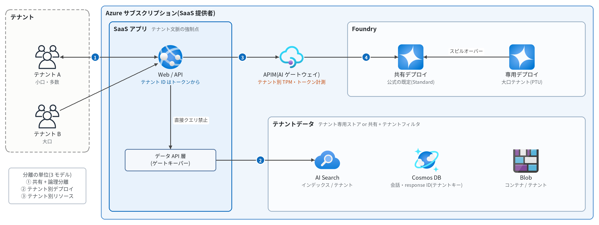

1トークンからテナント ID を確定(LLM に伝搬させない)

2データ API 層がそのテナントのデータだけを取得

3APIM がテナント別に TPM 制限・トークン計測

4既定は共有デプロイ、大口は専用デプロイへ

詳細: <a href="../survey/architecture/html/06-usecase-customer-facing.html">architecture/06-usecase-customer-facing</a> — docs/survey/architecture/06-usecase-customer-facing.md

<!-- 公開系は「Foundry の機能」より「Foundry がやらない境界防御」が主戦場。BOLA = Broken Object Level Authorization(他人の会話 ID を指定すると読めてしまう認可不備)。境界は WAF(Web Application Firewall)+APIM(Azure API Management)で、課金按分も APIM で自前。クォータはデプロイ単位なので分割で暴走を隔離する。 -->

---

# D1: 規制業種・閉域

閉域は「使えない機能の一覧」から設計する — 下限は固定費

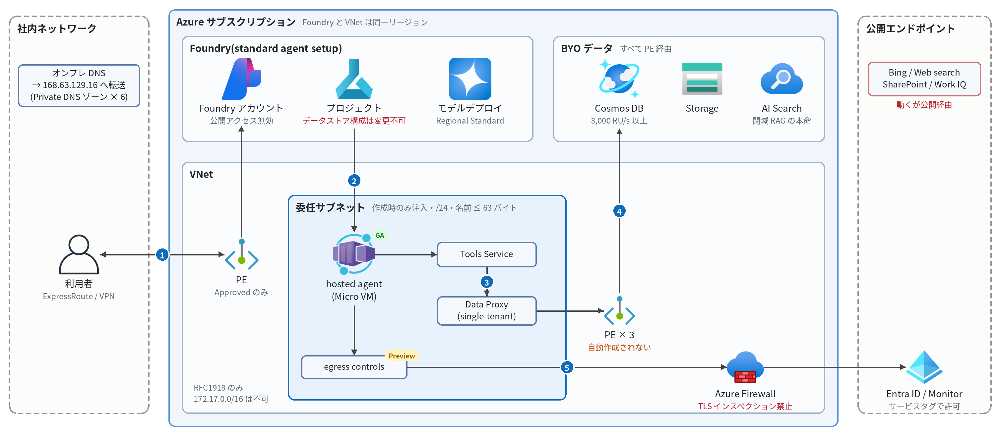

1社内から ER / VPN で PE へ(公開経路なし)

2委任サブネットに hosted agent セッションを起動

3ツール呼び出しは single-tenant の Data Proxy 経由

4PE 経由で BYO データへ(PE は個別に作成)

5送信は egress controls → Firewall で FQDN 許可

詳細: <a href="../survey/architecture/html/07-usecase-regulated-edge.html">architecture/07-usecase-regulated-edge</a> — docs/survey/architecture/07-usecase-regulated-edge.md

<!-- 金融・公共の案件はまずこの章。G2 ゲート(後付け不可)の実体がここにある。固定費(Firewall / Private Endpoint / APIM)を先に積む — トークン代より固定費が支配的。閉域×hosted エージェントは VNet 注入が実質必須(外部案件の実測)。 -->

---

# D3: エッジ・オンプレ

クラウドに出せないなら D3 — 3 つの形態から選ぶ

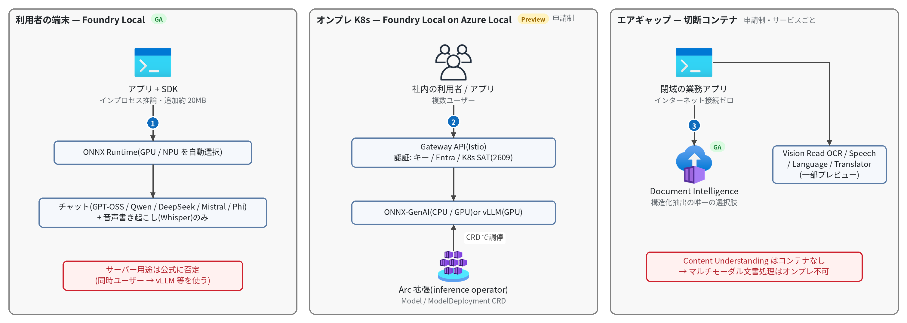

1端末内のアプリに埋め込んで推論(Foundry Local)

2社内の複数ユーザーへ推論 API を提供(Azure Local)

3接続ゼロの環境で文書・音声を処理(切断コンテナ)

詳細: <a href="../survey/architecture/html/07-usecase-regulated-edge.html">architecture/07-usecase-regulated-edge</a> — docs/survey/architecture/07-usecase-regulated-edge.md

<!-- そもそもクラウドにデータを出せない場合の 3 形態(Foundry Local / Azure Local 版 / 切断コンテナ)。D2(政府クラウド)は hosted エージェント・A2A が非対応(MCP は対応に変わった)。 -->

---

# E: チャット以外の 6 類型

「索引」と「落とし穴」だけ持ち帰る — 各類型の構成図は 2 層目にある

E1 音声エージェント
Voice Live API 落とし穴 SIP(電話網接続)非対応・音声にガードレール非適用。<b>Japan East に gpt-realtime 系なし</b>

E2 文書処理(IDP)
定型帳票は Document Intelligence / 非定型は Content Understanding 落とし穴 後者はページ課金・BYO モデル接続必須

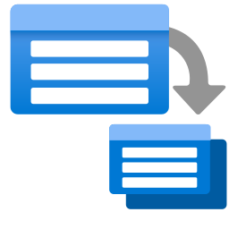

E3 大量バッチ
Batch デプロイ(Flex 処理はプレビュー) 課金 <b>50% 引き</b>だが 24 時間ターゲット・SLA なし

E4 画像・動画生成
非同期ジョブ 閉域 <b>閉域不可</b>。モデルのリタイアが早い

E5 M365 / Teams 連携
公開フロー(GA) 落とし穴 Bot Service が別途必要

E6 ファインチューニング
MLOps パイプライン 原則 <b>知識の追加は RAG、挙動・文体の変更が FT</b>

詳細: <a href="../survey/architecture/html/08-usecase-specialized.html">architecture/08-usecase-specialized</a> — docs/survey/architecture/08-usecase-specialized.md

<!-- 「チャット以外」の引き合いが来たときの索引。IDP = Intelligent Document Processing(帳票・契約書の構造化抽出)。FT = Fine-tuning(追加学習)。E6 の「知識は RAG、挙動は FT」は顧客への説明でそのまま使える一行。Voice Live は gpt-realtime-2.1 が 2026-09-29 に GA したが、Japan East では gpt-realtime 系が提供されていない(gpt-4o / 4.1 / 5.x 系を使う構成になる)。 -->

---

<!-- header: "§4 判断②: ポータルか、コードか、どのフレームワークか" -->

# 判断②: フレームワーク選定の 3 軸

「ポータル vs MAF vs LangGraph」と一列に並べない — 独立した 3 つの軸で決める

軸A 定義方法<b>Prompt エージェント</b> — 構成のみ・フルマネージド実行<b>Hosted エージェント</b> — 自前コードをデプロイ

軸B フレームワーク<b>MAF</b>LangGraphOpenAI Agents SDK自前コード

軸C 統合度フル統合<b>Responses API のみ</b> — モデルとツールだけ借りるFoundry 非依存

- Hosted エージェントは **MAF 専用ではない** — LangGraph 製エージェントを Foundry にホストする構成も公式サポートの正規ルート
- 「Foundry を使うか」と「MAF を使うか」は**独立した判断**。既存システム組み込み型の SI 案件では軸C の「Responses API のみ」が重要

詳細: docs/learning-plan.md §2(技術選定の全体像) — <a href="../learning-plan.md">learning-plan.md</a>

<!-- 「ポータル vs MAF vs LangGraph」と一列に並べた瞬間に議論が壊れる。3 軸が独立していることだけ持ち帰ってもらえれば、このセクションは成功。 -->

---

# レイヤー別「任せる / 作る」

16 のレイヤーごとに「Foundry に任せる / 自前で作る」を選ぶ — 全体表は付録 A5

凡例: <b>M</b> フルマネージド(Foundry 機能)/ <b>H</b> ハイブリッド / <b>S</b> 自前実装MHS

<b>L2 オーケストレーション</b> — 迷ったら Hosted エージェント(MAF / LangGraph)MHS

<b>L4 長期記憶</b> — Foundry Memory はプレビュー。本番は自前サマライズ+ベクトル検索MHS

<b>L5 ナレッジ / RAG</b> — 本番は AI Search 自前索引(A2 と同じ判断)MHS

<b>L11 ゲートウェイ</b> — 按分・レート制御が要るなら APIM(AI ゲートウェイ)MHS

<b>L16 IaC・CI/CD</b> — データプレーンは Bicep の外(§5 で詳述)MHS

- 「迷ったら」列は**既定値であって正解ではない** — 各レイヤーの全選択肢と根拠は 2 層目に整理済み

詳細(16 レイヤー全体): <a href="../survey/architecture/html/02-building-blocks.html">architecture/02-building-blocks</a> / 付録 A5 — docs/survey/architecture/02-building-blocks.md

<!-- 発表ではこの 5 レイヤーだけ。全 16 レイヤーの M/H/S 表は付録 A5 と architecture/02 にある。個別レイヤーの議論になったらそちらに戻る。 -->

---

# マルチエージェント協調の型

協調は 2 つの軸で 3 つの型に割り切れる — そもそも単一で始める

制御の流れを<b>コード</b>が決める(順序・分岐が事前に確定)→<b>グラフ型</b> — MAF Workflow。直列・並列・分岐・ループ

<b>LLM</b> が相手を選び、応答が<b>戻る</b>→<b>相談型(agent-as-tool)</b> — エージェントをツールとして呼ぶ

<b>LLM</b> が相手を選び、制御が<b>移る</b>→<b>担当交代(handoff)</b> — サポートのエスカレーション等

原則<b>単一エージェントで始める</b> — CAF はマルチにしてよい条件を 3 つに限定。Anthropic の公表値ではマルチはトークン消費 3〜10 倍

実測元アプリの「handoff」の多くは実は<b>固定シーケンス</b> — グラフ化で失うものはなく、型・テスト・可視化を得る

詳細: docs/tech-selection-guide.md §1-1 / <a href="../survey/architecture/html/11-decision-frameworks.html">architecture/11(公式 5 パターンとの対照)</a>

<!-- Azure Architecture Center の 5 パターン・LangChain の 4 型もこの 2 軸(制御を誰が決めるか×制御が戻るか)に還元できる。労力をかけて覚えるのはこの 1 枚でよい。 -->

---

# フレームワーク移行コスト

他フレームワークからの書き換えは実測済み — 移行は思ったより軽い

| 元フレームワーク → MAF | 書き換えの実態(14 本の移植から) |
|---|---|
| LangGraph(StateGraph) | ノード→Executor、条件エッジ→switch-case。型なし共有 dict が**型付きメッセージ**になる |
| OpenAI Agents SDK | handoff 1 行 → 構造化出力+switch-case の数十行。**ただしテスト可能になる** |
| AG2 旧 Swarm | 長寿命エージェントの「必要悪」が、ステートレスな純関数に縮退 |
| LangChain ルーター | 三段カスケード約 150 行が **Foundry IQ の宣言に消滅**(可観測性・単体テストは失う) |
| ADK + FastAPI 常時稼働 | hosted エージェント化で変わるのは周辺 3 点のみ。cron 配管は Routines(GA)へ |

- 共通パターン: **書き換えで元コードの欠陥が見つかる** — 型付きグラフへの移植自体がコードレビューとして機能する

詳細(全 14 行+検証元): docs/tech-selection-guide.md §1-3 — <a href="../tech-selection-guide.md">tech-selection-guide.md</a>

<!-- 「他フレームワークからの乗り換えは怖い」への実測回答。移行コストは思ったより一様に低いが、失うもの(LangChain ルーター行の可観測性など)も正直に書いてある。 -->

---

# 実証済みコードの対応表

「事例がない」には動くコードで答える — 型ごとにコード+テスト+IaC+実行ガイド

直列パイプライン

trend-analysis

Executor+エッジ、進捗イベント

並列実行+合流

mixture-of-agents

fan-out / fan-in エッジ

ルーティング / トリアージ

research-handoff

構造化出力+switch-case

自己補正 RAG

corrective-rag

採点→分岐→書き換え+AI Search

評価駆動の品質ループ

critique-loop

サイクリックグラフ+クラウド評価

常時稼働+スケジュール

hn-briefing-hosted

hosted エージェント+Routines

音声エージェント

claim-voice-live

Voice Live(3 層分離)

ガバナンス / 監査

governed-agent

middleware 3 種+ハッシュ連鎖監査

規模maf-ports 14 本で<b>オフラインテスト約 545 件</b> — ネットワークなしで数秒で全件回る

2026-09全ラボを <b>MAF 1.19 / openai 3.20</b> で再検証し、<b>実行ガイド(確認観点つき)</b>を整備

詳細: <a href="../../labs/runbooks.html">labs 実行ガイド索引</a> / labs/maf-ports/README.md(進捗表)/ docs/tech-selection-guide.md §3

<!-- 「事例がない」への課内の回答がこの表。顧客事例ではないが、動くコード+テスト+IaC 一式が型ごとにあり、実現可否確認と工数見積もりの根拠に使える。2026-09 に全ラボへ実行ガイド(runbook: Markdown と、確認観点をチェックボックスで追える HTML)を整備した。 -->

---

<!-- header: "§5 判断③: 見積もりに乗せる現実" -->

# 判断③: やってくれないこと

「Foundry がやってくれないこと」を先に顧客と合意する — 頻出 5 つ

1 災害復旧・フェイルオーバー
リージョン間の自動切替なし。<b>復旧は再構築</b> — アプリ層ルーティング+再構築パイプラインで埋める

2 会話のユーザー単位認可
BOLA 対策なし — アプリ側で所有権をリクエストごとに検証

3 blue-green / canary 配備
エージェントの段階的リリース機能なし — APIM 等のルーティング層で

4 部門・テナント別の課金按分
トークン計測は APIM の <code>llm-emit-token-metric</code> で自前実装

5 コストのハードリミット
公式明記: <b>機能が存在しない</b> — 予算アラート+自作の自動化で

⚠ フィルターはフェイルオープン
コンテンツフィルターが利用不能のとき<b>遮断せず素通しで HTTP 200</b> を返す — 規制業種は応答検証を必須実装に

- 全 12 項目は**付録 A2** — 提案書の**除外事項・前提条件欄にそのまま転記**できる形にしてある

詳細: <a href="../survey/architecture/html/index.html">architecture/index(全案件共通の前提の節)</a> — docs/survey/architecture/README.md

<!-- 「Foundry でできます」と言った後に効いてくるのがこのリスト。フェイルオープンは finish_reason と content_filter_results の検証で防ぐ。 -->

---

# 重要期限 2026–2027

提案書には賞味期限がある — 直近 4 つの廃止日は暗記する

2026-09-29 <b>本資料の基準日</b> ここから数か月に廃止が集中

2026-10-14 <b>On Your Data</b> RAG の既存提案書は要更新(同日 gpt-4.1-nano もリタイア)

2026-11-19 <b>o1 / o3 / o3-mini / o4-mini</b> 推論モデル旧世代。gpt-5.6 系へ

2026-12-01 <b>ビジュアル Workflows</b> ポータルでのマルチエージェント構成が消える

2026-12-09 <b>gpt-4o(2024-05-13)</b> 後継 gpt-5.6-sol。他の版は 2027-04-14

2027-03-31 Agents (classic) 状態データは移行されない

2027-04-20 prompt flow 新規開発に非推奨・MAF へ

運用PoC → 本番のスケジュールと<b>期限の衝突チェック</b>を提案フローに組み込む(期間内に廃止が来るなら最初から後継 API で作る)

済Hosted 旧基盤(08-20)・Assistants API(08-26)は<b>期限到来済み</b>。Claude 4.5 世代(10-19)等を含む<b>全体表は付録 A3</b>

詳細: <a href="../survey/architecture/html/10-migration-antipatterns.html">architecture/10-migration-antipatterns</a> / <a href="../survey/features/html/index.html">features/index(期限表)</a>

<!-- 「GA だから安心」ではなく「いつ消えるか」で見る。赤の 4 つは直近数か月なので暗記推奨。モデルのリタイア日は改定で前後する(2026-09 に gpt-4.1-nano が 2027-04 延長から 2026-10-14 へ再前倒し、o シリーズ・gpt-4o は後ろ倒し)ので、提案前にリタイア表の版を必ず確認する。 -->

---

# 提案のアンチパターン

踏みやすい 11 個のうち代表 3 つ — 言う前・見積もる前に確認する

「ポータルで全部できます」
ポータル完結は「単一エージェント+カタログツール+公開」まで。分岐・承認・ローカルテストは入らない 対処: ポータル完結の範囲とコードが要る範囲の線引き表を提案に添える

File Search で品質が出ないまま押し切る
チャンク・埋め込み設定は固定で、日本語長文・表主体の文書に合わないことがある 対処: PoC で難しい文書 20〜30 件を測り、駄目なら早期に AI Search へ

az CLI で自動化できる前提の見積もり
専用の <code>az foundry</code> は存在せず、多くの機能はポータル+SDK / REST のみ 対処: 自動化は Bicep / Terraform(基盤)+SDK / REST(データ操作)前提で工数を積む

詳細(全 11 個): <a href="../survey/architecture/html/10-migration-antipatterns.html">architecture/10-migration-antipatterns</a> — docs/survey/architecture/10-migration-antipatterns.md

<!-- 残り 8 個(閉域後付け・Claude のガードレール・プレビュー本番投入など)は既に他のスライドで触れたものも多い。設計レビュー前に 10 章を通読するのが実用的な使い方。 -->

---

# 実装のハマりどころ

「半日溶けるポイント」は先に知っておく — 実測 3 点+2026-09 の依存関係

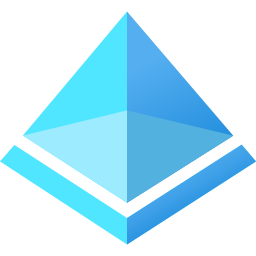

権限の反映が遅く・不均一 実測
RBAC の伝播は 5〜15 分。Bicep 作成のプロジェクトは実行 ID にモデル操作権限が<b>自動付与されない</b>(ポータル作成は付く)— 401 の切り分けで半日溶ける

IaC だけでは完結しない 実測
AI Search の索引や Memory ストアは Bicep / ARM で作れない。「<b>Bicep → セットアップスクリプトの 2 段デプロイ</b>」が定型

Memory は「書いた直後に読めない」 実測
同期書き込みではなく<b>非同期処理+既定 300 秒の遅延</b>(LRO+debounce)— UX とテストはその前提で設計する

SDK の版は「最新」で揃わない 2026-09
MAF の Foundry 連携パッケージは <code>azure-ai-projects&lt;2.7</code>・<code>mcp&lt;2</code> に上限固定。最新 SDK の新機能と同居できないことがある — <b>依存の上限を見積もり前に確認</b>

詳細(全 13 点+検証元): docs/tech-selection-guide.md §2(実装ナレッジ集) — <a href="../tech-selection-guide.md">tech-selection-guide.md</a>

<!-- 「運が悪いと半日〜1 日溶ける系」を tech-selection-guide §2 にまとめてある。実装フェーズに入るメンバーは §2 を最初に読むと元が取れる。4 枚目は 2026-09-29 のラボ最新化で確認した依存関係の制約(agent-framework-foundry 1.13.1 が azure-ai-projects<2.7.0 を要求、MAF core[all] と hosting が mcp<2 を要求)。 -->

---

<!-- header: "§6 提案実務への接続" -->

# 提案フロー

5 ステップの型に資料を対応済み — 明日から使える

1. ヒアリング 質問リストで要件採取 proposal/01

→

2. 実現可否 GA / プレビュー確認 features

→

3. 詰まりどころ 要件シナリオの落とし穴 casebook

→

4. 概算 月額レンジ試算 proposal/02

→

5. 規制説明 顧客説明の論点 proposal/03

- ヒアリング後のアウトプット: 構成候補 1〜2 案 / **プレビュー依存リスト** / **廃止日程との衝突チェック** / 概算月額レンジ / 規制・契約の論点リスト

詳細: <a href="../survey/proposal/html/index.html">proposal/index</a> / <a href="../survey/casebook/html/index.html">casebook/index</a> — docs/survey/proposal/README.md

<!-- 提案の型は既に 5 ステップに分解して資料化済み。「明日から案件で使える」状態であることを伝えるのがこのセクション。体制(知識ギャップ)の確認は proposal/04。 -->

---

# ヒアリングとコスト概算

ヒアリングは「地雷質問」から、コストは「固定費」から積む

ヒアリングシート(proposal/01)
Phase 0〜7・約 30 問。太字は<b>地雷質問</b>(聞き漏らすと提案後に手戻り) 例: 閉域は要件か希望か / データを国外に出せるか / ユーザーごとに見えるデータが違うか / 引き渡し後は誰が運用するか

コスト見積もり手順(proposal/02)
トークン推計(日本語 ≒ 1 文字 1 トークン。<b>エージェントは内部呼び出しで 2〜5 倍</b>)→ 構成要素チェック → 単価取得 → PTU 判断 → 削減レバー 単価はドキュメントに書かない主義(陳腐化対策)。モデル以外が過半になる構成は珍しくない

- 閉域構成の経験則: **固定費(Firewall / Private Endpoint / APIM)だけで月額の下限が決まる** — 先に固定費、後から変動費

詳細: <a href="../survey/proposal/html/01-hearing-sheet.html">proposal/01-hearing-sheet</a> / <a href="../survey/proposal/html/02-cost-estimation.html">proposal/02-cost-estimation</a>

<!-- ヒアリングシートは 60〜90 分の初回ヒアリングでそのまま使える。コスト手順は試算例 A / B / C(社内 RAG・顧客向け・文書処理バッチ)つき。PTU = Provisioned Throughput Unit(スループットの予約購入)。 -->

---

# 日本の規制対応

定番質問への「回答型」を用意済み — 登録状況は案件ごとに最新確認

ISMAP(政府・自治体)
政府情報システムのクラウド登録制度。<b>対象サービスの登録状況の確認が先決</b> — 登録リストは変動するため文書に固定値を書かない設計

FISC(金融)
金融機関の安全対策基準。対応整理+<b>閉域構成(D1)が前提</b>になりやすい

個人情報保護法
委託構成の整理+<b>abuse monitoring(不正利用監視の人手レビュー)の説明</b>を準備 — オプトアウト申請の要否を含む

3 省 2 ガイドライン(医療)
医療情報システムの安全管理ガイドライン。該当時の論点を整理済み

- 位置づけ: **G1(データ・規制)/ G2(ネットワーク)ゲートの日本ローカル具体化**

詳細: <a href="../survey/proposal/html/03-japan-compliance.html">proposal/03-japan-compliance</a> — docs/survey/proposal/03-japan-compliance.md

<!-- 規制の細部を暗記する必要はない。「定番質問の回答型がある」「登録状況は案件ごとに最新確認」の 2 点だけ覚えてもらう。 -->

---

# 公開事例

提案書で引ける事例を 21 件収録 — 公式出典のみ、数値は表現のまま使う

67%
<b>富士通</b> — 営業支援エージェントで生産性向上(Foundry 名指し)

50%
<b>NTT データ</b> — Fabric+Agent Service で市場投入を短縮

4 万件/日
<b>Air India</b> — 問い合わせを自動処理

- ほかに Sky / 大和証券 / トヨタ / ソフトバンク / JR 西日本 / Accenture(4 か月で 17 ユースケース)など**計 21 件**を出典 URL つきで収録
- 事例は「**同業種・同類型で公開実績がある**」ことの証明に使い、**アーキテクチャ選定の根拠には使わない**(その役割は公式リファレンス)

詳細(正確な表現+出典 URL): <a href="../survey/proposal/html/05-case-studies.html">proposal/05-case-studies</a> — docs/survey/proposal/05-case-studies.md

<!-- 効果数値は必ず出典の表現のまま引用する(「約」「目標」を落とさない)。「Foundry 事例が少なく見える」のは主に名義変遷の問題。二次記事は収録していないので、そのまま提案書に載せられる。 -->

---

<!-- header: "§7 クロージング" -->

# 情報の鮮度の保ち方

この情報は腐る — ウォッチすべき一次情報は 3 つ+公式ブログ

What's new in Microsoft Foundry
月次の新機能・ステータス変更 features の月次更新のトリガー。GA 発表は Azure 公式ブログにも載る

Feature readiness at GA
GA / プレビューの<b>最重要ページ</b> 公式ページ間で表記が食い違ったらここを正とする

Model retirement schedule
モデルのリタイア日 日付は往復改訂される — 提案書には表の版を併記

- 更新サイクル: **features 月次 / architecture 四半期 / casebook 月次 / proposal 随時**。**Ignite(11 月)・Build(5 月)直後は必ず更新**
- このスライド自体も survey の大型更新に合わせて改訂する(更新手順は明文化済み・生成 AI への依頼手順つき)

詳細(更新運用ガイド・ウォッチリストの URL): <a href="../survey/features/html/index.html">features/index</a> — docs/survey/features/README.md

<!-- 資料の信頼性は更新運用で決まる。誰でも更新できるよう手順は features README に明文化してあり、生成 AI に更新作業を依頼する手順まで書いてある。ms.date が据え置きでも本文が変わることがあるので、GitHub の公開リポジトリの差分で確認するのが確実。 -->

---

# まとめ

3 つの判断能力を、次の案件で「この 3 手」から使い始める

1 決める順序
<b>G1〜G5</b> を後戻りコストの大きい順に閉じる

2 当たりの付け方
要件の言葉 → <b>推奨構成マップ(A〜E の本線)</b>+<b>3 軸</b>(定義方法 / フレームワーク / 統合度)

3 見積もりの現実
「<b>やってくれないこと 12</b>」+<b>廃止期限</b>+実測のハマりどころ

1 ヒアリング proposal/01 のシートで要件採取(太字の地雷質問だけでも)

→

2 ゲートで絞る G1 → G5 の順に閉じ、A1〜E6 の 1〜2 パターンへ

→

3 裏取り features で GA / プレビュー確認+期限表と衝突チェック+casebook で詰まりどころ

最初の 1 手のテンプレート: <a href="../survey/proposal/html/01-hearing-sheet.html">proposal/01-hearing-sheet</a> / 要件の逆引きは付録 A6 — docs/survey/proposal/01-hearing-sheet.md

<!-- 3 手のうち 1 つでも次の案件で実行されたら、この勉強会は成功。質疑では「いま抱えている案件をこの型に当てるとどうなるか」を歓迎する。 -->

---

# 2 層目への入口 / Q&A

2 層目はビルド済み — リポジトリを clone してブラウザで開くだけ

機能一覧(features)
その機能は使えるのか docs/survey/features/html/

設計ガイド(architecture)
どう組むか・22 パターン・運用 docs/survey/architecture/html/

ケースブック(casebook)
要件シナリオ・詰まりどころ索引 docs/survey/casebook/html/

提案実務(proposal)
ヒアリング・コスト・規制・事例 docs/survey/proposal/html/

技術選定ガイド
実装で実証した判断基準 docs/tech-selection-guide.md

ラボ+実行ガイド
動くコード・テスト・IaC・確認観点 labs/runbooks.html

- 以降は付録: **A1** パターン完全版 / **A2** やってくれないこと全 12 項 / **A3** 期限全体表 / **A4** Copilot Studio 境界 / **A5** 16 レイヤー表 / **A6** 要件逆引き / **A7** 用語集

<a href="../survey/features/html/index.html">features</a> / <a href="../survey/architecture/html/index.html">architecture</a> / <a href="../survey/casebook/html/index.html">casebook</a> / <a href="../survey/proposal/html/index.html">proposal</a> / <a href="../tech-selection-guide.md">tech-selection-guide</a> / <a href="../../labs/runbooks.html">labs/runbooks</a>

<!-- 資料はここで終わり。以降は発表では飛ばす付録で、後日参照用の完全版テーブルと用語集を収録している。 -->

---

<!-- header: "付録" -->
<!-- _class: dense -->

# 付録 A1-1: ユースケース別パターン完全版(A・B)

| ID | パターン | オーケストレーション | RAG / ナレッジ | 主な決め手 |
|---|---|---|---|---|
| A1 | 部門内 FAQ チャット | Prompt agent | File Search | 速度優先。権限制御なし |
| A2 | 全社ナレッジ検索(本番) | Prompt / Hosted agent | **AI Search 自前索引** | ユーザーごとに見える文書が違う |
| A3 | 既存 AI Search 資産の活用 | Prompt agent | AI Search ツール直結 | 索引設計を自分で持ち続けたい |
| A4 | M365 / SharePoint 主データ源 | Prompt agent | SharePoint ツール(OBO) | 権限透過。M365 Copilot ライセンス前提 |
| A5 | 複数ソース横断・高精度 | 任意(MCP 経由) | **Foundry IQ** | 複数エージェントでナレッジ共有 |
| B1 | 単一エージェント+基幹 API | Prompt agent + Toolbox | 補助的 | 参照系中心 |
| B2 | 承認付き業務自動化(HITL) | **MAF hosted agent** | 調査工程で使用 | 「担当者が承認してから実行」 |
| B3 | 長時間・確実な再開 | MAF + Durable Extension + DTS | 任意 | 数時間〜数日停止して再開 |
| B4 | マルチエージェント(専門分化) | MAF workflows / A2A | 領域別 | 領域ごとに権限を分けたい |
| B5 | 業務フローエンジン主導 | Logic Apps / Copilot Studio | 任意 | 業務部門がビジュアルで保守 |

詳細: <a href="../survey/architecture/html/index.html">architecture/index</a> — docs/survey/architecture/README.md

---

<!-- _class: dense -->

# 付録 A1-2: ユースケース別パターン完全版(C・D・E)

| ID | パターン | オーケストレーション | RAG / ナレッジ | 主な決め手 |
|---|---|---|---|---|
| C1 | 一般顧客向けチャット | 任意 | 任意 | 不特定多数(公開 + WAF + APIM) |
| C2 | マルチテナント SaaS | Hosted agent(プロトコル 2.0.0) | テナント別索引 | 複数顧客に販売(APIM 必須) |
| C3 | 大規模・複数部門への払い出し | 任意 | 任意 | 部門別按分・キャパシティ(APIM 必須) |
| D1 | 規制業種・閉域 | Hosted agent or 自前 | AI Search 自前索引一択 | BYO VNet。閉域・監査・データ主権 |
| D2 | ソブリン(Azure Government) | Prompt agent 対応 | File Search / AI Search | hosted agent・A2A 非対応(MCP は対応) |
| D3 | エッジ・オンプレ | Foundry 非依存 | 自前 | Foundry Local / Azure Local 版 / 切断コンテナ |
| E1 | 音声エージェント | Voice Live API | 任意 | リアルタイム音声対話(SIP 非対応) |
| E2 | 文書処理・IDP | 非同期パイプライン | DI / Content Understanding | 帳票・契約書の構造化抽出 |
| E3 | 大量バッチ処理 | ジョブ実行基盤 | 不要 | Batch で 50% 割引 |
| E4 | マルチモーダル生成 | 非同期ジョブ | 不要 | 画像・動画生成(閉域不可) |
| E5 | M365 / Teams 連携 | Prompt / Hosted agent | Work IQ 等 | 業務ツール内で使わせる |
| E6 | ファインチューニング運用 | MLOps パイプライン | 併用推奨 | 挙動・文体をモデル側で変える |

詳細: <a href="../survey/architecture/html/index.html">architecture/index</a> — docs/survey/architecture/README.md

---

<!-- _class: dense tight -->

# 付録 A2: Foundry がやってくれないこと(全 12 項)

| # | やってくれないこと | 誰が埋めるか |
|---|---|---|
| 1 | リージョン間の自動フェイルオーバー・DR(復旧は再構築) | アプリ層ルーティング + Cosmos 継続バックアップ + 再構築パイプライン |
| 2 | 会話へのユーザー単位の認可(BOLA) | アプリ側で所有権をリクエストごとに検証 |
| 3 | エージェントの blue-green / canary | APIM 等のルーティング層 |
| 4 | モデルデプロイのラウンドロビン・サーキットブレーカー | APIM のバックエンドプール + circuit breaker |
| 5 | 部門・テナント別のトークン計測と課金按分 | APIM `llm-emit-token-metric` |
| 6 | コストのハードリミット | 予算アラート + 自作の自動化 |
| 7 | プロジェクト内のエージェント単位のアクセス制御 | アプリの認証認可層 / hosted agent の Entra Agent ID |
| 8 | `max_output_tokens` / `truncation` によるトークン制御 | 自前オーケストレーション |
| 9 | 閉域での Traces / Memory / File Search / Work IQ / 画像生成 等 | 自前実装または機能除外 |
| 10 | Claude モデルへのコンテンツフィルター | APIM `llm-content-safety` かアプリ層で Content Safety |
| 11 | 音声モデルへのガードレール | テキスト化後の経路で Content Safety |
| 12 | capabilityHost の更新(変更は削除・再作成) | IaC を「作り直し前提」で設計(後継の capability settings〈プレビュー〉も既存プロジェクトへの追加・変更は不可) |
| + | **コンテンツフィルターのフェイルオープン**(利用不能時は遮断せず素通しで HTTP 200) | 規制業種は `finish_reason` / `content_filter_results` の検証を必須実装に |

詳細: <a href="../survey/architecture/html/index.html">architecture/index(全案件共通の前提の節)</a> — docs/survey/architecture/README.md

---

<!-- _class: dense -->

# 付録 A3-1: 重要期限(今後の期限)

| 期限 | 対象 | 影響・移行先 |
|---|---|---|
| 2026-10-14 | Azure OpenAI On Your Data | 廃止。Foundry Agent Service + Foundry IQ へ |
| 2026-10-14 | `gpt-4.1-nano` | リタイア(2027-04-14 延長は撤回され**再前倒し**。リタイア表 2026-09-21 版) |
| 2026-10-19 | Claude 4.5 世代(sonnet / opus / haiku-4-5) | リタイア |
| 2026-11-19 | o1 / o1-pro / o3 / o3-pro / o3-deep-research / o3-mini / o4-mini | リタイア(日付を 11-19 に統一。後継 gpt-5.6-sol / terra) |
| 2026-12-01 | ビジュアル Workflows | 廃止。MAF / Logic Apps / A2A へ |
| 2026-12-09 | gpt-4o(2024-05-13) | リタイア(10-01 から延長。08-06 / 11-20 版は 2027-04-14) |
| 2027-03-31 | Agents (classic)(v1、Threads / Runs) | 廃止。Agents v2 へ(状態データは自動移行されない) |
| 2027-04-14 | `gpt-4.1` / `gpt-4.1-mini` | リタイア(nano は 2026-10-14 に戻った — 上の行) |
| 2027-04-20 | prompt flow | 廃止。新規開発に非推奨。MAF へ |
| 2028-09-25 | Azure AI Vision Image Analysis 4.0 / 3.2 | 廃止。DI / Content Understanding / Foundry Models へ |
| 日付未公表 | Agent Applications | 廃止予告済み |
| 予告 15 日のみ | Fireworks 系モデル(`FW-*`) | 標準 60 日でなく **15 日前通知**。本番の必須経路に置かない |

詳細: <a href="../survey/features/html/index.html">features/index(重要期限)</a> — docs/survey/features/README.md

---

<!-- _class: dense -->

# 付録 A3-2: 重要期限(到来済み — 既存資産の点検用)

| 期限 | 対象 | 状態・移行先 |
|---|---|---|
| ~~2026-08-20~~ | Hosted agents 初期プレビュー基盤 | サポート終了済。未移行なら新基盤へ再デプロイ |
| ~~2026-08-26~~ | Assistants API(Azure OpenAI) | 「The Assistants API is retired」。Responses API(Agents v2)へ |
| ~~2026-08-26~~ | `azure-ai-inference` SDK | 「retired on August 26, 2026」(beta のまま終了)。OpenAI SDK + v1 API へ |
| ~~2026-08-31~~ | NTT Data `tsuzumi-7b`(Legacy) | 後継 `tsuzumi2` へ。**日本語特化モデル案件で効く** |
| ~~2026-09-13~~ | Foundry IQ Serverless(Developer tier、プレビュー) | 課金開始済。PoC で無料前提にしない |
| ~~2026-09-15~~ | `MAI-Transcribe-1`(Speech 経由) | `MAI-Transcribe-1.5` / Voice Live の `mai-transcribe` は MAI-Transcribe-2 を指す |
| ~~2026-09-25~~ | Global Standard の flex → standard 自動フォールバック | 廃止済。Flex 非対応モデルへの `service_tier: flex` は HTTP 400 |
| 開始日の明記なし | hosted agent コンテナプロトコル 1.0.0 | 非サポート・ブロック中。2.0.0 へ |

- 期限到来済みの項目は「既存の提案書・コード・IaC に残っていないか」の点検リストとして使う(labs は 2026-09-29 に点検済み)

詳細: <a href="../survey/features/html/index.html">features/index(重要期限)</a> — docs/survey/features/README.md

---

# 付録 A4: Copilot Studio との境界線

乗り換えのシグナルは 3 つ — ただし両者は排他ではなく分業できる

30〜40 アクション超
オーケストレーターのツール選択精度が落ちる(公式明記)

多段の階層が組めない
connected agents を持つエージェントは他の connected agent になれない

決定的ワークフローが業務クリティカル
CAF が「Foundry / MAF の workflows を使え」と実装先を名指し

Copilot Studio 入口・M365 チャネル・業務部門が保守する部分

→

Foundry hosted agent 複雑な処理(connected agent として呼ぶ。接続はプレビュー、A2A 経由は GA だが要検証)

→

SI の受託範囲 「Copilot Studio で簡単に作れないエージェントの開発」— 公式の分業構成と一致

詳細: <a href="../survey/architecture/html/11-decision-frameworks.html">architecture/11-decision-frameworks</a> — docs/survey/architecture/11-decision-frameworks.md

<!-- 選定の決め手は機能でなく「誰が作り・誰が保守し・どこまで制御が要るか」(CAF デシジョンツリー)。 -->

---

<!-- _class: dense tight -->

# 付録 A5: 16 レイヤー × M / H / S 完全版(Foundry 機能 vs 自前実装)

| # | レイヤー | M(フルマネージド) | H(ハイブリッド) | S(自前) | 迷ったら |
|---|---|---|---|---|---|
| L1 | モデル提供 | Foundry モデルデプロイ | + APIM ゲートウェイ | 他クラウド / セルフホスト | M |
| L2 | オーケストレーション | Prompt agent | Hosted agent(MAF・LangGraph) | 自アプリ + Responses API | H |
| L3 | 会話状態 | Conversations | BYO Cosmos DB | 自前 DB | M→S |
| L4 | 長期記憶 | Foundry Memory(プレビュー) | Memory + 自前フィルタ | 自前サマライズ + ベクトル検索 | S(本番) |
| L5 | ナレッジ / RAG | File Search / Foundry IQ | AI Search + 自前索引 | 自前パイプライン | H |
| L6 | ツール実行 | ツールカタログ / MCP | Toolbox + 自前 MCP | アプリ内 function calling | H |
| L7 | コード実行 | Code Interpreter | Custom CI | ACA dynamic sessions 直 | M |
| L8 | ガードレール | Guardrails 既定 | カスタム | Content Safety API 自前呼び | M+S 併用 |
| L9 | ID・認可 | Foundry RBAC + Entra | OBO / Agent identity | 自前認可基盤 | M |
| L10 | ネットワーク | パブリック + Private Link | BYO VNet 注入 | 自前 VNet | 要件次第 |
| L11 | ゲートウェイ | クォータのみ | **APIM AI ゲートウェイ** | 自前プロキシ | H |
| L12 | 可観測性 | Foundry Tracing | OTel 自前計装 → App Insights | 自前ログ基盤 | M+H |
| L13 | 評価 | Foundry Evaluations | evals API を CI から | 自前ハーネス | H |
| L14 | UI・チャネル | Teams / M365 公開 | 自作 Web + Responses API | 既存システム組込み | 要件次第 |
| L15 | 実行基盤 | Hosted agents | Container Apps 等 | AKS / オンプレ | H |
| L16 | IaC・CI/CD | ポータル手動 | Bicep / Terraform + azd | 既存 IaC に統合 | S |

詳細(各レイヤーの全選択肢と根拠): <a href="../survey/architecture/html/02-building-blocks.html">architecture/02-building-blocks</a> — docs/survey/architecture/02-building-blocks.md

---

<!-- _class: dense tight -->

# 付録 A6: 要件の言葉の逆引き表

| 要件の言葉 | 当たりをつけるパターン |
|---|---|
| 「社内文書を検索して答える」 | **A1** で PoC → 品質が出なければ **A2** |
| 「部署によって見える文書が違う」 | **A2**(GA 要件を満たす唯一の方式) |
| 「担当者の承認を経て実行」 | **B2**(MAF hosted agent)。承認待ちが数日なら **B3** |
| 「複数のエージェントが協調する」 | **B4**。ビジュアル Workflows は選ばない(2026-12-01 廃止) |
| 「顧客向けに公開する」 | **C1**。WAF チューニングと BOLA 対策を工数に |
| 「複数のお客様に SaaS として提供」 | **C2**。APIM が事実上必須 |
| 「閉域で運用する」 | **D1**。「閉域で使えない機能一覧」から設計 |
| 「日本国内でデータ処理を完結」 | geography 型(Standard / Regional Provisioned、Japan East / West)。APAC Data Zone は不可。Global 比の価格プレミアムあり |
| 「音声で対話したい」 | **E1**(Voice Live)。SIP 非対応・Japan East の提供モデルに注意 |
| 「請求書を読み取って」 | **E2**。定型は DI、非定型は Content Understanding |
| 「月間 N 万件を処理」 | **E3**(Batch 50% 引き)+ PTU サイジング |
| 「既存システムに組み込む」 | オーケストレーションは自前(L2 の S)。Foundry の運用機能は使えなくなる |
| 「ロックイン回避」 | Foundry はモデル供給元として使い、抽象レイヤーを自前で持つ |

詳細: <a href="../survey/architecture/html/index.html">architecture/index(選定早見表)</a> — docs/survey/architecture/README.md

---

<!-- _class: xdense -->

# 付録 A7: 用語集(本資料で使う略語)

| 略語 | 意味 |
|---|---|
| GA | General Availability(一般提供)。SLA つきの正式リリース |
| RAG | Retrieval-Augmented Generation。文書を検索して根拠つきで回答させる方式 |
| HITL | Human-in-the-Loop。処理の途中に人の承認を挟む |
| MAF | Microsoft Agent Framework。コードでエージェントを組む公式フレームワーク |
| MCP | Model Context Protocol。エージェントとツールの標準接続規格 |
| A2A | Agent-to-Agent。エージェント間連携プロトコル(v1.0 は GA) |
| BOLA | Broken Object Level Authorization。ID 指定で他人のリソースに触れる認可不備 |
| FT | Fine-tuning。モデルの追加学習 |
| IDP | Intelligent Document Processing。帳票・文書の構造化抽出 |
| DI / CU | Document Intelligence(定型帳票)/ Content Understanding(非定型文書) |
| PTU | Provisioned Throughput Unit。スループットの予約購入 |
| OBO | On-Behalf-Of。ユーザー本人の権限での代理アクセス |
| LRO | Long-Running Operation。非同期の長時間処理 |
| SIP | Session Initiation Protocol。電話網接続の標準プロトコル |

| 略語 | 意味 |
|---|---|
| WAF(2 義) | Web Application Firewall(境界防御)/ Well-Architected Framework(Azure 設計原則集)。本文では都度明記 |
| APIM | Azure API Management。API ゲートウェイ |
| VNet / BYO VNet | 仮想ネットワーク / 自前 VNet の持ち込み(閉域構成) |
| PE | Private Endpoint。閉域接続の受け口 |
| CMK | Customer-Managed Key。顧客管理キーによる暗号化 |
| RBAC | Role-Based Access Control。ロールベースのアクセス制御 |
| MI | Managed Identity。Azure リソースに付与する実行 ID |
| IaC | Infrastructure as Code。インフラ構成のコード化(Bicep / Terraform) |
| CAF | Cloud Adoption Framework。Microsoft のクラウド導入方法論 |
| AAC | Azure Architecture Center。公式アーキテクチャ集 |
| ALZ | Azure Landing Zones。全社共通の Azure 基盤標準 |
| DPA | Data Protection Addendum。Microsoft のデータ保護補遺(契約文書) |
| DTS | Durable Task Scheduler。永続実行のスケジューラ |
| DR | Disaster Recovery。災害復旧 |

