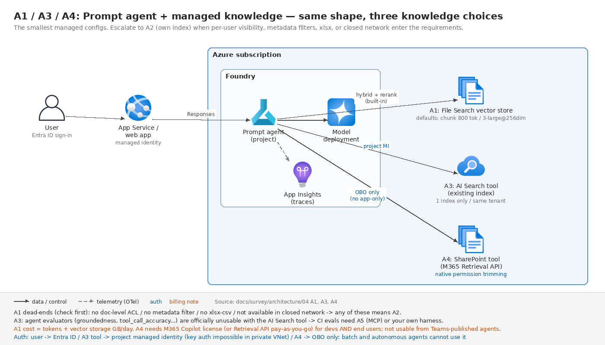
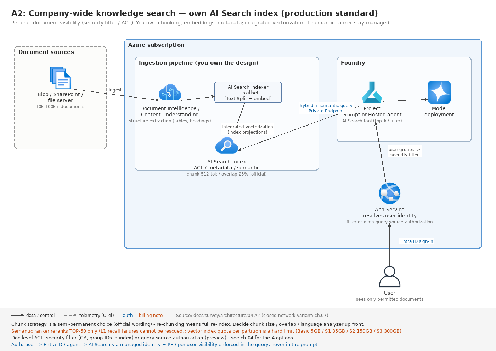
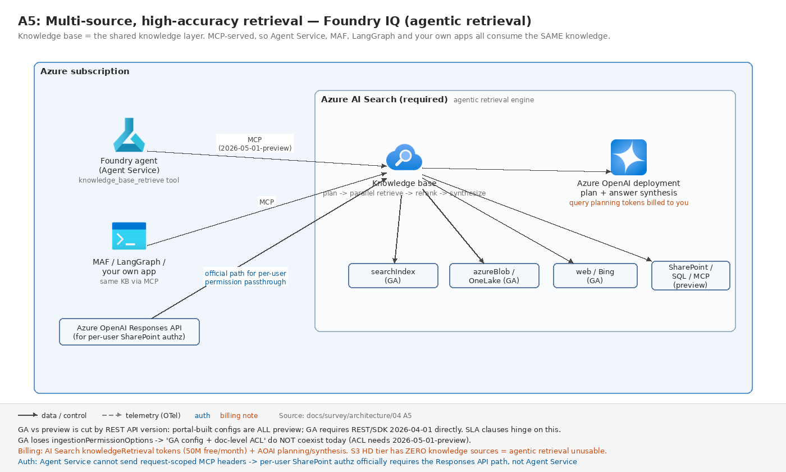

# 04. ユースケース編 A — 社内ナレッジ検索・RAG チャット

[← アーキテクチャ TOP](./README.md)

> **最終更新:** 2026-07-30(公式ドキュメントとの突合検証で訂正)

Foundry 案件で最も数が多い類型。**同じ「社内文書に答えるチャット」でも、権限要件・文書の性質・鮮度要件によって取るべきアーキテクチャが 5 通りに分かれる。**本ページはその 5 パターンを、選択理由と地雷つきで整理する。

## パターン一覧(先に全体像)

| # | パターン | RAG 方式 | 想定規模 | 決め手になる要件 |
|---|---|---|---|---|
| A1 | 部門内 FAQ チャット | File Search | 〜数千ファイル | 速度優先。権限制御なし |
| A2 | 全社ナレッジ検索(本番) | AI Search 自前索引 | 数万〜数十万文書 | **ユーザーごとに見える文書が違う** |
| A3 | 既存 AI Search 資産の活用 | AI Search ツール直結 | 既存インデックス | 索引設計を自分で持ち続けたい |
| A4 | M365 / SharePoint が主データソース | SharePoint ツール / remote SharePoint KB | M365 テナント内 | 権限透過。**M365 Copilot ライセンス or Retrieval API 従量課金** |
| A5 | 複数ソース横断・高精度 | Foundry IQ(agentic retrieval) | Blob + OneLake + Web 等 | 複数エージェントで同じナレッジを共有 |

**まず読むべき公式の選択ガイダンス**(Azure AI Search の RAG 概要より):

> **agentic retrieval を使うとき:** クライアントがエージェントかチャットボット / 可能な限り高い関連性が必要 / クエリが複雑または会話的 / 引用とクエリ詳細を含む構造化レスポンスが欲しい / **新規 RAG 実装**
> **classic RAG を使うとき:** **GA 機能のみが必要** / 単純さと速度が高度な関連性より優先 / **既存のオーケストレーションコードを保持したい** / **クエリパイプラインのきめ細かい制御が必要**
> そして「**新規 RAG 実装は agentic retrieval から始めよ**」。

ただし後述のとおり **Foundry IQ / agentic retrieval は「ポータル経由だと全部プレビュー」**という重大な条件が付く。SLA 条項を書く案件ではここが分岐点になる。

> **⚠ 前提が 1 つ変わった:** **Azure OpenAI On Your Data は非推奨で、2026-10-14 にリタイアされる。**公式は「On Your Data のワークロードは **Foundry Agent Service + Foundry IQ** へ移行することを推奨する」と明記している。**「オーケストレーターを挟まず、モデルが直接データストアを読む」構成は新規設計で選べない。**本ページの 5 パターンはいずれもオーケストレーター型(エージェントまたは自アプリ)を前提にしている。

---

## A1. 部門内 FAQ チャット(File Search・最小構成)

**想定:** 情シスや人事が持つ規程・マニュアル・FAQ を数百〜数千ファイル。全社員が同じ文書を見てよい。2〜4 週間で立ち上げたい。



```
 [ユーザー] ─ Entra ID 認証 ─> [App Service / Web アプリ]
                                     │ マネージド ID
                                     ▼
                          [Foundry プロジェクト]
                             ├ Prompt agent
                             ├ File Search ツール ─> vector store(Microsoft 管理 or BYO Blob+AI Search)
                             └ モデルデプロイ(Global Standard)
                                     │
                                     ▼
                          [Application Insights](トレース)
```

**なぜ File Search でよいか:** ファイルを上げるだけで、解析 → チャンク → 埋め込み → 索引 → **ハイブリッド検索 + 再ランク + クエリ書き換え**まで内蔵。引用も `url_citation` として自動生成される。ここまで自前で作ると数人月かかる。

**受け入れることになる既定値:**

| 項目 | 既定値 |
|---|---|
| チャンクサイズ | **800 トークン** |
| チャンクオーバーラップ | **400 トークン(50%)** |
| 埋め込みモデル | **text-embedding-3-large @ 256 次元** |
| コンテキストへの最大チャンク数 | 20 |

> text-embedding-3-large の完全次元は 3,072 なので、**256 次元は 1/12 に圧縮された構成。**Matryoshka 表現で精度低下は限定的とはいえ、**専門用語が密な日本語技術文書では検索精度に効く可能性がある。**この次元数を変更する API パラメータは公式ドキュメントに存在しない。

**上限:** 10,000 ファイル / ストア、**エージェントに 1 ストアのみ**、最大ファイルサイズ 512MB、全アップロード合計 300GB、バッチ追加は 1 回 500 ファイルまで(要確認: 公式 limits ページに記載なし)。

**このパターンが成立しない条件(先に潰す):**

- **xlsx / csv が非対応。**対応形式はテキスト系と `.docx` `.pdf` `.pptx` などで、**表形式データが主体なら A2 以上に上げる。**
- **ドキュメントレベルのアクセス制御が原理的に不可能。**vector store に ACL の概念がない。「部署によって見える文書が違う」が要件に入った瞬間に A2 へ。
- **メタデータによるフィルタができない。**年度別・機密区分別の絞り込みが要るなら A2/A3。
- **閉域(ネットワーク分離)では File Search が使えない。**公式の互換性表で「Not supported / 開発中」と明記されている。閉域案件では A2/A3 に倒す。
- **Italy North と Brazil South では利用不可。**
- **会話ヘルパーで作った vector store は「最終利用から 7 日」で自動失効する。**失効すると当該会話の応答生成が**失敗する。**長期に同じ会話を続ける想定なら、エージェント側の vector store を使う。

**PoC で必ずやること:** **代表的に難しい文書を 20〜30 件選んで検索品質を測る。**チャンク 800 トークン(既定)が効かないタイプ(長文契約書、条項参照が多い規程、表主体の技術文書)は早期に判明する。ここで駄目なら A2 へ切り替える。**切り替えコストは後になるほど上がる。**

**コスト構造:** モデルトークン + **File Search のベクトルストレージ(GB/日)** + App Insights 取込。Standard セットアップにすると Cosmos DB(最低 3,000 RU/s)・Storage・AI Search のコストが加わる。

---

## A2. 全社ナレッジ検索(AI Search 自前索引・本番の標準形)

**想定:** 数万〜数十万文書。**ユーザーの所属や役職によって見える文書が違う。**閉域または Private Link。長期運用。

これが **SI 案件で最も現実的な着地点**になることが多い。チャンク戦略・埋め込みモデル・メタデータ・フィルタ・ACL を完全に握りつつ、統合ベクトル化・インデクサ・セマンティックランカー・ハイブリッド検索はマネージドのまま享受できる。



```
 [文書ソース: Blob / SharePoint / ファイルサーバ]
        │
        ▼  取り込みパイプライン
 [Document Intelligence Layout / Content Understanding スキル]  ← 構造抽出(表・見出し)
        │
        ▼
 [AI Search インデクサ + スキルセット(Text Split + 埋め込み)]  ← 統合ベクトル化
        │                                    index projections でチャンク→親子投影
        ▼
 [Azure AI Search インデックス]  ← ACL / メタデータ / セマンティック構成を自分で設計
        ▲
        │ Private Endpoint
 [Foundry プロジェクト: Prompt agent or Hosted agent]
        │   └ Azure AI Search ツール(top_k / query_type / filter を指定)
        ▼
 [App Service]  ← ユーザー ID を解決し、検索フィルタまたは
        ▲          x-ms-query-source-authorization に反映
 [ユーザー]
```

### 索引設計で押さえる数値

**チャンキングの公式推奨:**

> チャンクサイズは **512 トークン(約 2,000 文字)**、オーバーラップは **25%(= 128 トークン)** から始めよ。

Text Split スキルを文字ベースで使うなら `textSplitMode: pages` / `maximumPageLength: 2000` / `pageOverlapLength: 500`。パラメータの範囲は `maximumPageLength` が最小 300・最大 50,000・既定 5,000、`pageOverlapLength` は **`maximumPageLength` の半分未満**が必須。**`defaultLanguageCode` は日本語で重要**(単語途中での分割を避ける)。

> **⚠ 注意点が 2 つ。**(1) 同一ページ内でオーバーラップ推奨が「10〜15%」と「25% から始めよ」で食い違っている。(2) **トークナイザに `o200k_base`(GPT-4o 系)が非対応**で、`cl100k_base` 等しか選べない。GPT-4o 系のトークン化と完全一致するチャンキングはできない。

**チャンク戦略は準恒久的な選択である**と公式が警告している:

> **チャンキングのアプローチは、ソリューション設計全体における準恒久的(semipermanent)な選択である。**

**セマンティックランカーの上限(効くが万能ではない):**
- BM25 / RRF の結果から **上位 50 件のみ**が再ランクに進む。
- 各文書の要約モデル入力は**最大 2,000 トークン**。フィールド別配分は **title 128 / keywords 128 / content 残り**で、超過分は切り捨て。**→ セマンティック構成のフィールド順序が意味を持つ。**
- スコア `@search.rerankerScore` は **0.00〜4.00**。ただし「インフラ条件やランキングモデル更新で分布がわずかに変動しうる。**閾値を細かくしすぎるな**」と公式が警告している。**閾値をハードコードしない。**
- **「セマンティックランカーはコーパス全体に対してクエリを再実行できない。」→ L1(BM25 / ベクトル)の再現率が悪ければリランカーでは救済できない。**

**ハイブリッド検索:** RRF の定数 **k = 60**(ベクトル検索の近傍数 k とは別物)。`maxTextRecallSize` の既定は **1,000** で全文検索はそこで打ち切られる。**セマンティックランカーを使うならベクトルクエリの `k` を 50 に設定して入力を最大化せよ**というのが公式推奨。

**ベクトルインデックスのクォータ(パーティション単位、ハードリミット):** **2024-04-03 以降に作成したサービス**の場合、Basic 5GB / S1 35GB / S2 150GB / S3 300GB(それ以前に作成したサービス、および Israel Central / Qatar Central / Spain Central / South India は旧上限のまま)。「上限超過後のインデックス試行は失敗する」。緩和策はベクトル文書削除・次元削減・パーティション追加のみ。

### ドキュメントレベルアクセス制御の 4 方式

| 方式 | 仕組み | ステータス |
|---|---|---|
| **セキュリティフィルタ** | ID を文字列フィールドに入れてクエリフィルタで絞る | **GA。API 非依存・push モデルでも使える** |
| POSIX 風 ACL / RBAC スコープ | Entra プリンシパルと索引済み権限メタデータを照合 | プレビュー |
| Purview 秘密度ラベル | インデクサがラベル抽出 → クエリ時に Purview ポリシー評価 | プレビュー |
| SharePoint (M365) ACL | SharePoint 権限を直接取り込み | プレビュー |

**GA 要件を満たせるのはセキュリティフィルタだけ。**カスタム ID システムや非 Microsoft のセキュリティ基盤を使う案件でも、これが公式推奨。

**設計上の重要な制約:**
- **権限変更はインデックスに同期されて初めて反映される。**Entra グループメンバーシップや ACL の変更は次回インデクサ実行後。
- **チャンク分割している場合、権限メタデータフィールドを indexer field mappings から index projections へ移す必要がある。**これを忘れるとチャンクレベルの参照がフィルタされない — **静かに漏れるタイプの事故。**
- Purview 秘密度ラベル方式はシングルテナントのみで、**Autocomplete / Suggest API が使えなくなる。**

### 取り込みパイプラインの選択

| 方式 | 使うとき | 注意 |
|---|---|---|
| **インデクサ + 統合ベクトル化**(pull) | ソースが Blob / Azure SQL / Cosmos DB / ADLS で、抽出と埋め込みの間に文書ごとの業務ロジックが要らない | **最小スケジュール間隔は 5 分**(全ティア) |
| **自前 push** | **5 分未満の鮮度が必要**、ソースがインデクサ非対応、接続と文書取得の完全制御が要る | **1 文書約 16MB 上限**(インデクサ経由なら S1 で 128MB、S2 以上で 256MB) |
| Logic Apps | インデクサに無いコネクタ(SharePoint / OneDrive / Azure File Storage / Service Bus 等)が要る | インデックススキーマ固定、テキスト抽出のみ、**削除検出なし(孤児の手動掃除)**、重複文書が既知のプレビュー問題 |
| Durable Functions | 文書ごとの分類・業務ロジックを挟む | 公式リファレンスあり。**埋め込み工程を Batch デプロイに回してコスト削減**が推奨されている |

**絶対ルール:** 「**AI enrichment または統合ベクトル化が要件なら、pull モデル(インデクサ)を使わなければならない。スキルセットはインデクサに紐づき単独で実行できない。**」

**文書前処理は Content Understanding が新しい既定路線:**

> このドキュメントは Document Layout skill を使う**既存パイプライン**向けである。**新しいスキルセットには Azure Content Understanding skill を使え。**

| | Document Layout skill | **Content Understanding skill** |
|---|---|---|
| 表・図の出力 | **プレーンテキスト(情報欠落)** | **Markdown** |
| ページ跨ぎの表 | 分断される | **単一単位で抽出** |
| チャンクのページ跨ぎ | 不可 | 可 |
| 無料枠 | インデクサあたり 20 文書/日 | **なし(全文書課金)** |

**両スキル共通の罠:** **レイアウト処理に 5 分以上かかる文書はタイムアウトし、しかも課金される。**

**⚠ ページ上限の逆転:** Content Understanding は **300 ページ**、Document Intelligence Layout は **2,000 ページ**。超長尺 PDF は上流で分割するか DI Layout を使う。

### 閉域構成での隠れた地雷

**インデクサの `executionEnvironment` を `"Private"` にしないと、マルチテナント実行にフォールバックして Private Endpoint を越えられず、「サイレントに失敗して空インデックス」になる。**「Import data」ウィザードが生成するインデクサが該当する。ただし **indexed knowledge source とその自動生成インデクサは private execution environment に非対応**なので、Foundry IQ の自動生成パイプラインと閉域は相性が悪い。

インデクサの最大実行時間はパブリック実行環境で **2 時間**、プライベート実行環境で **24 時間**。

---

## A3. 既存 AI Search 資産の活用(AI Search ツール直結)

既に AI Search のインデックスがある場合、エージェントから直接つなぐのが最短。構成は A1 と同型(ナレッジが AI Search ツール直結に変わるだけ)— [A1 の統合図](./images/a1-prompt-rag-variants.png)を参照。

| パラメータ | 既定 |
|---|---|
| `top_k` | **5** |
| `query_type` | **`vector_semantic_hybrid`**(他に `simple` / `vector` / `semantic` / `vector_simple_hybrid`) |
| `filter` | エージェントの全クエリに適用される |

**制約:**
- **1 つのインデックスしかターゲットにできない。**複数インデックスを横断したいなら A5(Foundry IQ)か、自前オーケストレーション。
- AI Search リソースと Foundry エージェントは**同一テナント必須。**
- **Basic エージェントデプロイはプライベート AI Search / パブリックアクセス無効の AI Search をサポートしない。**閉域なら VNet 注入した Standard エージェントが必要。
- プライベート VNet では**キー認証不可**で、Entra のプロジェクトマネージド ID が必須。
- **プライベート AI Search をエージェントツールに使う場合、新 Foundry ポータルで新規にエージェントを作る必要がある**(classic ポータルの旧 Agent Service では非対応)。

**⚠ 評価との相性(見落とされやすい):** 公式にこう明記されている。

> `tool_call_accuracy` / `tool input accuracy` / `tool_output_utilization` / `tool_call_success` / `groundedness` の各評価器は、エージェントの会話に **Azure AI Search / Bing Grounding / Bing Custom Search / SharePoint Grounding / Code Interpreter / Fabric Data Agent / Web Search**(計 7 ツール)への呼び出しが含まれる場合は使うな。

完全サポートは **File Search / Function Tool / MCP / Knowledge-based MCP。**つまり **「Foundry Agent + AI Search ツール」はエージェント評価の自動化が弱い。**評価を CI ゲートにする要件があるなら、A5(Foundry IQ = MCP 経由)を選ぶか、評価を自前ハーネスで組む。

---

## A4. M365 / SharePoint が主データソース

構成は A1 と同型(ナレッジが SharePoint ツールに変わるだけ)— [A1 の統合図](./images/a1-prompt-rag-variants.png)を参照。**成立条件が厳しいので、まずここを確認する:**

- **Microsoft 365 Copilot ライセンスが開発者・エンドユーザー双方に必須**(または Copilot Retrieval API の従量課金を有効化)。**ライセンス費が案件コストに乗る。**
- **ユーザー ID 認証(OBO)のみ。アプリ専用(サービスプリンシパル)認証は不可。**→ **バッチ処理・非対話型エージェントでは使えない。**
- SharePoint テナントと Foundry プロジェクトは同一 Entra テナント。
- **1 エージェントに SharePoint ツールは 1 つのみ。**
- **Teams に発行したエージェントでは動作しない。**
- 画像・チャートなど非テキストコンテンツからの取得は非対応。

実体は **Microsoft 365 Copilot Retrieval API** で、SharePoint 側のセマンティックインデックスと権限をそのまま使う。**「ユーザーが見える文書しか答えない」を自前で作らなくてよい**のが最大の価値。

**Work IQ(M365 のメール・会議・チャットまで含める)を足す場合の追加条件:** 接続は A2A プロトコル。**Entra Global Administrator によるテナント同意が必須。BYO Entra アプリ(OBO)のみ。VNet 統合非対応。**データレジデンシは Foundry プロジェクトのリージョンではなく **M365 テナントの構成に従う。**

**代替案:** ライセンスや OBO 制約が飲めない場合は、**SharePoint の文書を AI Search に取り込み(indexed SharePoint / SharePoint ACL 方式)、A2 の構成にする。**ただし SharePoint ACL 方式はプレビューで、**親スコープ(サイト / ライブラリ / フォルダ)からの継承変更は明示的な `/resync` または `/resetdocs` が必要**という運用上の罠がある。

---

## A5. 複数ソース横断・高精度(Foundry IQ / agentic retrieval)

**想定:** Blob + OneLake + Web + SharePoint を横断。複数のエージェント / アプリで同じナレッジを共有したい。クエリが複雑・会話的。

**構造:** Knowledge base(最上位。どのソースを引くか、reasoning effort をどうするか)→ Knowledge source(indexed 型 / remote 型)→ agentic retrieval(クエリ分解 → 並列実行 → セマンティック再ランク → 統合)。



**実体は Azure AI Search の agentic retrieval であり、Azure AI Search は必須。**公称値は「従来の single-shot RAG より約 36% 高い応答品質」。

### ⚠ 「Foundry IQ = GA」は誤り。GA / プレビューは REST API バージョンで切れている

> 一部の agentic retrieval 機能は **2026-04-01 REST API のプログラム的アクセスで一般提供されている。Azure portal と Microsoft Foundry portal は、すべての agentic retrieval 機能に対してプレビュー限定のアクセスを提供し続ける。**

つまり **ポータルで作った Foundry IQ 構成は全部プレビュー扱い。**GA 構成が要るなら REST/SDK で `2026-04-01` を直接叩く必要がある。**SLA 条項を書く案件ではここが最大の分岐点。**

**ナレッジソース別の GA / プレビュー:**

| GA(2026-04-01) | プレビュー |
|---|---|
| `searchIndex`(既存インデックスをラップ)、`azureBlob`、`indexedOneLake`、`web`(Bing 経由) | `azureSql`、`file`、`indexedSharePoint`、`remoteSharePoint`、`fabricDataAgent`、`fabricOntology`、`mcpServer`、`workIQ` |

**GA 版で失われる機能:** `ingestionPermissionOptions` が非サポート = **ドキュメントレベル権限を使うなら 2026-05-01-preview が必須。「GA 構成 かつ ACL 連携」は現時点で両立しない。**さらに GA では `outputMode` / `answerInstructions` / `retrievalInstructions` / retrieval reasoning effort も削除される。

### Retrieval reasoning effort(コスト・レイテンシ・精度のダイヤル)

| レベル | LLM 使用 | 回答合成トークン | 備考 |
|---|---|---|---|
| `minimal` | なし | 不可 | `outputMode` は `extractiveData` 必須。web ソース不可 |
| `low`(既定) | 1 パス計画 | 5,000 | セマンティック再ランク最大 50 件 |
| `medium` | 計画 + 反復検索 | 10,000 | L3 分類器で 1 回だけ再試行。**対応リージョン限定(Japan East は対応)** |

**クエリ時の既定値:** `maxRuntimeInSeconds` = 90 秒、`maxOutputSizeInTokens` = 5,000 トークン。**⚠ この上限を超えた文書はサイレントに応答から落ちる**(activity ログに警告が出るだけ)。

**その他の注意:** retrieve は knowledge source のセマンティック構成は使うが、**元インデックスの scoring profile を適用しない。**

### ティアと課金

- **S3 HD はナレッジソース / ナレッジベースの上限が 0** = **agentic retrieval が使えない。**マルチテナント設計で S3 HD を選ぶと Foundry IQ が使えなくなる。
- 課金は AI Search 側の**トークン課金**(`knowledgeRetrieval` プロパティ。**無料枠は月 5,000 万トークン**)+ Azure OpenAI 側のクエリ計画・回答合成トークン。公式試算例(2,000 リクエスト・3 サブクエリ・50 チャンク再ランク)で **約 $4.32**。
- **⚠ 移行時の落とし穴:** 2026-04-01 以降 `semanticSearch` と `knowledgeRetrieval` は分離され、**旧 `semanticSearch=standard` の同意は `knowledgeRetrieval` に引き継がれない。**

### エージェントからの接続と、その制約

Foundry Agent Service との接続は **MCP 経由**(`knowledge_base_retrieve` ツールのみ)。MCP エンドポイントは `2026-05-01-preview` 必須。

> このプレビューでは、**Foundry Agent Service は MCP ツールのリクエスト単位ヘッダーをサポートしない。**エージェント定義で設定したヘッダーは全呼び出しに適用され、ユーザーやリクエストごとに変えられない。

→ 公式は「**remote SharePoint ナレッジソースでユーザー単位の権限透過をやるなら、Foundry Agent Service ではなく Azure OpenAI Responses API を使え**」と明記している。**エンドユーザー ID ベースの認可が要件なら、この一文が構成を決める。**

**逆に価値になる点:** knowledge base は **MCP 経由なので Foundry Agent Service 以外(Microsoft Agent Framework / LangGraph / 自作アプリ)からも同じナレッジを使える。**「ナレッジ層だけ Foundry IQ、オーケストレーションは自前」という組合せが成立する。

---

## RAG 方式の比較(まとめ)

| 観点 | A1 File Search | A2 自前索引 | A3 AI Search ツール | A5 Foundry IQ |
|---|---|---|---|---|
| 立ち上がり | 最速 | 遅い | 速い(既存資産があれば) | 中 |
| チャンク・埋め込みの制御 | **不可** | 完全 | 完全 | 生成物は編集非推奨 |
| メタデータフィルタ | **不可** | 可 | 可(1 インデックス) | `filterAddOn`(searchIndex のみ) |
| ドキュメントレベル ACL | **不可** | 可(GA: セキュリティフィルタ) | 可 | **GA 版では不可**(preview 必須) |
| 複数ソース横断 | 不可 | 自前実装 | 1 インデックスのみ | **可** |
| 閉域(VNet) | **不可** | 可 | 可(Standard セットアップ) | MCP 経由で可 |
| エージェント評価器 | **完全サポート** | — | **限定サポート** | **完全サポート(MCP)** |
| ポータブル性 | Foundry 固有 | 高い | 高い | AI Search 依存 |
| レイテンシ | 速い | 速い | 速い | **単一ショット検索より有意に遅い**(クエリ分解・並列実行・再ランクを行うため。公式は秒数非公表) |

**「マネージドを選んで失うもの」を一覧化しておくと提案時に説明しやすい:**

- **File Search で失うもの:** チャンク制御、埋め込みモデル・次元選択、メタデータ / フィルタ、**ドキュメントレベルアクセス制御(原理的に不可)**、ハイブリッド重み・RRF・リランク閾値、コーパスの分離、コスト可視性、ポータビリティ、表形式データ対応。
- **Foundry IQ で失うもの:** **GA 構成の自由度**(ポータル経由は全プレビュー)、インデックススキーマ制御(自動生成物は名前変更不可・直接編集非推奨)、**ユーザー単位認可**(Agent Service 経由の場合)、応答の完全性(`maxOutputSizeInTokens` 超過分がサイレントに落ちる)、既存 scoring profile。
- **自前で失うもの:** 引用の配管、クエリ計画・分解(公称 36% の品質差)、クエリ書き換え、ACL 同期実装、リトライ / スロットリング制御、リランキング。**ただし「自前 = 全部自前」ではない** — インデクサ + 統合ベクトル化を使えば取り込み運用の大半はマネージドのまま残る。

---

## 要件別・決定表

| 要件 | 推奨 | 根拠 |
|---|---|---|
| PoC を最速で / 数百ファイル / 権限制御不要 | **A1 File Search(Basic セットアップ)** | 設定ゼロ、引用自動 |
| データレジデンシ / CMK / 閉域が必須 | **A2**(Standard セットアップ + 自前索引)。Web グラウンディングは排除 | File Search は閉域非対応、Web は DPA 対象外 |
| ユーザーごとに見える文書が違う | **A2 + セキュリティフィルタ(GA)** | GA 要件を満たす唯一の方式 |
| チャンク戦略を業務文書構造に合わせたい | **A2** | File Search は 800/400 が既定(変更用パラメータは公式ドキュメントに記載がない) |
| 表・帳票が主体 | **A2**(DI プリビルト or CU で前処理) | File Search は xlsx/csv 非対応 |
| SharePoint が唯一のソース / M365 Copilot 契約済 | **A4** | 権限透過が自動。ただし OBO 必須 |
| 複数ソース横断(Blob + OneLake + Web) | **A5**(GA ソースだけで組む) | 実用可 |
| 複雑・会話的クエリ / 最高精度 | **A5**(reasoning effort = medium) | 公称 +36%。ただし単一ショット検索より有意に遅い(公式は秒数非公表) |
| 5 分未満の鮮度が必要 | **A2 の push モデル** | インデクサ最小スケジュールが 5 分 |
| エージェント評価の自動化が要件 | **A1 または A5。A3 は避ける** | 評価器の限定サポートリスト |

---

## 品質を測る仕組み(どのパターンでも入れる)

**検索側とレスポンス側を分けて測る。**

- **検索側:** `Document Retrieval` 評価器(正解ラベルが必要、LLM 不要で NDCG / XDCG / fidelity を算出)。**検索パラメータ(検索アルゴリズム、`top_k`、チャンクサイズ)をスイープして最良値を見つける**のが公式の想定用途。Architecture Center 側は Precision@K / Recall@K / MRR を規定しており、**両者は相互参照していない**ため、ステークホルダー向けの指標は自前計算になることがある。
- **レスポンス側:** Groundedness(精度)+ Response Completeness(再現)+ Relevance + Content Safety。
- **診断の読み方(公式):** 高 completeness + 低 utilization → **top-k を下げる。**低 completeness + 高 utilization → **チャンクを大きくするか top-k を上げる。**
- **リランキングの原則:** 「**cross-encoder のスコアは相対値であり絶対値ではない。順序付けに使い、閾値判定に使うな。**」
- 「言語モデルの応答は非決定的なので、**単一の目標値ではなく目標レンジを使うことを検討せよ。**」

**実行時のガードレール(RAG 固有):** Prompt Shields の間接攻撃検出(**最大 5 文書・合計 10,000 文字**)は、top-50 の取得結果を 1 回では検査できない。**分割呼び出しかインデックス前サニタイズが必要。**Groundedness detection は**ストリーミングのみ・英語のみ・対応 4 リージョン(Central US / East US / France Central / Canada East)のみ**という制約がある。
