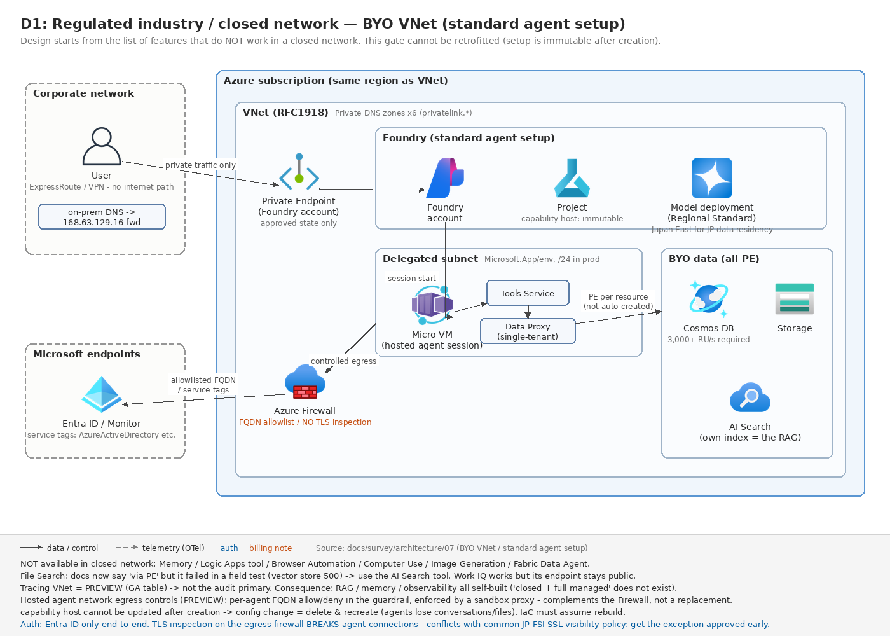
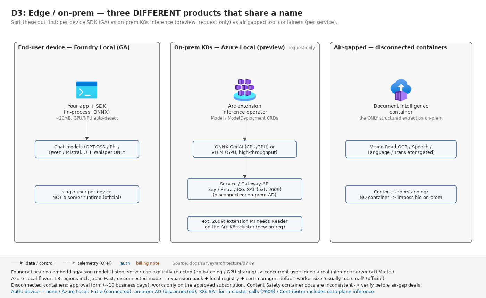

# 07. ユースケース編 D — 規制業種・閉域・データ主権・エッジ

[← アーキテクチャ TOP](./README.md)

> **最終更新:** 2026-07-30(公式ドキュメントとの突合検証で訂正) / 2026-09-04(§3 のツール表を configure-private-link 2026-08-14 版と外部案件実測で改訂)/ 2026-09-26(四半期更新: 委任サブネットのアドレス範囲・Class A・同時セッション既定値、hosted agent の egress controls〈preview〉、データ処理範囲の定義変更、Azure Policy 適格性 GA、CMK の対象範囲、評価リージョン、Azure Government、Foundry Local on Azure Local 2607/2609 を一次情報で更新)

金融・公共・医療など、**ネットワーク分離とデータ所在を先に決めなければ設計が始まらない**類型。このページの内容は [03. 選定ガイド](./03-decision-guide.md) の G1(データ・規制ゲート)と G2(ネットワークゲート)の詳細版にあたる。

## この章で最初に伝えるべき 3 つの事実

1. **ネットワーク構成は Foundry アカウント作成時にしか決められない。**後付け不可、委任サブネットの変更も不可。変更したければ**再デプロイ**。「PoC は basic で始めて本番で standard + VNet に切り替える」という計画は**アカウント再作成を必須とする。**
2. **閉域を選ぶと使えなくなる Foundry 機能がかなりある。**特に **Memory・Logic Apps・Browser Automation・Computer Use・Image Generation・Fabric Data Agent** は非対応、**Tracing VNet と Workflow Agents の outbound は未対応 / プレビュー**。File Search は公式表記が「対応」に変わったが実測では不成立(§3)。設計は「使える機能の一覧」から始める。
3. **「日本国内処理」を保証できるのは `Standard` または `ProvisionedManaged`(Regional Provisioned)だけ。****APAC Data Zone は日本以外(豪・韓・星・印)も含むため、多くの日本の規制要件では不十分。**(2026-09-26 注: deployment-types 2026-08-06 版は両者の処理範囲を「顧客指定の Azure ジオグラフィ内」に書き換えた。日本ジオ内=東日本/西日本間の処理はありうる → §5)

---

## 1. 最上位の分岐 — 3 つの egress モデル

Foundry のネットワーク設計は「**egress(送信)モデルを先に決める**」のが公式の意思決定順序。egress の選択が inbound の選択肢を決める。

| Egress モデル | Inbound の選択肢 | 適する場面 |
|---|---|---|
| **Public egress** | パブリック(IP 制限可)/ VNet 内 Private Endpoint | egress 分離なし。PE を付けても**呼び出し元制限だけ**でエージェントの送信は公開網 |
| **BYO Virtual Network**(サブネット注入) | VNet 内 Private Endpoint | 完全分離。IP レンジ・ピアリング・ルーティングを自社統制 |
| **Managed Virtual Network**(Microsoft 管理) | VNet 内 Private Endpoint | 完全分離だが IP 管理をしたくない / IP レンジが重複する場合 |

### BYO VNet と Managed VNet の公式比較

| 観点 | Managed network | Custom (BYO) network |
|---|---|---|
| メリット | Microsoft がサブネットレンジ・IP 選択・委任を処理 | **フルコントロール:** 自前 firewall、UDR、ピアリング、サブネット委任 |
| 制約 | approved-outbound で**自前 firewall を持ち込めない。**オンプレ接続は Application Gateway 必須。**outbound ログ未対応** | セットアップが複雑。RFC1918 必須、最小 `/27` |

**Managed VNet を規制案件で選びにくい理由:**
- **Azure Portal UI での作成が未対応**(Bicep / Terraform / `az rest` のみ)。
- **自前 Azure Firewall を持ち込めない。**`AllowOnlyApprovedOutbound` + FQDN ルールで**マネージド Firewall が自動作成され課金される**(既定 SKU = Standard。高度な機能が不要なら Basic も選択可。**デプロイ後に SKU 変更不可**。**マネージド Firewall は Foundry アカウントごとに 1 つ作られ、複数アカウントで共有できない**。FQDN ルールはポート 80 / 443 のみ — managed-virtual-network 2026-08-18 版、2026-09-26 確認)。
- **outbound トラフィックのログ機能が未対応**と比較表に明記。
- マネージド Private Endpoint は**顧客サブスクリプションに NIC として現れない**(可視性なし)。
- モードは一方向。`AllowInternetOutbound` → `Disabled` 不可、`AllowOnlyApprovedOutbound` → `AllowInternetOutbound` 不可。**有効化後の無効化も不可。BYO VNet からの移行パスもない。**

> **「出口通信のログを保全できない」「Firewall が自分のテナントにない」の 2 点は、通信ログ保全を求める規制要件に対する説明が難しい。**IP 空間重複という運用上の事情がない限り、**BYO VNet + 自前 Azure Firewall(ログを Log Analytics に集約)が説明性の面で有利**というのが本ドキュメントの判断(公式にこの優劣の記述はない)。

**Managed VNet の対応リージョンには Japan East が含まれる。**

---

## 2. BYO VNet(Standard agent setup)の設計

### 委任サブネット要件

| 項目 | 値 |
|---|---|
| 委任先 | `Microsoft.App/environments` |
| 最小サイズ | **`/27`**(後から変更不可) |
| 推奨サイズ | **`/24`**(hosted agent がある本番)。deep dive は「本番で `/27` を使うな」、networking-options は「prompt agent 中心なら `/27` でも本番可」と書き分けが揺れる |
| サブネットと同時セッション | 既定は **usable IP : セッション = 1:1**。`/27` ≈ 20、`/26` ≈ 50、`/25` ≈ 100、`/24` ≈ 250、`/22` ≈ 1,000 セッション(ピークは usable IP の 80% 未満で計画)。**サポート申請で最大 1:10 まで引き上げ可**。prompt agent はバージョンごとに IP を消費せず、プロジェクトあたり最大約 10 IP の固定プール |
| 共有可否 | **Foundry リソースごとに専用サブネット必須**(VNet は共有可)。アカウント内の全プロジェクトが同じサブネットを共有 |
| アドレス範囲 | **RFC1918(`10/8`・`172.16/12`・`192.168/16`)。**パブリック IP レンジ(`44.x.x.x` 等)は不可。**CGNAT(RFC 6598 `100.64.0.0/10`、`100.100.0.0/17` 等を除く)は公式間で揺れ**: virtual-networks(2026-08-27 更新)・networking-options(2026-09-09 更新)は「使用可」、agents-networking-deep-dive(2026-09-07 版)は「非対応・ルーティング障害」 → **RFC1918 に留めるのが安全** |
| Class A(`10.x`) | **Agent Service の全提供リージョンで対応**(virtual-networks 2026-08-27 更新版。limits-quotas-regions の「Private VNet」列も全リージョン Yes) |
| リージョン | **Foundry リソースと VNet は同一リージョン必須**(Cosmos DB / AI Search / Storage は別リージョン可。越境コストに注意) |

> **日本リージョン(2026-09-26 更新):** 前版の「Japan East は Class A 対応、Japan West は非対応」は解消。limits-quotas-regions(ms.date 2026-09-07、2026-09-25 更新)で **Japan West も Private VNet = Yes**、virtual-networks も「Agent Service の全リージョンで Class A 対応」に変わった。国内 DR で West を使う場合も `10.x` を割り当てられる。

**ピアリング先 VNet も含めて、予約レンジ(`169.254.0.0/16`、`172.30.0.0/16`、`172.31.0.0/16`、`192.0.2.0/24`、`0.0.0.0/8`、`127.0.0.0/8`、`100.100.0.0/17`、`100.100.192.0/19`、`100.100.224.0/19`)と重複してはならない**(virtual-networks 2026-08-27 更新版。前版の「`100.64.0.0/11`」は現行の列挙に無い)。ピアリング VNet は一意で重複しない IP レンジが必須で、重複が避けられない場合は Managed VNet を使えと明記されている。

**同時セッションのクォータ(サブネットとは別枠):** hosted agent の同時セッションは**サブスクリプション × リージョン単位**(全アカウント・プロジェクト合算。idle / stopped は数えない)で、既定は **Japan East を含む 7 リージョンが 2,000、その他(Japan West を含む)が 1,000**(limits-quotas-regions 2026-09-07 版)。超過は `429 session_quota_exceeded`、リージョン容量不足は `429 regional_session_quota_exceeded`、サブネット IP 枯渇は `429 subnet_exhausted`。サブネットを大きくしてもこのクォータは増えない。

### BYO 必須リソースと Cosmos DB の RU/s

Standard setup は **Storage / AI Search / Cosmos DB の 3 つすべて**を渡さないと capability host 作成が失敗する。

**Cosmos DB はアカウント合計 3,000 RU/s 以上が必須**(コンテナーは 3〜5 個 × 各 1,000 RU/s。基本 3 個+Responses API 利用エージェントの初回起動で 2 個が追加作成される。排他ではなく追加関係で、Responses 利用時はプロジェクトあたり実質 5,000 RU/s)。**複数プロジェクトならプロジェクト数分を乗算する。**RU/s 不足は capability host プロビジョニング失敗の直接原因。

| コンテナー | 用途 | ランタイム |
|---|---|---|
| `thread-message-store` | エンドユーザー会話 | Classic |
| `system-thread-message-store` | 内部システムメッセージ | Classic |
| `agent-entity-store` | エージェントメタデータ | Classic |
| `agent-definitions-v1` | エージェントメタデータ + バージョン | **New** |
| `run-state-v1` | 内部メッセージ + 会話 | **New** |

> **⚠ capability host は作成後に更新できない。**構成変更には capability host の削除・再作成が必要(プロジェクト削除は不要。ただし削除で既存エージェントの会話・ファイルへのアクセスは失われる)。**IaC の冪等更新が効かない最大のポイント。**
>
> **2026-09-26 追記 — 後継の「capability settings」(プレビュー):** アカウント / プロジェクトの `capabilitySettings`(`documentStore` = Cosmos DB、`vectorStore` = Cosmos DB または AI Search、`blobStore` = Storage)でデータストアを宣言する方式が追加され、capability-hosts ページは「参考として保持」扱いになった(configure-capability-settings ms.date 2026-09-22 / capability-hosts 2026-09-25 更新)。ただし **API `2026-07-15-preview`、提供は UK South / Canada Central のみの段階展開**で、日本リージョンの案件は当面 capability host(後方互換フロー)のまま。capability settings でも**既存プロジェクトへの追加・更新は不可(プロジェクトの削除・再作成)**、ネットワーク注入と同時に作成時設定が前提なので、「作り直し前提」の性質は変わらない。プロビジョニング ID が呼び出し元(CI/CD の SP 等。Storage Blob Data Contributor / Cosmos DB Operator が必要)に変わる点は権限設計に効く。

**なお BYO VNet でもデータリソースは「platform-managed」を選べる**(テンプレート `11-private-network-basic-vnet`)。**「閉域にしたいがデータストアの運用は持ちたくない」場合の選択肢**として覚えておく。BYO データリソースが要るなら `15-private-network-standard-agent-setup`。

### Private Link のサブリソースと DNS ゾーン

| リソース | サブリソース(group ID) | Private DNS ゾーン |
|---|---|---|
| **Foundry** | `account` | `privatelink.cognitiveservices.azure.com` / `privatelink.openai.azure.com` / `privatelink.services.ai.azure.com` |
| Azure AI Search | `searchService` | `privatelink.search.windows.net` |
| Azure Cosmos DB | `Sql` | `privatelink.documents.azure.com` |
| Azure Storage | `blob` | `privatelink.blob.core.windows.net` |
| Container Registry(hosted agent) | `registry` | `privatelink.azurecr.io` |
| Application Insights | AMPLS 経由 | `privatelink.monitor.azure.com` ほか 3 種 |

**落とし穴:** Foundry リソースをデプロイしても、**AI Search / Storage / Cosmos DB の Private Endpoint は自動作成されない。**各リソース側で別途作成が必要。

**オンプレ DNS を使う場合:** `privatelink` サブドメインを VNet の Private DNS ゾーンに委任するか、条件付きフォワーダーを **Azure DNS 仮想サーバー `168.63.129.16`** に向ける。

**Private Endpoint 側の制限:** VNet と**同一リージョン・同一サブスクリプション**に配置必須。**Approved 状態の PE のみトラフィックを通す。**VNet に **`172.17.0.0/16` は使用不可**(Docker bridge 予約)。

### トラフィックフロー

- **Hosted agent:** Client → Foundry endpoint → 委任サブネット内の **Micro VM** → Tools Service → **Data Proxy** → PE 経由で顧客リソース
- **Prompt agent:** Client → Foundry endpoint → Tools Service → Data Proxy → PE 経由(Micro VM を経由しない)

Micro VM は専用 NIC を持ち自身の送信は直接出るが、**ツール呼び出しは必ず single-tenant data proxy を経由する。**data proxy はプロジェクトごとに 1 つの専用インスタンス。

### Firewall / NSG / UDR

**許可が必要な FQDN / サービスタグ:**

| シナリオ | FQDN / タグ |
|---|---|
| Agents | `*.identity.azure.net`、`login.microsoftonline.com`、`*.login.microsoftonline.com`、`*.login.microsoft.com` または **`AzureActiveDirectory` サービスタグ** |
| Evaluations & Traces | `settings.sdk.monitor.azure.com`、`*.livediagnostics.monitor.azure.com`、`*.in.applicationinsights.azure.com`、`AzureMachineLearning` タグ |
| Fine-tuning | `raw.githubusercontent.com`(ポータルでキュレート済みサンプルデータセットを選ぶ場合) |
| Hosted agents → Agent 365 | **`AzureFrontDoor.Frontend` サービスタグ(TCP 443)**。hosted agent から A365 の可観測性 / トレースエンドポイントへ(configure-private-link 2026-08-14 版) |
| hosted agent のソースコード(ZIP)デプロイ | `mcr.microsoft.com`、`*.login.microsoft.com`(deploy-hosted-agent-code、2026-09-21 更新) |
| Managed VNet 追加分 | `mcr.microsoft.com`(managed-virtual-network では Agents 行に含まれる) |

加えて **Azure Container Apps 側の Managed Identity 系 FQDN** も許可が必要。評価については `AzureMachineLearning` タグの代わりに `*.dataproxy.{region}.api.azureml.ms` と `{region}.api.azureml.ms`(評価実行リージョン)を許可する方式も案内されている。

> **⚠ TLS インスペクション禁止(最重要):** 「Firewall で TLS インスペクションが行われ自己署名証明書が付加されないことを確認せよ」と明記され、Architecture Center 側でも「**このトラフィックに Azure Firewall の TLS インスペクションを適用するな。検査時の証明書がエージェントの接続を壊す。**」と明言されている。
>
> **多くの日本の金融機関で標準になっている「出口 Firewall での SSL 可視化」ポリシーと正面衝突する。**設計初期に例外承認を取る必要がある。

**サブネット別の統制**は [01 章の Baseline アーキテクチャ](./01-official-baselines.md#b-baseline-本番の出発点-waf-が-ai-ワークロードの推奨アーキテクチャ-と名指し)の表を参照。公式の追加推奨として、**強制トンネリングをサポートする全サブネットに適用する**(egress を想定しないサブネットにも多層防御として)、**Azure Firewall はリージョン内の全可用性ゾーンにデプロイする**(egress の単一障害点であるため)、**高い同時 outbound 接続数がある場合は複数パブリック IP を構成して SNAT ポート枯渇を回避する**、が挙げられている。

---

## 3. 閉域で使えない機能の一覧(設計の出発点)

### エージェントツールの互換性

| ツール | 状況 | トラフィック経路 |
|---|---|---|
| MCP Tool(Private MCP) | 対応 | **自 VNet サブネット経由** |
| Azure AI Search | 対応 | **Private Endpoint 経由** |
| OpenAPI tool / Azure Functions / A2A | 対応 | 自 VNet サブネット経由 |
| Function Calling | 対応 | Microsoft バックボーン |
| Foundry IQ(ツール表では「(preview)」表記) | 対応 | MCP 経由。GA 一覧は Partial GA(API GA・ポータル Preview)で表記が割れる |
| **Code Interpreter** | **部分** | **ファイルの上り下りを伴わないシナリオのみ動作。**回避策は SDK でコンテナーを作り `container_id` を渡す(**ポータル UI では不可**)。configure-private-link 2026-08-14 版は「✅ Microsoft backbone」表記だが、virtual-networks ページは BYO 構成でのファイル I/O 不可を維持 |
| **Bing Grounding / Websearch / SharePoint Grounding** | 動くが**パブリックエンドポイント経由** | ↓ 下記の警告 |
| Fabric IQ | 部分 | Fabric アイテム種別依存(Power BI セマンティックモデルは**パブリックアクセスのみ**) |
| **Fabric Data Agent** | **非対応** | Fabric 側でパブリックネットワークアクセス有効が必須 |
| **Logic Apps** | **非対応** | 開発中 |
| **File Search** | **表記変更あり(要注意)** | configure-private-link 2026-08-14 版で「✅ Through private endpoint」に変更。**ただし外部案件の実測(2026-08-30)では閉域作成アカウントで vector store 作成自体が 500 で継続失敗**、Blob 連携は非対応のまま。閉域では File Search を提案せず AI Search ツールに寄せる(→ [casebook P-N13](../casebook/02-pitfalls-index.md#d-ネットワークと閉域)) |
| **Browser Automation** | **非対応** | 開発中 |
| **Computer Use** | **非対応** | 開発中 |
| **Image Generation** | **非対応** | 開発中 |

> **金融・公共での決定的な論点:** Bing Grounding / Websearch / SharePoint Grounding は「動く」が**パブリックインターネット経由である**とドキュメント自身が明記している。「すべての通信をプライベート網に閉じる」要件があるなら、これらは**要件を満たさない。**ブロック手段として **Azure Policy による利用禁止**が公式に案内されている。
>
> さらに Architecture Center 側では「**web search ツールは `api.bing.microsoft.com` を呼ぶが、Agent Service が内部機構で呼ぶため egress サブネットを完全にバイパスする**」と明記。「443 を許可すれば Firewall を通るだろう」という想定が成り立たない。**全ツールを実測で検証せよ**と書かれている。

**File Search は公式表記が「対応」に変わったが実測では成立していない。**閉域では **Azure AI Search ツール(PE 経由・対応)** に寄せる(→ [04 章の A2/A3](./04-usecase-chat-rag.md))。ただし **AI Search ツールの「PE 経由」はアウトバウンド VNet 注入構成(公式 15-private-network-standard-agent-setup)が前提**で、注入なし(インバウンド遮断のみ)では hosted agent から PNA Disabled の BYO Search に到達できず「デプロイ成功・実行だけ失敗」になる(外部案件実測 → [casebook P-H01](../casebook/02-pitfalls-index.md#a-hosted-agent))。Blob Storage のファイルを File Search で使うことも別途「非対応」と明記されている。

### 機能レベルの非対応

| 機能 | 状況 |
|---|---|
| **Traces** | トレース本体は prompt / hosted agent で GA、**Tracing VNet は Preview**(GA 一覧 2026-08-14 版)。閉域の監査主系には置かず、自前 OTel + App Insights(AMPLS)を主系にする |
| **Memory** | **VNet 非対応** |
| **Work IQ**(preview) | 前版の「VNet 統合非対応」は更新: BYO VNet outbound 構成では**プロジェクトの single-tenant data proxy 経由**でルーティングされ顧客のネットワーク制御が効くが、**宛先は公開 HTTPS(`workiq.svc.cloud.microsoft`)のまま**で、リクエストは Azure コンプライアンス境界の外で処理されうると明記(work-iq 2026-09-04 版、2026-09-26 確認)。Bing / SharePoint と同じ「動くがプライベートではない」扱い |
| Evaluations の Synthetic Data Generation | **非対応**(自前データを持ち込んで評価する)。※出典の evaluation-regions-limits-virtual-network は `concepts/` 配下へ移動し(2026-08-18 更新)、VNet 節が見当たらなくなった → **現行の可否は要確認** |
| **Workflow Agents** | inbound は対応。**VNet 注入による outbound は非対応** |
| **AI Gateway(APIM)** | 新ポータルからプライベート Foundry に対して作れるが**自動的にパブリックになる。**Azure portal でゲートウェイ側のネットワーク分離を別途設定する必要 |
| **Foundry MCP Server** | ネットワーク分離未対応(Private Link 裏のリソース不可) |
| Teams / M365 への公開 | 可能だが**パブリックネットワーク無効プロジェクトではポータル不可・REST のみ** |
| **hosted agents** | GA(2026-07-09 GA 告知。devblogs 7・8 月号 2026-09-09 で再明言)。「network-isolated Foundry で動作」と記載されるが、**PNA Disabled では VNet 注入(作成時のみ設定可)が実質必須**(注入なしは実行だけ失敗)。private ACR は 2026-06-25 以降作成プロジェクトのみ(configure-private-link / virtual-networks とも 2026-09-26 時点で同文)。virtual-networks ページ(2026-08-27 更新)には azd 経路の「The agent endpoint stays public in this preview」が残存。**アウトバウンド先の制御は network egress controls(preview)で追加可** → 下記 |

### hosted agent の network egress controls(プレビュー、2026-09 追加)

hosted agent の**送信先を FQDN ルールで制御する**機能が 2026-09-24 に紹介された(devblogs「Control where your hosted agent connects with network egress」、Learn は add-hosted-agent-guardrails 2026-09-24 版の「Network egress controls (preview)」節)。

| 項目 | 内容 |
|---|---|
| ステータス | **プレビュー**(SLA なし・本番利用非推奨と明記)。**hosted agent 専用**(prompt agent・モデルデプロイには効かない) |
| 設定場所 | ガードレール(RAI policy)の `egressPolicy`。API は `2026-05-15-preview`。ポータルはガードレールの Network control、azd(Bicep)/ REST / Python SDK(`RaiConfig`)で agent version に付与 |
| ルール | 順序付き・先勝ち。Allow / Deny / **Transform**(ヘッダー付与・置換)/ **Rewrite**(宛先書き換え)。既定アクション Deny / Allow。**モードは Audit(拒否相当をログのみ)→ Enforced** の順に移行。1 ポリシー最大 480 ルール |
| 強制点 | **Foundry 管理のエージェント sandbox 内のプロキシ**。拒否時はプロキシが HTTP 403 を返す。判定は App Insights / トレースの「Network egress decision」スパンで確認 |
| TLS | HTTPS を検査するため**ランタイムがプロキシの CA を sandbox の信頼ストアに注入**(約 30 日でローテーション。ピン留め・イメージへのコピー禁止) |
| ヘッダー注入 | Transform の値ソースは Static とマネージド ID 値参照(デプロイ済みエージェントの ID に宛先側 RBAC が必要)。Secret 参照は不可 |
| プレビュー期の制限 | ホスト名マッチのみ(サービスタグ・IP レンジは今後)、Secret 参照ヘッダーは不可、**顧客 Firewall への委譲や Azure Policy による集中強制はしない**、MCP ツールポリシー・PII / DLP 検査は今後 |

> **同ページのガードレール側の落とし穴(規制案件で必ず確認):** hosted agent に付けた RAI policy は、**invocations プロトコルでは `invocations_moderation`(`azure-ai-projects` 2.7.0 以降)でテキストの位置を宣言しないと無効(素通り)**で、デプロイも HTTP 200 も成功するため気づきにくい。また**存在しないポリシー ID を参照するとエラーなく fail-open**(フィルタなしで active になる)。デプロイ後にポリシー存在確認と遮断テストを必須にする。

> **位置づけ:** 公式は「Azure Firewall 等の自社ネットワーク制御を**置き換えるものではなく補完**」と明記している。規制案件では**主統制は BYO VNet + 自前 Firewall(ログ保全)**のまま、egress controls は「エージェント単位の宛先ホワイトリストを定義として版管理できる」追加層として扱う。Firewall 側の TLS インスペクション禁止(§2)とは別の話で、こちらはプラットフォーム内部で完結する検査である点に注意。

> **Tracing VNet が Preview のままなのは監査要件に直撃する。**可観測性が要る規制ワークロードで、トレースだけパブリック Application Insights になる構成をどう説明するかが課題になる。**監査ログ設計を Purview Audit / Defender アラート / APIM ログ / アプリ独自の監査ログの組み合わせで再設計する**必要がある。

### その他の運用上の制約

- **ACR のプライベート化は 2026-06-25 以降に作成したプロジェクトのみ。**それ以前のプロジェクトは ACR にパブリックエンドポイントが必要。
- **VNet 化後は公開インターネット上の端末から `azd up` / `azd deploy` ができない**(データプレーン呼び出しが 403)。**VNet 内のセルフホスト GitHub Actions runner / Azure DevOps agent が推奨パターン**で、CI/CD 基盤の追加コストになる。
- **ポータルアクセス:** パブリックアクセス無効の場合、Foundry ポータルのプロジェクトレベル機能はすべてネットワークアクセスを要する。開発者は jump box / ピアリング VNet / ExpressRoute / S2S VPN 経由でアクセスする(Azure Bastion → jump box → PE が公式パターン)。
- **削除順序:** Foundry リソースと VNet は最後に削除する。VNet 削除前に Foundry リソースを削除し **purge** する。失敗すると `serviceAssociationLinks` エラーで VNet が消せなくなる。
- **AI Search のインデクサは `executionEnvironment` を `"Private"` にしないと PE を越えられず「サイレントに失敗して空インデックス」になる。**

---

## 4. Network Security Perimeter という代替(Private Link とは排他)

Foundry リソースは **NSP に関連付けできる。**PaaS リソース群を論理境界でまとめ、inbound/outbound アクセスルールを適用し、アクセス判断を集中ログ化する。

| 項目 | 内容 |
|---|---|
| アクセスモード | **Learning**(ログ観測のみ)→ **Enforced**(ルール適用)の順で移行 |
| `publicNetworkAccess` との関係 | **Enforced では NSP ルールが優先し PNA を実質上書き** |
| Inbound ルール | IP レンジ(CIDR)またはサブスクリプション(マネージド ID)スコープ |
| Outbound ルール | FQDN 宛先 |
| ログ | 診断設定で `NspAccessLogs` テーブルへ |

**重大な注意点:**
- NSP は**データプレーントラフィックを統制する。コントロールプレーン操作は別途制限しない限り通る場合がある。**
- **Enforced モードでも、診断ログ出力先への送信が NSP ルールでフィルタされるのは Microsoft Entra ID 認証を使う場合のみ。**API キー認証のリクエストは NSP perimeter claim を持たないため**ログトラフィックが NSP でブロックされない。**完全な NSP 準拠には Entra ID 認証が必須。
- **Private Endpoint / UDR を使う構成とは併用できない。**Baseline アーキテクチャは「PE と UDR を使うため NSP 機能をサポートしない」と明記。

> **NSP と Private Link は排他的な二択。**NSP は「PaaS 群の論理境界 + 集中ログ」が主眼で、VNet を持たない / 持ちたくない構成向け。**エージェントの egress をサブネットに落として Firewall で見たいなら Private Link + BYO VNet 一択。**

---

## 5. データ主権とデータ所在

### デプロイ種別と処理範囲

**全デプロイ種別共通で、保存時データは指定した Azure ジオグラフィに留まる。**異なるのは**推論時の処理場所。**

| データゾーン | 処理範囲 |
|---|---|
| **United States** | 米国内 |
| **European Union** | **Azure EU Data Boundary** 内(仏・独・伊・蘭・諾・波・西・瑞・スイス)。**事前通知なくリージョンが追加されうる** |
| **Asia Pacific (APAC)** | **オーストラリア、日本、韓国、シンガポール、インド。**事前通知なくリージョンが追加されうる(現行 deployment-types は構成国を列挙せず「複数の APAC リージョン」とのみ記載。region-availability 2026-09-03 版の Data Zone Standard 表で australiaeast / japaneast / koreacentral / southeastasia / southindia を確認) |
| (参考)**Standard / Regional Provisioned** | deployment-types 2026-08-06 版: 「**顧客指定の Azure ジオグラフィ内**で処理し、運用目的で**ジオ内のリージョン間**で処理されうる」。一方 region-availability 2026-09-03 版は「デプロイのリージョンで処理」のままで**公式間で表現が揺れる** |

> **日本の金融 / 公共における決定的論点:** **「日本国内のみで処理」を保証できるのは `Standard` または `ProvisionedManaged`(Regional Provisioned)だけ。**ただし deployment-types の現行定義は「Azure ジオグラフィ内(ジオ内リージョン間の処理あり)」なので、**「Japan East の単一リージョンでしか処理しない」までは保証されない**(日本ジオ=東日本・西日本)。「国内」要件なら満たすが、「特定リージョン限定」要件がある場合は Microsoft に確認する。**APAC Data Zone は日本を含むが豪・韓・星・印も含む**ため「国内処理」にはならない。
>
> ただし Standard / Regional は「モデル可用性とスループットが限定されうる」「高い継続的ボリュームでは遅延のばらつきが大きくなりうる」と明記されており、**モデル選択肢とスループットを犠牲にする**トレードオフになる。

**⚠ 公式ドキュメント間の不整合:** `foundry/concepts/architecture` は「data zone は US または EU 内に留まる」と書いており **APAC に触れていない**(2026-09-24 更新版でも同じ。2026-09-26 確認)。`deployment-types` 側(US/EU/APAC を明記)が正。**この記述だけを読むと誤った提案になる。**

**価格面の追加論点(2026-09-26 追記):** Microsoft Community Hub の「Microsoft Foundry Model Deployment Pricing Update」( https://techcommunity.microsoft.com/blog/azure-ai-foundry-blog/microsoft-foundry-model-deployment-pricing-update/4535385 )で、**2026-09-01 以降に投入されたモデルから Data Zone / 米国外 Regional に Global 比のプレミアム**が付く改定が告知された(2026-07-09 公開、2026-09-26 に生 HTML で確認)。Global 比で **APAC Data Zone +20%(新設)**・EU Data Zone +20%(9% 引き上げ)・US Data Zone / Regional US +10%(据え置き)・**日本 Regional +35%**(米国外 Regional は国により +25〜50%、引き上げ幅 7〜16%)。従量課金は 2026-09-01 以降に投入されたモデルのみ、PTU は既存も対象。「国内処理=Standard」を選ぶ場合、新モデルほど単価差が広がる前提で見積もる。

**Azure Policy でデプロイ種別を制限できる**(`Microsoft.CognitiveServices/accounts/deployments` の `sku.name` を対象にしたポリシールール)。「Global Standard を作らせない」を組織的に強制できる。

**Claude のデプロイ種別:** Global Standard(全 Claude モデル)と **Data Zone Standard (US) のみ**(Azure ホスト版の一部モデル)。**EU / APAC の Data Zone デプロイは提供されていない。**

### Foundry が保存するもの・保持

**処理されるデータ:** プロンプトと生成コンテンツ / アップロードデータ(Files API・vector store)/ **ステートフルエンティティのデータ(Responses API、Threads、Stored completions)** / 学習・検証データ。

**明示的なコミットメント:** プロンプト・完了・埋め込み・学習データは、他の顧客に提供されず、**モデル提供者(OpenAI 等)にも提供されず**、モデル改善に使われず、**許可・指示なしに基盤モデルの学習に使われない。**モデルはステートレスで、プロンプトも完了もモデル内に保存されない。

保存されるデータは Foundry リソース(顧客の Azure テナント内)に**リソースと同一ジオグラフィで**保存され、**既定で常に AES-256 で暗号化**され、**顧客がいつでも削除できる。**

**Agent Service のデータ所在:** 「Foundry Agent Service のエンドポイントはリージョナルで、データはエンドポイントと同じリージョンに保存される。」

### 不正使用監視と人間によるレビュー(規制案件での説明対象)

濫用の指標が検出されると、**顧客のプロンプトと完了のサンプルがレビュー対象として選択されうる。**レビューは既定で自動手段(LLM を含む)、必要に応じて**人間レビュー**が追加される。人間レビュー用のデータストアは顧客リソース単位で論理分離され、**顧客のプロンプト / 生成物は Foundry リソースがデプロイされた Azure ジオグラフィに保存される。**認可された Microsoft 従業員が、request ID によるポイントクエリ、Secure Access Workstations、マネージャー承認の Just-In-Time 経由でアクセスする。

**Modified abuse monitoring(データ保存と人間レビューの停止)** をマネージド顧客は申請できる(Limited Access レビュー)。承認されると上記のデータ保存と人間レビューは行われない(**自動レビューは継続されうる**)。

> **⚠ 監査エビデンスの取り方:** Azure portal の Foundry リソース Overview → **JSON View**、または `az cognitiveservices account show` で、**Capabilities リストに `{"name":"ContentLogging","value":"false"}` が現れるのは abuse monitoring 用データ保存がオフのときだけ。**オフでない場合このプロパティは出力に現れない。**「申請したから大丈夫」ではなく、この値で確認する。**

**プレビュー機能の例外:** 「Azure Preview 機能(プレビュー中の Models sold by Azure を含む)は、**abuse monitoring を含めて異なるプライバシー慣行を採用する場合がある。**」

### CMK(顧客管理キー)

**適用範囲:** Foundry リソースに関連付けられたストレージに保存される保存時データ(**プロジェクト成果物・アップロードファイル・評価データを含む**)。

**機能別の対象範囲(2026-08 に新設された概念ページ customer-managed-keys、ms.date 2026-08-24 で確認):**

| 機能 | Foundry 管理ストレージで CMK | 顧客管理ストレージ(BYO)で CMK |
|---|---|---|
| Prompt agents | **非対応**(basic setup は Microsoft 管理キー) | 対応(Cosmos DB / Storage / AI Search 側で個別に CMK 設定) |
| **Hosted agents** | **非対応** | **部分対応**: 各セッションの永続 `$HOME` は**プラットフォーム管理ストレージで CMK 非対応・無効化不可**。アイドル後も**セッション削除まで 30 日保持** |
| Fine-tuning / Batch / Evaluations / Language | 対応 | Batch・Evaluations・Language は対応(FT は BYO ストレージなし) |
| Speech | 非対応 | 対応 |
| Content Understanding | — | 対応(**BYO ストレージ必須**) |

> **規制案件での含意:** 「エージェントの会話も含め全データを CMK で」という要件は **standard setup(BYO Cosmos DB / Storage / AI Search)が前提**で、**hosted agent は `$HOME` が CMK の対象外**になる。hosted agent を使うなら、機微データを `$HOME` に書かない実装規約と、不要セッションの明示削除を運用に入れる。

| 項目 | 要件 |
|---|---|
| キーストア | Azure Key Vault または Azure Managed HSM |
| リージョン | **キーストアと Foundry リソースは同一リージョン** |
| キー保護 | **論理削除(soft delete)と purge protection が必須** |
| マネージド ID | Foundry リソースの**システム割当 + ユーザー割当の両方**が前提 |
| ロール | Key Vault Crypto User(Azure RBAC 推奨) |
| キー種別 | **RSA、最小 2048 bit** |

**⚠ リージョン制限:** 「基盤の Azure AI Search インフラのキャパシティ制約により、**CMK 暗号化は現時点で一部のリージョンでのみ利用可能。**」対応リージョンは Azure AI Search のリージョンサポートページを参照する必要がある。**日本リージョンでの可否は案件着手時に必ず個別確認する。**

**⚠ プライベートネットワーク時のキーストア構成は 2 択しかない:**
1. **Private Link endpoint + 「信頼された Microsoft サービスを許可」有効**(推奨構成)
2. 「信頼された Microsoft サービスを許可」のみ(PE なし)

つまり **「Key Vault を完全にプライベート化し、trusted services バイパスも切る」構成は Foundry の CMK ではサポートされない。**「バイパス全面禁止」ポリシーとの調整が必要。

**不可逆性:** プロジェクトは Microsoft 管理キーから CMK に更新できるが**逆は不可。**プロジェクト CMK は同一キーストア内のキーにしか更新できない。**キーを失効 / 削除すると、そのキーで暗号化されたデータはキーが復元されるまでアクセス不能。**また**一部のプレビュー機能は CMK 非対応。**

---

## 6. コンプライアンス統制

### Azure Policy(モデルデプロイ)

| ポリシー | 目的 | ステータス |
|---|---|---|
| **Foundry model deployments should only use approved models** | 承認済みモデル / パブリッシャーのリストに限定 | **GA** |
| **Foundry model deployments should meet eligibility requirements** | `onlyAllowDirectFromAzure` / **`denyPreviewModels`** で属性ベース制御 | **GA**(model-deployment-policy 2026-08-18 版で「Generally available」。前版のプレビューから昇格) |
| Foundry Tools resources should have key access disabled | ローカル認証(API キー)を無効化 | — |

**`denyPreviewModels=true` は「プレビューモデルを本番に持ち込まない」統制をプラットフォームレベルで実装できる。**本番サブスクリプションには入れておく。

**⚠ asset ID はプレフィックスマッチ。**末尾スラッシュなしの `azureml://registries/azure-openai/models/gpt-5` は **GPT-5.2 や GPT-5.4 にもマッチしてしまう。**特定モデルに限定するには**末尾にスラッシュ**を付ける。

**⚠ model router を使う場合:** パブリッシャー許可リストに `Microsoft` を含める必要がある(Microsoft が model router のパブリッシャー)。**Claude にルーティングするなら `Anthropic` も追加。**ポリシーは model router が選択する配下モデルにも適用され、ARM / CLI では非準拠モデルが 1 つでも含まれるとデプロイ全体が失敗する(ポータルは準拠サブセットだけをデプロイ可)。加えて **model router 専用の組み込みポリシー(デプロイリージョン・必須ルーティングルール・ログ構成)がパブリックプレビュー**で追加されている(2026-08-18 版)。

**適用タイミング:** ポリシー割当は即時反映されない。**最低 15 分待つ。**コンプライアンスダッシュボードへの反映は評価サイクル(通常最大 24 時間)。Foundry ポータルへの反映は最大 30 分。

**その他:** プレビュー機能の抑止はタグ `AZML_DISABLE_PREVIEW_FEATURE=true`(サブスク / RG / リソース単位)でポータルのプレビュー UI を非表示化でき、カスタム RBAC(`notDataActions` / `notActions`)で API レベルのブロックもできる。

### API キーの無効化(`disableLocalAuth`)

**Agent Service と Evaluations は API キーでは動かない**(Entra ID 必須)ので、エージェント基盤を採る時点で Entra は前提。加えて `disableLocalAuth` でキーを完全に殺す。

> **⚠ 伝播遅延(見落としがち):** コントロールプレーンには即座に反映されるが、**認証を強制する共有ゲートウェイはキャッシュ更新まで既存キーを受け付け続ける。**通常は数分だが、**リージョン・負荷・ゲートウェイキャッシュ状態によっては数時間かかりうる。**「即座の遮断」を前提にしたセキュリティ運用はできない。**古いキーでデータプレーン要求を投げて HTTP 401 が返ることを確認してから完了とみなす。**
>
> **鍵漏洩時の手順書に「止めたと宣言できるまで数時間の窓が開く可能性」を明記する。**

### Microsoft Purview 統合(プレビュー)— 規制案件での期待値調整

サポートされるのは DSPM for AI / Auditing / Data classification / Sensitivity labels / DLP / Insider Risk Management / Communication compliance / eDiscovery / Data Lifecycle Management / Compliance Manager。**Encryption without sensitivity labels は非対応。**

**⚠ 決定的な制約が 4 つある:**

1. **Data Security Policies は、Entra ID の「ユーザーコンテキストトークン」を使う API 呼び出しにしか適用されない。**それ以外の認証シナリオでは、ユーザー相互作用は Purview Audit と Activity Explorer の分類にしか現れず、**ポリシーによる強制は行われない。**
2. **Purview 統合に Foundry エージェントのデータが含まれるかは公式間で記載が揺れる。**Defender ドキュメントは「Foundry エージェント統合のサポートは現時点で提供されていない」、一方 Foundry 側の how-to-manage-compliance-security(2026-08-04 更新)は「サブスクリプション内の**全アプリケーションとエージェント**の AI インタラクションデータが Purview に流れる」と書く(2026-09-26 確認)。エージェント案件では要確認として扱う。
3. **Purview 統合は現時点でネットワーク分離をサポートしない。**
4. **課金:** データセキュリティポリシーは pay-as-you-go メーター**または Agent 365 サブスクリプション**。**どちらも無いと Purview Audit 統合しかサポートされない**(how-to-manage-compliance-security 2026-08-04 更新版。Audit は Purview ライセンスに含まれる)。

> **3(と 2 の揺れ)の組合せが致命的:** 「ネットワーク分離した Foundry でエージェントを動かす」という規制業界の標準構成では、**Purview による DLP / 分類は現時点でほぼ機能しない。DSPM for AI を前提としたコンプライアンス説明はできない。**

### Microsoft Defender for Cloud(AI services プラン)

3 コンポーネント: **Suspicious prompt evidence**(疑わしいプロンプト / 応答をアラートエビデンスとして受信。機密データは自動リダクト)/ **Data security for AI interactions**(Purview 側の有償機能で、Defender プランには含まれない)/ **AI model security**(Azure ML Registries のモデルをスキャン)。

検出対象は「Foundry のマネージド推論エンドポイント上に構築された AI ワークロード」で、**jailbreak およびユーザー入力攻撃を検出**する。**Azure Government / 21Vianet は非対応。**

### Azure Security Baseline での注意点

MCSB v1.0 ベースで「古いガイダンスを含む可能性がある」と警告付きだが、**Customer Lockbox が非対応**と記載されている点は金融 / 公共で問い合わせが来る典型項目。**最新状況は Microsoft に個別確認する。**(DLP・機微データ検出が "False" になっているのは Purview 統合が後から追加されたことによる表の陳腐化の可能性が高い。)

---

## 7. 評価とレッドチーミングのリージョン制約(日本案件で必ず効く)

| 機能 | 対応リージョン |
|---|---|
| バッチ評価 | 広範(**Japan East / Japan West を含む**) |
| **リスク・安全性評価器** | **22 リージョンに拡大**(米州 11: Brazil South / Canada Central / Canada East / Central US / East US / East US 2 / North Central US / South Central US / West Central US / West US / West US 3、欧州 10: France Central / Germany West Central / Italy North / Norway East / Poland Central / Spain Central / Sweden Central / Switzerland North / Switzerland West / West Europe、APAC は **Australia East のみ**)。**日本は依然非対応**(旧記載の 6 リージョンから拡大) |
| Groundedness Pro | East US 2 / Sweden Central のみ |
| Protected material | **East US 2 のみ** |
| **AI Red Teaming** | **公式2ページ間で記載が揺れる(evaluation-regions ページは East US 2 / North Central US の2つ、ai-red-teaming-agent ページ〈2026-08-19 版〉は +France Central / Sweden Central / Switzerland West の5つ)。いずれにせよ日本・APAC 非対応** |
| 合成データ生成 / トレース→データセット生成 | 広範(**Japan East を含む**。Japan West は含まない) |

出典: https://learn.microsoft.com/en-us/azure/foundry/concepts/evaluation-regions-limits-virtual-network (ms.date 2026-04-03 / 2026-08-18 更新、2026-09-26 確認。`how-to/` 配下の同名パスは 404)

> **本番推論は Japan East、安全性評価と Red Teaming は別リージョンの評価専用プロジェクト**という分離構成になる。**プロンプト・応答が評価のために国外に渡る**ため、法務確認が必須。評価だけなら Agent 用のフル構成(Cosmos DB / AI Search / capability host)は不要で、**評価専用の Bicep テンプレート**が用意されている。
>
> 加えて **Guardrails の Task adherence は「データが指定 Geo 外(US/EU)で処理される可能性」が明記されている。**

---

## 8. ソブリンクラウド(Azure Government)

| 項目 | 内容 |
|---|---|
| ポータル | **https://ai.azure.us/nextgen**(foundry-azure-government 2026-09-02 版) |
| リージョン | US Gov Arizona / US Gov Virginia |
| エージェント種別 | Prompt agents = 対応 / **Voice-based prompt agents = 非対応** / Workflows = プレビュー / **Hosted agents = 非対応** |
| 利用可能ツール | Code Interpreter / File Search / Azure AI Search / Azure Functions / Function calling / **MCP servers / OpenAPI tool**(2026-09-26 確認で「対応」に変化)/ Custom Code Interpreter(プレビュー) |
| **非対応ツール** | **Web search / Grounding with Bing / Image Generation / Browser Automation / Computer Use / Microsoft Fabric / SharePoint / A2A** |
| プラットフォーム機能 | Responses API / Agent identity / **Private networking(VNet)/ NSP** / RBAC / Content safety・guardrails(Block lists・Jailbreak・Protected material)/ Tracing(prompt agents)= 対応。**Model router / Evaluations / Optimization = 非対応** |
| (旧版との差) | 前版にあった「Serverless endpoints / Content Understanding / Agents playground / Fine-tuning / Batch jobs / VS Code 拡張 = 非対応」の列挙は、ページ再編(プラットフォーム版 foundry-azure-government とエージェント版 agents/concepts/azure-government に分割)後の現行ページに無い → **個別に要確認** |
| 公開 | 公開(安定エンドポイント+Entra ID)と Entra Agent Registry への登録は可。**Teams / M365 Copilot への公開は現行ページに記載なし**(前版は「非対応」明記。**要確認**) |
| SDK | `azure-ai-projects` 2.0.0 以降。スコープは `https://ai.azure.us/.default`、プロジェクトエンドポイントは `https://{resource}.services.ai.azure.us/api/projects/{project}` |

出典: https://learn.microsoft.com/en-us/azure/foundry/agents/concepts/azure-government (ms.date 2026-08-19 / 2026-09-24 更新)・ https://learn.microsoft.com/en-us/azure/foundry/concepts/foundry-azure-government (ms.date 2026-09-02)。いずれも 2026-09-26 確認。

> **プレビュー機能とコンプライアンス認定の関係を明文化しているのはこのページだけ**(agents/concepts/azure-government の「Preview features in Azure Government」節。2026-09-26 時点でも同文): 「**Preview 表記の機能は、GA 機能と同じコンプライアンスコミットメント(FedRAMP, DoD IL5, CJIS 等)を伴わない場合がある。**規制ワークロードで使う前にセキュリティ・コンプライアンスチームで確認せよ。」
>
> **日本の政府調達(ISMAP 等)でも同種の論理が使えるが、ISMAP への言及はドキュメント上に見つからなかった。**日本固有の認証状況は Microsoft Trust Center / Service Trust Portal 側で個別確認が必要。

---

## 9. エッジ・オンプレ・ハイブリッド

**「オンプレで Foundry を動かす」には 3 つの別物がある。**名前が似ているので最初に切り分ける。

| 選択肢 | 何か | ライフサイクル |
|---|---|---|
| **Foundry Local** | **エンドユーザー端末上**でアプリに AI を埋め込むための SDK + ランタイム | **GA**(公式ブログで 2026-04-09 に GA 宣言: https://devblogs.microsoft.com/foundry/foundry-local-ga/ 。docs ページにはラベルなし) |
| **Foundry Local on Azure Local** | **オンプレ K8s 上のエンタープライズ推論基盤**(Arc 拡張) | **プレビュー、かつ申請制**(拡張 2607〈2026-08〉/ 2609〈2026-09〉時点でも同じ) |
| **Foundry Tools の切断コンテナ** | Speech / Language / Vision / Document Intelligence 等を**エアギャップで動かす** | サービスごとに GA / preview が異なる |

### 9.1 Foundry Local(端末上)

「ユーザーのデバイス上で完全に動作するアプリケーションを出荷するための、エンドツーエンドのローカル AI ソリューション」と定義されている。

- **公式ブログで 2026-04-09 に GA 宣言済み**( https://devblogs.microsoft.com/foundry/foundry-local-ga/ )。ただし docs の概要ページにも入門ページにも GA / preview のラベル・バナーが無い点は変わらない(初版の「Microsoft は GA と明言していない」という記述は撤回)。(なお「Foundry Local is available in preview」という記述は **Azure Local 版の記事内にのみ**存在する。同名製品の混同に注意。)
- **Windows / macOS(Apple silicon)/ Linux。Azure サブスクリプション不要。**ランタイムは ONNX Runtime で、アプリへの追加サイズは約 20MB。
- **ハードウェアアクセラレーションは自動。**「利用可能なハードウェアを検出し最良の実行プロバイダーを選ぶ。**GPU と NPU** で高速化し、無ければ CPU にシームレスにフォールバックする。ハードウェア検出コードは不要」。Windows 向けには専用パッケージがあり、Windows ML ランタイムと統合して「同じ API サーフェスでより広いハードウェアアクセラレーション」を提供する。
- **モデルカタログは意図的に絞られている。**対象は**チャット補完(GPT OSS / Qwen / DeepSeek / Mistral / Phi)と音声書き起こし(Whisper)の 2 系統のみ。**「Foundry Local は**汎用のモデル実験用ではなく本番アプリの出荷用**に設計されている」と明記。**埋め込みモデル・ビジョンモデルの記載はない。**
- **API は OpenAI 互換**で、「**Responses API のフォーマットを含む**」。ただし「フォーマットをサポート」であり、クラウド版 Responses API のステートフル機能まで再現するとは書かれていない。SDK は C# / JavaScript / Rust / Python。
- **ローカル HTTP サーバーはオプション扱い。**「多くの組み込みアプリシナリオでは SDK を直接使え。別サーバーのオーバーヘッドなしでインプロセス推論する」。FAQ でも「これは Web サーバーと CLI ツールか? → **いいえ**」と明言している。

> **⚠ サーバー用途は明確に否定されている(逐語):**
> 「Foundry Local は**一度に単一ユーザーがモデルにアクセスする、ハードウェア制約のあるデバイス向けに最適化されている。**サーバーハードウェアに technically インストールして動かすことはできるが、**サーバー推論スタックとして設計されていない。**vLLM や Triton Inference Server のようなサーバー志向のランタイムは、同時リクエストのキューイング、継続的バッチング、多数の同時クライアント間での効率的な GPU 共有のために作られている。**Foundry Local はこれらの機能を提供しない。**……**複数の同時ユーザーにモデルを提供する必要があるなら、専用のサーバー推論フレームワークを使え。**」

推論はローカル完結で、ネットワークを使うのはモデル / 実行プロバイダーの初回ダウンロードと、任意の診断ログ共有のみ。

### 9.2 Foundry Local on Azure Local(オンプレ K8s)

**別 SKU で、ドキュメントも `azure-sovereign-clouds` 配下の別セット。**「Arc 対応 Kubernetes クラスター上に AI モデルをデプロイして実行し、Kubernetes ネイティブな運用を行う」もの。

**⚠ プレビューかつ申請制。**「Foundry Local on Azure Local のデプロイは**プレビュー期間中はリクエストベースでのみ利用可能**」と明記され、専用の申請フォームが用意されている。**GA 時期の記載は見つからなかった**(overview / whats-new とも ms.date 2026-09-13 で再確認)。

| 項目 | 内容 |
|---|---|
| 形態 | Azure Arc 拡張としてインストール。inference operator が状態を調停し、`Model` / `ModelDeployment` の CRD で宣言的に管理 |
| 推論エンジン | **ONNX-GenAI(CPU / GPU)** または **vLLM(GPU 専用、高スループット向け)** |
| 対応 | 生成 AI 推論に加え、**Predictive AI 推論**(分類・スコアリング等の非生成モデル)も可能。マルチモデル同時配信可 |
| エンドポイント公開 | 内部 Service または **Kubernetes Gateway API**(拡張 2606 で NGINX ingress から移行)。API キー / Entra ID トークン検証 / **Kubernetes サービスアカウントトークン(SAT、拡張 2609 で追加・既定有効。クラスター内の推論呼び出し向け)** / TLS で保護 |
| リージョン | 18 リージョン。**Japan East を含む** |
| 前提 | Arc 接続、クラスター容量、GPU シナリオでは検証済みドライバー / プラグイン、クラスターレベル権限、証明書・API キー運用体制 |

**Azure Local の具体バージョン、GPU SKU、最小ノード数は概要ページに記載がなかった。**

**拡張バージョンの推移(whats-new、ms.date 2026-09-13):**

| 拡張 | 時期 | 主な追加 |
|---|---|---|
| 2606 | 2026-07 | 推論トラフィックを Kubernetes Gateway API(Istio)へ、マルチレプリカ vLLM に Endpoint Picker(EPP) |
| **2607** | 2026-08 | **クラスター上でのモデル評価**(NLP 系 F1 / BLEU / ROUGE と、別デプロイモデルを judge にする品質評価。**切断環境でも実行可・データはクラスター外に出ない**)、vLLM の**マルチ GPU モデル並列**(tensor / pipeline parallel)、GPU 推論設定の自動チューニング強化 |
| 2609 | 2026-09 | SAT 認証(上記)。**拡張のマネージド ID に Arc 対応 K8s クラスタースコープの Reader ロールが必須に** |

devblogs 7・8 月号(2026-09-09)も「2607 は Azure Local 拡張の更新でデスクトップ版 Foundry Local SDK ではない。Azure Local 環境とプレビューアクセスが必要」と明記している。

**切断(disconnected)運用時の差分:** 拡張機能を **expansion pack** として事前にダウンロード・インポートし、モデルはローカルのコンテナレジストリから取得する。Istio・Gateway API CRD・Endpoint Picker イメージが同梱されるので**デプロイ時のアウトバウンド接続が不要。**証明書は `azure-cert-manager` が使えず `cert-manager` + `trust-manager` を導入する。**テレメトリは Microsoft へ送信されない。**認証はパブリックな Entra ID エンドポイントではなく**環境内の Active Directory** と統合する(クラスター内の pod 間推論は SAT 認証も可)。認可は Azure RBAC で、**`Contributor` がコントロールプレーン書き込みに加えてデータプレーンの推論操作(`predict` / `chat/completions`)まで含む**点が接続環境と異なる。

**サイジングの注意:** マルチレプリカ vLLM は `ModelDeployment` あたり Endpoint Picker Pod を 1 つ追加し、既定でメモリ request 約 512MiB / limit 2GiB。**`az aksarc create` の既定ワーカーサイズ `Standard_A4_v2` は「通常小さすぎる」**と明記されている。

### 9.3 切断コンテナ(エアギャップでの Foundry Tools)

> **⚠ 本ドキュメント初版の記述を訂正:** 初版では「オンプレ / エアギャップの文書処理は Document Intelligence コンテナが唯一の選択肢」と書いたが、**これは不正確だった。****Vision の Read OCR コンテナも GA かつ切断対応**で、印刷 / 手書きテキストを JPEG・PNG・BMP・**PDF・TIFF** から抽出できる。
>
> **正確には:** 「**構造化文書抽出(Layout / 請求書・領収書・ID の Prebuilt / Custom Template)をエアギャップで行える唯一の選択肢が Document Intelligence コンテナ**。単純な OCR だけなら Vision Read コンテナも選べる」。なお **Content Understanding にはコンテナが存在しない**ため、**マルチモーダル文書処理をオンプレで、は不可。**

**切断対応の主な一覧:**

| サービス | コンテナ | ライフサイクル | 切断 |
|---|---|---|---|
| Document Intelligence | **バージョンごとに対応モデルが異なる**: v4.0 = Read / Layout **のみ**、v3.1 = Read / Layout / ID / Receipt / Invoice、v3.0 = Read / Layout / General Document / Business Card / Custom | v3.0 / v3.1 / v4.0 とも GA | **対応** |
| Vision | **Read OCR** | **GA** | **対応**。※Image Analysis API の 2028-09-25 廃止は「接続・切断コンテナにも適用」と migration-options に明記。廃止対象は `/imageanalysis` エンドポイント(v3.2 / v4.0)と定義され、Read コンテナ(Read API)が含まれるかは明記なし → **長期案件は要確認**(同ページは OCR の移行先に Document Intelligence Read を挙げる) |
| Speech | Speech to text / Custom Speech to text / Neural TTS | GA | 対応 |
| Speech | **Fast transcription**(話者分離・マルチチャネル対応のバッチ高速書き起こし) | プレビュー | container-support では「切断環境でも実行可」、disconnected-containers の一覧には無い(Content Safety と同種の不整合) |
| Speech | Speech language identification | プレビュー | **非対応** |
| Language | Key Phrase / Language Detection / Sentiment / NER / PII / CLU | GA | 対応 |
| Language | Summarization | パブリックプレビュー | 対応 |
| Language | Text Analytics for health / Custom NER | GA | **非対応** |
| Translator | Text Translation Standard | GA(**ゲート制**) | 対応 |
| Content Safety | Text Analyze / Image Analyze / Prompt Shields | パブリックプレビュー | **記述が不整合**(下記) |
| Decision | Anomaly Detector | GA | **非対応** |

> **⚠ ドキュメント間の不整合:** Content Safety の 3 コンテナ(と Speech の Fast transcription)は container-support ページ(2026-08-07 更新)で「切断環境でも実行できる」と明記されているが、**disconnected-containers ページ(2026-06-11 更新)の対応一覧には含まれていない**(2026-09-26 再確認でも解消せず)。エアギャップ案件でこれらを前提にするなら事前に確認する。

**承認プロセスとライセンス(見積もりに直結):**

- **申請フォーム提出後、10 営業日以内**に可否がメールで返る。**承認されたサブスクリプション ID で作成したリソースでのみ動作する。**
- アクセス条件は「**Microsoft の戦略的顧客またはパートナーとして識別されていること**」で、用途は「インターネット接続ゼロの環境 / たまにしか接続できない遠隔地 / データをクラウドに一切送れない厳格な規制下の組織」のいずれか。
- **コミットメントプランは暦年単位。**「プラン購入時に**全額が即座に課金される。**コミットメント期間中は**プランを変更できない。**ただし残日数分を按分価格で追加購入はできる」。
- **ライセンスファイルには有効期限があり、期限を過ぎるとコンテナを実行できない**(具体的な日数はドキュメントに記載なし)。新イメージを pull した後はライセンスの再取得が推奨されている。
- 使用量は出力マウント経由で記録し、REST エンドポイントから JSON レポートを取得する。

**Document Intelligence コンテナのハードウェア要件(すべて 8 コア):**

| コンテナ | 最小メモリ | 推奨メモリ |
|---|---|---|
| Read | 10 GB | 24 GB |
| Layout / Invoice / Business Card / Custom Template | 16 GB | 24 GB |
| General Document | 12 GB | 24 GB |
| Receipt | 11 GB | 24 GB |
| ID Document | 8 GB | 24 GB |

**接続コンテナ(切断でない場合)の注意:** ポート 443 と `*.cognitiveservices.azure.com` / `*.cognitive.microsoft.com`(Translator オンプレは `translatoronprem.blob.core.windows.net` も)の許可が必要で、**DPI(Deep Packet Inspection)は無効化が必須。**また「**既定ではコンテナ API にセキュリティがない**」ため、Istio / Nginx 等を前段に置くことが推奨されている。

### 9.4 ハイブリッド(クラウド + エッジフォールバック)の公式ガイダンスは存在しない

**Azure Architecture Center に「クラウド + エッジ推論フォールバック」のリファレンスアーキテクチャは見つからなかった。**AI アーキテクチャ索引にエッジ推論・ハイブリッド推論・オンプレ AI の記事は 1 本もなく、旧「AI at the edge」記事は索引へリダイレクトされて実体が消えている。`/azure/architecture/hybrid/` も 404。

**代替として使える公式材料:**
- **配置先の二択**(端末上 = Foundry Local / オンプレ K8s = Foundry Local on Azure Local)を示す Foundry Local 概要ページが、**唯一の公式なエッジ配置ガイダンス。**
- モデルライフサイクル記事の「Deployment option change」が MaaS / MaaP / **Self-hosting** の 3 戦略とトレードオフを整理しており、「セルフホストは最大の制御を与えるが、インフラ・管理・保守の責任が大きい」と明記している。
- ゲートウェイパターン(複数バックエンドルーティング)は技術的には Foundry Local(OpenAI 互換)とクラウドの切替に転用できるが、**これらはクラウド内の複数バックエンドを想定した記述で、エッジ→クラウドのフォールバックは対象外。****公式に検証されたパターンではない**ことを顧客に明示する。

**エッジ案件の判断軸:** 「完全にオフラインで推論する」なら Foundry Local か切断コンテナで、**Foundry のエージェント機能・ガードレール・観測性は一切使えない。**「基本はクラウド、通信断時のみローカル」というハイブリッドは、**公式の裏付けが無い自社設計**になることを前提に工数を積む。

### 補足: 「Windows AI Foundry」という製品は存在しない

現行ドキュメントでは **「Microsoft Foundry on Windows」に改称**されている。これは傘の名称で、中身は 3 つの技術:

| | Windows AI APIs | Foundry Local | Windows ML |
|---|---|---|---|
| 内容 | タスク別のすぐ使える AI モデル / API | すぐ使える LLM と voice-to-text | 自前 / 入手モデルを実行する ONNX Runtime フレームワーク |
| 対応デバイス | **Copilot+ PC のみ** | **Windows 10 以降 + クロスプラットフォーム** | Windows 10 以降 + クロスプラットフォーム |
| モデル配布 | Microsoft ホスト、アプリ間共有 | 同左 | アプリ自身が配布 |

公式の選択順序は「① Windows AI APIs で足りるか(Copilot+ PC 対象なら最速)→ ②足りない、または Windows 10 対応が必要なら **Foundry Local** → ③カスタムモデル / Hugging Face なら **Windows ML**」。3 つを組み合わせることもできる。

---

## 規制案件で早期に潰すべき論点(チェックリスト)

1. [ ] **国内処理要件** — Data Zone (APAC) は日本以外も含む。`Standard` / `ProvisionedManaged` 一択か、Global 許容かを法務と先に決める
2. [ ] **Firewall の TLS インスペクション** — Foundry は明示的に禁止。標準ポリシーの例外承認を先に取る
3. [ ] **Key Vault の trusted services バイパス** — CMK を使うなら必須(2 択しかない)
4. [ ] **CMK の日本リージョン可否** — AI Search 側のリージョン表で個別確認
5. [ ] **WAF ルール除外** — チャットで OWASP anomaly score が累積し突然 403。除外設計の承認を先に取る
6. [ ] **Purview による DLP** — **ネットワーク分離下では非対応、エージェントデータは対象外。**DSPM for AI 前提の説明は成立しない
7. [ ] **Traces** — Tracing VNet はプレビュー(GA 一覧 2026-08-14 版、2026-09-23 更新でも同じ)。監査ログ設計を Purview Audit / Defender アラート / APIM ログ / アプリ独自ログの組合せで再設計
8. [ ] **会話 ID の認可** — Foundry はユーザー単位の会話認可を強制しない。アプリ側で BOLA 対策必須
9. [ ] **Customer Lockbox** — Security Baseline 上「非対応」。最新状況を Microsoft に個別確認
10. [ ] **ネットワーク構成の後戻り不能性** — アカウント作成時に確定。**PoC と本番でサブスクリプション / リソースグループを分ける**
11. [ ] **Claude を使うなら** — Foundry ガードレールが効かない。APIM の `llm-content-safety` かアプリ層で Content Safety を呼ぶ
12. [ ] **hosted agent の同時セッション**(既定 2,000〈Japan East 等 7 リージョン〉/ 1,000〈Japan West 等その他〉/ サブスクリプション / リージョン)と**委任サブネットの IP 数**(既定 1 IP = 1 セッション)の両方でピークを見積もる。超過はサポート申請(クォータ増 / 1:10 マッピング)
13. [ ] **評価の越境** — 安全性評価と Red Teaming が日本で動かない。国外へのデータ移送について法務確認
14. [ ] **プレビュー機能とコンプライアンス認定** — プレビューは GA と同じ認定コミットメントを伴わない可能性。使用機能を棚卸し
15. [ ] **abuse monitoring** — Modified abuse monitoring を申請したなら `ContentLogging=false` で実際に確認
16. [ ] **hosted agent の `$HOME`** — CMK 対象外・無効化不可・セッション削除まで 30 日保持。機微データを書かない規約とセッション削除運用を入れる(2026-09-26 追加)
17. [ ] **hosted agent の送信先統制** — network egress controls はプレビュー(本番非推奨)。主統制は BYO VNet + 自前 Firewall のまま設計する(2026-09-26 追加)
