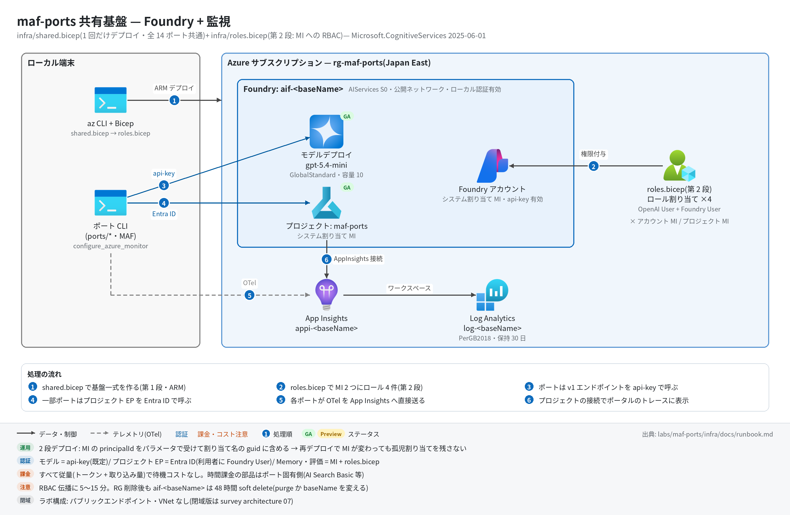

# 共有基盤 実行ガイド

> **対象:** `labs/maf-ports/infra/`([shared.bicep](../shared.bicep) + [roles.bicep](../roles.bicep))— 全ポート共通の Foundry アカウント+プロジェクト+モデルデプロイ+監視と、マネージド ID への RBAC(第 2 段)
> **最終確認:** 2026-09-29 オフライン(`az bicep build` 2 本 OK・az CLI 2.87.0 / Bicep CLI 0.45.15・apiVersion とロール ID を現行 docs と照合)/ ライブ: 2026-07-31(Wave 1 は `baseName=mafports`、Wave 2 は `mafportsw2`)・**2026-09-30**(Port 15 のライブ検証で `baseName=dahp15`・gpt-5.4-mini `2026-03-17` として再構築。`RequestConflict` を踏んで `shared.bicep` に `dependsOn` を追加)。いずれも検証後に削除済み — 再デプロイ手順は §5
> **正は本 Markdown。** 人間用 HTML(同じディレクトリの `runbook.html`)は `python3 labs/tools/build_runbooks.py` で生成する(HTML は直接編集しない)。ラボ全体の概要と進捗は [maf-ports README](../../README.md)、移植規約(Bicep 規約を含む)は [PORTING.md](../../PORTING.md)。

## 1. この基盤で確かめること

- **2 段デプロイ**(① shared.bicep → ② roles.bicep)で、各ポートが `labs/maf-ports/.env` の 5 変数だけで Foundry に接続できる状態を作れること。
- RBAC を第 2 段に分けた理由(Wave 2 で実測した罠): Bicep で作ったプロジェクト/アカウントの MI には、Memory やクラウド評価が必要とするモデルデータプレーン権限が**自動では付かない**。さらに MI は再デプロイでローテーションし得るため、principalId を guid のシードに含めて割り当て名を作り直す(旧 principal への孤児割り当てを残さない)。
- **ステートレス設計**: 使わない期間は RG ごと削除し、Bicep から再現できること(ただし Foundry アカウント名の soft delete 48 時間に注意 — §8)。

## 2. 構成



| リソース | 型(apiVersion) | 名前 | 役割 | 課金 |
| --- | --- | --- | --- | --- |
| Log Analytics | `Microsoft.OperationalInsights/workspaces`(2023-09-01) | `log-<baseName>` | App Insights の格納先(PerGB2018・保持 30 日) | 取り込み量従量 |
| Application Insights | `Microsoft.Insights/components`(2020-02-02) | `appi-<baseName>` | 全ポートの OTel トレース送信先(ワークスペースベース) | 取り込み量従量(Log Analytics 側) |
| Foundry アカウント | `Microsoft.CognitiveServices/accounts`(2025-06-01) | `aif-<baseName>` | kind `AIServices`・SKU S0・`allowProjectManagement`・システム割り当て MI・公開ネットワーク・ローカル認証(api-key)有効 | 固定費なし(使った機能の従量) |
| プロジェクト | `accounts/projects`(2025-06-01) | `maf-ports`(固定) | ポートの作業単位・システム割り当て MI | なし |
| AppInsights 接続 | `accounts/projects/connections`(2025-06-01) | `appinsights-<baseName>` | プロジェクトのトレース画面の参照先(接続文字列を ApiKey として保持、全員共有) | なし |
| モデルデプロイ | `accounts/deployments`(2025-06-01) | `<modelName>`(= デプロイ名) | GlobalStandard・容量 `modelCapacity`(1K TPM 単位)・`OnceCurrentVersionExpired` で自動版上げ | トークン従量(容量は上限で予約課金ではない) |
| ロール割り当て ×4(第 2 段) | `Microsoft.Authorization/roleAssignments`(2022-04-01) | `guid(account.id, principalId, roleId)` | アカウント MI・プロジェクト MI × {Cognitive Services OpenAI User, Foundry User}、スコープはアカウント | なし |

apiVersion の監査(2026-09-29):

- `Microsoft.CognitiveServices/*` の **2025-06-01 は据え置き**。Foundry の Bicep how-to がリンクする公式サンプル(foundry-samples `infrastructure-setup-bicep/00-basic`)が今も 2025-06-01 を使っている。テンプレートリファレンスには新しい GA(2025-12-01 / 2026-03-01 / 2026-05-01 / 2026-07-01)があり、スクラッチで 2026-05-01 に置換してもビルド・lint とも警告なしだったが、本基盤が使うプロパティに差がないため変更は次回のライブ検証とセットにする。なお 2026-07-01 は手元の Bicep CLI 0.45.15 の型定義に未収録でオフライン型検査できない。
- `OperationalInsights/workspaces@2023-09-01`(新しい GA 2025-07-01 あり)と `Insights/components@2020-02-02`(最新 GA)は、公式の App Insights モジュール(`41-standard-agent-setup/modules-standard/application-insights.bicep`)と同じ版。`roleAssignments@2022-04-01` は最新 GA。
- ロール ID: `5e0bd9bd-…` = Cognitive Services OpenAI User、`53ca6127-…` = **Foundry User**(旧名 Azure AI User。ID は不変。組み込みロール一覧は旧名を載せていない)。
- AppInsights 接続: 公式サンプルはアカウント直下(`accounts/connections`)に作るが、本基盤はプロジェクト配下。2026-07-31 のライブではプロジェクト配下でトレース表示を確認済み。

## 3. 前提

| 区分 | 必要なもの | 備考 |
| --- | --- | --- |
| ツール | Azure CLI(2.87.0 で確認)+ Bicep(`az bicep`。0.45.15 で確認)。ポートの実行には uv | `az bicep build` はオフラインで動く |
| サブスクリプション | Japan East 等で `AIServices` を作れること、GlobalStandard の対象モデルのクォータ(既定 10K TPM) | クォータは §5.1 で確認 |
| 権限(デプロイする人) | RG への**所有者**(または 共同作成者 + ロール割り当て権限)。第 2 段は `Microsoft.Authorization/roleAssignments/write` が要る | 共同作成者だけだと第 2 段が失敗する |
| 権限(Entra で呼ぶポートの利用者) | サインインユーザー自身に **Foundry User**(データプレーン)。roles.bicep は MI にしか付けない | critique-loop の評価 run など(§5.4) |

shared.bicep のパラメータ:

| パラメータ | 必須 | 既定 | 説明 |
| --- | --- | --- | --- |
| `baseName` | ○ | — | 英小文字数字のみ。`aif-` / `appi-` / `log-` の接頭辞で各リソース名になる。`aif-<baseName>` はカスタムサブドメインにもなるので**グローバル一意** |
| `location` | | RG の場所 | 例: `japaneast` |
| `modelName` | ○ | — | リタイアが早いため既定値なし。例: `gpt-5.4-mini`(2027-09-21 まで GA)。現行の安価 GA モデルは [features/02-models.md](../../../../docs/survey/features/02-models.md) で確認 |
| `modelVersion` | ○ | — | 例: `2026-03-17`(2026-08 の foundry-probes 実測時の gpt-5.4-mini の版)。現行版は §5.1 のコマンドで確認 |
| `modelCapacity` | | 10 | GlobalStandard の容量(1K TPM 単位) |

roles.bicep のパラメータ: `baseName`(shared と同じ値)/ `accountPrincipalId` / `projectPrincipalId`(§5.3 で取得)。

## 4. オフライン検証(Azure 不要・無料)

本基盤には pytest はない。テンプレートの構文・型検査だけをローカルで行う(各ポートのオフラインテストは各ポートの実行ガイド)。

```bash
cd labs/maf-ports/infra
az bicep build --file shared.bicep --stdout > /dev/null   # 期待: エラーなしで何も出ない(新版 Bicep の案内 WARNING は無視してよい)
az bicep build --file roles.bicep  --stdout > /dev/null   # 同上
grep -n '^output' shared.bicep                            # 期待: foundryName / projectEndpoint / openaiV1Endpoint / modelDeploymentName / appInsightsConnectionString の 5 本
```

生成物を残さないこと(`--stdout` を使えば `*.json` は作られない)。テンプレートが固定している設計:

- [ ] shared.bicep にはロール割り当てを置かない(MI ローテーション時の孤児割り当てを防ぐため第 2 段に分離)
- [ ] roles.bicep は 2 principal × 2 ロール = 4 件、名前は `guid(account.id, principalId, roleId)`(principal が変われば別名で新規作成される)
- [ ] 出力 5 本が `.env` の 5 変数に 1 対 1 で対応する(§5.5。API キーだけは出力に出さず CLI で取る)

## 5. ライブ実行(Azure 必要・課金あり)

### 5.1 事前確認

```bash
az login && az account set -s <subscription>
az cognitiveservices account list-deleted -o table     # 同名 aif-<baseName> が soft delete 中なら §8 で purge するか baseName を変える
az cognitiveservices model list -l japaneast \
  --query "[?model.name=='gpt-5.4-mini'].{version:model.version, format:model.format}" -o table   # modelVersion の候補
az cognitiveservices usage list -l japaneast -o table  # GlobalStandard の残りクォータ(1K TPM 単位)
```

### 5.2 第 1 段: shared.bicep

```bash
cd labs/maf-ports/infra
az group create -n rg-maf-ports -l japaneast
az deployment group what-if -g rg-maf-ports -f shared.bicep \
  -p baseName=<baseName> modelName=gpt-5.4-mini modelVersion=<version> modelCapacity=10   # 任意: 作成内容の確認
az deployment group create -g rg-maf-ports -n shared -f shared.bicep \
  -p baseName=<baseName> modelName=gpt-5.4-mini modelVersion=<version> modelCapacity=10
```

期待: `provisioningState: Succeeded`、`outputs` に 5 本。出力の形の例:

```text
foundryName                  aif-<baseName>
projectEndpoint              https://aif-<baseName>.services.ai.azure.com/api/projects/maf-ports
openaiV1Endpoint             https://aif-<baseName>.openai.azure.com/openai/v1
modelDeploymentName          gpt-5.4-mini
appInsightsConnectionString  InstrumentationKey=...;IngestionEndpoint=https://japaneast-...
```

- モデルデプロイはプロジェクト(と App Insights 接続)の**後**に作る(`dependsOn`)。アカウント配下の子リソースを並列に作ると `RequestConflict`(「Another operation is in progress on the resource aif-…」)で片方が失敗し、再実行しても同じ組が並列になるので毎回失敗する(2026-09-30 実測、casebook P-C12)。

### 5.3 第 2 段: roles.bicep(MI へのロール割り当て)

```bash
RG=rg-maf-ports; BASE=<baseName>
AID=$(az cognitiveservices account show -n aif-$BASE -g $RG --query identity.principalId -o tsv)
PID=$(az cognitiveservices account project show -n aif-$BASE -g $RG --project-name maf-ports --query identity.principalId -o tsv)
#   ↑ Wave 2 で使った同等コマンドは shared.bicep 末尾コメントの az rest 版(api-version=2025-06-01)
az deployment group create -g $RG -n roles -f roles.bicep \
  -p baseName=$BASE accountPrincipalId=$AID projectPrincipalId=$PID
```

shared.bicep を**再デプロイしたら毎回**第 2 段もやり直す(MI の principalId が変わっていれば新しい名前で割り当てが作られる)。

### 5.4 RBAC 伝播待ちと利用者の権限

- ロール割り当てがデータプレーンに効くまで **5〜15 分**(travel-memory の実測は約 5〜7 分で、ノード間で不均一 — 片方のプローブが通った後も数分 401 が続いた)。MI でモデルを呼ぶ機能(Memory・クラウド評価)は、この間 401 / PermissionDenied になる。
- api-key でモデルを直接呼ぶだけのポート(trend-analysis / mixture-of-agents / research-handoff など多数)は第 2 段を待たずに動く。
- Entra ID で**プロジェクトのデータプレーン**を呼ぶポート(`FOUNDRY_PROJECT_ENDPOINT` を使う critique-loop / travel-memory / hn-briefing-hosted / governed-agent / claim-voice-live / delegated-access-hosted)は、サインインユーザー自身にも Foundry User が要る(サブスクリプションの所有者・共同作成者だけでは足りない)。**hosted agent を作るポート(hn-briefing-hosted / delegated-access-hosted)は無いと作成が「does not have permissions … agents/write」で拒否される**(2026-09-30 実測。付与後の反映に約 5 分):

```bash
az role assignment create --assignee <自分の UPN またはオブジェクト ID> --role "Foundry User" \
  --scope $(az cognitiveservices account show -n aif-$BASE -g $RG --query id -o tsv)
```

### 5.5 `.env` への転記

`labs/maf-ports/.env`(git 管理外。雛形 `labs/maf-ports/.env.example`)に、共有基盤の出力を次の対応で書く。

| `.env` 変数 | 取得元 | 使うポート |
| --- | --- | --- |
| `FOUNDRY_OPENAI_V1_ENDPOINT` | 出力 `openaiV1Endpoint` | 全ポート(モデル呼び出し) |
| `FOUNDRY_MODEL` | 出力 `modelDeploymentName` | 全ポート |
| `FOUNDRY_API_KEY` | `az cognitiveservices account keys list -n aif-<baseName> -g <rg> --query key1 -o tsv`(出力には含めない) | 全ポート(api-key 認証) |
| `FOUNDRY_PROJECT_ENDPOINT` | 出力 `projectEndpoint` | critique-loop / travel-memory / hn-briefing-hosted / governed-agent / claim-voice-live |
| `APPLICATIONINSIGHTS_CONNECTION_STRING` | 出力 `appInsightsConnectionString` | 全ポート(任意。未設定ならトレース無効) |

```bash
# 新規作成の例(既存の .env を上書きするので、ポート固有の変数があれば後で足し直す)
RG=rg-maf-ports
out() { az deployment group show -g $RG -n shared --query "properties.outputs.$1.value" -o tsv; }
cat > labs/maf-ports/.env <<EOF
FOUNDRY_PROJECT_ENDPOINT=$(out projectEndpoint)
FOUNDRY_OPENAI_V1_ENDPOINT=$(out openaiV1Endpoint)
FOUNDRY_MODEL=$(out modelDeploymentName)
FOUNDRY_API_KEY=$(az cognitiveservices account keys list -n $(out foundryName) -g $RG --query key1 -o tsv)
APPLICATIONINSIGHTS_CONNECTION_STRING=$(out appInsightsConnectionString)
EOF
```

ポート固有の変数(`AZURE_SEARCH_*`・`FOUNDRY_EMBEDDING_MODEL`・`MEMORY_STORE_NAME`・`GITHUB_*`・`VOICE_LIVE_*`・`FOUNDRY_PROPOSER_MODELS` など)は各ポートの実行ガイド・README を参照。

### 5.6 疎通スモーク

```bash
set -a; . labs/maf-ports/.env; set +a
curl -s -X POST "$FOUNDRY_OPENAI_V1_ENDPOINT/responses" \
  -H "Content-Type: application/json" -H "api-key: $FOUNDRY_API_KEY" \
  -d "{\"model\": \"$FOUNDRY_MODEL\", \"input\": \"ping\"}" | head -c 400
# 期待: "status": "completed" を含む Responses API の JSON(v1 API は api-version 不要)

cd labs/maf-ports/ports/trend-analysis && uv sync --extra dev --extra live \
  && uv run trend-analysis-maf "AI coding agents"   # エンドツーエンド+トレース送信(→ trend-analysis の実行ガイド)
```

## 6. 確認観点

| 確認 | # | 観点 | 確認方法 | 期待結果 |
| --- | --- | --- | --- | --- |
| [ ] | 1 | 第 1 段の成功 | `az deployment group show -g <rg> -n shared --query "{state:properties.provisioningState, outputs:keys(properties.outputs)}"` | `Succeeded`、出力 5 本 |
| [ ] | 2 | モデルデプロイ | `az cognitiveservices account deployment list -n aif-<baseName> -g <rg> -o table` | デプロイ名 = `modelName`、SKU `GlobalStandard`、容量 = `modelCapacity` |
| [ ] | 3 | v1 エンドポイントと api-key | §5.6 の curl | HTTP 200・`"status": "completed"`。401 ならキー、404 ならデプロイ名(§9) |
| [ ] | 4 | 第 2 段の割り当て | `az role assignment list --scope <accountId> -o table` | Cognitive Services OpenAI User と Foundry User が、アカウント MI・プロジェクト MI の 2 principal に 1 件ずつ(計 4 件) |
| [ ] | 5 | 割り当て先が現在の MI か(孤児の有無) | #4 の principalId を `az cognitiveservices account show --query identity.principalId` / `project show` の値と突き合わせる | すべて一致。principal 名が空(削除済み principal)の割り当てが残っていれば `az role assignment delete --ids <id>` で消す |
| [ ] | 6 | RBAC 伝播 | MI を使うポート(例: travel-memory のライブスモーク)を割り当て直後と 15 分後に実行 | 直後は 401 になり得る。5〜15 分後に通れば伝播完了 |
| [ ] | 7 | トレースの経路 | §5.6 の trend-analysis 実行後、§7 の KQL | `invoke_agent ...` などのスパン名が並ぶ。ポータルのプロジェクト「トレース」でも同じ実行が見える(AppInsights 接続経由) |
| [ ] | 8 | 秘密情報の扱い | `git status --short labs/maf-ports/` / デプロイ履歴 | `.env` が差分に出ない(.gitignore 済み)。接続文字列はデプロイ出力に残る(取り込み専用キーだが共有範囲に注意) |
| [ ] | 9 | 後片付けとコスト | §8 の手順後に `az group show -n <rg>` と `az cognitiveservices account list-deleted -o table` | RG が存在しない。同じ名前で作り直す予定なら soft delete 中のアカウントを purge 済み |

## 7. トレース・評価の確認

本基盤自体はスパンを出さない。トレースは各ポートの CLI が `APPLICATIONINSIGHTS_CONNECTION_STRING` 宛てに OTel で直接送り、プロジェクトの AppInsights 接続はポータルの「トレース」画面がそれを参照するためにある。

```bash
az monitor app-insights query --app appi-<baseName> -g <rg> \
  --analytics-query "dependencies | where timestamp > ago(1h) | summarize count() by cloud_RoleName, name | order by count_ desc"
```

- 期待: 実行したポートの `workflow.run` / `executor.process ...` / `invoke_agent ...` / `chat <デプロイ名>` / `execute_tool ...` が並ぶ(スパン名の詳細は各ポートの実行ガイド §7)。
- クラウド評価(evals)はプロジェクト MI とユーザー双方の権限に依存する — 手順と罠は critique-loop の README。

## 8. 片付け

```bash
az group delete -n rg-maf-ports --yes --no-wait
# Foundry アカウントは 48 時間 soft delete され、その間は同じ名前(aif-<baseName>)で作り直せない
az cognitiveservices account list-deleted -o table
az cognitiveservices account purge -l japaneast -g rg-maf-ports -n aif-<baseName>   # すぐ同名で再作成したい場合のみ
```

- 別の `baseName` で作るなら purge は不要(Wave 2 は `mafportsw2` で作り直した)。
- コストの考え方: 本基盤のリソースはすべて従量課金で、放置しても時間課金される部品はない(Foundry アカウント・プロジェクト・接続は無料、GlobalStandard はトークン従量、App Insights / Log Analytics は取り込み量従量)。**時間課金の部品はポート固有側**にある(例: db-routing-iq の AI Search Basic)ので、各ポートの実行ガイドの片付けも合わせて行う。単価は書かない方針 — 見積りの手順は [proposal/02-cost-estimation.md](../../../../docs/survey/proposal/02-cost-estimation.md)。

## 9. トラブルシューティング

| 症状 | 原因 | 対処 |
| --- | --- | --- |
| 第 1 段でアカウント名・カスタムサブドメインの衝突エラー | `aif-<baseName>` が他テナントで使用中、または soft delete 中 | §8 で purge するか `baseName` を変える |
| モデルデプロイでクォータ不足のエラー | GlobalStandard のクォータ不足 | `modelCapacity` を下げる / 別リージョン / クォータ申請 |
| モデルデプロイで版・モデル名のエラー | `modelVersion` が現行カタログにない(リタイア・版上げ) | §5.1 の `az cognitiveservices model list` で版を確認し直す |
| 第 2 段で `AuthorizationFailed`(roleAssignments/write) | デプロイ実行者にロール割り当て権限がない | RG の所有者(またはロールベースアクセス制御管理者)に実行してもらう |
| Memory・評価が 401 / PermissionDenied | RBAC 伝播待ち、または MI ローテーション後に第 2 段を流していない | 5〜15 分待つ。shared を再デプロイしたなら §5.3 をやり直し、#5 で孤児を確認 |
| 評価 run が PermissionDenied(MI は正しい) | 提出ユーザー自身に Foundry User がない | §5.4 のコマンドでユーザーに付与 |
| 第 1 段で `RequestConflict`(Another operation is in progress on the resource aif-…)、再実行しても失敗 | 古い `shared.bicep`(モデルデプロイに `dependsOn` がない)でプロジェクトとモデルデプロイが並列に作られた | 最新の `shared.bicep` で再実行(2026-09-30 修正) |
| hosted agent の作成が「does not have permissions … agents/write」 | デプロイ実行者に Foundry User がない | §5.4 のコマンドで付与し、約 5 分待つ |
| トレースがポータルの「トレース」に出ない(KQL では見える) | AppInsights 接続が別リソースを指している / 表示の遅延 | `az cognitiveservices account project connection list -n aif-<baseName> -g <rg> --project-name maf-ports -o table` で `AppInsights` 接続を確認 |

## 10. 関連・更新履歴

- ラボ概要・進捗: [maf-ports README](../../README.md) / 移植規約: [PORTING.md](../../PORTING.md)
- 各ポートの実行ガイド(例): [trend-analysis](../../ports/trend-analysis/docs/runbook.md) / [mixture-of-agents](../../ports/mixture-of-agents/docs/runbook.md) / [research-handoff](../../ports/research-handoff/docs/runbook.md)
- 閉域(VNet・Private Endpoint)構成の考え方: [architecture/07-usecase-regulated-edge.md](../../../../docs/survey/architecture/07-usecase-regulated-edge.md)
- アーキテクチャ図の生成: [tools/README.md](../../tools/README.md)

| 日付 | 内容 |
| --- | --- |
| 2026-09-30 | Port 15 のライブ検証で再構築した際に `RequestConflict` を踏み、`shared.bicep` のモデルデプロイに `dependsOn: [appInsightsConnection]` を追加(§5.2・§9)。hosted agent の作成に実行者の Foundry User が要ることを §5.4・§9 に追記 |
| 2026-09-29 | 初版(Bicep は変更なし。apiVersion・ロール ID を現行 docs と公式サンプルに照合し据え置きを判断)。構成図を v2(日本語・処理順バッジ)に更新し、対象ポート数を 14 に訂正 |
