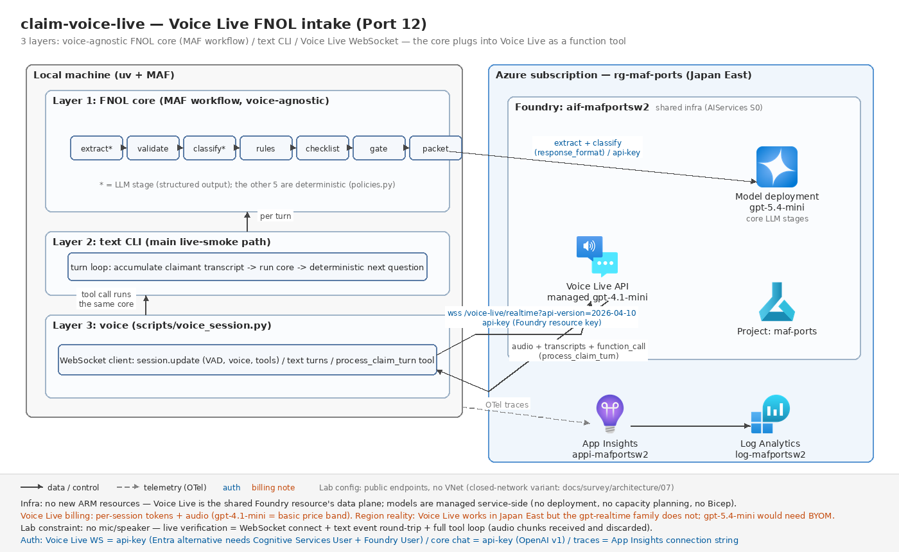

# claim-voice-live — 音声 FNOL 受付の Gemini Live → Voice Live API 移植(Port 12)

元: [`voice_ai_agents/insurance_claim_live_agent_team`](https://github.com/Shubhamsaboo/awesome-llm-apps/tree/main/voice_ai_agents/insurance_claim_live_agent_team)(Google ADK + Gemini Live + FastAPI/WebSocket UI、約 1,900 行)

Wave 2 最終ポート。核心は **Gemini Live → Azure Voice Live API の置換**だが、本ポートの設計上の肝はそこではなく、**FNOL(First Notice of Loss)コアを音声から完全に切り離した 3 層設計**にある — マイク/スピーカーの無い検証環境でも、コア(構造化抽出+決定論ルール+パケット漸進構築)の正しさをテキストだけで完全に検証できる。

## 元の構成(5行)

- 音声ファーストの保険事故受付(FNOL): 請求者が自然に話す間に、構造化クレームパケット(不足項目・書類チェックリスト・ルーティング判定・アジャスター引継ぎ)をリアルタイム構築
- 会話面: Gemini Live(`gemini-3.1-flash-live-preview`)の双方向音声 WebSocket。FastAPI がブラウザとの間で音声チャンク・トランスクリプトを中継
- 頭脳面: ADK `SequentialAgent` 7 ノードグラフ(LLM 2 + 決定論 FunctionNode 5)。**毎ターン、請求者発話の全文をグラフに流して状態を作り直す**
- 決定論ルール: 必須 6 項目検証、種別ごとの必要書類照合、高額(≥$25k)、負傷/危険(SAFE 系)、タイミング不正(90 日超・逆転日付)、SIU ルーティング(policies.py 約 680 行)
- エージェント応答の「次の質問」は LLM ではなく決定論(`claimant_next_message`)。Gemini Live は会話の口、ADK グラフは頭脳という分業

## 実装前調査の結果(2026-07、Learn ドキュメント+installed package 精読)

### Voice Live API の Python SDK と接続契約(voice-live-quickstart / voice-live-how-to)

- SDK は **`azure-ai-voicelive`**(PyPI 1.2.0、`[aiohttp]` extra で async)。Python / C# は**安定版**(Java / JS はプレビュー)。`azure.ai.voicelive.aio.connect(credential=..., endpoint=..., model=..., api_version=...)` → `VoiceLiveConnection`(`send()` は **plain dict も受ける** / `recv()` は型付きイベント)
- 素の WebSocket 契約: `wss://<resource>.services.ai.azure.com/voice-live/realtime?api-version=2026-04-10&model=<model>`。**イベント体系は Azure OpenAI Realtime API 互換**(`session.update` / `conversation.item.create` / `response.create`、`response.text.delta` / `response.audio_transcript.delta` / `response.function_call_arguments.done` 等)。api-version は安定版 **2026-04-10** を採用(2025-10-01 も安定版)
- function calling は Realtime API と同型: `session.tools` に function 宣言 → `response.function_call_arguments.done`(Voice Live は `name` も同イベントに載る)→ `conversation.item.create`(`function_call_output`)+ `response.create` で継続
- 認証は 2 経路: **api-key**(接続ヘッダー/クエリ。共有基盤の `FOUNDRY_API_KEY` = Foundry リソースキーがそのまま通る)/ **Entra**(Bearer、scope `https://ai.azure.com/.default`、要 Cognitive Services User + Foundry User ロール)。Speech リソースでも使えるが「Foundry リソースに最適化。Speech リソースは Agent Service 統合と BYOM 不可」と明記
- Voice Live 固有の追加(全て任意・additive): `azure_semantic_vad`(全モデルで使える意味論 VAD)、`azure_deep_noise_suppression`、`server_echo_cancellation`、Azure TTS voices(azure-standard / HD / custom)

### リージョンとモデル提供(regions?tabs=voice-live)— **Japan East は「使えるが gpt-realtime 系が無い」**

- Voice Live 自体は Japan East 対応(Agent support も ✅)。ただし**モデル別に提供マトリクスが分かれ**、`gpt-realtime` / `gpt-realtime-mini` / `gpt-realtime-1.5` / `azure-realtime`(ネイティブ音声モデル)は **Japan East 非提供**。gpt-4o / gpt-4.1 / gpt-5 系(音声入出力を Azure Speech STT/TTS が担う構成)は Global standard で利用可
- **モデルはマネージド提供**: "you don't need to deploy or manage any generative AI models"(overview 原文)— survey features/07 の記述を一次情報で裏取り。**デプロイ・容量計画・課金予約は不要**、モデル名をクエリで指定するだけ。例外は `gpt-5.5` / `gpt-5.4-mini` / `gpt-5.4-nano` で、pre-deploy されず **BYOM**(自リソースにデプロイして接続)が必要
- 帰結 2 点: (1) 共有基盤のチャットモデル `gpt-5.4-mini` は Voice Live では使えない(BYOM になってしまう)→ 音声側の既定は **`gpt-4.1-mini`**(Japan East で Global standard・Voice Live **basic** 価格帯・非 reasoning で低レイテンシ)。(2) **infra/main.bicep に追加リソースなし** — Voice Live は共有基盤の Foundry リソースのデータプレーンそのもの
- GA/プレビューの表記ゆれ(survey features/07 で確認済み): GA 一覧表は「Voice Live = Preview」、一方で安定版 API・安定版 SDK が存在。**提案では Preview 扱いが安全**。WebRTC 接続・phi4 系・MAI-Voice-2-Flash は明示的にプレビュー → 本ポートは WebSocket + 安定版 API に寄せた

## 移植後の構成(3 層)



```
【層 1: FNOL コア(音声非依存・MAF Workflow)】
ClaimTurn(請求者発話全文)
  ─▶ extract(LLM・構造化出力 ClaimNarrative)─▶ validate(決定論)
  ─▶ classify(LLM・構造化出力 ClaimClassification)─▶ rules ─▶ checklist ─▶ gate ─▶ packet
  ─▶ IntakeState(パケット+最終ルート+次質問)          └ StageDone 進捗イベント

【層 2: テキスト対話層(CLI)】                    ← ライブスモークの主経路
ClaimIntakeConversation: 請求者ターン蓄積 → コア実行 → 決定論の次質問を応答に
CLI: stdin ループ / --script 自動再生 / --json / --output

【層 3: Voice Live 層】
voice.py(純関数: session.update / ツール宣言 / テキストターン / イベント正規化)
scripts/voice_session.py(実 WebSocket: 接続 → session.update →
  テキスト or 音声ターン → process_claim_turn ツール呼び出し → コア実行 → 応答音声)
```

### ADK → MAF 対応表

| 元(ADK + Gemini Live) | 移植後(MAF + Voice Live) | 備考 |
| --- | --- | --- |
| `SequentialAgent`(7 サブエージェント直列) | MAF `WorkflowBuilder` 直列 7 Executor | 段構成は 1:1。スパンがノード単位で出る |
| `LlmAgent` NormalizeClaimNarrative(`output_schema=ClaimNarrative`) | `ExtractExecutor` + `Agent`(`ChatOptions(response_format=ClaimNarrative)`) | instructions 原文流用 |
| `FunctionNode` ValidateRequiredClaimFields | `ValidateExecutor` | policies.py の同名関数 |
| `LlmAgent` ClassifyClaimTypeAndSeverity(state 補間 `{normalized_claim}`) | `ClassifyExecutor`(前段 JSON をプロンプトに埋め込み) | ADK の state テンプレート補間 → 明示的なプロンプト組み立て |
| `FunctionNode` ApplyCoverageAndEvidenceRules / GenerateDocumentChecklist / FraudSignalAndSafetyGate / FinalClaimIntakePacket | `RulesExecutor` / `ChecklistExecutor` / `GateExecutor` / `PacketExecutor` | ルール ID・文言・優先順位は挙動互換 |
| ADK `session.state`(無型 dict 7 キー) | `IntakeDraft`(段間)+ `IntakeState`(最終・型付き) | 無型 state → 型付きメッセージ(Port 4 と同じ規律) |
| `run_claim_workflow(transcript)`(毎ターン全文再実行) | `run_intake_turn(agents, transcript)` | 空文字の短絡(初期状態生成)も同じ |
| Gemini Live `LiveConnectConfig`(system_instruction / voice / 入出力転写) | Voice Live `session.update`(instructions / azure voice / azure_semantic_vad / input_audio_transcription) | 下記「学び 1」 |
| server.py の input_transcription 完了 → ADK グラフ再実行 | `process_claim_turn` **関数ツール**でコアを Voice Live に接続(+ 入力転写イベントの記録) | 元は「転写を盗み見て裏で実行」、移植版は「モデルが明示的にツールを呼ぶ」 |
| FastAPI + ブラウザ UI(音声中継・カード表示) | **スコープ外**(CLI 化。PORTING.md 規約) | |

## 設計判断

### 「音声なしで検証できる」を最優先した 3 層分離

元実装も「Gemini Live = 口 / ADK グラフ = 頭脳」の分業だったが、server.py が転送・状態管理・UI 整形を 700 行で抱え込み、頭脳の検証に音声面が必要だった。移植では層 1+2 だけで FNOL の全ロジック(抽出→検証→分類→規則→ゲート→パケット→次質問)が完結し、**ライブスモークの主経路もテキスト層**(実モデル+スクリプト再生→エスカレーション判定まで)。Voice Live 層は「接続＋イベント往復」だけを検証すればよい薄さに削った。

### FNOL コアは「指示」ではなく「ツール」として Voice Live に繋ぐ

元実装は Gemini Live の**入力転写イベントを裏で盗み見て** ADK グラフを再実行し、結果は UI にだけ反映していた(音声エージェント自身は決定論ルートを知らない)。移植版は `process_claim_turn` 関数ツールとして宣言し、**モデル自身がターンごとにコアを呼び、返ってきた `next_question` / `routing_decision` に基づいて話す**。決定論の次質問が音声応答に反映される(元実装より一貫性が上がる)。テキストターンでも音声ターンでも同じループが回る。

### 送信ペイロードは SDK 型ではなく plain dict

`VoiceLiveConnection.send()` が Mapping を受けることを確認したので、session.update / ツール宣言 / テキストターン / function_call_output は**すべて純関数が組む dict**(voice.py)。受信も `recv_bytes()` → `parse_voice_event(dict)`(純関数)に正規化。オフラインテストが SDK 非依存になり、`--extra voice` はスクリプトとライブスモークだけの依存に閉じた。

### 元実装の癖の発見と保存(「移植はコードレビュー」の今回分)

- `_document_provided` のフォールバックは書類名の**先頭 3 語をカンマ付きのまま部分文字列照合**する。"Refund, voucher, or credit documentation" は 3 語目が "or" になり、"major" や "storm" を含む語りがあるだけで「提出済み」扱いになる — 旅行クレームでは実質常に成立(`test_document_provided_or_fallback_quirk_is_preserved` と eval `travel_ready_for_adjuster` で文書化)
- 盗難クレームで「police report を**まだ出していない**」と言うと、"police" の語が evidence テキストに載るため **THEFT-001(報告書要求)が消える**(THEFT-002 シグナルは残る)— eval `theft_no_police_needs_docs` で保存
- いずれも挙動互換を優先してそのまま移植し、テストで固定した

## 実行

```bash
uv sync --extra dev                # コア+テキスト対話層(Voice Live 依存なし)
uv run pytest                      # オフライン(ネットワーク不要・77 件)

# --- テキスト対話層ライブ(要 共有基盤 + ../../.env)---
uv run claim-voice-live-maf                                    # 対話(claimant 役で入力)
uv run claim-voice-live-maf --script tests/data/fnol_auto_injury.txt
uv run claim-voice-live-maf --script tests/data/fnol_auto_injury.txt --json --output runs/state.json
uv sync --extra dev --extra live && uv run pytest -m live -k text   # スモーク主経路

# --- Voice Live 層(要 --extra voice)---
uv sync --extra dev --extra voice
uv run python scripts/voice_session.py --probe                 # 接続確立+session.updated
uv run python scripts/voice_session.py --text "I need to file a claim for my flooded basement."
uv run python scripts/voice_session.py --script tests/data/fnol_auto_injury.txt
uv run pytest -m live -k voice                                 # WebSocket 接続+テキスト往復
CLAIM_VOICE_TOOL_SMOKE=1 uv run pytest -m live -k tool         # ツール完全ループ(任意)
```

環境変数(すべて省略可・lab ルート `.env` に追記): `VOICE_LIVE_ENDPOINT`(既定: `FOUNDRY_PROJECT_ENDPOINT` から導出)/ `VOICE_LIVE_MODEL`(既定 `gpt-4.1-mini`)/ `VOICE_LIVE_API_VERSION`(既定 `2026-04-10`)/ `VOICE_LIVE_VOICE`(既定 `en-US-AvaNeural`。日本語なら `ja-JP-NanamiNeural` 等)。

**検証範囲の制約(明記)**: 本環境にはマイク/スピーカーが無いため、Voice Live のライブ検証は**接続確立+テキストイベント往復**(`conversation.item.create` の `input_text` → `response.audio_transcript.delta` / `response.audio.delta` 受信)までとする。音声入力(`input_audio_buffer.append`)への拡張点は `scripts/voice_session.py` に TODO で明示済み。音声チャンクは受信して破棄(バイト数のみ計上)する。**コスト注意**: Voice Live はセッション中のトークン+音声で課金(gpt-4.1-mini = basic 価格帯)。スモークは短文 1〜2 往復に留める。

## 評価

[tests/eval_dataset.jsonl](./tests/eval_dataset.jsonl)(8 ケース)は「抽出済みクレーム+分類 → 期待ルート・シグナル・次質問」のデータ駆動検証で、**LLM 2 段の後段すべて**(検証→規則→チェックリスト→ゲート→パケット→次質問)を決定論として固定する: 書類未提出(1)/ 負傷エスカレーション(1)/ 盗難未届け(1)/ 曖昧・欠落(1)/ タイミング不正(2)/ 高額無証憑(1)/ 完備 → ready(1、"or" 癖の固定を兼ねる)。これによりライブ評価で見るべき残余は「transcript からこの claim / classification が抽出できるか」(= `-m live -k text` のアサーション)だけに縮む。

## 検証結果(2026-07-31 オフライン)

- オフラインテスト **77 passed**(決定論ルール 29 / ワークフロー 12 / 会話層 8 / Voice Live ペイロード 15 / 設定 4 / データセット 9)/ ruff clean / `az bicep build` OK(生成 json は削除)
- 実 MAF `Agent` の構築(構造化出力付き)と `scripts/voice_session.py` のモジュールロードはオフラインで確認済み。`azure-ai-voicelive` 1.2.0 の `connect` シグネチャ・`send()` の dict 受理・イベント型は installed package で突合済み
- ライブスモーク(テキスト層・Voice Live 接続)は未実施(呼び出し元が実施)。**未検証の残リスク**:
  1. Voice Live の `session.update` に `tools` + `azure_semantic_vad` + `input_audio_transcription` を同時指定した場合の受理(ドキュメント上は全て有効な組合せ。エラー時は `error` イベントの `message` が返る設計にしてある)
  2. `gpt-4.1-mini` が期待どおり Japan East ルーティングで応答するか(モデル提供は Global standard なので処理リージョンはグローバル — データ所在が論点になる案件では Data zone / Standard 提供リージョンの選定が必要)
  3. テキストのみモダリティ(`--no-audio`)の受理。Realtime API 互換なら `["text"]` は合法だが、Voice Live 側の検証は未実施のため、スモークは `["text","audio"]` で音声を破棄する経路を既定にした

## 検証結果(2026-07-31 ライブ)

- オフライン **77 passed** / ruff clean / bicep build OK
- ライブスモーク **3 passed(34.5s)**:
  1. テキスト対話層: 事故シナリオスクリプト再生 → FNOL パケット完成 → **emergency_escalation 判定**
  2. **Voice Live 実接続**: WebSocket 確立(安定版 api-version 2026-04-10、マネージド gpt-4.1-mini、api-key 認証)+テキストイベント往復
  3. **ツール完全ループ**: Voice Live のセッションから FNOL コアが関数ツールとして呼ばれ、応答が返る
- 環境制約: マイク/スピーカーなしのため音声入出力の実検証は未実施(接続・イベント・ツールループまで)。音声検証手順は scripts/voice_session.py に記載

## 学び(MAF/Foundry vs 元構成)

1. **Gemini Live と Voice Live の API 設計差は「独自イベント体系 vs Realtime API 互換+additive 拡張」に集約される。**Gemini Live は `LiveConnectConfig` + `server_content`(input/output_transcription、model_turn、interrupted...)という Google 独自の器で、元 server.py はその器に合わせた 150 行のイベント分岐を書いていた。Voice Live は **Azure OpenAI Realtime API のイベント名をそのまま使い**、Azure 固有機能(意味論 VAD・ノイズ抑制・Azure TTS 音声・アバター)を session プロパティの**追加**として載せる。移植で書いたイベント分岐(`parse_voice_event`)は Realtime API の知識がそのまま通用し、既存の Realtime クライアントからの乗換コストを最小化する設計思想が明確。一方 Gemini Live が 1 モデルで音声理解〜音声生成まで持つのに対し、Voice Live は「ネイティブ音声モデル(gpt-realtime 系)」と「テキストモデル+STT/TTS 合成」の**二形態を同じ API で抽象化**しており、後者ならどの GPT でも音声エージェント化できる — この抽象化がリージョン制約の回避策にもなった(学び 3)。
2. **音声非依存コアの分離は「移植可能性」と「テスト可能性」を同時に買う一石二鳥だった。**元実装の頭脳(ADK グラフ+決定論ルール)は最初から音声非依存だったのに、検証には FastAPI+ブラウザ+マイクが要った。移植では (a) コアを MAF Workflow として層 1 に固定、(b) 会話蓄積を層 2 に分離、(c) 音声を層 3 の純関数+薄いスクリプトに削った結果、**77 テスト全部がネットワークなしで回り、ライブスモークの主経路すらテキスト**になった。決定論部分が大きいアプリ(本件は約 680 行が決定論)ほどこの分離の配当は大きい。Voice Live 置換自体も「層 3 の差し替え」に閉じ、Gemini Live の痕跡はコアに 1 行も残っていない — **音声 API の移植コストは、コアがどれだけ音声を知らないかで決まる**。
3. **Voice Live のリージョン/デプロイ要件の実際: 「デプロイ不要」は本当だが、「リージョンで使える」はモデル別に読む必要がある。**survey の「モデルはマネージド提供」は一次情報で裏が取れ(デプロイ・容量計画・Bicep 追加すべて不要 — infra/main.bicep は existing 参照+出力のみ)、Foundry リソースの api-key がそのまま通るので接続の摩擦は驚くほど低い。ただし規則表は 3 段組で読む: (a) Voice Live 対応リージョンか(Japan East ✅)、(b) 使いたい**モデルがそのリージョンで提供されるか**(gpt-realtime 系は Japan East ✗ — ネイティブ音声モデルは使えない)、(c) そのモデルが pre-deploy されるか(gpt-5.4-mini は BYOM 必要 — 共有基盤のチャットモデルを流用できない)。Routines(8)・Memory(19)・hosted(31)に続き、**「同じ Foundry でもサブ機能×モデル×リージョンの積集合で可否が決まる」**の最も細かい事例。GA 一覧表と製品ページの成熟度表記が食い違う点(Preview vs 安定版 API 併存)も提案時の注意点。
4. **「会話の口」と「業務の頭脳」の接続方法が、転写の盗み見(元)から関数ツール(移植)へ変わり、アーキテクチャが素直になった。**元実装は Gemini Live に業務ロジックを渡す口が system_instruction しかなく、決定論ルートは UI にしか反映されなかった(音声エージェントは自分のバックエンドが決めたエスカレーション判定を知らずに話し続ける)。Voice Live は Realtime API 互換の function calling を持つため、FNOL コアを `process_claim_turn` ツールとして宣言し、**モデルが自分でコアを呼び、決定論の次質問を踏まえて話す**構成にできた。「LLM は口、決定論は頭脳」の分業を API 契約(ツール)として明示できるのは、音声エージェントを業務システムに組み込むときの本質的な改善点。ただしツール呼び出しはモデルの裁量なので、確実性が要るなら元方式(入力転写イベントで裏実行)の併用が保険になる — 本ポートは両方のイベントを拾う設計にしてある。
5. **ADK `SequentialAgent` → MAF Workflow は最も摩擦の少ない移植パターンで、差分は「state の型」に出る。**7 ノード直列は Executor+エッジの直訳(対応表 1:1)で、ADK の `FunctionNode`(session.state を読み書きする自作基底クラス+Event 発行)が MAF では `@handler` 1 メソッドに縮む。ADK が session.state の**無型 dict**+instruction 内テンプレート補間(`{normalized_claim}`)で段間を繋ぐのに対し、MAF は型付きメッセージ+明示的なプロンプト組み立てになり、「分類器に何を渡しているか」がコードから読める。元実装が全関数を `Any` で受けて `_as_model` で毎回復元していた防御コードは、型付きグラフでは丸ごと不要になった(policies.py が約 80 行痩せた)。毎ターン全文再実行(状態を持たない頭脳)という元設計は MAF でもそのまま成立し、ステートレスな `Agent.run` と相性が良い。
