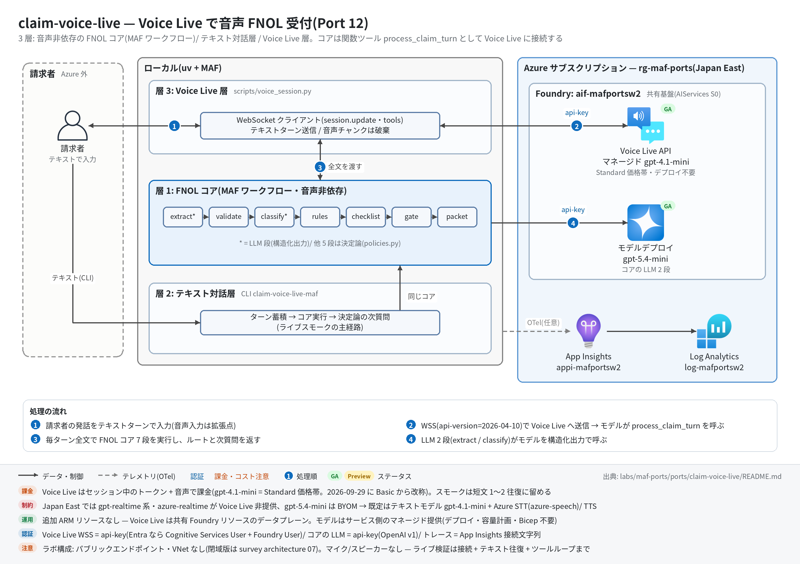

# claim-voice-live 実行ガイド

> **対象:** `labs/maf-ports/ports/claim-voice-live/`(Port 12・パターン: 音声非依存コアの 3 層設計 — FNOL コア(MAF 7 段直列ワークフロー)/ テキスト対話層 / Voice Live 層(関数ツールでコアを呼ぶ))
> **最終確認:** 2026-09-29 オフライン(77 passed・`ruff check .` clean・依存 agent-framework-core 1.19.0 / agent-framework-openai 1.14.4 / azure-ai-voicelive 1.3.0 / openai 3.20.0)/ ライブ: 2026-07-31(当時の構成 core 1.13 / azure-ai-voicelive 1.2.0 / openai 2.51。3 passed。Azure リソースは削除済み — 再デプロイ手順は §5)
> **正は本 Markdown。** 人間用 HTML(同じディレクトリの `runbook.html`)は `python3 labs/tools/build_runbooks.py` で生成する(HTML は直接編集しない)。設計判断と移植の学びは [README](../README.md)。

## 1. このパターンで確かめること

- **FNOL コア(層 1)**: 請求者発話の全文から `extract`(LLM・構造化出力)→ `validate` → `classify`(LLM・構造化出力)→ `rules` → `checklist` → `gate` → `packet` が毎ターン直列に動き、ルート(`emergency_escalation` / `special_investigation` / `needs_docs` / `ready_for_adjuster`)と**決定論の次質問**が出ること。
- **テキスト対話層(層 2)**: 音声なしでもスクリプト再生だけで FNOL パケットが完成し、負傷シナリオが `emergency_escalation` に到達すること(ライブスモークの主経路)。
- **Voice Live 層(層 3)**: WebSocket 接続 → `session.update` → テキストターン → 応答(テキスト+音声チャンク)の往復が成立し、モデルが `process_claim_turn` ツールでコアを呼んで決定論の次質問を踏まえて話すこと。
- 技術選定上の意味: 音声 API の移植コストは「コアがどれだけ音声を知らないか」で決まる。Voice Live は Realtime API 互換+Azure 拡張で、テキストモデル+STT/TTS 構成ならリージョン制約(Japan East に gpt-realtime 系なし)を回避できる(README の学び 1〜3)。

## 2. 構成



```text
【層 1: FNOL コア(MAF Workflow・音声非依存)】
ClaimTurn(請求者発話の全文)─▶ extract ─▶ validate ─▶ classify ─▶ rules ─▶ checklist ─▶ gate ─▶ packet ─▶ IntakeState
【層 2: テキスト対話層】ClaimIntakeConversation(ターン蓄積 → コア実行 → 次質問)/ CLI claim-voice-live-maf
【層 3: Voice Live 層】scripts/voice_session.py: wss://<res>.services.ai.azure.com/voice-live/realtime?api-version=2026-04-10&model=gpt-4.1-mini
   session.update(instructions / azure-standard voice / azure_semantic_vad / azure-speech 転写 / tools=process_claim_turn)
   → テキストターン → response.function_call_arguments.done → コア実行 → function_call_output → 応答音声+テキスト
```

| コンポーネント | 役割 | 課金 |
| --- | --- | --- |
| MAF Workflow(ローカル、`workflow.py`) | 7 Executor 直列(LLM 2 段+決定論 5 段) | なし |
| MAF `Agent` ×2(`agents.py`) | `claim_narrative_extractor` / `claim_type_classifier`(構造化出力)。共有基盤のモデルを api-key で呼ぶ | — |
| モデルデプロイ(共有基盤、既定 gpt-5.4-mini) | 層 1 の LLM 2 段 | トークン従量 |
| Voice Live(共有基盤の Foundry リソースのデータプレーン) | マネージドモデル `gpt-4.1-mini`(デプロイ不要)+ Azure STT(`azure-speech`)/ TTS(`en-US-AvaNeural`) | Voice Live **Standard** 価格帯(2026-09-29 に Basic から改称)のトークン+音声 |
| App Insights(共有基盤) | 層 1 のトレース送信先(任意) | 取り込み量従量 |

## 3. 前提

| 区分 | 必要なもの | 備考 |
| --- | --- | --- |
| ツール | uv(Python 3.11 以上。uv が取得。検証は 3.13) | オフライン実行はこれだけ。マイク/スピーカーは不要(音声は受信して破棄) |
| Azure(ライブのみ) | 共有基盤([infra/shared.bicep](../../../infra/shared.bicep))のみ。**Voice Live 用の追加リソース・モデルデプロイはない**(`infra/main.bicep` は existing 参照+出力だけ) | テキスト層はトークン従量、Voice Live はセッション中のトークン+音声 |
| リージョン | Japan East は Voice Live 対応。`gpt-4.1-mini` は Global standard で提供(処理リージョンはグローバル)。gpt-realtime 系・azure-realtime は Japan East 非提供 | データ所在が論点なら Data Zone 提供のモデル/リージョンを選び直す |
| 権限 | 既定は api-key(`FOUNDRY_API_KEY` = Foundry リソースキー)なので RBAC 不要。`--entra` 時は Cognitive Services User + Foundry User | RBAC 伝播に 5〜15 分 |
| ネットワーク | `*.services.ai.azure.com` への WSS(443)と、テキスト層の `*.openai.azure.com` への HTTPS | WebSocket を遮断するプロキシ下では層 3 だけ失敗する |

環境変数(`labs/maf-ports/.env`。雛形は `.env.example`。**ライブ実行時のみ必要**。読み込み順はカレントの `.env` → lab ルートの `.env` で、既にシェルにある値が優先):

| 変数 | 用途 | 取得元 |
| --- | --- | --- |
| `FOUNDRY_OPENAI_V1_ENDPOINT` | 層 1 の LLM 呼び出し先。**必須** | shared.bicep の出力 `openaiV1Endpoint` |
| `FOUNDRY_MODEL` | 層 1 のモデルデプロイ名。**必須**(Voice Live のモデルとは別) | shared.bicep の出力 `modelDeploymentName` |
| `FOUNDRY_API_KEY` | api-key 認証(層 1 と Voice Live の両方)。**必須** | `az cognitiveservices account keys list -n <foundryName> -g <rg> --query key1 -o tsv` |
| `FOUNDRY_PROJECT_ENDPOINT` | Voice Live 接続先の導出元(ホスト部 `https://<res>.services.ai.azure.com/` を使う) | shared.bicep の出力 `projectEndpoint` |
| `VOICE_LIVE_ENDPOINT` | Voice Live 接続先の明示指定(省略時は上から導出) | port の `infra/main.bicep` 出力 `voiceLiveEndpoint` |
| `VOICE_LIVE_MODEL` | Voice Live のマネージドモデル(既定 `gpt-4.1-mini`) | 任意 |
| `VOICE_LIVE_API_VERSION` | Voice Live API バージョン(既定 `2026-04-10`。GA 最新は `2026-07-15`) | 任意 |
| `VOICE_LIVE_VOICE` | Azure TTS 音声(既定 `en-US-AvaNeural`。日本語なら `ja-JP-NanamiNeural` 等) | 任意 |
| `APPLICATIONINSIGHTS_CONNECTION_STRING` | 層 1 のトレース送信先(任意) | shared.bicep の出力 `appInsightsConnectionString` |
| `CLAIM_VOICE_TOOL_SMOKE` | `1` のときだけツール完全ループのライブスモークを実行 | 手で設定 |

## 4. オフライン実行(Azure 不要・無料)

```bash
cd labs/maf-ports/ports/claim-voice-live
uv sync --extra dev                 # コア+テキスト対話層(Voice Live SDK なしで全テストが通る)
uv run pytest                       # 期待: 77 passed, 3 deselected(live は既定で除外。ネットワーク不要)
uv run ruff check .                 # 期待: All checks passed!(図生成スクリプト docs/architecture.py を含む)
```

Voice Live 層のスクリプトが新しい SDK で読み込めるかの確認(接続はしない):

```bash
uv sync --extra dev --extra voice
uv run python scripts/voice_session.py --help   # 期待: usage に --probe / --text / --script / --no-audio / --entra
```

オフラインテストが固定している主な挙動:

- [ ] 決定論ルール: 負傷 → SAFE-002 エスカレーション、水害の危険語 → SAFE-001、高額(≥$25k)→ LOSS-001、高額かつ証憑なし → EVID-001(SIU)、報告日が事故日より前 → TIMING-001、90 日超 → TIMING-002。緊急は SIU より優先(`test_policies.py` の各テスト、`test_emergency_beats_siu_in_final_route`)
- [ ] 次質問は決定論: 緊急時は質問より人間への引継ぎ、それ以外はブロッキング項目 → 非ブロッキング → 書類の順(`test_next_message_emergency_overrides_questions` / `test_next_message_asks_blocking_field_first` / `test_next_message_falls_back_to_non_blocking_then_documents`)
- [ ] 元実装の癖の保存: 書類名の先頭 3 語照合で「提出済み」になる "or" 癖、盗難で「police report をまだ出していない」と言うと THEFT-001 が消える(`test_document_provided_or_fallback_quirk_is_preserved` / `test_theft_unfiled_police_report_signals_theft_002`)
- [ ] ワークフロー: 7 段が順に進捗イベントを出し、空の発話は LLM を呼ばずに初期状態を返す。抽出・分類の失敗は空クレーム / 初期分類にフォールバック(`test_stage_events_flow_in_order` / `test_empty_transcript_short_circuits_without_llm` / `test_extraction_failure_falls_back_to_blank_claim` / `test_classification_failure_falls_back_to_initial`)
- [ ] 構造化出力: ネイティブの構造化出力を優先し、散文に包まれた JSON も拾う(`test_native_structured_output_value_is_preferred` / `test_json_wrapped_in_prose_is_parsed`)
- [ ] 会話層: ターンを蓄積して毎回**全文**をコアに渡し、ルートと次質問がターンごとに変わる(`test_multi_turn_passes_accumulated_transcript_to_core` / `test_route_and_question_evolve_across_turns`)
- [ ] Voice Live 契約: `session.update` の既定(azure-standard 音声・`azure_semantic_vad`・`azure-speech` 転写・ツール宣言)、WebSocket URL が docs の形、テキスト/音声トランスクリプト両方の delta を同じ種別に畳む、関数呼び出しイベントの解釈(`test_session_config_defaults` / `test_websocket_url_matches_documented_contract` / `test_parse_response_text_from_both_modalities` / `test_parse_function_call_event`)
- [ ] 評価データセット 8 ケース(書類未提出 / 負傷 / 盗難未届け / 曖昧 / タイミング 2 / 高額無証憑 / 完備)が決定論パイプラインの期待ルート・シグナルと一致する(`test_deterministic_pipeline_matches_expectations`)

## 5. ライブ実行(Azure 必要・課金あり)

### 5.1 デプロイ

共有基盤(Foundry アカウント+プロジェクト+モデル+App Insights)が未作成なら先に [共有基盤の実行ガイド](../../../infra/docs/runbook.md) §5 で作り、§5.5 の手順で `.env` に転記する。本ポート固有のリソースはない。

```bash
cd labs/maf-ports/ports/claim-voice-live
az deployment group create -g <rg> -f infra/main.bicep -p baseName=<baseName> \
  --query properties.outputs -o json
# 期待: openaiV1Endpoint / projectEndpoint / voiceLiveEndpoint /
#       voiceLiveWebSocketUrl(wss://<res>.services.ai.azure.com/voice-live/realtime?api-version=2026-04-10&model=gpt-4.1-mini)
```

### 5.2 実行

```bash
# 層 2: テキスト対話層(スモークの主経路)
uv sync --extra dev --extra voice --extra live
uv run claim-voice-live-maf --script tests/data/fnol_auto_injury.txt
uv run claim-voice-live-maf --script tests/data/fnol_auto_injury.txt --json --output runs/state.json
uv run claim-voice-live-maf                                   # 対話(/packet で現在のパケット、/quit で終了)
uv run pytest -m live -k intake                               # 事故シナリオ → emergency_escalation(1 passed)

# 層 3: Voice Live
uv run python scripts/voice_session.py --probe                # 接続確立+session.updated だけ
uv run python scripts/voice_session.py --text "I need to file a claim for my flooded basement."
uv run python scripts/voice_session.py --script tests/data/fnol_auto_injury.txt
uv run pytest -m live -k websocket                            # WebSocket 接続+テキスト往復(1 passed)
CLAIM_VOICE_TOOL_SMOKE=1 uv run pytest -m live -k tool        # ツール完全ループ(任意。モデルのツール判断に依存)
```

期待される出力の例(テキスト層。発話ごとに `[route=...]` が変わる。値は実行ごとに変わる):

```text
Agent> I can start the claim while we talk. First, are you and everyone else in a safe place?
Claimant> I need to file an auto claim. My name is Jordan Lee, policy AUTO-90210. ...
  [route=needs_docs type=... missing=...]                                  ← stderr(情報不足の間は needs_docs)
Agent> <決定論の次質問>
...
Claimant> My passenger has neck pain and went to urgent care. ...
  [route=emergency_escalation type=auto_collision missing=0]               ← stderr
Agent> Your claim mentions injury, safety, or habitability concerns. A human representative ...

# Insurance Claim Intake Packet
...
**Routing decision:** Emergency Escalation
```

期待される出力の例(Voice Live 層):

```text
[connect] wss://<res>.services.ai.azure.com/voice-live/realtime?api-version=2026-04-10&model=gpt-4.1-mini   ← stderr
[session] updated (connection established)                                                               ← stderr
PROBE OK: connection + session.update round trip succeeded                                               ← --probe のとき
(--text / --script のとき) エージェント発話のテキストが流れ、ツール呼び出し時に
[core] route=... missing=... next='...'                                                                  ← stderr
[audio] discarded <N> base64 chars                                                                       ← stderr(音声は破棄)
[final route] emergency_escalation                                                                       ← stderr(スクリプト再生時)
```

終了コード: CLI は 正常 0 / 設定不足 2 / Ctrl-C 130。1 ターンのタイムアウトは既定 120 秒(`--timeout`)。

## 6. 確認観点

| 確認 | # | 観点 | 確認方法 | 期待結果 |
| --- | --- | --- | --- | --- |
| [ ] | 1 | 正常系: テキスト層でパケット完成 | `claim-voice-live-maf --script tests/data/fnol_auto_injury.txt --json` | `claim.policy_number` に `90210`、`classification.claim_type` が `auto_collision`、最終ルート `emergency_escalation`、`gate.signals` に `SAFETY-001`、パケット Markdown に `**Routing decision:** Emergency Escalation` |
| [ ] | 2 | 正常系: Voice Live 接続 | `voice_session.py --probe` | `[session] updated` と `PROBE OK` が出る(`error` イベントなし) |
| [ ] | 3 | 正常系: Voice Live のテキスト往復 | `voice_session.py --text "..."` / `pytest -m live -k websocket` | 応答テキスト(`response.text.delta` または `response.audio_transcript.delta`)が空でない。音声チャンクは `[audio] discarded` で件数だけ出る |
| [ ] | 4 | パターン固有: ツールでコアを呼ぶ | `voice_session.py --script tests/data/fnol_auto_injury.txt` | stderr に `[core] route=...` が出て、最後に `[final route] emergency_escalation`。モデルの発話が決定論の次質問(人間への引継ぎ)を踏まえている |
| [ ] | 5 | 分岐: ルートの遷移 | 対話モードで 1 発話ずつ入力し `/packet` を見る | 情報不足の間は `needs_docs`、負傷の言及で `emergency_escalation` に変わる(負傷を否定する言い方ではエスカレーションしない) |
| [ ] | 6 | 異常系: 設定不足 | `FOUNDRY_API_KEY= uv run claim-voice-live-maf`(空文字はシェルの値が優先される) | 終了コード 2、stderr に `error: 環境変数が未設定: FOUNDRY_API_KEY(labs/maf-ports/.env を確認)` |
| [ ] | 7 | 異常系: Voice Live の設定エラー | `VOICE_LIVE_MODEL=gpt-realtime` で `--probe`(Japan East 非提供のモデル) | `Voice Live error: ...` で停止する(`error` イベントの `message` がそのまま出る。応答内容はライブ未確認) |
| [ ] | 8 | 観測: トレース着信 | §7 の KQL | 層 1 の `executor.process extract|validate|classify|rules|checklist|gate|packet` と `invoke_agent claim_narrative_extractor|claim_type_classifier` |
| [ ] | 9 | コスト・後片付け | 実行後にスクリプトが終了しているか(WebSocket が閉じているか) | Voice Live はセッション中のトークン+音声で課金。スモークは短文 1〜2 往復に留め、使わない期間は RG ごと削除(§8) |

## 7. トレース・評価の確認

```bash
az monitor app-insights query --app appi-<baseName> -g <rg> \
  --analytics-query "dependencies | where timestamp > ago(30m) | summarize count() by name"
```

- 期待するスパン名(層 1。`APPLICATIONINSIGHTS_CONNECTION_STRING` と live extra があるときだけ送信): `workflow.run` / `executor.process extract|validate|classify|rules|checklist|gate|packet` / `invoke_agent claim_narrative_extractor|claim_type_classifier` / `chat <デプロイ名>`。
- Voice Live の WebSocket セッションは本ポートでは計装していない(Voice Live 側の組み込みテレメトリは未構成)。層 3 の確認はスクリプトの stderr(`[connect]` / `[session]` / `[core]` / `[final route]`)で行う。
- 評価: `tests/eval_dataset.jsonl`(8 ケース)で LLM 2 段の後段すべてを決定論として固定済み。ライブで見るべき残余は「transcript からこの claim / classification を抽出できるか」だけ(= `pytest -m live -k intake` のアサーション)。

## 8. 片付け

```bash
# 本ポート固有のリソースはない(Voice Live は共有基盤のデータプレーン)。共有基盤ごと消す場合:
az group delete -n <rg> --yes --no-wait
```

- 同じ `baseName` で作り直す場合は Foundry アカウントの soft delete に注意 — [共有基盤の実行ガイド](../../../infra/docs/runbook.md) §8。
- ローカルの生成物(`runs/state.json` など)は手で削除する。

## 9. トラブルシューティング

| 症状 | 原因 | 対処 |
| --- | --- | --- |
| `error: VOICE_LIVE_ENDPOINT か FOUNDRY_PROJECT_ENDPOINT を設定してください` | Voice Live の接続先を導出できない | `.env` に `FOUNDRY_PROJECT_ENDPOINT`(または `VOICE_LIVE_ENDPOINT`)を追記 |
| `error: azure-ai-voicelive 未導入(uv sync --extra voice)` | voice extra なしで層 3 を実行 | `uv sync --extra dev --extra voice`(live と併用するなら extra を全部並べる。`uv sync` は指定しない extra を外す) |
| `Voice Live error: ...`(モデル関連) | 指定モデルがリージョンで提供されていない、または BYOM 対象(gpt-5.5 / gpt-5.4-mini / gpt-5.4-nano)を指定 | 既定の `gpt-4.1-mini` に戻す。gpt-realtime 系を使うなら提供リージョンにリソースを置く |
| 401 / 接続拒否 | キーの誤り、またはアカウントでローカル認証が無効 | キーを再取得。Entra で試すなら `--entra`(Cognitive Services User + Foundry User) |
| ツールが呼ばれない(`[core]` が出ない) | ツール呼び出しはモデルの裁量 | テキストターンを具体的にする。確実性が要る設計なら入力転写イベントでコアを裏実行する方式を併用(README の学び 4) |
| テキストのみ(`--no-audio`)で応答が来ない | テキスト単独モダリティの受理はライブ未検証 | 既定の `["text","audio"]`(音声は破棄)で実行する |

## 10. 関連・更新履歴

- 設計判断と学び: [README](../README.md)
- Voice Live の機能・GA 状況: [features/07-foundry-tools.md](../../../../../docs/survey/features/07-foundry-tools.md)
- 公式: [Voice Live 概要(モデルと価格帯)](https://learn.microsoft.com/en-us/azure/ai-services/speech-service/voice-live) / [voice-live-how-to](https://learn.microsoft.com/en-us/azure/ai-services/speech-service/voice-live-how-to) / [リリースノート](https://learn.microsoft.com/en-us/azure/ai-services/speech-service/releasenotes?pivots=voice-live) / [リージョン](https://learn.microsoft.com/en-us/azure/ai-services/speech-service/regions?tabs=voice-live)

| 日付 | 内容 |
| --- | --- |
| 2026-09-29 | 初版(依存を agent-framework-core 1.19 / azure-ai-voicelive 1.3.0 / openai 3.20 へ更新。api-version 2026-04-10・gpt-4.1-mini・azure-speech は現行 docs で有効と確認しコード変更なし。構成図を v2 スタイル(日本語・処理順バッジ)に更新し `ruff check .` を clean に) |
