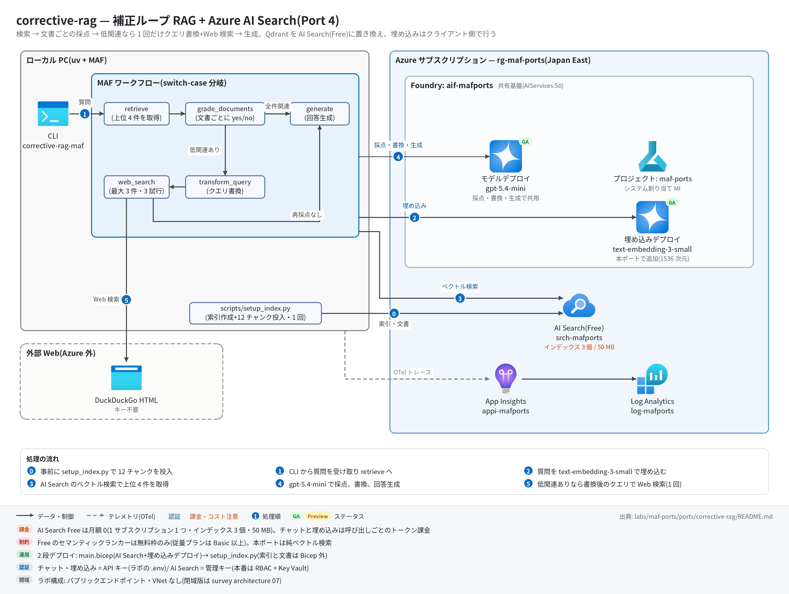

# corrective-rag 実行ガイド

> **対象:** `labs/maf-ports/ports/corrective-rag/`(Port 4・パターン: 補正ループ RAG — switch-case 分岐+Azure AI Search Free+クライアント側埋め込み)
> **最終確認:** 2026-09-29 オフライン(37 passed・ruff clean・依存 agent-framework-core 1.19.0 / agent-framework-openai 1.14.4 / openai 3.20.0 / azure-search-documents 12.0.0)/ ライブ: 2026-07-31(当時の構成。Azure リソースは削除済み — 再デプロイ手順は §5)
> **正は本 Markdown。** 人間用 HTML(同じディレクトリの `runbook.html`)は `python3 labs/tools/build_runbooks.py` で生成する(HTML は直接編集しない)。設計判断と移植の学びは [README](../README.md)。

## 1. このパターンで確かめること

- 質問 → ベクトル検索(上位 4 件)→ **文書ごとの yes/no 採点** → 全件関連なら直接 `generate`、1 件でも低関連なら `transform_query`(クエリ書換)→ `web_search`(DuckDuckGo・最大 3 件)→ `generate`、という**2 経路の分岐**が switch-case エッジで起きること。
- 補正パスは**最大 1 回**(再採点・再書換なし)。「補正ループ」という名前に反して元実装どおりの一方向 DAG で、グラフ構造そのものが上限になっていること。
- Qdrant → Azure AI Search の置換で、埋め込みモデルのデプロイ・次元数(1536)・インデックス投入(データプレーン)が**自分の設計項目になる**こと(README 学び 2)。LangGraph の共有 dict が MAF の型付きメッセージに分解される点は README 学び 1。

## 2. 構成



| コンポーネント | 役割 | 課金 |
| --- | --- | --- |
| MAF Workflow(ローカル、`workflow.py`) | retrieve → grade_documents →(switch-case)→ generate / transform_query → web_search → generate | なし |
| モデルデプロイ gpt-5.4-mini(共有基盤) | 採点(`response_format=GradeScore`)・書換・生成の 3 役割で共用 | トークン従量(採点は検索件数ぶん呼ばれる) |
| 埋め込みデプロイ text-embedding-3-small(本ポートの `infra/main.bicep` が共有 Foundry に追加) | 投入時(`setup_index.py`)とクエリ時(`OpenAIEmbedder`)のクライアント側埋め込み | トークン従量(微小) |
| Azure AI Search `srch-<baseName>`(Free SKU) | 純ベクトル検索(HNSW・1536 次元・インデックス `corrective-rag`) | 無料(1 サブスクリプション 1 つまで) |
| DuckDuckGo HTML(Azure 外) | Web 検索フォールバック(キー不要、3 試行・4s/8s 待ち) | なし |
| App Insights `appi-<baseName>`(共有基盤) | OTel トレースの送信先 | 取り込み量従量(少量) |

## 3. 前提

| 区分 | 必要なもの | 備考 |
| --- | --- | --- |
| ツール | uv(Python は uv が取得。検証は 3.13) | オフライン実行はこれだけ |
| Azure(ライブのみ) | 共有基盤([infra/shared.bicep](../../../infra/shared.bicep))+本ポート固有: AI Search(Free)と text-embedding-3-small デプロイ([infra/main.bicep](../infra/main.bicep)) | Free Search は 1 サブスクリプションに 1 つまで。既に別の Free があると作成に失敗する |
| 権限 | デプロイ先 RG の共同作成者(共有 Foundry アカウントへのデプロイ追加を含む)。実行時の認証は **API キー**(Foundry・AI Search とも)なので、データプレーンの RBAC 付与は不要 | 本番は RBAC / Key Vault(README 参照) |

環境変数(`labs/maf-ports/.env`。雛形は [.env.example](../../../.env.example)。**ライブ実行時のみ必要**。`AZURE_SEARCH_*` は雛形に無いので手で追記する):

| 変数 | 用途 | 取得元 |
| --- | --- | --- |
| `FOUNDRY_OPENAI_V1_ENDPOINT` | チャット・埋め込みの呼び先(`https://<foundry>.openai.azure.com/openai/v1`) | shared.bicep / main.bicep の出力 `openaiV1Endpoint` |
| `FOUNDRY_MODEL` | チャットモデルのデプロイ名(例: `gpt-5.4-mini`) | shared.bicep の出力 `modelDeploymentName` |
| `FOUNDRY_API_KEY` | Foundry の API キー | `az cognitiveservices account keys list -n aif-<baseName> -g <rg>` |
| `AZURE_SEARCH_ENDPOINT` | AI Search のエンドポイント | main.bicep の出力 `searchEndpoint` |
| `AZURE_SEARCH_ADMIN_KEY` | AI Search の管理キー(インデックス作成・検索の両方に使用) | main.bicep の出力 `searchAdminKey` |
| `FOUNDRY_EMBEDDING_MODEL`(任意) | 埋め込みデプロイ名 | 既定 `text-embedding-3-small`(main.bicep の出力 `embeddingDeploymentName`) |
| `AZURE_SEARCH_INDEX`(任意) | インデックス名 | 既定 `corrective-rag` |
| `APPLICATIONINSIGHTS_CONNECTION_STRING`(任意) | トレース送信先。未設定ならトレース無効で実行は続く | shared.bicep の出力 `appInsightsConnectionString` |

## 4. オフライン実行(Azure 不要・無料)

```bash
cd labs/maf-ports/ports/corrective-rag
uv sync --extra dev
uv run pytest                                  # 期待: 37 passed, 1 deselected(live は既定で除外。ネットワーク不要)
uv run pytest -W error::DeprecationWarning     # 期待: 37 passed(非推奨 API の混入検知)
uv run ruff check .                            # 期待: All checks passed!
```

オフラインテストが固定している主な挙動:

- [ ] 全文書が関連 → 書換・Web 検索なしで直接生成(`test_all_relevant_generates_directly`)/ 1 件でも低関連 → 書換 → Web 検索 → 生成(`test_low_relevance_triggers_rewrite_and_web_search`)
- [ ] 補正パスは 1 回だけで、Web 結果は再採点されない(`test_single_corrective_pass_no_regrade_or_rerewrite`)
- [ ] 採点がパース不能なら安全側に文書を残す(`test_unparseable_grade_keeps_document`)。ネイティブ構造化出力 `.value` が優先される(`test_grader_native_value_path`)
- [ ] 検索 0 件のときは Web 検索に行かず**空コンテキストで直接生成**する元実装の癖を保存(`test_empty_retrieval_goes_direct_with_empty_context`)
- [ ] Web 検索が 3 試行とも失敗 / 0 件でも、残った文書だけで生成まで進む(`test_web_search_failure_still_generates_with_filtered_docs` / `test_web_search_empty_results_appends_nothing`)。リトライ待ちは 4s → 8s(`tests/test_search.py`)
- [ ] 進捗イベントが経路どおりに出る(`test_progress_events_direct_route` / `test_progress_events_corrective_route`)

## 5. ライブ実行(Azure 必要・課金あり)

### 5.1 デプロイ

```bash
# (1) 共有基盤が未作成なら先に作る(詳細は labs/maf-ports/README.md「実行の前提」)
cd labs/maf-ports
az group create -n rg-maf-ports -l japaneast
az deployment group create -g rg-maf-ports -f infra/shared.bicep \
  -p baseName=mafports modelName=gpt-5.4-mini modelVersion=2026-03-17 modelCapacity=10
#   モデル名・版は docs/survey/features/02-models.md で現行を確認(上は 2026-09-29 時点の例)

# (2) 本ポート固有: AI Search(Free)+ text-embedding-3-small デプロイ
cd ports/corrective-rag
az deployment group create -g rg-maf-ports -f infra/main.bicep -p baseName=mafports
az deployment group show -g rg-maf-ports -n main --query properties.outputs
#   → searchEndpoint / searchAdminKey を ../../.env の AZURE_SEARCH_ENDPOINT / AZURE_SEARCH_ADMIN_KEY に転記
```

main.bicep のパラメータ: `baseName`(必須。shared.bicep と同じ値)/ `searchServiceName`(既定 `srch-<baseName>`、グローバル一意)/ `embeddingModelName`(既定 `text-embedding-3-small`)/ `embeddingModelVersion`(既定 `1`)/ `embeddingCapacity`(既定 10 = 10K TPM)。

### 5.2 インデックス作成と実行

```bash
uv sync --extra dev --extra live
uv run python scripts/setup_index.py --recreate   # data/*.md を埋め込んで投入(再実行は --recreate なしでも冪等な upsert)
uv run corrective-rag-maf "Azure AI Search の Free レベルにはどんな制約がありますか?"
uv run corrective-rag-maf --json "Azure AI Search の Basic レベルは月額いくら?"   # 補正パス期待
uv run corrective-rag-maf --top-k 6 "Foundry Agent Service の組み込みツールは?"   # 取得件数の変更
uv run pytest -m live                              # ライブスモーク(インデックス作成済みが前提)
```

期待される出力の例(値は実行ごとに変わる。CLI の書式と 2026-07-31 ライブ結果から作った**形の例**):

```text
$ uv run python scripts/setup_index.py --recreate
deleted index: corrective-rag            ← 初回は "no existing index to delete"
index ready: corrective-rag (https://srch-mafports.search.windows.net)
chunked 4 files into 12 chunks
embedded with text-embedding-3-small
uploaded 12/12 chunks

$ uv run corrective-rag-maf "Azure AI Search の Free レベルにはどんな制約がありますか?"
tracing: App Insights 有効
[retrieve] 4 docs
[grade] kept=1 dropped=3 → transform query + web search     ← 全件 yes なら "→ generate"
[transform_query] 'Azure AI Search の Free レベルには…' → 'Azure AI Search Free tier limitations …'
[web_search] 3 results                                       ← 失敗時は "[web_search] failed"
<回答本文(stdout)>

(corrective path: query rewritten to '…', web results: 3)
```

`--json` の出力は `question` / `original_question` / `answer` / `corrected` / `documents` / `grades`(文書ごとの `yes` / `no` / `error-kept`)/ `web_result_count`(直行時は `null`)/ `web_search_failed`。

## 6. 確認観点

| 確認 | # | 観点 | 確認方法 | 期待結果 |
| --- | --- | --- | --- | --- |
| [ ] | 1 | 正常系: インデックス投入 | `uv run python scripts/setup_index.py --recreate` | `uploaded 12/12 chunks`(2026-07-31 のライブ時は 11 チャンク。コーパス訂正で 12 に)。終了コード 0 |
| [ ] | 2 | 正常系: コーパス内の質問 | §5.2 の 1 問目を実行 | 回答がコーパス(インデックス 3 個・50 MB・セマンティックランカーは無料枠のみ)に沿う。stderr の `[grade]` 行で経路を確認 — 採点が厳しく in-domain でも補正パスに入ることがある(2026-07-31 は 4 件中 3 件棄却) |
| [ ] | 3 | 分岐: 補正パス | 鮮度依存の質問を `--json` で実行(§5.2 の 2 問目) | `corrected: true`、`question` が書換後で `original_question` と異なる、`web_result_count` が 1〜3、`grades` に `no` を含む |
| [ ] | 4 | 補正は 1 回だけ | 同じ実行の stderr | `[transform_query]` と `[web_search]` が各 1 行だけ。`--json` の `grades` の件数 = `[retrieve]` の件数(Web 結果は再採点されない) |
| [ ] | 5 | 異常系: Web 検索失敗 | DuckDuckGo がレート制限(202 / 429)を返したとき、またはオフラインテスト `test_web_search_failure_still_generates_with_filtered_docs` | `[web_search] failed` の後も回答が出る。`--json` の `web_search_failed: true` |
| [ ] | 6 | 観測: トレース | §7 の KQL | `executor.process retrieve` / `grade_documents` / `transform_query` / `web_search` / `generate` と、`invoke_agent grader_agent` が**採点した文書数ぶん**並ぶ |
| [ ] | 7 | 評価の下準備(任意) | `tests/eval_dataset.jsonl` の 7 問を `--json` で流し、`corrected` を `expected_route`(direct / corrective)と突き合わせる | 分岐の当否を観察記録として残す(合否ラインは設けない)。`documents`+`answer`+質問は Foundry の Groundedness 評価器の入力になる |
| [ ] | 8 | コスト・後片付け | §8 を実行後 `az group show -n rg-maf-ports` | `ResourceGroupNotFound`。Free Search は月額 0 だが 1 サブスクリプション 1 枠を占有するので、使わないなら消す |

## 7. トレース・評価の確認

```bash
az monitor app-insights query --app appi-mafports -g rg-maf-ports \
  --analytics-query "dependencies | where timestamp > ago(30m) | summarize count() by name | order by name asc"
```

- 期待するスパン名: `executor.process retrieve` / `executor.process grade_documents` / `executor.process generate`(補正パスなら `executor.process transform_query` / `executor.process web_search` も)、`invoke_agent grader_agent`(文書数ぶん)/ `invoke_agent rewriter_agent` / `invoke_agent generator_agent`、各 LLM 呼び出しの `chat <model>`。
- 取り込みには数分の遅延がある。0 件なら `APPLICATIONINSIGHTS_CONNECTION_STRING` の設定と、CLI の最初の行に `tracing: App Insights 有効` が出たかを確認。
- 埋め込み(`OpenAIEmbedder`)と AI Search の呼び出しは MAF の計装対象外なので、スパンには出ない。

## 8. 片付け

```bash
az group delete -n rg-maf-ports --yes --no-wait   # 共有基盤ごと削除(インデックスは setup_index.py で再構築できるのでステートレス)

# 共有基盤を残して本ポート分だけ消す場合
az search service delete -n srch-mafports -g rg-maf-ports --yes
az cognitiveservices account deployment delete -n aif-mafports -g rg-maf-ports --deployment-name text-embedding-3-small
```

## 9. トラブルシューティング

| 症状 | 原因 | 対処 |
| --- | --- | --- |
| `error: 環境変数が未設定: AZURE_SEARCH_ENDPOINT, …`(終了コード 2) | `.env` に AI Search の値が無い(`.env.example` に載っていない) | main.bicep の出力 `searchEndpoint` / `searchAdminKey` を `labs/maf-ports/.env` に追記 |
| `ModuleNotFoundError: azure.search` / `openai`、または aiohttp 関連の ImportError | `--extra live` なしで同期した(非同期の azure-search-documents は aiohttp が必要) | `uv sync --extra dev --extra live` |
| 検索で 404(index not found) | インデックス未作成、または `AZURE_SEARCH_INDEX` の食い違い | `uv run python scripts/setup_index.py` を先に実行 |
| main.bicep のデプロイで Free の作成に失敗 | 同じサブスクリプションに既に Free の検索サービスがある / リージョンの容量制約 | 既存の Free を削除するか、`searchServiceName` を既存に合わせず別サブスクリプション・別リージョンで作る |
| しばらく使っていなかったら検索サービスが消えていた | Free は長期間操作がないと削除され得る(公式の制限事項) | main.bicep を再デプロイ → `setup_index.py --recreate` |
| 埋め込みで `DeploymentNotFound` | 埋め込みデプロイ未作成、または `FOUNDRY_EMBEDDING_MODEL` の不一致 | main.bicep の出力 `embeddingDeploymentName` と揃える |
| 投入・検索でベクトル次元のエラー | 埋め込みモデルを 1536 次元以外(例: text-embedding-3-large = 3072)に変えた | `retrieval.EMBEDDING_DIMENSIONS` を合わせ、`--recreate` で作り直す |
| Foundry 呼び出しで 401 | `FOUNDRY_API_KEY` の誤り / アカウントのキー認証が無効 | キーを取り直す(shared.bicep は `disableLocalAuth: false`) |
| `[web_search] failed` が続く | DuckDuckGo のレート制限・ボット判定 | 時間をおく。失敗しても回答は出る(元実装どおりの挙動) |

## 10. 関連・更新履歴

- 設計判断と学び: [README](../README.md)(LangGraph → MAF 対応表・Free SKU の割り切り・補正ループはループしない)
- RAG のアーキテクチャ選定: [architecture/04 チャット・RAG](../../../../../docs/survey/architecture/04-usecase-chat-rag.md) / Foundry IQ・AI Search の位置づけ: [features/04 ツール・ナレッジ](../../../../../docs/survey/features/04-tools-knowledge.md)
- 移植規約(テスト・トレース・Bicep の必須要件): [PORTING.md](../../../PORTING.md)

| 日付 | 内容 |
| --- | --- |
| 2026-09-29 | 初版(agent-framework-core 1.12→1.19 / openai 2.51→3.20 に更新、コード変更なし。「Free はセマンティックランカー不可」の誤記を訂正し、コーパスが 12 チャンクに。図を v2〈日本語+処理順〉に更新) |
