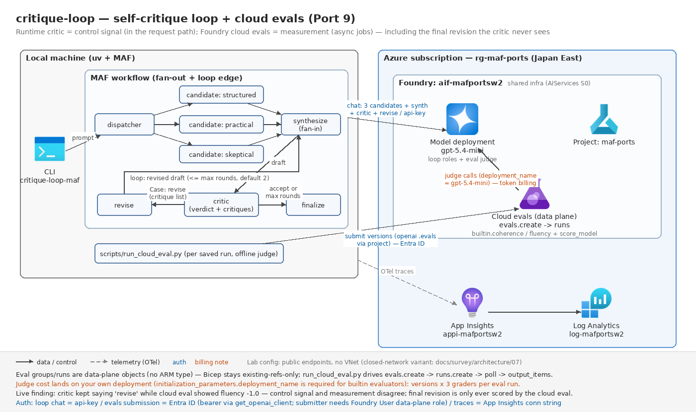

# critique-loop — 批評・改善ループ + Foundry クラウド評価(Port 9)

元: [`advanced_llm_apps/gpt_oss_critique_improvement_loop`](https://github.com/Shubhamsaboo/awesome-llm-apps/tree/main/advanced_llm_apps/gpt_oss_critique_improvement_loop)(Groq SDK 直書き + Streamlit、228 行)

## 元の構成(5行)

- Streamlit UI。プロンプトを入力し、max_iterations スライダー(1〜3、既定 2)で改善周回数を選ぶ
- `generate_initial_answer`: 同一プロンプトを temperature=0.9 で **3 並列生成**(ThreadPoolExecutor)し、temperature=0.2 で 1 本に統合("Pro Mode")
- `critique_answer`: 批評者として「'•' 始まりの箇条書き」で欠陥・欠落を列挙させる(temperature=0.3、**自由テキスト**)
- `revise_answer`: 批評全点に対処した改訂を生成(temperature=0.2)
- `for iteration in range(max_iterations)` で批評→改訂を**無条件に**繰り返し、最後の改訂を最終回答として表示(改善履歴は expander)。全役割が同一モデル(openai/gpt-oss-120b)で、役割差は temperature のみ

## 本ポートの核心 = 実行時の自己批評ループと、Foundry クラウド評価(AI judge)の分担

移植は 2 つの部品からなる:

1. **ループ本体**(workflow.py): 並列候補生成(fan-out)→統合(fan-in)→批評(構造化出力: 継続/終了判断+改善指示)→改訂、のサイクリックグラフ。上限は元実装と同じ 1〜3(既定 2)
2. **クラウド評価**(scripts/run_cloud_eval.py): ループの各周回の中間出力(初稿 / 改訂1 / 改訂2)を **azure-ai-projects の evals API(OpenAI 互換 evals クライアント)**で採点し、「実行時の自己批評の判断」と「オフラインの評価器スコアの傾向」が一致するかを突き合わせる

| 観点 | 実行時の自己批評(critic) | クラウド評価(evals API) |
| --- | --- | --- |
| 位置 | **リクエストパス内**(同期。次のアクションを決める) | **パス外**(非同期のサーバー側ジョブ) |
| 出力 | 継続/終了の判断+**改訂に使える指示リスト** | 版ごとの**比較可能なスカラースコア**+理由 |
| 消費者 | 次のノード(reviser) | 人間・ダッシュボード(ポータルの評価レポート) |
| 網羅性 | **上限打ち切り時、最終改訂は批評されない**(元実装も同じ) | 全版を採点できる — 実行時の死角を補完する |
| コスト | 実行ごとに発生(早期終了で節約) | 回したいときだけ(判定モデルのトークン課金) |

このうち「最終改訂は実行時には未評価」という死角は評価アイテムの `runtime_verdict` フィールドに `unevaluated` として現れる(cloud_eval.py の `build_eval_items` がループ実行結果から機械的に導出する)。**クラウド評価の一番の役割が、まさにこの実行時に誰も見ていない最終成果物の採点**になる — この分担が本ポートで実証したかった設計上の整理(学び 1)。

## evals API 調査(azure-ai-projects 2.4.0 精読)と採った経路

実装前調査の結論 — **`AIProjectClient` に evals 操作群はない**(あるのは evaluation_rules / datasets / indexes 等)。evals は OpenAI 互換クライアント側に露出する:

- **クライアント取得**: `AIProjectClient(project_endpoint, DefaultAzureCredential()).get_openai_client()`(`_patch.py` 211 行)が、base_url = プロジェクトエンドポイント + `/openai/v1`、api_key = `get_bearer_token_provider(credential, "https://ai.azure.com/.default")` の **openai SDK クライアント**を返す。evals はその `.evals`(`evals.create` → `evals.runs.create` → `evals.runs.output_items.list`)
- **組み込み評価器**: openai ネイティブの testing_criteria(label_model / score_model / text_similarity / python)に加え、Azure 拡張の `{"type": "azure_ai_evaluator", "evaluator_name": "builtin.coherence", "data_mapping": {...}}` を渡す。この型は `azure.ai.projects.models.TestingCriterionAzureAIEvaluator`(**TypedDict**。`models/_patch_evaluation_typeddicts.py` — openai SDK は TypedDict を実行時検証しないため素の dict のまま通る)
- **データソース**: `data_source_config` は `{"type": "custom", "item_schema": ...}`、ランの `data_source` は `{"type": "jsonl", "source": {"type": "file_content", "content": [{"item": {...}}]}}`(インライン JSONL — ファイルアップロード不要)。`include_sample_schema: False` で「完成品の採点のみ(モデル再実行なし)」になる
- **評価器の選定**: builtin から **coherence / fluency** の 2 つ(ground truth もコンテキストも要らず、自由記述の版比較に合う)+ rubric は openai ネイティブの **score_model** グレーダー(自由記述 rubric+判定モデル指定)で実装。Azure 側の rubric 評価器は SDK に `builtin.*` の名前一覧が存在せず発見性がないため、仕様が SDK の型として確認できる score_model を選んだ(判断の記録)

**採った経路**: SDK フルパス(evals.create → runs.create → ポーリング → output_items 集計)を scripts/run_cloud_eval.py に実装した。「複雑すぎる場合は JSONL 出力+ポータル手順に落とす」フォールバックは**不要だった** — API 面が openai SDK そのままなので、クライアント側は素の dict の組み立てと集計だけで済む(全て cloud_eval.py の純関数としてオフラインテスト済み)。`--dry-run` が送信ペイロードをそのまま表示するので、SDK を使わずポータル/REST で流したい場合の JSONL 素材も同じスクリプトから得られる。

## 移植後の構成



```
                ┌─▶ candidate(structured)─┐
    prompt ──▶ dispatcher ─▶ candidate(practical) ─┼─▶ synthesize ─▶ critic ─┐
                └─▶ candidate(skeptical) ─┘                    ▲             │ switch-case
                                                               │             ├─[accept or 上限到達]─▶ finalize
                                                    revise ◀───┴─[revise]────┘        ─▶ CritiqueLoopResult
                                                    (ループエッジ)
```

- fan-out/fan-in は Port 2(mixture-of-agents)、ループエッジ+データ条件の終了は Port 7(game-design-team)の型を踏襲
- 批評は `ChatOptions(response_format=CritiqueVerdict)` のネイティブ構造化出力(`{"verdict": "accept"|"revise", "critiques": [...]}`)+lenient フォールバック(schemas.py — corrective-rag と同型)
- Streamlit → CLI(`critique-loop-maf "prompt"` / `--max-rounds` / `--show-history` / `--json` / `--save-run`)。進捗(候補完了・批評 verdict・改訂)は stderr にストリーム表示
- `--save-run` の JSON(版ごとの中間出力を含む)が scripts/run_cloud_eval.py の入力になる

## 設計判断

### 上限は元実装に合わせ、LLM 呼び出し回数も一致させる

`for range(max_iterations)` は「revise → critic のループエッジ+switch-case のデータ条件」に写像した。上限(`LoopState.max_rounds`、1〜3・既定 2 = 元スライダー)はメッセージが運び、**改訂数が上限に達したら critic は LLM を呼ばずに打ち切る**。元実装は最後の改訂を批評しない(ループが批評→改訂の順だから)ので、この設計で批評・改訂の呼び出し回数が元と正確に一致する(上限 2 なら: 候補3+統合1+批評2+改訂2)。

### 早期終了は移植で追加した唯一の意味論差分

元実装の批評は**読み捨てられない自由テキストだが、終了判断には一切使われない** — 完璧な回答でも max_iterations 回改訂される(コストが固定)。移植では批評を構造化出力にし、`verdict="accept"` なら改訂せず終了する。上限は元と同じなので悪化方向の差分はない。「revise なのに critiques が空」は改訂プロンプトに載せるものがないため accept に正規化し、構造化出力が JSON として壊れていた場合は安全側(= 元実装の無条件改訂に相当)に倒して応答全文を 1 批評として改訂する(max_rounds で必ず停止するので発散しない)。

### 温度による多様性はペルソナ差に置き換える(Port 2 の翻訳)

元の「temperature=0.9 ×3 並列」による候補多様性は、gpt-5.4-mini(reasoning 系)が temperature を受け付けないため(tech-selection-guide §2-6)、観点ペルソナ 3 種(structured / practical / skeptical)の instructions 差に置き換えた。統合/批評/改訂は元どおり system prompt なし・プロンプト原文を Executor が組み立てる。

### クラウド評価は「純関数+薄い実行スクリプト」に分離

evals API に送る内容(評価アイテム・評価器定義・データソース)と結果集計は cloud_eval.py の**純関数**にし、ネットワークを触る部分(クライアント生成・ポーリング)だけを scripts/run_cloud_eval.py に置いた。送信ペイロードの形・`runtime_verdict` の対応付け・stage×grader 集計は 13 件のオフラインテストで固定してある。評価グループ/ランはデータプレーンのオブジェクトで ARM では作れない(Bicep → スクリプトの 2 段デプロイ — travel-memory の Memory ストアと同件)。

## 実行

```bash
uv sync --extra dev
uv run pytest                      # オフライン(ネットワーク不要・44 件)

# --- ライブ(要 共有基盤 + ../../.env)---
az deployment group create -g rg-maf-ports -f infra/main.bicep -p baseName=mafportsw2
#   (existing 参照のみ。新規リソースなし — 出力の endpoint 確認用)

uv run critique-loop-maf "Explain recursion with examples."
uv run critique-loop-maf "What are the best practices for API design?" --max-rounds 3 --show-history
uv sync --extra dev --extra live && uv run pytest -m live   # ライブスモーク

# --- クラウド評価(要 az login + FOUNDRY_PROJECT_ENDPOINT)---
uv run critique-loop-maf "Explain recursion with examples." --save-run runs/recursion.json
uv sync --extra eval
uv run python scripts/run_cloud_eval.py runs/*.json --dry-run   # 送信内容の確認(オフライン)
uv run python scripts/run_cloud_eval.py runs/*.json             # 実行(builtin.coherence/fluency + rubric)
```

**課金注意**: クラウド評価は評価器の判定モデルがサーバー側で実行され、**プロジェクト側にトークン課金**が発生する(1 ランの規模は「版数 × 評価器 3 つ」の判定呼び出し)。評価は Entra ID 認証のみ(`get_openai_client()` の bearer token provider)。インフラ: 共有基盤のみ(existing 参照)— 評価グループ/ランはデータプレーンのため**本ポート固有の Azure リソースはゼロ**。

## 評価

[tests/eval_dataset.jsonl](./tests/eval_dataset.jsonl)(5 題)は元アプリの SAMPLE_PROMPTS 4 つ(技術説明)+エッセイ 1 つで、各題に「批評が拾うべき欠落」「改訂で追加されるべき観点」を期待として付した。ライブでは各題を `--save-run` 付きで実行し、scripts/run_cloud_eval.py で **stage(initial / revision-1 / revision-2)× 評価器(coherence / fluency / rubric)のスコア表**と initial→最終版のスコア差(delta)を出す。**実行時の critic が revise と判断して改訂した版列で、クラウド評価のスコアが単調に上がっていれば、自己批評ループが実際に品質を押し上げた**(= 実行時判断とオフライン評価の傾向一致)ことの傍証になる。逆に delta が 0 近傍なら「改善ループのコストに見合う品質向上がない」ことを評価器が示したことになり、それ自体が max_rounds 選定の入力になる。

## 検証結果(2026-07-31)

- オフラインテスト **44 passed** / ruff clean / `az bicep build` OK(生成 json は削除)
- クラウド評価スクリプトの `--dry-run`(送信ペイロード確認)をオフラインで実行し、testing_criteria(azure_ai_evaluator ×2 + score_model)と評価アイテム(stage / runtime_verdict 付き)の形を確認済み
- ライブスモーク・クラウド評価の実実行は未実施(呼び出し元で実施)。手順:
  1. `uv sync --extra dev --extra live` → `uv run pytest -m live`(ループ 1 周の完走+構造化 verdict)
  2. CLI 1 回(`--save-run runs/xxx.json`)→ トレース到達の確認クエリ:
     ```bash
     az monitor app-insights query --app appi-mafportsw2 -g rg-maf-ports \
       --analytics-query "dependencies | where timestamp > ago(30m) | summarize count() by name"
     ```
     期待: `executor.process`(critic / revise が周回数ぶん)+ `invoke_agent` スパン
  3. `uv sync --extra eval` → `az login` → `uv run python scripts/run_cloud_eval.py runs/*.json` → stage×評価器のスコア表と delta、ポータルの評価レポート(report_url)を確認
- 未検証の残リスク(ライブで確認すべき点): (1) Foundry の evals エンドポイントが `azure_ai_evaluator` testing_criteria と custom データソースの組み合わせを本プロジェクトで受理すること、(2) `builtin.coherence` / `builtin.fluency` の data_mapping キー名(query / response)が現行サービス版と一致すること、(3) score_model グレーダーの判定モデルに gpt-5.4-mini(reasoning 系)を指定した場合の挙動

## 検証結果(2026-07-31 ライブ)

- オフライン **44 passed** / ライブスモーク完走(2周: 3候補並列→統合→批評10件→改訂×2)
- **クラウド評価 完走**: builtin.coherence / builtin.fluency で3段階(初稿/改訂1/改訂2)を評価
  - initial: coherence 4.00 / fluency 5.00 → revision-2: coherence **5.00(+1.00)** / fluency **4.00(−1.00)**
  - **実行時批評は「revise」を出し続けたが、クラウド評価では fluency が悪化** — 「制御信号と測定は別物」という設計仮説が実データで裏付けられた(改訂は一貫性を上げ、流暢さを犠牲にしていた)
  - 上限打ち切りの revision-2 が実行時未評価になる死角も、クラウド評価側で捕捉できることを確認
- **到達までの躓き(重要・3連発)**:
  1. builtin 評価器は `initialization_parameters.deployment_name`(ジャッジ用モデルデプロイ)必須 — 評価コストは自分のデプロイに乗る
  2. プロジェクト/アカウント MI への割り当てが**孤児化**していた(MI ローテーション+guid 固定名。infra/roles.bicep へ分離で恒久対応)
  3. **評価 run は提出ユーザーの権限でも動く**: 提出者に Foundry User(データプレーン)が必要。しかもセッション中にテナントのロール改名が完了し「Azure AI User」名が解決不能に(改名ロールアウトを実地で観測)
- rubric(score_model)は切り分け中に単体でも PermissionDenied を確認済みのため、権限解決後の再実行は未実施(手順は scripts/run_cloud_eval.py デフォルトで rubric 込み)

## 学び(MAF/Foundry vs 元構成)

1. **「実行時の自己批評」と「クラウド評価器」は同じ AI judge でも別の部品で、分担は"死角"で決まる — 実行時批評は制御信号、クラウド評価は測定。**移植して初めて見えたのは、元実装もこの移植も、**上限打ち切りで終わったループの最終改訂は実行時には誰も評価していない**という構造的な死角を持つことだった(ループが批評→改訂の順である以上、必然)。critic の出力は次ノード(reviser)が消費する「継続判断+改訂指示」であり、リクエストパス内で同期実行され、早期終了でコストを削る — 制御信号の性質そのもの。一方 evals API は版を並べた比較可能なスカラーを非同期ジョブで返し、実行時の死角(最終版)も含めて全版を採点できる。評価アイテムに `runtime_verdict`(revise / accept / **unevaluated**)を付けて突き合わせる設計にしたことで、この分担が出力の形として残る: クラウド評価の一番の仕事は「実行時に revise と判断され続けた版列でスコアが実際に上がったか」と「誰も見ていない最終版の品質」の 2 点の裏取りである。SI の選定文脈では「実行時に LLM judge を挟むか、オフライン評価に回すか」は二者択一ではなく、**改訂指示が要るならパス内・比較と監査が要るならパス外**、と役割で切り分けるのが実装から得た整理。
2. **評価 SDK の DX: azure-ai-projects に evals はなく、「openai SDK の evals API + 検証されない TypedDict 拡張」が現行の姿 — 発見性は最悪だが、テスト容易性と可搬性は最高だった。**`AIProjectClient` の操作群を精読しても evals は見つからず(あるのは evaluation_rules / datasets)、正体は `get_openai_client()` が返す openai クライアントの `.evals` に、Azure 拡張の testing_criteria dict(`TestingCriterionAzureAIEvaluator` — openai SDK が実行時検証しない TypedDict)を**すり抜けさせる**構造だった。`builtin.coherence` 等の評価器名は SDK に enum がなくサービス側解決(typo は実行時まで分からない)で、公式サンプルへの依存度が高い。他方この「素の dict」設計のおかげで、評価定義・アイテム・集計の全部を純関数+オフラインテスト 13 件で固定でき、`--dry-run` で送信ペイロードをそのまま目視できる。Port 8 の Code Interpreter(プロトコル+素の dict)と完全に同型で、**「Azure は OpenAI 形状の API に dict 拡張で相乗りし、SDK は型ヒントしか足さない」が Foundry の OpenAI 互換面の一貫した設計**だと二例目で確信できた。期待値設定: 評価の学習コストは SDK でなく「evals API そのもの+builtin 評価器のドキュメント」に払う。
3. **`for range(n)` のグラフ化は「上限を制御フローからデータ条件へ移す」こと — 対価ゼロで、批評判断が観測可能なデータに変わる。**元のループ上限は Python の `range` に埋まっていて、批評が何を判断したかはテキストログにしか残らない。移植後は上限がメッセージ(`LoopState.max_rounds` vs `len(revisions)`)、判断が型付きイベント(`CritiqueDecided(round, verdict, critique_count)`)になり、(a) トレースでは critic/revise の `executor.process` スパンが周回数ぶん並び、(b) テストは批評の scripted 応答列で「合格なら早期終了/上限で打ち切り/壊れた出力で安全側」の 3 系統の周回制御を決定的に固定でき、(c) 早期終了の追加は switch-case の Case 1 行だった。さらに「上限到達時は critic が LLM を呼ばずに打ち切る」ショートカットで、**LLM 呼び出し回数を元実装と正確に一致させたままグラフ化**できた — ループをグラフに載せると呼び出し回数の意味論が変わりがち(1 回多く批評する実装が一番素直)で、そこを合わせに行くには終了判定を「批評の前」に置く必要がある、という気付きは他のループ移植にも効く。
4. **移植が元コードの設計欠陥を暴く(Wave 1 から続く再現パターン): 元の「批評」は終了判断に使われておらず、完璧な回答でも必ず n 回改訂される。**元実装の critique は表示用+改訂プロンプト用で、ループ継続は無条件 — つまり品質がいくら高くてもコストは `max_iterations` に固定で、批評は「やめる」ためには一度も機能しない。構造化出力(verdict)に落とした瞬間、この暗黙の仕様が Case 条件として明文化され、早期終了によってコストが品質依存の変動費になった。加えて「最終版が未評価」という死角(学び 1)も、`build_eval_items` の verdict 対応付けを書くまで元コードからは見えなかった。Port 2(質問がアグリゲータに未達)・Port 7(インデックス依存の拾い出し)に続き、**型付きメッセージへの移植作業それ自体が最も安いコードレビュー**という結論が 3 例目でも成立した。
5. **「同一モデル×温度差」で 4 役割を演じ分ける元設計は、reasoning モデル時代には全面翻訳が要る — 候補はペルソナ、統合/改訂は既定、批評は構造化出力へ。**元アプリの役割分化は temperature(0.9 / 0.2 / 0.3 / 0.2)だけで実現されていたが、gpt-5.4-mini は temperature を受け付けない。多様性が要る候補生成はペルソナ 3 種(Port 2 の翻訳の再利用)、決定性が要る統合・改訂は既定サンプリングのまま、判定が要る批評は response_format による構造化出力へ、と**「温度で表現していた意図」を役割ごとに別の機構へ振り直す**必要があった。温度は 1 パラメータで済むが意図が読めない。翻訳後はプロンプト/スキーマに意図が現れ、テストで固定できる — 表現力の喪失ではなく意図の顕在化として働いた。
