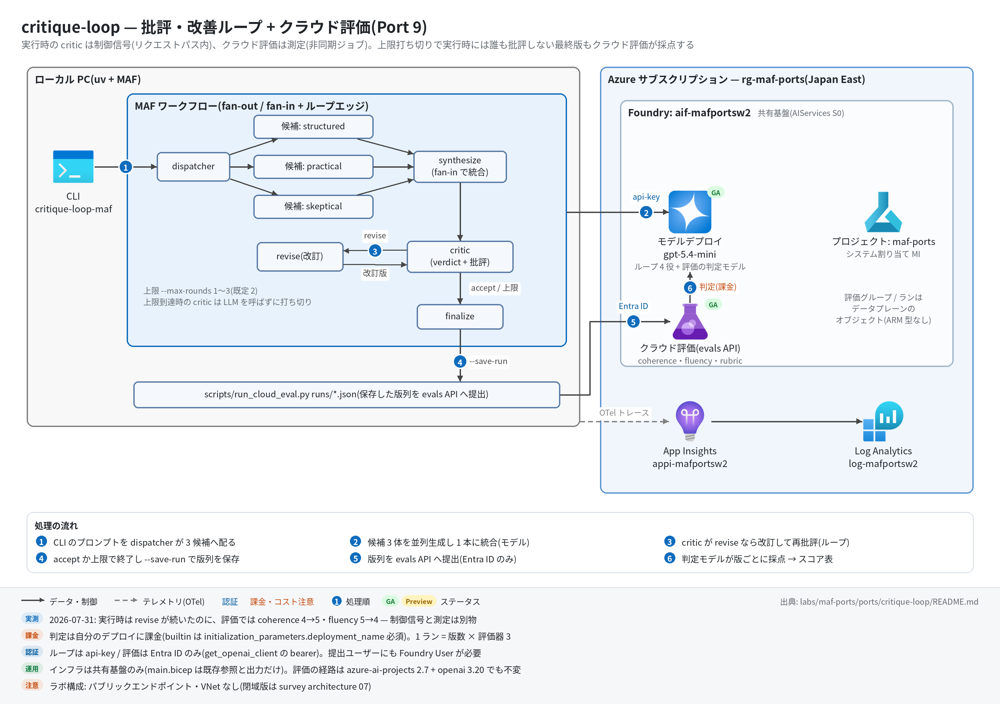

# critique-loop 実行ガイド

> **対象:** `labs/maf-ports/ports/critique-loop/`(Port 9・パターン: 評価駆動ループ — 並列候補 → 統合 → 批評 ⇄ 改訂のサイクリックグラフ + Foundry クラウド評価)
> **最終確認:** 2026-09-29 オフライン(44 passed・ruff clean・依存 agent-framework-core 1.19.0 / agent-framework-openai 1.14.4 / openai 3.20.0 / azure-ai-projects 2.7.0)/ ライブ: 2026-07-31(当時の構成 = agent-framework-core 1.13 / openai 2.51 / azure-ai-projects 2.4。Azure リソースは削除済み — 再デプロイ手順は §5)
> **正は本 Markdown。** 人間用 HTML(同じディレクトリの `runbook.html`)は `python3 labs/tools/build_runbooks.py` で生成する(HTML は直接編集しない)。設計判断と移植の学びは [README](../README.md)。

## 1. このパターンで確かめること

- 質問 1 つから、候補 3 体の並列生成(fan-out)→ 統合(fan-in)→ 批評(構造化出力 `{"verdict": "accept"|"revise", "critiques": [...]}`)→ 改訂 → 再批評、のループが回り、**accept なら早期終了・上限(`--max-rounds`、既定 2)到達なら打ち切り**で必ず止まること。上限到達時、critic は LLM を呼ばずに打ち切る(= 最終改訂は実行時には誰も批評しない)。
- `--save-run` で保存した版列(初稿 / 改訂 1 / 改訂 2)を、Foundry の evals API(`builtin.coherence` / `builtin.fluency` + rubric の `score_model`)で**サーバー側で採点**し、実行時の verdict(`revise` / `accept` / `unevaluated`)と並べたスコア表が出ること。
- 技術選定上の意味: 実行時の LLM judge(制御信号)とクラウド評価(測定)は別部品で、**「実行時 revise が続いたのにクラウド評価では fluency が下がった」**という食い違いが 7 月のライブで実際に出た([README 学び 1・検証結果(ライブ)](../README.md))。

## 2. 構成



| コンポーネント | 役割 | 課金 |
| --- | --- | --- |
| MAF Workflow(ローカル、`workflow.py`) | dispatcher → candidate ×3 → synthesize → critic ⇄ revise → finalize のサイクリックグラフ | なし |
| モデルデプロイ(共有基盤、`FOUNDRY_MODEL` = gpt-5.4-mini) | 候補 3 + 統合 1 + 批評 ≤ 上限 + 改訂 ≤ 上限 回の呼び出し(上限 2 なら最大 8 回) | トークン従量 |
| Foundry クラウド評価(evals API、`scripts/run_cloud_eval.py`) | 版ごとの採点(評価器 3 つ × 版数)。評価グループ / ランはプロジェクトのデータプレーンのオブジェクト | 判定モデル(同じデプロイ)のトークン従量 |
| Application Insights(共有基盤) | OTel トレース(executor.process / invoke_agent / chat) | 取り込み量従量 |
| 本ポート固有の Azure リソース | **なし**(`infra/main.bicep` は existing 参照と出力のみ) | — |

## 3. 前提

| 区分 | 必要なもの | 備考 |
| --- | --- | --- |
| ツール | uv(Python 3.11 以上。uv が取得。検証は 3.13) | オフライン実行はこれだけ |
| Azure(ライブのみ) | 共有基盤([infra/shared.bicep](../../../infra/shared.bicep) + [infra/roles.bicep](../../../infra/roles.bicep))。本ポート固有リソースなし | 課金あり |
| 権限(ループ) | API キー(`FOUNDRY_API_KEY`)のみ | — |
| 権限(クラウド評価) | `az login` 済みユーザーに**プロジェクトの Foundry User**(旧名 Azure AI User、ロール ID `53ca6127-db72-4b80-b1b0-d745d6d5456d`)。プロジェクト / アカウント MI には roles.bicep で Foundry User + Cognitive Services OpenAI User | RBAC 伝播に 5〜15 分。評価は Entra ID のみ(キー不可) |

環境変数(`labs/maf-ports/.env`。雛形は `labs/maf-ports/.env.example`。**ライブ実行時のみ必要**):

| 変数 | 用途 | 取得元 |
| --- | --- | --- |
| `FOUNDRY_OPENAI_V1_ENDPOINT` | ループのチャット呼び出し先(`https://<foundry>.openai.azure.com/openai/v1`) | shared.bicep 出力 `openaiV1Endpoint` |
| `FOUNDRY_MODEL` | モデルデプロイ名(ループと評価の判定モデルの両方) | shared.bicep 出力 `modelDeploymentName` |
| `FOUNDRY_API_KEY` | ループの API キー(**`run_cloud_eval.py` も設定読み込みで必須扱い**。評価自体は Entra ID) | `az cognitiveservices account keys list -n aif-<baseName> -g <rg>` |
| `FOUNDRY_PROJECT_ENDPOINT` | クラウド評価のみ(`https://<foundry>.services.ai.azure.com/api/projects/maf-ports`) | shared.bicep 出力 `projectEndpoint` |
| `APPLICATIONINSIGHTS_CONNECTION_STRING` | トレース送信先(未設定ならトレース無効で動く) | shared.bicep 出力 `appInsightsConnectionString` |

## 4. オフライン実行(Azure 不要・無料)

```bash
cd labs/maf-ports/ports/critique-loop
uv sync --extra dev
uv run pytest                        # 期待: 44 passed, 1 deselected(ネットワーク不要)
uv run ruff check .                  # 期待: All checks passed!
```

クラウド評価の送信内容だけならオフラインで確認できる(値はダミーでよい。`--dry-run` はネットワークに出ない):

```bash
uv sync --extra dev --extra eval
FOUNDRY_OPENAI_V1_ENDPOINT=https://x.openai.azure.com/openai/v1 FOUNDRY_MODEL=gpt-5.4-mini FOUNDRY_API_KEY=dummy \
  uv run python scripts/run_cloud_eval.py runs/<保存済みの実行結果>.json --dry-run
# 期待: testing_criteria(azure_ai_evaluator ×2 + score_model)と items(stage / runtime_verdict 付き)の JSON
```

オフラインテストが固定している主な挙動:

- [ ] 上限到達時は最後の改訂を批評せず(critic は LLM を呼ばない)に打ち切る(`test_loop_stops_at_max_rounds_without_final_critique`)
- [ ] 最初の批評が accept なら改訂ゼロで終了、1 回改訂後に accept でも終了(`test_early_exit_when_first_critique_accepts` / `test_accept_after_one_revision`)
- [ ] 構造化出力が壊れていたら応答全文を 1 批評として revise(安全側)、revise なのに批評が空なら accept に正規化(`test_malformed_critique_falls_back_to_revise_with_raw_text` / `test_revise_with_empty_critiques_normalized_to_accept`)
- [ ] 候補 3 体が並列に走り、統合プロンプトに全候補が入る(`test_candidates_run_concurrently` / `test_fan_in_synthesis_prompt_contains_all_candidates`)
- [ ] 評価アイテムの runtime_verdict 対応付け: 上限打ち切りの最終版 = `unevaluated`、早期終了の最終版 = `accept`、それ以外 = `revise`(`test_runtime_verdict_mapping_for_max_rounds_run` / `test_runtime_verdict_mapping_for_accepted_run`)
- [ ] testing_criteria は `builtin.coherence`(query+response)/ `builtin.fluency`(response)+ `score_model` rubric、データソースはインライン JSONL(`test_testing_criteria_builtin_pair_and_rubric` / `test_data_source_wraps_items_as_inline_jsonl`)
- [ ] 集計は stage 順・評価器ごとの平均と initial → 最終版の delta(`test_summarize_orders_stages_and_averages_scores` / `test_format_summary_shows_verdicts_and_delta`)

## 5. ライブ実行(Azure 必要・課金あり)

### 5.1 デプロイ

```bash
# 共有基盤が未作成なら先に作る(labs/maf-ports/README.md「実行の前提」と infra/shared.bicep 冒頭コメント)
cd labs/maf-ports
az group create -n <rg> -l japaneast
az deployment group create -g <rg> -f infra/shared.bicep \
  -p baseName=<baseName> modelName=gpt-5.4-mini modelVersion=<版> modelCapacity=10
# 第 2 段: MI へのロール割り当て(クラウド評価に必須。手順は infra/shared.bicep 末尾のコメント)
az deployment group create -g <rg> -f infra/roles.bicep \
  -p baseName=<baseName> accountPrincipalId=<AID> projectPrincipalId=<PID>
# 評価を提出する自分にもプロジェクトの Foundry User(ロール ID で指定すると改名の影響を受けない)
az role assignment create --assignee <自分の UPN か objectId> \
  --role 53ca6127-db72-4b80-b1b0-d745d6d5456d \
  --scope "$(az cognitiveservices account show -n aif-<baseName> -g <rg> --query id -o tsv)/projects/maf-ports"

# 本ポートの Bicep は existing 参照と出力だけ(新規リソースなし。エンドポイントの確認用)
cd ports/critique-loop
az deployment group create -g <rg> -f infra/main.bicep -p baseName=<baseName>
```

出力を `labs/maf-ports/.env` に転記する(§3 の表)。

### 5.2 実行

```bash
cd labs/maf-ports/ports/critique-loop
uv sync --extra dev --extra live
uv run critique-loop-maf "Explain recursion with examples."
uv run critique-loop-maf "What are the best practices for API design?" --max-rounds 3 --show-history
uv run critique-loop-maf "Explain recursion with examples." --save-run runs/recursion.json   # 評価の入力
uv run pytest -m live            # 期待: 1 passed(max_rounds=1 の最小 1 周)

# クラウド評価(az login 済み + FOUNDRY_PROJECT_ENDPOINT)
uv sync --extra dev --extra live --extra eval
uv run python scripts/run_cloud_eval.py runs/recursion.json               # builtin 2 種 + rubric
uv run python scripts/run_cloud_eval.py runs/recursion.json --no-rubric   # rubric を外す(切り分け用)
```

CLI のオプション: `--max-rounds`(1〜3、既定 2)/ `--show-history`(各周回の批評と改訂を表示)/ `--json`(全出力を JSON)/ `--save-run PATH`。評価スクリプト: `--name`(評価グループ名)/ `--no-rubric` / `--dry-run` / `--poll-interval`(既定 10 秒)/ `--timeout`(既定 900 秒)。

期待される出力の例(ループ。stderr の進捗は CLI の書式どおり、数値は**例**。候補の完了順は並列なので毎回変わる):

```text
tracing: App Insights 有効
[candidate:practical] done (2841 chars)
[candidate:structured] done (3310 chars)
[candidate:skeptical] done (2977 chars)
[synthesize] initial draft (3605 chars)
[critic] round 1: revise (10 critiques)
[revise] round 1: revised (4420 chars)
[critic] round 2: revise (6 critiques)
[revise] round 2: revised (4891 chars)
[critic] round 3: max-rounds (0 critiques)
[save] runs/recursion.json
<最終回答>
[summary] iterations=3 revisions=2/2 stop=max-rounds final_chars=4891
```

期待される出力の例(クラウド評価 `--no-rubric`。initial と revision-2 の値は 7 月のライブ実測 — README「検証結果(2026-07-31 ライブ)」、revision-1 の値と ID は形の例):

```text
eval group: eval_...
eval run: evalrun_... (status=queued)
  status=in_progress
  status=completed
report: https://ai.azure.com/...
stage       runtime_verdict  coherence  fluency
initial     revise           4.00       5.00
revision-1  revise           5.00       4.00
revision-2  unevaluated      5.00       4.00
delta initial -> revision-2: coherence: +1.00, fluency: -1.00
```

rubric(`score_model`)込みの既定実行では右端に `revision_rubric` 列が増える。ただし rubric は 7 月のライブで権限の切り分け中に PermissionDenied が出たまま再実行しておらず(builtin 2 種のみ完走)、**実測の出力例はない**。列が `-` になる・ランが失敗する場合は §9。

## 6. 確認観点

| 確認 | # | 観点 | 確認方法 | 期待結果 |
| --- | --- | --- | --- | --- |
| [ ] | 1 | 正常系: ループ完走 | `uv run critique-loop-maf "Explain recursion with examples."` | stderr に candidate ×3 → synthesize → critic / revise が並び、`[summary] ... stop=max-rounds` か `stop=accepted` で終わる。最終回答が stdout に出る |
| [ ] | 2 | 上限打ち切りの呼び出し回数 | `--max-rounds 1` で実行し stderr を見る | revise の場合: `[critic] round 1: revise` → `[revise] round 1` → `[critic] round 2: max-rounds (0 critiques)`(上限到達の critic は LLM を呼ばない)。round 1 で accept なら改訂なしで終了 |
| [ ] | 3 | 分岐: 早期終了 | 簡単な質問(例: "What is 2+2?")で実行 | critic が `accept` を返せば改訂なしで `stop=accepted`(モデル裁量なので revise が続くこともある — 上限で必ず止まれば OK) |
| [ ] | 4 | 異常系: 入力検証 | `--max-rounds 4`(モデル呼び出し前に落ちるので、.env の 3 点さえあればダミー値でも確認できる) | `error: max_rounds は 1〜3(元アプリのスライダー範囲): 4` で exit 2 |
| [ ] | 5 | クラウド評価: 送信内容 | `run_cloud_eval.py ... --dry-run` | testing_criteria 3 件と、版数ぶんの items(最後の item の `runtime_verdict` が `unevaluated` か `accept`) |
| [ ] | 6 | クラウド評価: 完走 | `run_cloud_eval.py runs/recursion.json`(まず `--no-rubric` でも可) | status が `completed` になり、stage × 評価器の表と `delta` 行、`report:` の URL が出る |
| [ ] | 7 | パターン固有: 実行時判断と測定の突き合わせ | 表の `runtime_verdict` 列と各スコア列を見比べる | `unevaluated` の最終版にもスコアが付く(実行時の死角をクラウド評価が補う)。revise 続きでもスコアが単調に上がるとは限らない — 下がった評価器があれば README 学び 1 と同じ現象 |
| [ ] | 8 | ポータルで評価レポート | `report:` の URL を開く(Foundry ポータルのプロジェクト → 評価) | 評価グループ `critique-loop-stages` とランが見え、アイテムごとのスコアと理由が読める |
| [ ] | 9 | 観測: トレース到達 | §7 の KQL | `executor.process critic` が「改訂数 + 1」本、`executor.process revise` が改訂数ぶん、`invoke_agent` / `chat` スパンが並ぶ |
| [ ] | 10 | コスト・後片付け | §8 | 使わない期間は RG ごと削除。評価グループ / ランはプロジェクトと一緒に消える(本ポート固有リソースはない) |

## 7. トレース・評価の確認

```bash
az monitor app-insights query --app appi-<baseName> -g <rg> \
  --analytics-query "dependencies | where timestamp > ago(30m) | summarize count() by name | order by name asc"
```

- 期待するスパン名: `workflow.run`、`executor.process dispatcher` / `executor.process candidate_structured`(ほか 2 体)/ `executor.process synthesize` / `executor.process critic` / `executor.process revise` / `executor.process finalize`、`invoke_agent <エージェント名>`(candidate_* / synthesizer_agent / critic_agent / reviser_agent)、`chat <モデル名>`
- 周回数の読み方: `executor.process critic` の件数 = 改訂数 + 1(最後の 1 本は上限到達の打ち切りで、配下に `invoke_agent critic_agent` がない)
- 評価の結果はトレースではなくポータルの評価レポート(`report_url`)と `run_cloud_eval.py` の表で見る

## 8. 片付け

```bash
az group delete -n <rg> --yes --no-wait   # 共有基盤ごと削除(ステートレス。Bicep + roles.bicep で再現可)
```

ローカルの `runs/*.json` は実行結果(プロンプトと回答全文)を含むので、不要なら削除する。

## 9. トラブルシューティング

| 症状 | 原因 | 対処 |
| --- | --- | --- |
| `error: 環境変数が未設定: ...` | `labs/maf-ports/.env` に 3 点(`FOUNDRY_OPENAI_V1_ENDPOINT` / `FOUNDRY_MODEL` / `FOUNDRY_API_KEY`)がない。`run_cloud_eval.py`(`--dry-run` 含む)も同じ設定読み込みを通る | §3 の表どおり転記。`--dry-run` だけならダミー値でよい |
| `error: FOUNDRY_PROJECT_ENDPOINT が未設定` | クラウド評価だけが使う変数 | shared.bicep 出力 `projectEndpoint` を転記 |
| 評価ランが一律 PermissionDenied | 権限が 3 層ある: 判定用デプロイ(`initialization_parameters.deployment_name`)/ プロジェクト・アカウント MI(Foundry User + OpenAI User)/ **提出ユーザー自身の Foundry User**([casebook P-I09](../../../../../docs/survey/casebook/02-pitfalls-index.md#c-id-と-rbac)) | roles.bicep を再実行し、提出ユーザーにも Foundry User を付与して 5〜15 分待つ |
| 再デプロイ後に PermissionDenied が再発 | プロジェクト MI のローテーションで旧 principal への割り当てが孤児化(P-I04) | roles.bicep を新しい principalId で再実行 |
| ロール名「Azure AI User」で割り当てできない | 改名ロールアウト(Azure AI User → Foundry User) | ロール ID `53ca6127-db72-4b80-b1b0-d745d6d5456d` で指定 |
| rubric(`revision_rubric`)だけ失敗・`-` | 7 月は未解決のまま(builtin は完走) | まず `--no-rubric` で builtin を通し、rubric は別途切り分け |
| `error: timeout (900s)` | 評価ランがキュー待ち | `--timeout 1800` で再実行。ポータルの評価一覧で状態を確認 |
| トレースが出ない | `APPLICATIONINSIGHTS_CONNECTION_STRING` 未設定、または `--extra live` 未導入 | 起動時に `tracing: App Insights 有効` が出るか確認。取り込みに数分かかる |

## 10. 関連・更新履歴

- 設計判断と学び: [README](../README.md)
- 評価機能の GA / プレビューと課金: [features/05 観測・評価](../../../../../docs/survey/features/05-observability-evaluation.md)
- 詰まりどころ(評価の権限 3 層・MI ローテーション): [casebook 02 C. ID と RBAC](../../../../../docs/survey/casebook/02-pitfalls-index.md#c-id-と-rbac)
- 同型パターン: ループ + データ条件の終了は [game-design-team](../../game-design-team/README.md)、fan-out / fan-in は [mixture-of-agents](../../mixture-of-agents/README.md)

| 日付 | 内容 |
| --- | --- |
| 2026-09-29 | 初版(依存を agent-framework-core 1.19.0 / openai 3.20.0 / azure-ai-projects 2.7.0 に更新。evals API の経路は変更不要と確認。Bicep はロール名コメントのみ更新。構成図を v2(日本語・処理順バッジ・注記帯)に更新) |
