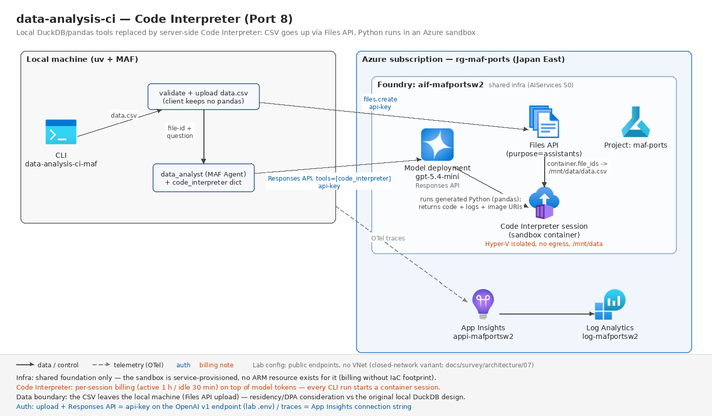

# data-analysis-ci — CSV/Excel 自然言語分析 + Code Interpreter(Port 8)

元: [`starter_ai_agents/ai_data_analysis_agent`](https://github.com/Shubhamsaboo/awesome-llm-apps/tree/main/starter_ai_agents/ai_data_analysis_agent)(Agno + DuckDbTools/PandasTools + Streamlit、125 行)

## 元の構成(5行)

- Streamlit UI。サイドバーで OpenAI API キーを入力し、CSV / Excel をアップロードして自然言語で質問する
- `preprocess_and_save`: pandas で読み込み、日付列のパース・数値化・文字列クオートをした**一時 CSV** を作る(前処理はクライアント側)
- `DuckDbTools().load_local_csv_to_table(path, table="uploaded_data")` — 一時 CSV を**ローカルプロセス内の DuckDB** にテーブルとしてロード
- `Agent(model=OpenAIChat("gpt-4o"), tools=[duckdb_tools, PandasTools()], system_message="You are an expert data analyst. Use the 'uploaded_data' table ... Generate SQL queries using DuckDB tools ...", markdown=True)` 単一エージェント
- `agent.run(user_query)` → `response.content` を表示。実行された SQL はターミナルの agno ログ頼み(UI に「💡 Check your terminal」)

## DuckDB ローカル実行 → Code Interpreter(本ポートの核心)

移植では、LLM が生成したコードの実行場所を「ローカルプロセス内(DuckDB / pandas ツール)」から **Foundry の Code Interpreter(OpenAI v1 Responses API の code_interpreter コンテナツール。サーバー側サンドボックス)** に置き換えた。

| 観点 | 元(DuckDB/Pandas ローカル) | 移植後(Code Interpreter) |
| --- | --- | --- |
| コード実行の所在 | **自プロセス内**(agno ツールが DuckDB SQL / pandas を実行) | **Azure 側のサンドボックスコンテナ**(Hyper-V 分離・アウトバウンド通信不可) |
| データの行き先 | ローカルに留まる(一時 CSV → ローカル DuckDB) | **Files API にアップロード**され、コンテナの `/mnt/data` にコピーされる(データが Azure 側に渡る — データ持ち出し要件がある案件では選定上の分岐点) |
| データの渡し方 | `load_local_csv_to_table(path, table="uploaded_data")` | `files.create(purpose="assistants")` → ツール定義の `container.file_ids` |
| 前処理(日付・数値変換) | クライアント側 pandas(`preprocess_and_save`) | **サンドボックス内の pandas に移る**(instructions で指示。クライアントは形式チェックのみ) |
| LLM が書くもの | DuckDB SQL(+pandas 呼び出し) | Python(pandas) |
| 実行環境の破壊半径 | **ホスト権限で動く**(agno の DuckDB ツールは任意 SQL、PandasTools は事実上任意コード) | サンドボックス内に閉じる(ネットワークなし・ホスト非公開) |
| 課金 | なし(ローカル CPU) | **セッション単位の追加課金**(アクティブ 1 時間/アイドル 30 分 — [04-tools-knowledge.md](../../../../docs/survey/features/04-tools-knowledge.md)) |
| インフラ | なし | **なし**(サーバー側機能。main.bicep は existing 参照のみ) |
| 実行されたコードの可視性 | agno のターミナルログ | **応答の構造化 Content**(`code_interpreter_tool_call` / `_result`)として取得(下記) |

## MAF の Code Interpreter API 調査(installed agent-framework-core 1.13.0 / -openai 1.12.0 精読)

実装前調査の結論 — **`HostedCodeInterpreterTool` クラスは現行 MAF に存在しない**(`_tools.py` / `_types.py` に定義なし)。かつてのプレビュー API は「クライアントごとの静的ファクトリ + プロトコル」方式に置き換わっている:

- **プロトコル**: `SupportsCodeInterpreterTool`(`_clients.py` 668 行、`@runtime_checkable`)。`isinstance(client, SupportsCodeInterpreterTool)` で対応可否を判定し、`client.get_code_interpreter_tool(**kwargs)` でツールを得る。File Search / Web search / 画像生成 / MCP / Shell も同型の `Supports*Tool` プロトコルが並ぶ
- **OpenAI 実装**: `OpenAIChatClient.get_code_interpreter_tool(file_ids=..., container="auto")`(`agent_framework_openai/_chat_client.py` 1005 行)は openai SDK の `CodeInterpreter` TypedDict — つまり**素の dict** `{"type": "code_interpreter", "container": {"type": "auto", "file_ids": [...]}}` を返すだけ。抽象クラスもラッパーもない
- **リクエスト側の配線**: dict ツールは `normalize_tools` を無変換で通過し(`_tools.py` 990 行)、`_prepare_tools_for_openai` も「FunctionTool 以外(dicts, SDK types)はパススルー」(同 983 行)— Responses API の `tools` 配列に**そのまま**載る。Agent は dict を通常ツールとして `default_options["tools"]` に保持する(MCP ツールのような分離保持・接続ライフサイクルはない — サーバー側ツールなのでクライアントに接続すべきものがない)
- **ファイルの渡し方**: コンテナ設定の `file_ids`。アップロードは MAF に相当機能が**ない**ため、`OpenAIChatClient` が内包する `AsyncOpenAI`(`chat_client.client`)の `files.create(purpose="assistants")` を直接使う(接続情報を二重に持たないため)
- **応答側の配線**: Responses の `code_interpreter_call` 出力アイテムは MAF が `code_interpreter_tool_call`(`inputs` = 実行コードの text Content)と `code_interpreter_tool_result`(`outputs` = logs の text / 画像の uri Content)にパースする(`_chat_client.py` 2685 行)。ストリーミングのコード delta やコンテナファイル引用(`container_file_citation` → annotation)も計装済み

**採った経路**: MAF ネイティブ(`get_code_interpreter_tool` + Agent)。リクエスト・応答の両側が上記どおり配線済みで、openai クライアント直へ切り替える必要は生じなかった(使い分けの基準は「学び 3」)。

## 移植後の構成



```
data.csv + 質問 ─▶ validate_data_file(csv/xlsx チェック — 元アプリの形式分岐)
              ─▶ upload_data_file(chat_client.client.files, purpose="assistants")─▶ file-xxx
              ─▶ build_code_interpreter_tool(file_ids=[file-xxx])
                    └─ {"type": "code_interpreter", "container": {"type": "auto", "file_ids": [...]}}
              ─▶ data_analyst(MAF Agent, gpt-5.4-mini)─▶ Responses API
                    └─ サーバー側コンテナで pandas 実行(/mnt/data/data.csv)
              ─▶ extract_analysis: 回答 + 実行コード + 実行ログ + 生成画像 URI
```

- ファイル検証・アップロードは [datafile.py](./src/data_analysis_ci_maf/datafile.py)(前処理はサンドボックスへ移管、クライアントは形式チェックだけ)
- ツール dict の組み立ては [tools.py](./src/data_analysis_ci_maf/tools.py)(プロトコル判定+`factory` コンストラクタ注入でテスト可能)
- 1 クエリの実行と抽出は [analysis.py](./src/data_analysis_ci_maf/analysis.py)(ファイル名を per-run プロンプトで伝達・300 秒タイムアウト・コード/ログ/画像の抽出)
- Streamlit → CLI(`data-analysis-ci-maf data.csv "質問"` / `--no-code` / `--timeout`)。実行されたコードとログを既定で表示 — 元アプリの「💡 Check your terminal」がここでは一次出力になる

## 設計判断

### 「'uploaded_data' テーブル」はファイル名の per-run プロンプトに置き換える

元アプリは対象データを system_message 内のテーブル名で固定していた(アップロードごとに同名テーブルへロードし直す)。Code Interpreter では「ロード」に相当する操作がなく、コンテナ内 `/mnt/data` にアップロード時のファイル名で見えるだけなので、instructions は「uploaded data file を使え」という役割定義に留め、**実ファイル名は run プロンプト**(`build_analysis_prompt`)で伝える。日付パース・数値化の前処理指示も instructions に移した(元アプリのクライアント側 `preprocess_and_save` の代替)。

### アップロードは chat client 内包の AsyncOpenAI を再利用する

MAF にファイルアップロードの抽象はない。`AsyncOpenAI` を別途組み立てることもできるが、エンドポイント・API キー・(将来の)Entra 認証の設定を二重に持つことになるため、`OpenAIChatClient` が内包するクライアント(`chat_client.client.files`)を使う。テスト境界は `files_api` 引数(`create(file=, purpose=)` を持つ最小プロトコル)への記録フェイク注入。

### 非対応クライアントは「openai 直へ切り替え」の明示エラーにする

`build_code_interpreter_tool` は `SupportsCodeInterpreterTool` を実装しないクライアントに対し、**openai クライアント直(Responses API)への切り替えを案内する専用例外**を投げる(`CodeInterpreterUnsupportedError`)。ツール dict は素の Responses API 形式なので、MAF を剥がしても同じ dict を `client.responses.create(tools=[...])` に渡すだけで動く — この「逃げ道の近さ」自体が本経路の採用理由の一つ(学び 3)。

### オフラインテストの境界は「ファクトリ関数」と「応答 Content」

実コンテナへの接続はライブスモークのみ。オフラインでは (a) ツール定義: `factory` 記録フェイク+実 `OpenAIChatClient.get_code_interpreter_tool`(静的メソッド・ネットワーク不要)が返す dict の形、(b) 抽出: 実 `Message` / `Content`(`from_code_interpreter_tool_call` / `_result`)を組んで code/logs/画像の抽出を固定、(c) 会話フロー: ScriptedAgent でプロンプト連結・タイムアウト・空応答を固定する。サンプル CSV の正解値(合計 3,225,050 / 上位 Electronics)もオフラインテストで再計算して固定し、ライブスモークの期待値の根拠にしている。

## 実行

```bash
uv sync --extra dev
uv run pytest                      # オフライン(ネットワーク不要・24 件)

# --- ライブ(要 共有基盤 + ../../.env)---
az deployment group create -g rg-maf-ports -f infra/main.bicep -p baseName=mafportsw2
#   (existing 参照のみ。新規リソースなし — 出力の endpoint 確認用)

uv run data-analysis-ci-maf data/sample_sales.csv "月別売上の傾向は?"
uv run data-analysis-ci-maf data/sample_sales.csv "合計売上と上位カテゴリは?" --no-code

uv sync --extra dev --extra live && uv run pytest -m live   # ライブスモーク
```

**課金注意**: Code Interpreter は**セッション単位の追加課金**(アクティブ 1 時間/アイドル 30 分 — [04-tools-knowledge.md](../../../../docs/survey/features/04-tools-knowledge.md)。Azure Container Apps dynamic sessions 基盤・Hyper-V 分離・アウトバウンド通信不可)。CLI / ライブスモークの実行ごとにコンテナが起動するため、モデルのトークン課金と別にセッション課金が発生する。インフラ: 共有基盤のみ(existing 参照)— サンドボックスはサービス側プロビジョニングのため**本ポート固有の Azure リソースはゼロ**。

## 評価

[tests/eval_dataset.jsonl](./tests/eval_dataset.jsonl)(6 ケース)は決定的な正解がある集計(合計 / カテゴリ別 / フィルタ+平均)+日付パースを要する月別傾向+画像生成+**サンドボックス境界の観察**(ファイル削除・シェル要求への応答)。サンプルデータの正解値はオフラインテスト(`test_sample_csv_shape_and_totals`)で固定してあるため、応答数値の正誤を機械照合できる — 実データ依存だった Port 6(GitHub)と違い、**評価が決定的**になるのが「データを同梱してサンドボックスに渡す」構成の副産物。ライブ実行時は App Insights のスパンで code_interpreter 呼び出しを突き合わせ、応答は Foundry の Task adherence / Relevance 評価器に渡せる形にしてある。

## 検証結果(2026-07-31)

- オフラインテスト **24 passed** / ruff clean / `az bicep build` OK(生成 json は削除)
- ライブスモークは未実施(呼び出し元で実施)。手順: `uv sync --extra dev --extra live` → `uv run pytest -m live` → CLI 1 回 → トレース到達の確認クエリ:

```bash
az monitor app-insights query --app appi-mafportsw2 -g rg-maf-ports \
  --analytics-query "dependencies | where timestamp > ago(30m) | summarize count() by name"
```

- 期待動作: サンプル CSV の「合計と上位カテゴリ」質問に **3,225,050 / Electronics** が返り、`invoke_agent` + code_interpreter 呼び出しがトレースに乗る。応答の `code_blocks` に実行された pandas コードが含まれる
- 未検証の残リスク(ライブで確認すべき点): (1) Foundry の v1 エンドポイントでの `files.create(purpose="assistants")` 受理と `container.file_ids` の紐付け、(2) gpt-5.4-mini の code_interpreter ツール対応、(3) コンテナ内のファイル名が `/mnt/data/<アップロード時の名前>` で見えること(プロンプトの案内文の前提)

## 検証結果(2026-07-31 ライブ)

- オフライン **24 passed** / ruff clean / bicep build OK
- ライブスモーク **1 passed(14.7s)**: sample_sales.csv を Files API でアップロード → サーバー側 Code Interpreter が Python 実行 → 合計 3,225,050 / 上位カテゴリ Electronics を正答(オフラインで固定した期待値と一致)
- トレース: `invoke_agent` / `chat gpt-5.4-mini` スパンを App Insights で確認(Code Interpreter の実行はモデル側スパン内に内包)

## 学び(MAF/Foundry vs 元構成)

1. **「コード実行をどこでやるか」の置き換えは、実は「データがどこへ行くか」と「課金が何に付くか」の置き換えだった。**E2B や本アプリの DuckDB ローカル実行では、コードもデータも自分のランタイムに留まり、課金はゼロ(または E2B のサンドボックス課金)で、その代わり **LLM 生成コードがホスト権限で走る**(agno の DuckDbTools / PandasTools は事実上の任意コード実行で、分離は何もない)。Code Interpreter では逆転する: 実行は Hyper-V 分離・アウトバウンド不可のコンテナに閉じ込められて安全になる代わりに、**CSV そのものが Files API 経由で Azure 側に渡り**(データレジデンシー・DPA の検討対象になり)、課金は「リソース」ではなく**セッション**に付く(アクティブ 1h/アイドル 30min。Bicep で管理する対象が存在しないのに課金だけはある、という IaC の死角)。SI の技術選定では「サンドボックスの安全性が欲しいのか、データを外に出したくないのか」が最初の分岐で、両方欲しいなら Custom Code Interpreter(プレビュー)や自前 ACA dynamic sessions が比較対象になる。
2. **MAF のサーバー側ツール DX は「抽象クラス」から「プロトコル+素の dict」へ振り切っていた — 薄いことは学習コストの低さでもあり、移植性の限界でもある。**実装前調査で探した `HostedCodeInterpreterTool` は現行版(core 1.13.0)に存在せず、`SupportsCodeInterpreterTool` プロトコル+`OpenAIChatClient.get_code_interpreter_tool()` 静的ファクトリが現行 API。返るのは openai SDK の TypedDict そのもので、MAF は**リクエスト側では無変換パススルー、応答側では `code_interpreter_tool_call/_result` Content への正規化**だけを担う。つまり MAF の付加価値はツール抽象ではなく**応答の構造化と計装**にあり、ツール定義自体はプロバイダ形式が剥き出しになる(Gemini や Anthropic のクライアントに同じ dict は渡せない — `Supports*Tool` プロトコルで「同名の能力」を宣言するのがフレームワークの回答)。バージョン間でクラスが消える程度に API がまだ動いている点も含め、「hosted ツールの抽象化はフレームワークに期待しない」が現時点の正しい期待値設定だと分かった。
3. **MAF 経由と openai クライアント直(Responses API)の使い分けは「会話ループと計装が要るか」で決まる — ツール定義が同一形式なので、切り替えコストは低い。**本ポートで MAF が実際に代行したのは: instructions/履歴の管理、ツール dict の合流、`code_interpreter_call` 出力のパース(コード delta のストリーミング結合まで)、OTel スパン。逆に MAF に無くて openai 直が必要だったのは: `files.create`(アップロード)— 内包クライアントの再利用で足りた。**コンテナの明示管理**(`containers.create` でのコンテナ再利用、`containers.files` での成果物ダウンロード)まで踏み込むなら Responses API 直の方が素直で、単発のコード実行だけなら Agent すら過剰になる。ツール dict が素の Responses API 形式のままなのはここで効く: `CodeInterpreterUnsupportedError` の案内どおり、同じ dict を `client.responses.create(tools=[...])` に渡せば MAF を剥がせる。「フレームワークからの退路が 1 行で確認できる」ことは、プレビュー成分の多い Foundry 系スタックでは選定の安心材料になる。
4. **元アプリの前処理(`preprocess_and_save` の 36 行)は移植で「消えた」のではなく、instructions の 1 行に圧縮されてサンドボックス内へ移った。**日付パース・数値化・クオート処理をクライアント側 pandas で済ませてから DuckDB に渡すのが元設計だったが、Code Interpreter では LLM 自身が pandas を書くので、「Parse dates and coerce numeric columns as needed」と指示するだけで同じ結果になる(eval の月別傾向ケースがこの検証)。決定的な前処理コードが確率的な指示に変わるトレードオフはあるが、Excel 対応も `read_excel` を書くかどうかの違いでしかなくなり、クライアント側の依存(pandas / numpy / duckdb / openpyxl)が**ゼロ**になった — pyproject の依存リストが Port 6(MCP)と同型の最小 4 点で済んでいるのがその証拠。「ツールをローカルに持つほど依存が太る」という agno 構成の隠れコストが、サーバー側ツール化で一番わかりやすく現れた点だった。
5. **実行されたコードが応答の構造化データとして手に入るのは、ローカル実行時代のログより監査に強い。**元アプリは「何の SQL が実行されたか」を agno のターミナルログでしか見られず、UI にも「ターミナルを見ろ」と書くしかなかった。Code Interpreter + MAF では、実行コード(`code_interpreter_tool_call.inputs`)・stdout(`_result.outputs` の logs)・生成画像(uri)が**応答オブジェクトの Content として残り**、CLI はそれをそのまま一次出力にできた(`extract_analysis` は 30 行の純関数)。「LLM が何を実行したか」を成果物として保存・評価・監査に回せるのは、コード実行系エージェントを本番に置くときの実務要件そのもので、この配線が最初から計装されている(ストリーミングのコード delta 結合まで)のは MAF 経路の明確な加点だった。
