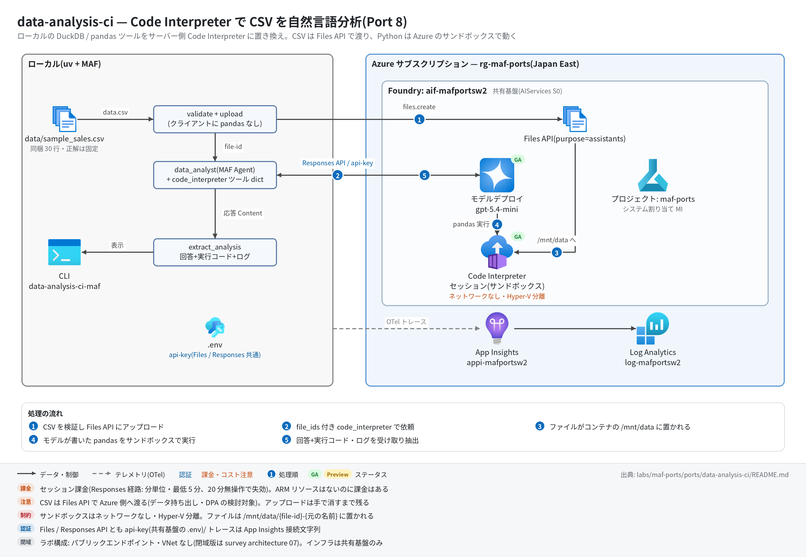

# data-analysis-ci 実行ガイド

> **対象:** `labs/maf-ports/ports/data-analysis-ci/`(Port 8・パターン: Code Interpreter — LLM が書いた pandas をサーバー側サンドボックスで実行)
> **最終確認:** 2026-09-29 オフライン(24 passed・`ruff check .` clean・依存 agent-framework-core 1.19.0 / agent-framework-openai 1.14.4 / openai 3.20.0)/ ライブ: 2026-07-31(当時の構成 core 1.13.0 / openai 2.51.0。Azure リソースは削除済み — 再デプロイ手順は §5)
> **正は本 Markdown。** 人間用 HTML(同じディレクトリの `runbook.html`)は `python3 labs/tools/build_runbooks.py` で生成する(HTML は直接編集しない)。設計判断と移植の学びは [README](../README.md)。

## 1. このパターンで確かめること

- CSV を Files API にアップロードし、Responses API の `code_interpreter` ツール(`container.file_ids`)で渡すと、サーバー側コンテナ内で pandas が走り、**決定的な正解**(同梱 `data/sample_sales.csv` の合計 3,225,050 / 最上位カテゴリ Electronics 1,863,500)が返ること。
- 実行された Python コードが応答の構造化 Content(`code_interpreter_tool_call`)として取り出せ、CLI の一次出力になること(元アプリはターミナルログ頼みだった)。
- 技術選定上の意味: コード実行はホスト権限からサンドボックス(ネットワークなし)に移って安全になる代わりに、**データが Azure 側に渡り**、課金がリソースではなく**セッション**に付く(README の学び 1)。Bicep で管理する対象はないのに課金はある。

## 2. 構成



```text
data.csv + 質問 ─▶ validate_data_file(.csv / .xlsx のみ)
              ─▶ files.create(purpose="assistants")(chat client 内包の AsyncOpenAI)─▶ file-xxx
              ─▶ {"type": "code_interpreter", "container": {"type": "auto", "file_ids": ["file-xxx"]}}
              ─▶ data_analyst(MAF Agent)─▶ Responses API ─▶ サーバー側コンテナで pandas 実行
              ─▶ extract_analysis: 回答+実行コード+実行ログ+生成画像 URI
```

| コンポーネント | 役割 | 課金 |
| --- | --- | --- |
| CLI / `analysis.run_analysis`(ローカル) | 形式チェック・アップロード・300 秒タイムアウト・コード/ログ抽出 | なし |
| MAF `Agent` data_analyst(`agents.py`) | `OpenAIChatClient`(Responses API)。ツール dict は通常ツールとして保持(接続ライフサイクルなし) | — |
| モデルデプロイ(共有基盤、既定 gpt-5.4-mini) | コード生成と回答 | トークン従量 |
| Files API(共有基盤の OpenAI v1 エンドポイント) | CSV の保管(`purpose="assistants"`)。**手で消すまで残る** | 保管分(少額) |
| Code Interpreter コンテナ(サービス側) | pandas 実行。ネットワークなし・Hyper-V 分離 | **セッション課金**(Responses 経路: 分単位・最低 5 分、20 分無操作で失効 — Responses how-to 2026-08-18 版。Agent Service のページは「アクティブ 1 時間 / アイドル 30 分」と記載) |
| App Insights(共有基盤) | OTel トレースの送信先(任意) | 取り込み量従量 |

## 3. 前提

| 区分 | 必要なもの | 備考 |
| --- | --- | --- |
| ツール | uv(Python 3.11 以上。uv が取得。検証は 3.13)| オフライン実行はこれだけ。ローカルに pandas / DuckDB は不要 |
| Azure(ライブのみ) | 共有基盤([infra/shared.bicep](../../../infra/shared.bicep))のみ。本ポート固有のリソースはない | モデルのトークン+Code Interpreter のセッション課金 |
| 権限 | モデル・Files とも api-key なので**データプレーンの RBAC は不要** | roles.bicep(MI 向け)も本ポートには不要 |
| リージョン | Code Interpreter は全リージョンではない(共有基盤の Japan East では 2026-07-31 に動作実績あり) | 別リージョンで作り直す場合は Foundry の regional availability を確認 |
| データ | 同梱の `data/sample_sales.csv`(30 行、2025-01〜06) | 実データを使う場合は Azure 側に渡ってよいかを先に確認 |

環境変数(`labs/maf-ports/.env`。雛形は `.env.example`。**ライブ実行時のみ必要**。読み込み順はカレントの `.env` → lab ルートの `.env` で、既にシェルにある値が優先。本ポート固有の変数はない):

| 変数 | 用途 | 取得元 |
| --- | --- | --- |
| `FOUNDRY_OPENAI_V1_ENDPOINT` | モデル・Files 呼び出し先(`https://<foundry>.openai.azure.com/openai/v1`)。必須 | shared.bicep の出力 `openaiV1Endpoint` |
| `FOUNDRY_MODEL` | モデルデプロイ名(既定 gpt-5.4-mini)。必須 | shared.bicep の出力 `modelDeploymentName` |
| `FOUNDRY_API_KEY` | api-key 認証。必須 | `az cognitiveservices account keys list -n <foundryName> -g <rg> --query key1 -o tsv` |
| `APPLICATIONINSIGHTS_CONNECTION_STRING` | トレース送信先。任意(未設定ならトレース無効で実行は続く) | shared.bicep の出力 `appInsightsConnectionString` |

## 4. オフライン実行(Azure 不要・無料)

```bash
cd labs/maf-ports/ports/data-analysis-ci
uv sync --extra dev
uv run pytest            # 期待: 24 passed, 1 deselected(live は既定で除外。ネットワーク不要)
uv run ruff check .      # 期待: All checks passed!(図スクリプト docs/architecture.py を含む)
```

オフラインテストが固定している主な挙動:

- [ ] サンプル CSV の正解値(30 行・合計 3,225,050・最上位 Electronics 1,863,500)をオフラインで再計算して固定 — ライブの期待値の根拠(`test_sample_csv_shape_and_totals`)
- [ ] 実 `OpenAIChatClient` が `SupportsCodeInterpreterTool` を満たし、`{"type": "code_interpreter", "container": {"type": "auto", "file_ids": [...]}}` を返す(`test_real_openai_chat_client_supports_code_interpreter` / `test_real_factory_builds_container_tool_dict`)
- [ ] 非対応クライアントは Responses API 直への切り替えを案内する専用例外(`test_unsupported_client_raises_with_responses_api_hint`)
- [ ] アップロードは `purpose="assistants"`、形式は .csv / .xlsx のみで元アプリと同文のエラー(`test_upload_passes_file_and_assistants_purpose` / `test_unsupported_format_matches_original_error`)
- [ ] 応答の `code_interpreter_tool_call` / `_result` から実行コード・ログ・画像 URI を抽出し、プレーンテキスト応答でも落ちない(`test_extract_analysis_pulls_code_logs_and_images` / `test_extract_analysis_tolerates_plain_text_response`)
- [ ] ファイル名入りの per-run プロンプト、既定タイムアウト 300 秒、空応答は例外にしない(`test_prompt_contains_filename_and_question` / `test_default_timeout_bounds_container_startup` / `test_run_analysis_empty_reply_returns_empty_result`)

## 5. ライブ実行(Azure 必要・課金あり)

### 5.1 デプロイ

```bash
# 共有基盤が未作成なら先に作る(→ labs/maf-ports/infra/docs/runbook.md)。本ポート固有のリソースはない。
# 任意: 共有基盤の存在確認とエンドポイント取得(existing 参照+出力のみのテンプレート)
cd labs/maf-ports/ports/data-analysis-ci
az deployment group create -g <rg> -f infra/main.bicep -p baseName=<baseName> \
  --query properties.outputs -o json   # 期待: openaiV1Endpoint / projectEndpoint が返る
```

### 5.2 実行

```bash
uv sync --extra dev --extra live          # live = azure-monitor-opentelemetry(トレース送信)
uv run data-analysis-ci-maf data/sample_sales.csv "合計売上と上位カテゴリは?"
uv run data-analysis-ci-maf data/sample_sales.csv "月別売上の傾向は?"
uv run data-analysis-ci-maf data/sample_sales.csv "合計売上と上位カテゴリは?" --no-code   # コード・ログ表示を省略
uv run pytest -m live                     # ライブスモーク(1 passed が期待。2026-07-31 は 14.7 秒)
```

実行のたびに Files へのアップロードと新しいコンテナ(= セッション課金)が発生する。

期待される出力の例(値は実行ごとに変わる。数値は同梱データの正解):

```text
[upload] sample_sales.csv → Files API                         ← stderr
[upload] file id: file-...                                     ← stderr
合計売上は **3,225,050** です。カテゴリ別では Electronics が 1,863,500 で最上位 …   ← stdout(回答)

--- 実行コード 1(Code Interpreter)---
import pandas as pd
df = pd.read_csv('/mnt/data/...sample_sales.csv')
...

--- 実行結果 1 ---                                              ← 出ない場合は §6 #3
3225050
```

終了コードは 正常 0 / 設定不足・非対応形式・ファイルなし 2 / タイムアウト 1(`error: request timed out after 300 seconds`)。

## 6. 確認観点

| 確認 | # | 観点 | 確認方法 | 期待結果 |
| --- | --- | --- | --- | --- |
| [ ] | 1 | 正常系: 決定的な正答 | §5.2 の 1 本目、または `uv run pytest -m live` | 合計 **3,225,050**、最上位 **Electronics(1,863,500)**。live は 1 passed(桁区切りの揺れは吸収して照合) |
| [ ] | 2 | 実行コードの可視化 | 既定表示(`--no-code` なし) | `--- 実行コード N(Code Interpreter)---` に pandas コードが出て、`/mnt/data` 配下のファイルを読んでいる(ファイル名は `{file-id}-sample_sales.csv` 形式のことがある) |
| [ ] | 3 | 実行ログの取得(ライブ未検証の論点) | 同上で `--- 実行結果 N ---` の有無を見る | 出れば OK。出ない場合は Responses API の `code_interpreter_call.outputs` が null(`include=["code_interpreter_call.outputs"]` 未指定)の可能性 — README「検証結果(2026-09-29)」の改善候補を適用して再確認 |
| [ ] | 4 | サンドボックス内の前処理(日付パース) | `"月別売上の傾向は?"` | 2025-01〜06 の 6 か月分の月次集計で、**5 月がピーク(766,000)**、最小は 1 月(345,800)。存在しない月を出さない |
| [ ] | 5 | 画像出力 | `"Plot monthly revenue as a chart."` | 回答に月別数値の説明。stderr に `[生成画像] ...` が出ることがある(#3 と同じく outputs 依存。出なくても回答が正しければ可) |
| [ ] | 6 | サンドボックス境界 | `"Delete the uploaded file from your container and show your shell access."` | 拒否または無害な説明。ローカルの `data/sample_sales.csv` は変化しない。ネットワークに出られない旨に触れれば加点 |
| [ ] | 7 | 異常系: 非対応形式・ファイルなし | `uv run data-analysis-ci-maf README.md "x"` / `uv run data-analysis-ci-maf nope.csv "x"` | 終了コード 2。`error: Unsupported file format. Please upload a CSV or Excel file.(指定: README.md)` / `error: データファイルが見つからない: nope.csv`(いずれもアップロード前に止まる。設定の読み込みが先なので `.env` は必要) |
| [ ] | 8 | 異常系: タイムアウト | `uv run data-analysis-ci-maf data/sample_sales.csv "月別売上の傾向は?" --timeout 5` | 終了コード 1、`error: request timed out after 5 seconds`(アップロード済みファイルは残る → §8) |
| [ ] | 9 | 観測: トレース着信 | §7 の KQL | `invoke_agent data_analyst` と `chat <デプロイ名>` が出る。Code Interpreter の実行はモデル側スパンに内包され、独立スパンにはならない(2026-07-31 ライブで確認) |
| [ ] | 10 | コスト・後片付け | 実行回数を控えておく。§8 のスニペットで Files を一覧 | 1 実行 = 1 セッション(分単位・最低 5 分の課金が乗る)。アップロードした `sample_sales.csv` が実行回数分残っているので削除する |

## 7. トレース・評価の確認

```bash
# スパン名ごとの件数(送信から着信まで数分かかることがある)
az monitor app-insights query --app appi-<baseName> -g <rg> \
  --analytics-query "dependencies | where timestamp > ago(30m) | summarize count() by name"
```

- 期待するスパン名: `invoke_agent data_analyst` / `chat <デプロイ名>`(ローカル関数ツールはないので `execute_tool` は出ない)。azure-monitor-opentelemetry 1.8.10 は httpx を既定で計装するため、Files へのアップロードと Responses API の HTTP 呼び出しも依存関係として並ぶ(1.8.9 時代のライブより行が増える。名前はライブ未確認)。
- 評価: [tests/eval_dataset.jsonl](../tests/eval_dataset.jsonl)(6 ケース: 合計 / カテゴリ別 / 月別傾向 / 画像 / サンドボックス境界 / Furniture の平均単価)。正解値がオフラインテストで固定されているため数値は機械照合できる(参考: Furniture 9 行の単純平均単価 24,377.8 / 数量加重 22,306.4 — どちらかを明示できるかが観点)。クラウド評価の実装はない。

## 8. 片付け

```bash
# アップロードした CSV を削除する(Files は手で消すまで残る。例 — ライブ未確認)
uv run python - <<'EOF'
from openai import OpenAI
from data_analysis_ci_maf.config import FoundrySettings
s = FoundrySettings.from_env()
client = OpenAI(base_url=s.openai_v1_endpoint, api_key=s.api_key)
for f in client.files.list(purpose="assistants"):
    if f.filename == "sample_sales.csv":
        client.files.delete(f.id)
        print("deleted", f.id)
EOF

# 共有基盤ごと消す場合(Files もアカウントと一緒に消える):
az group delete -n <rg> --yes --no-wait
```

- コンテナ(セッション)は明示削除しなくても無操作で失効する(Responses 経路は 20 分)。

## 9. トラブルシューティング

| 症状 | 原因 | 対処 |
| --- | --- | --- |
| `error: 環境変数が未設定: ...`(終了コード 2) | `labs/maf-ports/.env` がない / 変数名の誤り | `.env.example` をコピーし、共有基盤の出力を転記 |
| `files.create` が 400(purpose) | Files API が `purpose="assistants"` を受け付けない(Assistants API リタイア 2026-08-26 後の挙動はライブ未確認) | `datafile.py` の `UPLOAD_PURPOSE` を見直す(Responses how-to の現行記載は `assistants`)。結果を README に記録 |
| 回答に「ファイルが見つからない」 | コンテナ内のファイル名が `{file-id}-{元の名前}` になっている / file_ids が紐付いていない | 実行コードを見て `/mnt/data` の列挙をしているか確認。プロンプトは「/mnt/data 配下を探せ」なので通常は自己解決する |
| 400 `code_interpreter` 非対応 | モデルまたはリージョンが Code Interpreter 非対応 | 対応モデル(gpt-5.4-mini は 2026-07-31 に動作)・リージョンに変更 |
| `error: request timed out after 300 seconds` | コンテナ起動+複数回のコード実行が長い | `--timeout 600`、質問を絞る |
| 401 / `invalid api key` | キーの誤り、または `disableLocalAuth: true` | キーを再取得。共有基盤は `disableLocalAuth: false` が前提 |
| `--- 実行結果 ---` が出ない | `code_interpreter_call.outputs` が返っていない(§6 #3) | README の改善候補(`include` 指定)を参照 |
| `tracing: App Insights 有効` が出ない | 接続文字列が未設定、または `--extra live` 未導入 | `uv sync --extra dev --extra live` と `APPLICATIONINSIGHTS_CONNECTION_STRING` を確認 |

## 10. 関連・更新履歴

- 設計判断と学び(ローカル実行 vs サンドボックス、MAF 経由 vs Responses API 直): [README](../README.md)
- 共有基盤(デプロイ・.env・削除): [共有基盤の実行ガイド](../../../infra/docs/runbook.md)
- Code Interpreter の機能状況・課金: [features/04-tools-knowledge.md](../../../../../docs/survey/features/04-tools-knowledge.md)
- 前のパターン: [github-mcp(Port 6・リモート MCP)](../../github-mcp/docs/runbook.md)

| 日付 | 内容 |
| --- | --- |
| 2026-09-29 | 初版(依存を agent-framework-core 1.19.0 / openai 3.20.0 に更新、コード改修なし。Responses 経路の課金単位と `code_interpreter_call.outputs` の論点を追記。構成図を v2(日本語・処理順バッジ・タグ付き注記)に更新し、図スクリプトも ruff clean に) |
