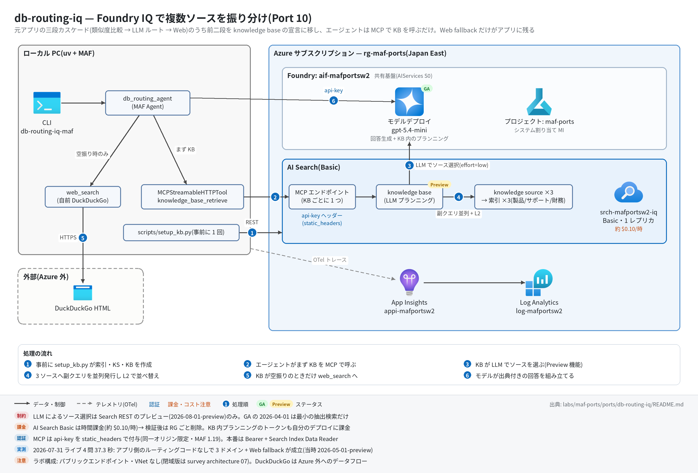

# db-routing-iq 実行ガイド

> **対象:** `labs/maf-ports/ports/db-routing-iq/`(Port 10・パターン: 複数ナレッジソース振り分け — Foundry IQ knowledge base の agentic retrieval を MCP 経由で使う単一エージェント + Web fallback)
> **最終確認:** 2026-09-29 オフライン(54 passed・ruff clean・依存 agent-framework-core 1.19.0 / agent-framework-openai 1.14.4 / openai 3.20.0 / mcp 1.30.0・Search REST `2026-08-01-preview`)/ ライブ: 2026-07-31(当時の構成 = `2026-05-01-preview`・MCP の api-key は `http_client` 方式。Azure リソースは削除済み — 再デプロイ手順は §5)
> **正は本 Markdown。** 人間用 HTML(同じディレクトリの `runbook.html`)は `python3 labs/tools/build_runbooks.py` で生成する(HTML は直接編集しない)。設計判断と移植の学びは [README](../README.md)。

## 1. このパターンで確かめること

- 元アプリがアプリ側で 150 行かけていた三段カスケード(全 DB 類似度比較 → LLM ルート → Web fallback)のうち前二段が、knowledge base の宣言(KS の `description` ×3 + `retrievalInstructions` + `retrievalReasoningEffort: low`)に置き換わり、**アプリ側ルーティングコードなしで**製品 / サポート / 財務の質問が正しいソースから答えられること。
- ドメイン外の質問では KB が空振りし、エージェントが instructions に従って `web_search`(自前 DuckDuckGo)に落ち、回答が `Web Search Result:` で始まること(カスケードの「端」はアプリの責務として残る)。
- 技術選定上の意味: ルーティングの**可観測性と決定性**(どのソースを何のスコアで選んだか)は MCP 経由では見えなくなる代わりに、副クエリ並列 + L2 リランクと KB の再利用性が手に入る。LLM によるソース選択は **Search REST のプレビュー版でしか使えない**([README 学び 1・4](../README.md))。

## 2. 構成



| コンポーネント | 役割 | 課金 |
| --- | --- | --- |
| MAF Agent `db_routing_agent`(ローカル) | `knowledge_base_retrieve`(MCP)を先に呼び、空振り時だけ `web_search` を呼んで回答を組み立てる | なし |
| Azure AI Search **Basic**(本ポート固有、`srch-<baseName>-iq`) | インデックス ×3(products / support / finance)+ searchIndex knowledge source ×3 + knowledge base ×1。KB ごとの MCP エンドポイント | **時間課金**(約 $0.10/時 ≒ 月 $75 規模)+ リトリーバル(リランク)のトークン課金(月次無料枠あり) |
| モデルデプロイ(共有基盤、gpt-5.4-mini) | エージェントの回答生成 + **KB 内の LLM クエリプランニング**(同じデプロイをキーで参照) | トークン従量(1 問あたり KB 内で 1 回余分に LLM が動く) |
| DuckDuckGo HTML(外部) | Web fallback | なし(Azure 外へのデータフロー) |
| Application Insights(共有基盤) | OTel トレース | 取り込み量従量 |

## 3. 前提

| 区分 | 必要なもの | 備考 |
| --- | --- | --- |
| ツール | uv(Python 3.11 以上。uv が取得。検証は 3.13) | オフライン実行はこれだけ |
| Azure(ライブのみ) | 共有基盤([infra/shared.bicep](../../../infra/shared.bicep))+ 本ポートの AI Search Basic([infra/main.bicep](../infra/main.bicep)) | 課金あり。Serverless(Developer tier・プレビュー)は使わないので 2026-09-13 からの Serverless 課金開始の影響はない |
| 権限 | AI Search の管理キー(KB 作成と MCP 認証の両方)と Foundry の API キー(KB のクエリプランニング用)。Entra ID の RBAC は不要 | 本番は Bearer + Search Index Data Reader / 検索サービス MI + Cognitive Services User(README) |
| リージョン | agentic retrieval が使えるリージョン(7 月は japaneast で実測) | — |

環境変数(`labs/maf-ports/.env`。雛形は `labs/maf-ports/.env.example` — `AZURE_SEARCH_*` は雛形にないので追記する。**ライブ実行時のみ必要**):

| 変数 | 用途 | 取得元 |
| --- | --- | --- |
| `FOUNDRY_OPENAI_V1_ENDPOINT` | エージェントの呼び出し先。KB の `models[].resourceUri` にも(`/openai/v1` を除いて)使う | shared.bicep 出力 `openaiV1Endpoint` |
| `FOUNDRY_MODEL` | エージェントと KB クエリプランニングのデプロイ名 | shared.bicep 出力 `modelDeploymentName` |
| `FOUNDRY_API_KEY` | エージェントの API キー + KB 定義の `apiKey`(KB 内プランニング用) | `az cognitiveservices account keys list -n aif-<baseName> -g <rg>` |
| `AZURE_SEARCH_ENDPOINT` | `https://srch-<baseName>-iq.search.windows.net` | main.bicep 出力 `searchEndpoint` |
| `AZURE_SEARCH_ADMIN_KEY` | `setup_kb.py` の REST と MCP の `api-key` ヘッダー | main.bicep 出力 `searchAdminKey` |
| `DB_ROUTING_KB_NAME` | KB 名(任意。既定 `db-routing-kb`) | — |
| `APPLICATIONINSIGHTS_CONNECTION_STRING` | トレース送信先(未設定ならトレース無効) | shared.bicep 出力 `appInsightsConnectionString` |

## 4. オフライン実行(Azure 不要・無料)

```bash
cd labs/maf-ports/ports/db-routing-iq
uv sync --extra dev
uv run pytest                        # 期待: 54 passed, 4 deselected(ネットワーク不要)
uv run ruff check .                  # 期待: All checks passed!
```

オフラインテストが固定している主な挙動:

- [ ] KB / KS / インデックスのペイロード: 3 ソースを束ね、`retrievalReasoningEffort: {kind: low}` + 元アプリのルーティング規則を移した `retrievalInstructions`、`outputMode` なし(回答統合はエージェント側)、インデックスはベクトルなし + semantic configuration 必須(`tests/test_kb_setup.py` の 18 件)
- [ ] MCP エンドポイントの形 `{search}/knowledgebases/{kb}/mcp?api-version=2026-08-01-preview`(`test_kb_mcp_url_shape` / `test_api_version_is_the_preview_that_supports_llm_routing`)
- [ ] 実 `MCPStreamableHTTPTool` のハンドシェイク(initialize / tools/list)に最初から `api-key` が付き、allow-list で `knowledge_base_retrieve` だけが展開される(`test_handshake_carries_api_key_and_exposes_only_retrieve`。偽 KB サーバーは MockTransport)
- [ ] Web fallback は失敗を例外にせず文字列で返す(`test_web_search_turns_failures_into_text`)
- [ ] 評価データの各ファクト(1.2kg / 30 日以内 / 84 億円 …)が**期待ドメインのコーパスにしか存在しない**(`test_expected_fact_exists_only_in_expected_domain`)— ライブで「正答 = 正しいソースから引いた」と推論できる根拠
- [ ] ルーティングの観測点 = 呼ばれたツール名の出現順(`test_summarize_tool_calls_extracts_names_in_order_without_duplicates`)

## 5. ライブ実行(Azure 必要・課金あり)

### 5.1 デプロイ

```bash
# 共有基盤が未作成なら先に作る(labs/maf-ports/README.md「実行の前提」と infra/shared.bicep 冒頭コメント)
cd labs/maf-ports
az deployment group create -g <rg> -f infra/shared.bicep \
  -p baseName=<baseName> modelName=gpt-5.4-mini modelVersion=<版> modelCapacity=10

# 本ポート: AI Search Basic(時間課金が始まる)
cd ports/db-routing-iq
az deployment group create -g <rg> -f infra/main.bicep -p baseName=<baseName>
az deployment group show -g <rg> -n main --query "properties.outputs.{endpoint:searchEndpoint.value, key:searchAdminKey.value}"
#   → AZURE_SEARCH_ENDPOINT / AZURE_SEARCH_ADMIN_KEY を labs/maf-ports/.env に追記

# 第 2 段: インデックス ×3 → 文書投入 → knowledge source ×3 → knowledge base(データプレーン。Bicep では作れない)
uv sync --extra dev --extra live
uv run python scripts/setup_kb.py              # 冪等(PUT + mergeOrUpload)
uv run python scripts/setup_kb.py --recreate   # KB → KS → インデックスの逆順で消してから作り直す
```

`setup_kb.py` の期待出力(チャンク数はオフラインで `build_documents` から算出した値):

```text
index ready: db-routing-products (3 chunks)
index ready: db-routing-support (3 chunks)
index ready: db-routing-finance (3 chunks)
knowledge source ready: db-routing-products-ks
knowledge source ready: db-routing-support-ks
knowledge source ready: db-routing-finance-ks
knowledge base ready: db-routing-kb
MCP endpoint: https://srch-<baseName>-iq.search.windows.net/knowledgebases/db-routing-kb/mcp?api-version=2026-08-01-preview
```

### 5.2 実行

```bash
cd labs/maf-ports/ports/db-routing-iq
uv run db-routing-iq-maf "Aurora X10 の本体重量とバッテリーでの連続投影時間は?"   # → products
uv run db-routing-iq-maf "返品は何日以内に申請すればいいですか?"                  # → support
uv run db-routing-iq-maf --json "FY2025 の売上高と前年比は?"                      # → finance
uv run db-routing-iq-maf "2026 年現在の日本の首相は誰ですか?"                     # → web fallback
uv run pytest -m live            # 期待: 4 passed(7 月の実測 37.3 秒)
```

CLI のオプション: `--json`(`question` / `answer` / `tool_calls` を JSON で出す)/ `--timeout`(全体タイムアウト秒、既定 180)。

期待される出力の例(stderr の `[kb]` / `[tools]` 行は CLI の書式どおり。回答文は**例** — 数値ファクトは `data/` のコーパスの値):

```text
tracing: App Insights 有効
[kb] https://srch-<baseName>-iq.search.windows.net/knowledgebases/db-routing-kb/mcp?api-version=2026-08-01-preview
[tools] knowledge_base_retrieve
Aurora X10 の本体重量は 1.2kg、バッテリーでの連続投影時間は最大 4 時間です(出典: Aurora X10 製品仕様)。
```

ドメイン外の質問では `[tools] knowledge_base_retrieve, web_search` となり、回答が `Web Search Result:` で始まる。

## 6. 確認観点

| 確認 | # | 観点 | 確認方法 | 期待結果 |
| --- | --- | --- | --- | --- |
| [ ] | 1 | 正常系: KB 作成 | `uv run python scripts/setup_kb.py` | §5.1 の 8 行が出て exit 0。プレビュー API のエラー時は HTTP ステータスとレスポンス本文がそのまま出る |
| [ ] | 2 | 正常系: ドメイン内 3 問 | §5.2 の products / support / finance の 3 問 | 各回答にそのドメインにしかないファクト(1.2kg / 30 日以内 / 84 億円)が入り、`[tools]` が `knowledge_base_retrieve` のみ |
| [ ] | 3 | 分岐: Web fallback | ドメイン外の質問 | `[tools]` に `web_search` が加わり、回答が `Web Search Result:` で始まる(KB の結果だけで答えていない) |
| [ ] | 4 | 異常系: 認証 | `AZURE_SEARCH_ADMIN_KEY` をわざと 1 文字変えて CLI を実行 | MCP 接続(initialize)の段階で失敗する(ツール呼び出し前に落ちる = キーが接続時から必要なことの確認)。戻したら正常に戻る |
| [ ] | 5 | 異常系: タイムアウト | `--timeout 1` | `error: request timed out after 1 seconds` で exit 1 |
| [ ] | 6 | パターン固有: ルーティングの観測の限界 | `--json` の `tool_calls` と回答を見る | どのソースを選んだかは MCP 応答からは分からず、**回答中のファクト**で推論する(retrieve の `activity` は MCP では返らない — README 学び 3) |
| [ ] | 7 | 観測: トレース到達 | §7 の KQL | `invoke_agent db_routing_agent`、`execute_tool knowledge_base_retrieve`(fallback 時は `execute_tool web_search`)、MCP の `tools/call knowledge_base_retrieve` スパンが出る |
| [ ] | 8 | コスト | ポータルの AI Search → 概要 / コスト分析 | Basic が起動している間は時間課金が進む。検証が終わったらすぐ §8 |
| [ ] | 9 | 後片付け | `az group show -n <rg>` | 削除後は `ResourceGroupNotFound`。KB は `setup_kb.py` で数分で再構築できる |

## 7. トレース・評価の確認

```bash
az monitor app-insights query --app appi-<baseName> -g <rg> \
  --analytics-query "dependencies | where timestamp > ago(30m) | summarize count() by name | order by name asc"
```

- 期待するスパン名: `invoke_agent db_routing_agent`、`chat <モデル名>`(function-calling ループの反復ごと)、`execute_tool knowledge_base_retrieve` / `execute_tool web_search`
- agent-framework-core 1.19 では MCP クライアント側のスパン(`initialize` / `tools/list` / `tools/call knowledge_base_retrieve`)も出る(7 月のライブ時点の 1.13 では未確認)
- KB 内部の LLM クエリプランニングと副クエリはサービス側で動くので、このトレースには**出ない**。ルーティングの中身を見たいときは REST の retrieve アクション(`POST {search}/knowledgebases/{kb}/retrieve?api-version=2026-08-01-preview`、`includeActivity: true`)を別に叩く
- 評価: `tests/eval_dataset.jsonl`(7 ケース)の定量評価は未実装。`--json` の `tool_calls` + 回答を Foundry の評価器に渡す場合は [critique-loop の runbook](../../critique-loop/docs/runbook.md) の evals 手順が流用できる

## 8. 片付け

```bash
az group delete -n <rg> --yes --no-wait   # AI Search Basic の時間課金を止める(共有基盤ごと消すならこれで全部)
# 共有基盤は残して AI Search だけ止める場合
az search service delete -n srch-<baseName>-iq -g <rg> --yes
```

## 9. トラブルシューティング

| 症状 | 原因 | 対処 |
| --- | --- | --- |
| `setup_kb.py` が 400(プロパティ不明など) | Search REST の api-version と KB / KS ペイロードの食い違い。本ポートは 2026-09-29 に `2026-08-01-preview` へ更新し、**この版ではライブ未検証** | レスポンス本文を確認。版起因なら `src/db_routing_iq_maf/config.py` の `SEARCH_API_VERSION` を検証済みの `"2026-05-01-preview"` に戻す(テスト 2 件の期待値も戻す) |
| `setup_kb.py` の KB 作成だけ 400 / 403 | KB の `models`(キー認証)の不備、または `FOUNDRY_OPENAI_V1_ENDPOINT` からリソース URI を導出できていない | `.env` の値を確認(`https://<sub>.openai.azure.com/openai/v1` の形)。MI 経路にする場合は Basic 以上 + 検索サービス MI に Cognitive Services User |
| KB の作成数上限で失敗 | agentic retrieval の上限は SKU 依存(Free は KS / KB 各 3、**S3 HD は 0**)([casebook P-R08 ほか](../../../../../docs/survey/casebook/02-pitfalls-index.md#e-rag-とナレッジ)) | Basic 以上を使う(main.bicep の既定) |
| CLI が `MCP server failed to initialize` | api-key 不一致、KB 未作成、`DB_ROUTING_KB_NAME` の不一致 | `setup_kb.py` の最終行の MCP endpoint と `[kb]` 行の URL が一致するか確認 |
| 接続時に `'InitializeResult' object has no attribute 'protocolVersion'` | mcp 2.x が入っている(MAF 1.19 は mcp<2 前提) | `pyproject.toml` の `mcp>=1.30,<2` を外していないか確認して `uv sync` |
| ドメイン外なのに `web_search` が呼ばれない | fallback は instructions ベース(モデル裁量) | 回答が「情報がない」旨ならそれも許容範囲(ライブスモークは web_search 呼び出しか `Web Search Result:` のどちらかで判定)。DDG 側の失敗は `Search failed:` の文字列で返る |
| 時間課金が止まらない | AI Search Basic はクエリがなくても課金 | §8 で削除 |

## 10. 関連・更新履歴

- 設計判断と学び: [README](../README.md)
- Foundry IQ の GA / プレビュー内訳と MCP 接続: [features/04 ツール・ナレッジ](../../../../../docs/survey/features/04-tools-knowledge.md)
- 詰まりどころ(Foundry IQ の「GA」の範囲など): [casebook 02 E. RAG とナレッジ](../../../../../docs/survey/casebook/02-pitfalls-index.md#e-rag-とナレッジ)
- 同じ MCP 接続パターン(static_headers): [github-mcp](../../github-mcp/README.md)。アプリ側で CRAG を組んだ対照例: [corrective-rag](../../corrective-rag/README.md)

| 日付 | 内容 |
| --- | --- |
| 2026-09-29 | 初版(依存を agent-framework-core 1.19.0 / openai 3.20.0 / mcp 1.30.0 に更新。Search REST を `2026-08-01-preview` へ、MCP の api-key を `static_headers` へ変更 — いずれもライブ未検証。構成図を v2(日本語・処理順バッジ・注記帯)に更新) |
