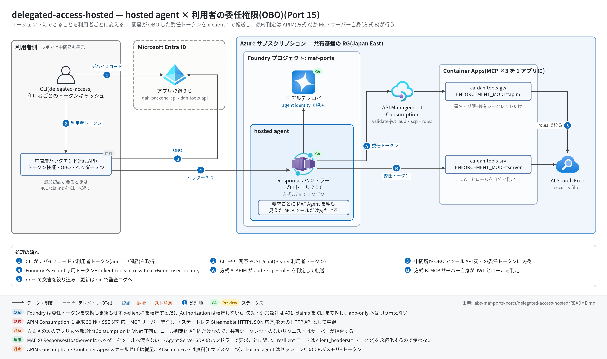

# delegated-access-hosted 実行ガイド

> **対象:** `labs/maf-ports/ports/delegated-access-hosted/`(Port 15・パターン: hosted agent × 利用者の委任権限 — アプリ管理の OBO+`x-client-*` 転送+`x-ms-user-identity`、最終判定を APIM〈方式 A〉と MCP サーバー〈方式 B〉の 2 通りで実装)
> **最終確認:** 2026-09-30 オフライン(**239 passed**・`ruff check .` clean・`az bicep build` / `az bicep lint` OK・依存 agent-framework-core 1.19.0 / azure-ai-agentserver-responses 2.2.0 / azure-ai-projects 2.6.1 / mcp 1.30)/ **ライブ: 2026-09-30 japaneast・gpt-5.4-mini・テスト用ユーザー 2 人で方式 A / B とも確認済み**(結果は §6.1。検証後に Azure・Entra のリソースはすべて削除済み)
> **正は本 Markdown。** 人間用 HTML(同じディレクトリの `runbook.html`)は `python3 labs/tools/build_runbooks.py` で生成する(HTML は直接編集しない)。設計判断と学びは [README](../README.md)。

## 1. このパターンで確かめること

- **同じ質問でも利用者で答えが変わる**: 一般社員には経理向け文書が検索結果に出ず(「見つかりませんでした」)、経理担当には「与信限度額の設定基準(経理部内規)」を根拠に答える。**判定は AI Search のセキュリティフィルター**(委任トークンの `roles` から作る)で、モデルの判断ではない。
- **できる操作が利用者で変わる**: 一般社員には更新ツール(`update_payment_terms`)が**最初から見えない**(supplier-admin の MCP サーバーが 403 → ツールを隠す)。経理担当は更新でき、監査ログに利用者の oid・変更前後が残る。呼び出し時点で 403 になっても別の ID で再試行しない。
- **トークンの扱い**: Foundry は委任トークンを転送するだけ(交換も更新もしない)。トークンはプロンプト・ツール引数・結果・ログ・トレースに出ない。委任トークンがなければモデルを呼ばずに再サインインを促し、追加認証が要れば 401+claims チャレンジを CLI まで返す。
- **方式 A と B の差**: 同じ利用者・同じ質問を 2 つの hosted agent(APIM 経由 / サーバー直)に投げ、結果・レイテンシ・ログの出方を比べる。方式 A の裏のサーバーを直接叩いても通らない(ゲートウェイ共有シークレット)。
- 技術選定上の意味: 「エージェントの権限 = 利用者の権限」は Foundry の機能ではなく部品間の契約で作るもの。判定点をゲートウェイに置くなら迂回対策まで含めて設計する(README の学び 1・3)。

## 2. 構成



```text
CLI ─①デバイスコード─▶ Entra ID(dah-backend-api / dah-tools-api)
 │② POST /chat(Bearer 利用者トークン)
 ▼
中間層バックエンド(手元の uvicorn :8000)─③ OBO ─▶ Entra ID
 │④ Authorization(Foundry 用)+ x-client-tools-access-token + x-ms-user-identity
 ▼
hosted agent delegated-access-apim ──⑤A──▶ APIM(Consumption)──▶ ca-dah-tools-gw(ENFORCEMENT_MODE=apim)
hosted agent delegated-access-server ─⑤B──────────────────────────▶ ca-dah-tools-srv(ENFORCEMENT_MODE=server)
                                                   └─ /docs/mcp → AI Search(roles で絞る)/ /suppliers/mcp / /supplier-admin/mcp
```

| コンポーネント | 役割 | 課金 |
| --- | --- | --- |
| CLI(`delegated-access`、ローカル) | デバイスコードでサインイン(利用者ごとに `.cache/` へ MSAL キャッシュ)、`/chat` を呼ぶ | なし |
| 中間層バックエンド(FastAPI、ローカル :8000) | 利用者トークンの検証、OBO、Foundry 用トークン、ヘッダー 3 つ、claims チャレンジ → 401 | なし(ラボでは手元で起動) |
| Entra ID のアプリ登録 2 つ | `dah-backend-api`(`access_as_user`・公開クライアント・シークレット)/ `dah-tools-api`(`Tools.Access`・アプリロール 2 つ) | なし |
| hosted agent ×2(0.5 vCPU / 1 GiB・`python_3_13`・REMOTE_BUILD) | 要求ごとに疎通確認 → 見えた MCP ツールだけで MAF Agent を組む | アクティブセッション中の CPU/メモリ(アイドルでスケールゼロ) |
| モデルデプロイ(共有基盤、既定 gpt-5.4-mini) | hosted agent の推論(agent identity) | トークン従量 |
| APIM(Consumption)`apim-dah-<suffix>` | 方式 A の判定点(validate-jwt ×2)+共有シークレットを付けて転送 | 呼び出し回数の従量(無料枠あり・待機課金なし) |
| Container Apps 環境+アプリ ×2(`ca-dah-tools-srv` / `ca-dah-tools-gw`、0.25 vCPU / 0.5 GiB・maxReplicas 1) | MCP 3 サーバーを 1 アプリに mount。方式 B の判定・文書の絞り込み・更新の監査 | 使用量の従量(minReplicas 0 ならアイドル時はほぼなし) |
| ACR(Basic)`crdah<suffix>` | ツールサーバーのイメージ | **置いておくだけで日額** |
| AI Search(Free)`srch-dah-<suffix>` | 社内文書の索引(`allowed_roles` でセキュリティフィルター) | Free は無料(`searchSku=basic` にすると時間課金) |
| ユーザー割り当て MI `id-dah-tools-<baseName>` | ACR pull と AI Search 読み取り | なし |
| App Insights / Log Analytics(共有基盤) | hosted agent のトレース、APIM のリクエストログ、ツールサーバーの監査ログ | 取り込み量従量 |

## 3. 前提

| 区分 | 必要なもの | 備考 |
| --- | --- | --- |
| ツール | uv(Python 3.11 以上。検証は 3.13)。ライブは Azure CLI(`az login`)、`az bicep`、(任意)Docker | オフライン実行は uv だけ |
| Azure(ライブのみ) | 共有基盤([infra/shared.bicep](../../../infra/shared.bicep))+本ポート固有([infra/main.bicep](../infra/main.bicep): ACR・MI・Container Apps ×2・APIM Consumption・AI Search Free) | 課金あり(§5.5) |
| Entra(ライブのみ) | テスト用の**既存**利用者 2 名(一般社員役・経理担当役。プロジェクトと同じテナント)、アプリ登録と管理者同意ができる管理者 | 管理者作業の一覧は §5.1 |
| 権限 | §5.1 の表(Entra のアプリ管理系ロール+ Azure の RBAC 管理系ロール+ Foundry のエージェント作成) | RBAC 伝播に 5〜15 分 |
| リージョン | 共有基盤の Japan East(hosted agent・APIM Consumption・Container Apps・AI Search Free とも可) | APIM Consumption は一部のソブリンクラウドに無い |

環境変数(ポートの `.env`。雛形は [.env.example](../.env.example)。**ライブ実行時のみ必要**。ポートの `.env` → lab ルートの `.env` の順に読む):

| 変数 | 用途 | 取得元 |
| --- | --- | --- |
| `ENTRA_TENANT_ID` / `TOOLS_API_CLIENT_ID` / `TOOLS_API_SCOPE` | 共通(JWT 検証の発行者・宛先、OBO の交換先) | `setup_entra.py --apply` の stdout |
| `BACKEND_API_CLIENT_ID` / `BACKEND_CLIENT_SECRET` | 中間層(利用者トークンの宛先、OBO と Foundry 用トークン)。CLI も `BACKEND_API_CLIENT_ID` を使う | 同上(シークレットは発行時の 1 回だけ表示) |
| `AGENT_RESPONSES_URL` | 中間層が呼ぶ hosted agent の Responses URL 全体(方式 A / B で差し替える) | `deploy_hosted_agent.py` の stdout |
| `FOUNDRY_SCOPE` | Foundry 用トークンのスコープ(既定 `https://ai.azure.com/.default`) | 既定のまま |
| `BACKEND_URL` / `DELEGATED_ACCESS_CACHE_DIR` | CLI の接続先(既定 `http://localhost:8000`)とキャッシュ(既定 `.cache`) | 既定のまま |
| `FOUNDRY_PROJECT_ENDPOINT` / `FOUNDRY_MODEL_NAME` | hosted agent のデプロイ(コンテナの環境変数にも転記)。`FOUNDRY_MODEL_NAME` が無ければ lab 共通の `FOUNDRY_MODEL` | 共有基盤の出力 |
| `TOOLS_BASE_URL` | hosted agent の MCP の入口(`--tools-base-url` が優先)。ローカルで `hosting/main.py` を起動するときも使う | Bicep の出力 `apimGatewayUrl`(A)/ `toolsServerUrl`(B) |

コンテナ側の環境変数はデプロイ定義や Bicep が渡す(`.env` ではない): hosted agent = `FOUNDRY_PROJECT_ENDPOINT` / `FOUNDRY_MODEL_NAME` / `TOOLS_BASE_URL`(秘密なし)、ツールサーバー = `ENFORCEMENT_MODE` / `ENTRA_TENANT_ID` / `TOOLS_API_CLIENT_ID` / `SEARCH_ENDPOINT` / `SEARCH_INDEX` / `AZURE_CLIENT_ID` / `PORT`(apim モードだけ `APIM_GATEWAY_SECRET` を Container Apps の secret から)。

## 4. オフライン実行(Azure 不要・無料)

```bash
cd labs/maf-ports/ports/delegated-access-hosted
uv sync --extra dev --extra hosting --extra search   # hosting = Agent Server SDK / azure-ai-projects の実構築テスト
uv run pytest          # 期待: 239 passed(ネットワーク不要。疑似 Entra・APIM エミュレーター・疑似 Graph/ARM)
uv run ruff check .    # 期待: All checks passed!
az bicep build -f infra/main.bicep --stdout > /dev/null && az bicep lint -f infra/main.bicep   # 期待: エラー・警告なし
```

送信せずに中身だけ確かめる(**どれも既定は dry-run** — 通信せず、実行予定の呼び出し・コマンドを表示する):

```bash
uv run python scripts/setup_entra.py --employee-upn alice@contoso.com --finance-upn bob@contoso.com \
    --resource-group rg-maf-ports --base-name mafports        # Graph / ARM の呼び出し 27 件と本文
scripts/deploy_tools_server.sh --resource-group rg-maf-ports --base-name mafports \
    --apim-publisher-email you@example.com                    # az / curl のコマンド列
FOUNDRY_PROJECT_ENDPOINT=https://aif-x.services.ai.azure.com/api/projects/maf-ports FOUNDRY_MODEL_NAME=gpt-5.4-mini \
  uv run python scripts/deploy_hosted_agent.py --mode apim --tools-base-url https://apim-dah-x.azure-api.net
```

期待される出力の例(`setup_entra.py` の dry-run。stderr に呼び出し、stdout に `.env` 用の行):

```text
# 2. ツール API のアプリ登録 dah-tools-api(Tools.Access + アプリロール 2 つ)
[dry-run] PATCH https://graph.microsoft.com/v1.0/applications(uniqueName='dah-tools-api')  [Prefer: create-if-missing]
          { "displayName": "dah-tools-api", "api": { "requestedAccessTokenVersion": 2, ... } }
...
# 7. Foundry 側: バックエンドの SP に 2 ロール(スコープ: project)
[dry-run] PUT https://management.azure.com/subscriptions/<subscription-id>/resourceGroups/rg-maf-ports/providers/Microsoft.CognitiveServices/accounts/aif-mafports/projects/maf-ports/providers/Microsoft.Authorization/roleAssignments/...?api-version=2022-04-01
[dry-run] 27 件の呼び出しを表示した(送信していない)。--apply で実行する
ENTRA_TENANT_ID=<tenant-id>
TOOLS_API_CLIENT_ID=<dah-tools-api:appId>
...
```

ローカルで全部品をつなぐ(Azure なし。AI Search の代わりに同梱の `data/docs` をメモリ検索、Entra の代わりに疑似 Entra — 部品の結合テストと同じ構成)は `uv run pytest -k "e2e or eval_dataset" -v` で見る(`tests/test_e2e_offline.py` 12 件: 利用者 2 人 × 方式 A / B で更新・文書の絞り込み・ヘッダーの出どころ・追加認証・トークン非露出 / `tests/test_eval_dataset.py` 17 件: 評価データセット 8 ケースの権限の期待値 × 方式 A / B)。

オフラインテストが固定している主な挙動:

- [ ] ツールサーバー: 両方式 × 両利用者で tools/list の見え方(一般社員に supplier-admin は 403)、同じ検索でも経理だけ経理向け文書が出る、署名不正・宛先違い・期限切れ・スコープなし → 401 / 403、app-only → 403、経理の更新は監査に oid が残り、一般社員の更新は実行されない(`tests/test_tools_*.py`)
- [ ] APIM ポリシー: エミュレーターが `infra/apim/policies/*.xml` を直接読んで判定し、XML からロール条件を消すと supplier-admin が開く(= ポリシーファイル自体をテスト)(`test_tools_apim_emulator.py`)
- [ ] 中間層: `x-ms-user-identity` は検証済みトークンの oid(偽の同名ヘッダーは無視)、エージェントへの `Authorization` は Foundry 用トークン、claims チャレンジ → 401 でエージェントを呼ばない、ログにトークンが出ない(`tests/test_backend_*.py`)
- [ ] hosted agent: 委任トークンなし → モデルを呼ばない、一般社員は docs+suppliers のツールだけ・経理は supplier-admin も、呼び出し時の 403 → `MSG_FORBIDDEN` で再試行なし、トークンがモデル入力・ログ・出力に出ない、2 人を続けて処理しても MCP セッションを共有しない(`tests/test_agent_*.py`)
- [ ] セットアップ: 初回で全部作り 2 回目は何も増やさない(冪等)、dry-run は通信も `az` も呼ばない、シークレットはログに出ず `.env` 用の行にだけ出る、レプリケーション遅延の 404 を再試行(`test_provisioning_entra.py`)
- [ ] デプロイ zip: ルートに `main.py` / `requirements.txt`、パッケージはエージェント側だけ(中間層・ツールサーバー・疑似 Entra は入れない)、zip の中身だけで `main.py` が import できる、プロトコル 2.0.0・環境変数に秘密なし、方式と URL の取り違えを拒否(`test_provisioning_hosted.py`)
- [ ] インフラの契約: Bicep の API パス = 契約パス、ポリシーが参照する Named Value はすべて Bicep が作る、ポリシーは Consumption の 16 KiB 未満、ツールサーバーのポート・環境変数・`maxReplicas 1`、`.env.example` の変数一覧(`test_infra_contracts.py`)

## 5. ライブ実行(Azure / Entra 必要・課金あり)

### 5.1 管理者作業の一覧(顧客環境で申請が要るもの)

**すべてスクリプト化してあり、既定は dry-run**(表示を申請書に貼れる)。「誰がやるか」が分かれるのがこのパターンのリードタイム。

| # | 作業 | 対象 | 必要な権限(最小の目安) | 実施手段 |
| --- | --- | --- | --- | --- |
| E1 | アプリ登録 `dah-tools-api` の作成(スコープ `Tools.Access` type=Admin、アプリロール `Suppliers.Write` / `Docs.Finance`、v2 トークン、App ID URI `api://<appId>`) | Entra | アプリケーション開発者(作成者が所有者になる)以上。アプリ登録を制限しているテナントでは クラウド アプリケーション管理者 / アプリケーション管理者 | `setup_entra.py` 手順 2 |
| E2 | アプリ登録 `dah-backend-api` の作成(スコープ `access_as_user`、**パブリッククライアントフロー有効**、必要な権限: `Tools.Access` / 自分の `access_as_user` / Graph の `openid profile offline_access`) | Entra | 同上 | 手順 3 |
| E3 | サービスプリンシパル(エンタープライズアプリ)2 つ | Entra | 同上 | 手順 2・3 |
| E4 | `dah-backend-api` のクライアントシークレット発行(既定 30 日) | Entra | アプリの所有者 / クラウド アプリケーション管理者 | 手順 4 |
| E5 | **テナント全体の管理者同意 3 件**(backend → tools `Tools.Access` / backend → backend `access_as_user` / backend → Graph `openid profile offline_access`) | Entra | クラウド アプリケーション管理者 / アプリケーション管理者 | 手順 5 |
| E6 | **アプリロールの割り当て**(経理担当に `Suppliers.Write` + `Docs.Finance`。一般社員はなし) | Entra | クラウド アプリケーション管理者 / アプリケーション管理者 | 手順 6 |
| E7 | (任意)条件付きアクセスで `dah-tools-api` に MFA を要求 — claims チャレンジの確認用 | Entra | 条件付きアクセス管理者 | ポータル(スクリプト外) |
| A1 | 固有リソースのデプロイ(ACR・MI・Container Apps ×2・APIM・AI Search)+ MI へのロール割り当て 2 件(AcrPull / Search Index Data Reader) | RG | **所有者**(または 共同作成者 + ロールベースのアクセス制御管理者) | `deploy_tools_server.sh` |
| A2 | カスタムロール「Foundry Agent User Identity Impersonation (<rg>)」の作成(`UserIdentityImpersonation/action` のみ、割り当て可能スコープ = RG) | RG | 所有者 / ユーザー アクセス管理者 | `setup_entra.py` 手順 7 |
| A3 | `dah-backend-api` の SP に **Foundry Agent Consumer**(プロジェクトスコープ) | Foundry プロジェクト | 所有者 / ユーザー アクセス管理者 / RBAC 管理者(Foundry Project Manager は Foundry User しか割り当てられない) | 手順 7 |
| A4 | 同 SP に A2 のカスタムロール(プロジェクトスコープ) | Foundry プロジェクト | 同上 | 手順 7 |
| A5 | hosted agent 2 つのデプロイ(`create_version_from_code` / `update_details`) | Foundry アカウント(またはプロジェクト) | **デプロイ実行者**に Foundry User 以上(エージェントの作成・更新)。サブスクリプションの所有者でも自動では付かない — ライブでは無いと `agents/write` 不足で拒否され、付与後の反映に約 5 分かかった | `deploy_hosted_agent.py` |
| A6 | AI Search のインデックス作成と文書投入 | AI Search | Search Service Contributor + Search Index Data Contributor(または管理キー) | `scripts/setup_index.py` |
| A7 | ツールサーバーのイメージビルド(`az acr build`)/ push(`--local-build`) | ACR | 共同作成者 / AcrPush | `deploy_tools_server.sh` |

### 5.2 デプロイ

```bash
cd labs/maf-ports/ports/delegated-access-hosted
uv sync --extra dev --extra hosting --extra search --extra live
az login          # §5.1 の権限を持つアカウント

# (0) 共有基盤(labs/maf-ports/infra の実行ガイド)+デプロイ実行者に Foundry User(A5)
az role assignment create --assignee <自分の objectId> --role "Foundry User" \
    --scope $(az cognitiveservices account show -g <rg> -n aif-<baseName> --query id -o tsv)
# テスト用ユーザーを新規に作る場合(ライブ検証ではこの形で 2 人作り、§8 で完全削除した)
#   az ad user create --display-name dah-employee --user-principal-name dah-employee@<tenant>.onmicrosoft.com --password <初期パスワード>

# (1) Entra + Foundry のロール(E1〜E6・A2〜A4)。まず dry-run の表示を確認してから --apply
uv run python scripts/setup_entra.py --employee-upn <社員の UPN> --finance-upn <経理の UPN> \
    --resource-group <rg> --base-name <baseName>
uv run python scripts/setup_entra.py ... --apply > .env.entra   # stdout = .env 用の行(シークレット含む。.env.* は git 管理外)
cat .env.entra >> .env && rm .env.entra

# (2) ツールサーバー・APIM・AI Search(A1・A7)。1 回目は器 → ビルド → toolsImage 付きで再デプロイ
set -a; source .env; set +a      # TOOLS_API_CLIENT_ID を渡す
scripts/deploy_tools_server.sh --resource-group <rg> --base-name <baseName> --apim-publisher-email <mail>
scripts/deploy_tools_server.sh ... --apply         # 最後に TOOLS_BASE_URL_APIM / _SERVER を表示

# (3) 文書の索引(A6)。.env の SEARCH_ENDPOINT に Bicep の出力 searchEndpoint を入れる
#     (SEARCH_API_KEY が空なら az login の ID で Entra 認証 → A6 のロールが要る)
az deployment group show -g <rg> -n dah-infra --query properties.outputs.searchEndpoint.value -o tsv
uv run python scripts/setup_index.py               # dry-run → 確認して --apply

# (4) hosted agent を方式ごとに 1 つ(A5)。最後に AGENT_RESPONSES_URL を表示
uv run python scripts/deploy_hosted_agent.py --mode apim   --tools-base-url <TOOLS_BASE_URL_APIM>   --apply
uv run python scripts/deploy_hosted_agent.py --mode server --tools-base-url <TOOLS_BASE_URL_SERVER> --apply
```

期待される出力の例(値は実行ごとに変わる):

```text
# 0. ゲートウェイ共有シークレット                    ← deploy_tools_server.sh(stderr)
  ゲートウェイ共有シークレットを新規生成する
+ az deployment group create -g <rg> -n dah-infra -f .../infra/main.bicep -p @/tmp/tmp.XXXX -p baseName=... toolsImage= -o none
+ az acr build -r crdahxxxxxxxx -t dah-tools:20260930-120000 -f .../docker/tools/Dockerfile ...
{"status":"ok", ...}                                ← /healthz ×2
TOOLS_BASE_URL_APIM=https://apim-dah-xxxxxxxx.azure-api.net
TOOLS_BASE_URL_SERVER=https://ca-dah-tools-srv.<env>.japaneast.azurecontainerapps.io

created version 1 — provisioning...                 ← deploy_hosted_agent.py(stderr)
  status=creating
  status=active
routed 100% -> version 1
AGENT_RESPONSES_URL=https://aif-<baseName>.services.ai.azure.com/api/projects/maf-ports/agents/delegated-access-apim/endpoint/protocols/openai/responses?api-version=v1
```

### 5.3 実行

```bash
# .env の AGENT_RESPONSES_URL を方式 A のものにして中間層を起動
uv run python -m delegated_access_maf.backend.main        # :8000

# 別ターミナル: 2 人分サインイン(デバイスコードの画面で別アカウントを選ぶ)
uv run delegated-access login --user employee
uv run delegated-access login --user finance

uv run delegated-access ask --user employee "与信限度額の見直し頻度は?"
uv run delegated-access ask --user finance  "与信限度額の見直し頻度は?"
uv run delegated-access ask --user employee "S-1002 の支払条件を 45 日に変更して"
uv run delegated-access ask --user finance  "S-1002 の支払条件を 45 日に変更して"

uv run delegated-access ask --user finance  "S-1001 の支払条件を 90 日に延ばして"   # 業務ルールで拒否

# 方式 B と比べる: AGENT_RESPONSES_URL を delegated-access-server のものに替えて中間層を再起動し、同じ質問
# ライブの自動スモーク(pytest -m live)はまだない — 結果を §6 の確認観点で記録する(2026-09-30 の結果は §6.1)
```

期待される出力の例(値は実行ごとに変わる):

```text
$ delegated-access ask --user employee "取引先の与信限度額はどのように決めていますか?社内文書で調べて"
…つまり、与信限度額の具体的な算定基準や決定方法は、検索結果内には記載がありませんでした。
--- 利用者: dah-employee@<tenant>.onmicrosoft.com / 使えたツール: docs, suppliers / 見えなかったツール: supplier-admin

$ delegated-access ask --user finance "与信限度額の見直し頻度は?社内文書で調べて"
社内文書「与信限度額の設定基準(経理部内規)」によると、与信限度額は年1回(4月)に決算書を取り寄せて見直す、となっています。
--- 利用者: dah-finance@<tenant>.onmicrosoft.com / 使えたツール: docs, suppliers, supplier-admin / 見えなかったツール: (なし)

$ delegated-access ask --user employee "S-1002 の支払サイトを 60 日に変更してください"
この環境では支払条件の更新に使えるツールがありません。
そのため、「この操作を行う権限がありません。必要であれば管理者に権限の付与を依頼してください。」
--- 利用者: dah-employee@<tenant>.onmicrosoft.com / 使えたツール: docs, suppliers / 見えなかったツール: supplier-admin

$ delegated-access ask --user finance "S-1004 の支払サイトを 60 日に変更してください"
S-1004(グリーンオフィス株式会社)の支払サイトを 60 日に変更しました。
```

(2026-09-30 のライブ出力から抜粋。モデルの言い回しは実行ごとに変わる)

終了コード(CLI): 正常 0 / 再サインインが必要(claims チャレンジ含む)3 / その他のエラー 1 / 設定不足 2。

### 5.4 ライブでしか確かめられないこと(オフラインの残リスク)

2026-09-30 のライブで確かめた結果を末尾に付けた(✅ 確認済み / ⏳ 未確認)。

- ✅ 実 APIM がポリシー XML(`rawxml`・Named Value・2 段の validate-jwt・on-error の `WWW-Authenticate`)を受け付けるか、実 Entra トークンの `scp`(空白区切り)と `roles`(配列)で期待どおり判定するか(README「APIM エミュレーターでは証明できないこと」)
- ✅ `x-ms-user-identity` が 403 にならないこと(カスタムロールの伝播)と、Foundry が `x-client-tools-access-token` をコンテナへ転送すること
- ✅ hosted agent の REMOTE_BUILD が `hosting/requirements.txt` を解決できるか(Port 11 と違い agent-framework-foundry-hosting を入れない)
- ✅ APIM Consumption の 30 秒上限に、ツールサーバーのコールドスタート(スケールゼロ)+AI Search が収まるか(タイムアウトは起きなかった)
- ✅ Container Apps の Host ヘッダーで FastMCP が 421 を返さないこと(DNS リバインディング保護を外した効果)
- ⏳ 条件付きアクセスの claims チャレンジ(Entra ID P1 が要る)/ 呼び出し中の委任トークン失効(既定の寿命 60〜90 分より検証が短い)/ ロール剥奪・カスタムロールなし(§6 #6・#8)

### 5.5 コスト(単価は書かない。料金ページで確認)

- **置いておくだけで課金**: ACR Basic(日額)、AI Search を `basic` にした場合(時間課金)、Container Apps を `toolsMinReplicas=1` にした場合(アイドル時もレプリカ分)。Log Analytics はデータ取り込み量
- **使った分だけ**: APIM Consumption(呼び出し回数。無料枠あり)、Container Apps(minReplicas 0 ならリクエスト処理中の vCPU・メモリ)、hosted agent(アクティブセッション中の CPU/メモリ。アイドル既定 15 分でスケールゼロ)、モデル(トークン)、ACR Tasks(ビルド時間)
- **無料**: AI Search Free(1 サブスクリプション 1 つ)、Entra のアプリ登録・同意・ロール割り当て、Azure RBAC
- 検証を終えたら §8 で片付ける。hosted agent 2 つは呼ばなければセッション課金は発生しないが、残すと誤呼び出しの的になる

## 6. 確認観点

| 確認 | # | 観点 | 確認方法 | 期待結果 |
| --- | --- | --- | --- | --- |
| [ ] | 1 | 正常系: 文書の絞り込み | §5.3 の「与信限度額」を 2 人で | 一般社員は「見つかりませんでした」、経理は経理内規を根拠に回答。方式 A / B で同じ |
| [ ] | 2 | 正常系: ツールの見え方 | CLI の `--- 使えたツール / 見えなかったツール` 行 | 一般社員 = docs, suppliers / 見えない supplier-admin、経理 = 3 つとも |
| [ ] | 3 | 正常系: 更新と監査 | 経理で「S-1002 を 45 日に」→ §7 の監査ログ | 更新成功。`supplier_update` ログに経理の oid・upn・変更前後。一般社員では更新が実行されずログもない |
| [ ] | 4 | 異常系: 委任トークンなし | 中間層を通さず hosted agent を呼ぶ(`az rest` で `AGENT_RESPONSES_URL` へ POST、または Foundry ポータルのプレイグラウンド) | `MSG_REAUTH` の定型文、`metadata.delegated_access_status=reauth_required`、モデル呼び出しのスパンが無い |
| [ ] | 5 | 異常系: 方式 A の迂回 | `toolsGatewayBackendUrl`(`ca-dah-tools-gw` の直 URL)の `/supplier-admin/mcp` へ `x-apim-gateway-secret` なしで POST | トークンの有無にかかわらず 403(シークレットはトークン検証より先に判定)。`mcp_auth` ログの理由が `gateway_secret_mismatch`。APIM 経由では経理だけ通る |
| [ ] | 6 | 異常系: ロール剥奪(呼び出し時の 403) | 経理の `Suppliers.Write` を外し、`login --user finance` をやり直さずに(古いトークンのまま)更新を依頼。新しいトークンでも再確認 | 古いトークンは期限まで通る(トークンのロールは発行時点のもの)→ 取り直すと supplier-admin が見えなくなる。403 で別 ID に切り替えない |
| [ ] | 7 | 異常系: 追加認証(任意・E7) | 条件付きアクセスで `dah-tools-api` に MFA を要求 → 質問 | CLI に「追加の認証が必要です(claims チャレンジ)」、終了コード 3。`login` が保存済みチャレンジ付きでサインインし、再質問で成功 |
| [ ] | 8 | 異常系: カスタムロールなし | A4 の割り当てを外して質問(伝播待ちの後) | Foundry が 403(公式のトラブルシューティングどおり)。中間層は app-only に切り替えない |
| [ ] | 9 | 利用者の分離 | 一般社員の `response_id` を経理の `ask --previous-response-id` に渡す | Foundry が別利用者の会話の続きとして扱わない(拒否・または履歴が見えない — 実際の応答を記録する) |
| [ ] | 10 | 方式 A / B の比較 | 同じ 4 問を 2 つの hosted agent で。§7 の KQL で所要時間 | 回答は同じ。A は APIM のホップ分遅い(コールドスタート込みの実測値を README に記録) |
| [ ] | 11 | 観測: トークンが残らない | §7 の KQL で App Insights / Log Analytics を `eyJ` で検索 | 0 件(トレース・ログ・APIM のリクエストログのどこにもトークンがない)。GenAI のメッセージ内容も記録されていない |
| [ ] | 12 | コスト・後片付け | §8 | hosted agent 2 つ・APIM(purge)・Entra のアプリ 2 つ・カスタムロールまで消えている |

### 6.1 ライブ結果(2026-09-30)

japaneast・gpt-5.4-mini(Global Standard)・新規に作ったテスト用ユーザー 2 人(一般社員・経理担当)。方式 A(`delegated-access-apim`)/ 方式 B(`delegated-access-server`)の両方で実施。

| # | 結果 | 記録 |
| --- | --- | --- |
| 1 | ✅ | 一般社員: 検索結果に経理内規が出ず「記載がありませんでした」。経理: 「与信限度額の設定基準(経理部内規)」を根拠に「年 1 回(4 月)」。A / B で同じ |
| 2 | ✅ | 一般社員 = docs, suppliers(supplier-admin は事前の疎通確認で 403 → 非表示)、経理 = 3 つとも |
| 3 | ✅ | 経理の更新が成功し、監査ログに経理の oid と変更前後。一般社員は更新ツールが渡らず定型文。権限はあるが業務ルール違反(S-1001 を 90 日 — 中小受託取引の対象先は 60 日以内)は権限エラーと別の文言で拒否 |
| 4 | ⏳ | 未実施 |
| 5 | ✅ | ゲートウェイ用アプリをシークレットなしで直接呼ぶと 403 `forbidden`。APIM にトークンなしで 401(`WWW-Authenticate` 付き)、方式 B のサーバーを直接トークンなしで 401 `invalid_token` |
| 6 | ⏳ | 未実施 |
| 7 | ⏳ | 未実施(条件付きアクセスに Entra ID P1 が要る) |
| 8 | ⏳ | 未実施 |
| 9 | ✅ | 同じ利用者の続き = 200。**別の利用者の response ID = Foundry が 404**(中間層は 404 `conversation_not_found` に写す — 当初 502 だったのを修正)。同じ利用者でも**方式 B の agent の response ID を方式 A の agent で続けると 404**(会話は agent ごと) |
| 10 | ✅ | 回答は同じ。経理の同じ参照の質問 ×3(CLI 計測、`uv run` の起動込み): **A 9.7〜11.9 秒 / B 10.5〜13.7 秒** — 差は推論のばらつきに埋もれた |
| 11 | ⚠️ | **トークンは 0 件**(App Insights 1,704 レコードを JWT 形式で検索)。ただし**プラットフォーム側(ロール名 `responsesapi`)のスパンが `gen_ai.input.messages` / `gen_ai.output.messages` に会話全文(ツール結果を含む)を記録**していた — 経理だけに見える文書 ID `fin-credit-limit` がスパン 4 件に出現。コンテナの `OTEL_INSTRUMENTATION_GENAI_CAPTURE_MESSAGE_CONTENT=false` では止まらない。公式の止め方はプロジェクトから App Insights の接続を外すことだけ(接続すると同じ接続文字列がコンテナにも注入される)→ 本番は「集約 / 2 つに分離 / 接続しない」から選ぶ([architecture 09 §3.6](../../../../../docs/survey/architecture/09-operations.md#3-6-トレースに会話の中身を残すか-hosted-agent-の選定基準)) |
| 12 | ✅ | RG 削除 → Foundry アカウントと APIM の purge → カスタムロール → アプリ登録 2 つ・テスト用ユーザー 2 人(deletedItems からも完全削除)→ 手元の `.env`・`.cache/` |

APIM のリクエストログ(同じ時間帯): supplier-admin の 403 が 5 件(一般社員の疎通確認)、docs / supplier-admin の 401 が各 1 件(意図的なトークンなし)、残りは 200 / 202。

## 7. トレース・評価の確認

```bash
# hosted agent・APIM(App Insights = 共有基盤の appi-<baseName>)
az monitor app-insights query --app appi-<baseName> -g <rg> \
  --analytics-query "union requests, dependencies | where timestamp > ago(30m) | summarize count(), avg(duration) by itemType, name, resultCode | order by count_ desc"

# ツールサーバーの監査ログ(Container Apps → Log Analytics。環境によってはテーブル名が ContainerAppConsoleLogs)
az monitor log-analytics query -w $(az monitor log-analytics workspace show -g <rg> -n log-<baseName> --query customerId -o tsv) \
  --analytics-query "ContainerAppConsoleLogs_CL | where TimeGenerated > ago(30m) | where Log_s has 'supplier_update' or Log_s has 'mcp_auth' | project TimeGenerated, ContainerAppName_s, Log_s"

# トークンが残っていないこと(0 件が期待値)
az monitor app-insights query --app appi-<baseName> -g <rg> \
  --analytics-query "union traces, requests, dependencies, customEvents | where timestamp > ago(1h) | where tostring(pack_all()) has 'eyJ' | count"
```

- hosted agent: Agent Server SDK のリクエストスパンと MAF の `invoke_agent` / `execute_tool <ツール名>` / `chat` が期待値。コンテナ側は `OTEL_INSTRUMENTATION_GENAI_CAPTURE_MESSAGE_CONTENT=false` でメッセージ内容を出さない。**ただしプラットフォーム側(`cloud_RoleName == "responsesapi"`)のスパンは会話全文を記録する**(2026-09-30 ライブ、§6.1 #11)。確認用: `dependencies | where cloud_RoleName == "responsesapi" | where tostring(customDimensions) has "gen_ai.output.messages" | count`
- APIM: API ごとのリクエスト(`mcp-docs` / `mcp-suppliers` / `mcp-supplier-admin`)と結果コード(401 / 403 は validate-jwt の拒否)。ヘッダー・本文は記録しない設定
- 評価: 回答品質より「誰に何が見えたか」が本題なので、`tests/` のオフラインテスト(利用者 × 方式の行列)が評価の本体。ライブではリクエストごとのメタデータ(`delegated_access_visible_servers` 等)を記録して §6 の表を埋める

## 8. 片付け

```bash
# hosted agent(2 つ)— データプレーンのオブジェクト。RG を消せば消える
# ポート固有の Azure リソースだけ消す場合(共有基盤は残す)
az containerapp delete -g <rg> -n ca-dah-tools-srv --yes
az containerapp delete -g <rg> -n ca-dah-tools-gw --yes
az containerapp env delete -g <rg> -n cae-dah-<baseName> --yes
az apim delete -g <rg> -n apim-dah-<suffix> --yes
az apim deletedservice purge --service-name apim-dah-<suffix> --location japaneast   # 48 時間ソフトデリートの解除
az acr delete -g <rg> -n crdah<suffix> --yes
az search service delete -g <rg> -n srch-dah-<suffix> --yes
az identity delete -g <rg> -n id-dah-tools-<baseName>
# または共有基盤ごと: az group delete -n <rg> --yes --no-wait

# Foundry 側のロール(RG を消していない場合)とカスタムロール
az role assignment delete --assignee <dah-backend-api の SP の objectId> --scope <projectResourceId>
az role definition delete --name "Foundry Agent User Identity Impersonation (<rg>)"

# RG ごと消した場合: Foundry アカウントも論理削除で残る(同名で作り直すと衝突)
az cognitiveservices account purge -l japaneast -g <rg> -n aif-<baseName>
az apim deletedservice purge --service-name apim-dah-<suffix> --location japaneast

# Entra(RG 削除では消えない)。削除後 30 日はごみ箱に残るので deletedItems からも消す
az ad app delete --id <dah-backend-api の appId>
az ad app delete --id <dah-tools-api の appId>
az rest --method DELETE --url "https://graph.microsoft.com/v1.0/directory/deletedItems/<アプリの objectId>"
# テスト用ユーザーを作った場合
az ad user delete --id <ユーザーの objectId>
az rest --method DELETE --url "https://graph.microsoft.com/v1.0/directory/deletedItems/<ユーザーの objectId>"

# 手元(シークレット・トークンキャッシュ・ログ)
rm -f .env && rm -rf .cache/
```

- 再構築は §5.2 の 4 コマンド(`setup_entra.py` → `deploy_tools_server.sh` → `setup_index.py` → `deploy_hosted_agent.py` ×2)。`setup_entra.py` は冪等で、既存のアプリがあれば差分だけ適用する(シークレットは作り直さない — 紛失時は `--rotate-secret`)
- `.cache/`(MSAL のトークンキャッシュ)は `uv run delegated-access logout --user <alias>` か手で削除

## 9. トラブルシューティング

| 症状 | 原因 | 対処 |
| --- | --- | --- |
| 中間層 → Foundry が 403 | 中間層の SP に Foundry Agent Consumer かカスタムロールが無い / 伝播待ち | §5.1 の A3・A4 を確認して 5〜15 分待つ(`x-ms-user-identity` を送るにはカスタムロールが必須) |
| OBO が `AADSTS65001`(同意なし) | E5 の管理者同意が無い、または条件付きアクセス(casebook P-H19) | `setup_entra.py --apply` を再実行(冪等)。CA なら claims チャレンジの経路(§6 #7) |
| APIM が 401(トークンは有効なはず) | App ID URI / v2 トークンの設定漏れで `iss` が `sts.windows.net`(v1)、または時刻のずれ(`clock-skew` 既定 0 秒) | `requestedAccessTokenVersion=2` と `identifierUris=api://<appId>` を確認。ずれならポリシーに `clock-skew` |
| APIM のデプロイで API ポリシーの保存に失敗 | ポリシーが参照する Named Value が無い | `dah-tenant-id` / `dah-tools-api-client-id` / `dah-gateway-secret` の 3 つ(apim.bicep が作る)。`test_infra_contracts.py` が同じことを検査する |
| APIM 経由だけ 504 / タイムアウト | Consumption の 1 要求 30 秒にコールドスタートが食い込む | `--min-replicas 1`(アイドル課金あり)、または 1 回目は捨てて再実行 |
| MCP が 421 Misdirected Request | FastMCP の DNS リバインディング保護(Host ヘッダー) | ツールサーバーのイメージが古い。再ビルド(保護は無効化済み) |
| 方式 A だけ全部 403(`mcp_auth` の理由が `gateway_secret_mismatch`。直 URL の `/healthz` は 200) | APIM の Named Value とアプリの `APIM_GATEWAY_SECRET` がずれた | `deploy_tools_server.sh --apply` を再実行(両方に同じ値を入れ直す) |
| Container Apps のリビジョンが起動しない | AcrPull の伝播待ち / ポートの不一致(8080) | 数分待って再デプロイ。`az containerapp logs show -n <app> -g <rg>` |
| 文書検索が 403 / 空 | AI Search がキー認証のみ、または MI に Search Index Data Reader が無い / インデックス未作成 | Bicep の `authOptions.aadOrApiKey` とロール割り当て、`setup_index.py --apply` |
| AI Search Free の作成に失敗 | Free は 1 サブスクリプション 1 つ(corrective-rag 等で使用中) | `deploy_tools_server.sh --search-sku basic`(時間課金) |
| APIM の作成が名前の衝突で失敗 | 前回削除した同名の APIM がソフトデリート中(48 時間) | `az apim deletedservice purge` |
| `az acr build` が失敗(タスク実行不可) | 無料クレジットのサブスクリプションで ACR Tasks が一時停止 | `--local-build`(docker build + push) |
| カスタムロール作成が `RoleDefinitionWithSameNameExists` | テナント内に同名のロール | `setup_entra.py` は名前に RG を付ける。別 RG の残骸なら `az role definition delete` |
| hosted agent の version が `failed` | REMOTE_BUILD の pip 解決失敗 / zip の同梱漏れ | `get_version` の `error.message`。`test_staged_code_imports_on_its_own` で同梱漏れを先に検出 |
| hosted agent の作成が「does not have permissions … agents/write」 | デプロイ実行者に Foundry User が無い(サブスクリプションの所有者でも自動では付かない) | §5.2 (0) の割り当て。反映まで約 5 分 |
| 共有基盤のデプロイが `RequestConflict`(Another operation is in progress on the resource aif-…) | 古い `shared.bicep` でプロジェクトとモデルデプロイが並列に作られた | 最新の `shared.bicep`(モデルデプロイに `dependsOn`)で再実行 |
| 続きの質問が 404 `conversation_not_found` | 別の利用者・別の hosted agent(方式 A ↔ B)の response ID(保存期限切れでも同じになると思われるが未確認) | `--previous-response-id` を付けずに新しい会話で。中間層を方式 A ↔ B で切り替えたら `.cache/state-<alias>.json` の続き ID は使えない |
| `login` が「デバイスコードの有効期限が切れました」 | 表示から 15 分以内にサインインしなかった | もう一度 `login` |

## 10. 関連・更新履歴

- 設計判断と学び: [README](../README.md)
- hosted agent の前例(デプロイ経路・プロトコル 2.0.0): [Port 11 hn-briefing-hosted](../../hn-briefing-hosted/docs/runbook.md)
- 認可の設計(app-only と OBO、hosted agent の Attended): [architecture/05-usecase-agent-automation.md](../../../../../docs/survey/architecture/05-usecase-agent-automation.md)
- 詰まりどころ(P-H19 CA と OBO / P-X11 Teams から OBO / P-X20 MCP の OAuth パススルー): [casebook/02-pitfalls-index.md](../../../../../docs/survey/casebook/02-pitfalls-index.md)
- 公式: [use-on-behalf-of-flow](https://learn.microsoft.com/en-us/azure/foundry/agents/how-to/use-on-behalf-of-flow) / [hosted-agent-permissions](https://learn.microsoft.com/en-us/azure/foundry/agents/concepts/hosted-agent-permissions) / [hosted-agent-contract](https://learn.microsoft.com/en-us/azure/foundry/agents/concepts/hosted-agent-contract) / [tool-authentication](https://learn.microsoft.com/en-us/azure/foundry/agents/how-to/tools/tool-authentication) / [Entra OBO](https://learn.microsoft.com/en-us/entra/identity-platform/v2-oauth2-on-behalf-of-flow) / [APIM validate-jwt](https://learn.microsoft.com/en-us/azure/api-management/validate-jwt-policy)

| 日付 | 内容 |
| --- | --- |
| 2026-09-30 | 初版(オフライン実装。Bicep・Entra セットアップ・デプロイスクリプトは dry-run まで確認、ライブ未実施) |
| 2026-09-30 | ライブ検証(§6.1)。会話継続の 404 を 502 と区別・CLI のデバイスコード失効メッセージ・デプロイ実行者の Foundry User・共有基盤の `dependsOn` を反映 |
