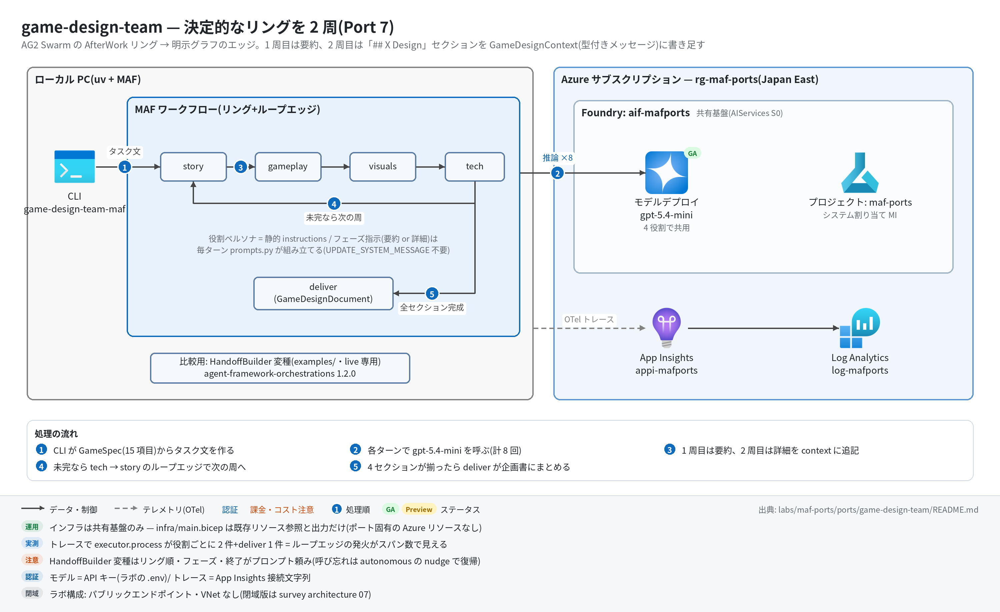

# game-design-team 実行ガイド

> **対象:** `labs/maf-ports/ports/game-design-team/`(Port 7・パターン: Swarm 型ハンドオフのリング+ループエッジ。比較用に HandoffBuilder 変種あり)
> **最終確認:** 2026-09-29 オフライン(30 passed〈`--extra orchestrations` 込み〉・ruff clean・依存 agent-framework-core 1.19.0 / agent-framework-openai 1.14.4 / agent-framework-orchestrations 1.2.0 / openai 3.20.0)/ ライブ: 2026-07-31(主実装のスモーク 1 passed・54 秒。当時の構成。Azure リソースは削除済み — 再デプロイ手順は §5)
> **正は本 Markdown。** 人間用 HTML(同じディレクトリの `runbook.html`)は `python3 labs/tools/build_runbooks.py` で生成する(HTML は直接編集しない)。設計判断と移植の学びは [README](../README.md)。

## 1. このパターンで確かめること

- 4 役割(story → gameplay → visuals → tech)が**リングを 2 周**し、1 周目は 2〜3 文の要約、2 周目は `## X Design` の詳細セクションを書くこと。tech → story の**ループエッジ**が 1 回だけ発火し、4 セクションが揃ったら `deliver` に抜けること(終了は回数でなくデータ条件)。
- 元アプリの「Swarm ハンドオフ」は委譲先が全部ハードコードで、LLM は一度も委譲先を選んでいない → **明示グラフ(MAF core)で決定的に書ける**こと。共有 context は型付きメッセージで Executor が決定的に書き足す(README 学び 1・3)。
- 同じ協調を HandoffBuilder(agent-framework-orchestrations)に載せると、リング順・フェーズ・終了が**プロンプト頼みの確率的な性質**になること(README「HandoffBuilder 比較」・学び 5)。選定基準は「委譲先が仕様で決まるならグラフ、会話で決まるなら handoff 基盤」。

## 2. 構成



| コンポーネント | 役割 | 課金 |
| --- | --- | --- |
| MAF Workflow(ローカル、`workflow.py`) | RoleExecutor ×4 のリング+tech の switch-case(全セクション完成 → deliver / それ以外 → story) | なし |
| モデルデプロイ gpt-5.4-mini(共有基盤) | 4 役割で共用。1 回の実行で 8 回呼ばれる(要約 4+詳細 4) | トークン従量 |
| HandoffBuilder 変種(`handoff_variant.py`+`examples/`、live 専用) | 同じ 4 役割を `handoff_to_*` ツール呼び出しで回す比較実装 | トークン従量(最低 8 回+nudge ぶん) |
| App Insights `appi-<baseName>`(共有基盤) | OTel トレースの送信先 | 取り込み量従量(少量) |

本ポート固有の Azure リソースはない([infra/main.bicep](../infra/main.bicep) は共有基盤の existing 参照と出力だけ)。

## 3. 前提

| 区分 | 必要なもの | 備考 |
| --- | --- | --- |
| ツール | uv(Python は uv が取得。検証は 3.13) | オフライン実行はこれだけ |
| Azure(ライブのみ) | 共有基盤([infra/shared.bicep](../../../infra/shared.bicep))のみ | 課金はモデルのトークンと App Insights の取り込み |
| 権限 | 実行時の認証は **API キー**(`FOUNDRY_API_KEY`)なのでデータプレーンの RBAC 付与は不要。デプロイには RG の共同作成者 | — |

環境変数(`labs/maf-ports/.env`。雛形は [.env.example](../../../.env.example)。**ライブ実行時のみ必要**。本ポート固有の変数はない):

| 変数 | 用途 | 取得元 |
| --- | --- | --- |
| `FOUNDRY_OPENAI_V1_ENDPOINT` | モデルの呼び先(`https://<foundry>.openai.azure.com/openai/v1`) | shared.bicep / main.bicep の出力 `openaiV1Endpoint` |
| `FOUNDRY_MODEL` | モデルのデプロイ名(例: `gpt-5.4-mini`) | shared.bicep の出力 `modelDeploymentName` |
| `FOUNDRY_API_KEY` | Foundry の API キー | `az cognitiveservices account keys list -n aif-<baseName> -g <rg>` |
| `APPLICATIONINSIGHTS_CONNECTION_STRING`(任意) | トレース送信先。未設定ならトレース無効で実行は続く | shared.bicep の出力 `appInsightsConnectionString` |

## 4. オフライン実行(Azure 不要・無料)

```bash
cd labs/maf-ports/ports/game-design-team
uv sync --extra dev --extra orchestrations     # HandoffBuilder 構築テスト用に orchestrations も入れる
uv run pytest                                  # 期待: 30 passed, 1 deselected(ネットワーク不要)
uv run pytest -W error::DeprecationWarning     # 期待: 30 passed
uv run ruff check .                            # 期待: All checks passed!
```

- `uv sync --extra dev` だけなら `26 passed, 1 skipped`(`tests/test_handoff_variant.py` がモジュールごと skip)。`uv sync` は指定しなかった extra をアンインストールするので、使う extra は毎回まとめて指定する。

オフラインテストが固定している主な挙動:

- [ ] リングが AfterWork 順に 2 周し、計 8 ターンで終わる(`test_ring_runs_two_laps_in_afterwork_order`)
- [ ] 1 周目は要約指示、2 周目は詳細セクション指示(原文の typo「You task is write」まで踏襲)(`test_first_lap_uses_summary_instruction` / `test_second_lap_uses_section_instruction` / `test_section_prompt_contains_original_wording_including_typo`)
- [ ] 先行役割の要約が後続のプロンプトに蓄積され、2 周目は全員が 4 要約を見る(`test_summary_accumulates_into_later_prompts` / `test_second_lap_prompts_carry_all_four_summaries`)
- [ ] 成果物は役割順の 4 セクション(`test_document_collects_four_sections_in_role_order`)
- [ ] HandoffBuilder の制約: participants は実 `Agent` 限定(scripted fake は `TypeError`)・全参加者に `require_per_service_call_history_persistence=True` 必須(`tests/test_handoff_variant.py` の 4 件)

## 5. ライブ実行(Azure 必要・課金あり)

### 5.1 デプロイ

```bash
# 共有基盤が未作成なら作る(詳細は labs/maf-ports/README.md「実行の前提」)
cd labs/maf-ports
az group create -n rg-maf-ports -l japaneast
az deployment group create -g rg-maf-ports -f infra/shared.bicep \
  -p baseName=mafports modelName=gpt-5.4-mini modelVersion=2026-03-17 modelCapacity=10
#   モデル名・版は docs/survey/features/02-models.md で現行を確認(上は 2026-09-29 時点の例)

# 本ポートの main.bicep は出力の再掲だけ(リソースを作らない)。.env の値の確認用
cd ports/game-design-team
az deployment group create -g rg-maf-ports -f infra/main.bicep -p baseName=mafports
```

### 5.2 実行

```bash
uv sync --extra dev --extra live
uv run game-design-team-maf                                  # 既定値(Epic fantasy with dragons / RPG / ...)
uv run game-design-team-maf --vibe "Cozy island life" --game-type Simulation \
    --mechanics "Crafting,Exploration" --mood "Peaceful" --depth Medium
uv run game-design-team-maf --json > gdd.json                # spec+task+summaries+sections
uv run pytest -m live                                        # ライブスモーク(depth=Low で 8 ターン)

# HandoffBuilder 変種(比較検証)
uv sync --extra dev --extra live --extra orchestrations
uv run python examples/handoff_builder_variant.py [--vibe ... --game-type ... --goal ...]
```

期待される出力の例(値は実行ごとに変わる。CLI の書式とテストの期待値から作った**形の例**):

```text
$ uv run game-design-team-maf
tracing: App Insights 有効
[story] overview: A young dragon-rider must rekindle the ancient flame ...
[gameplay] overview: ...
[visuals] overview: ...
[tech] overview: ...
[story] section done (2140 chars)
[gameplay] section done (2388 chars)
[visuals] section done (1975 chars)
[tech] section done (2203 chars)
# Game Concept                    ← ここから stdout(Markdown 企画書)

## Story Design
...
## Gameplay Design
...

$ uv run python examples/handoff_builder_variant.py
----- story_agent -----
<要約>
[handoff] story_agent -> gameplay_agent
----- gameplay_agent -----
...
[handoff] visuals_agent -> tech_agent
----- tech_agent -----
## Tech Design ...                ← 会話にこの見出しが出たら終了(termination_condition)
```

## 6. 確認観点

| 確認 | # | 観点 | 確認方法 | 期待結果 |
| --- | --- | --- | --- | --- |
| [ ] | 1 | 正常系: 企画書の生成 | `uv run game-design-team-maf` | stdout に `# Game Concept` と `## Story Design` / `## Gameplay Design` / `## Visuals Design` / `## Tech Design` が**この順で**揃う。終了コード 0 |
| [ ] | 2 | リングとループエッジ | 同じ実行の stderr | `overview:` が story → gameplay → visuals → tech の順に 4 行、続いて `section done` が同じ順に 4 行(= tech → story のループエッジが 1 回だけ発火) |
| [ ] | 3 | 共有 context の効き | `--game-type Simulation --mechanics "Crafting,Exploration" --json` を実行し `summaries` / `sections` を読む | gameplay が story の要約を踏まえ、非戦闘ジャンルで既定の戦闘ループを出さない(`tests/eval_dataset.jsonl` の観点。合否ラインは設けず観察記録) |
| [ ] | 4 | 異常系: 設定不足 | `FOUNDRY_MODEL= uv run game-design-team-maf`(空文字は `.env` で上書きされない) | `error: 環境変数が未設定: FOUNDRY_MODEL(...)` が stderr に出て終了コード 2 |
| [ ] | 5 | 観測: トレース | §7 の KQL | `executor.process story` / `gameplay` / `visuals` / `tech` が**各 2 件**、`executor.process deliver` が 1 件、`invoke_agent *_agent` が計 8 件 |
| [ ] | 6 | パターン固有: HandoffBuilder 変種 | `examples/handoff_builder_variant.py` を実行し stderr の `[handoff]` 行を数える | 正常なら `[handoff]` がリング順に 7 行出て tech の `## Tech Design` で止まる。呼び忘れがあると autonomous mode の nudge で余分なターンが入り、要約と詳細の数え方がずれることがある(主実装との差を記録) |
| [ ] | 7 | HandoffBuilder の構築制約(オフライン) | `uv run pytest tests/test_handoff_variant.py -v`(要 `--extra orchestrations`) | 4 passed(fake は `TypeError`、フラグなし Agent は `build()` で `ValueError`) |
| [ ] | 8 | コスト・後片付け | 1 回の主実装 = モデル呼び出し 8 回。変種は最低 8 回で、handoff を呼ばない応答が続くと 1 エージェントあたり既定 50 ターンまで autonomous に続く | 変種は 1 回ずつ試す(example は `--depth` を受けず既定の Low で走る)。使い終わったら §8 |

## 7. トレース・評価の確認

```bash
az monitor app-insights query --app appi-mafports -g rg-maf-ports \
  --analytics-query "dependencies | where timestamp > ago(30m) | where name startswith 'executor.process' or name startswith 'invoke_agent' | summarize count() by name | order by name asc"
```

- 期待(主実装 1 回ぶん): `executor.process story` 2 / `executor.process gameplay` 2 / `executor.process visuals` 2 / `executor.process tech` 2 / `executor.process deliver` 1、`invoke_agent story_agent` 2 など計 8。**ループエッジの発火がスパン数にそのまま出る**のが本ポートの見どころ。
- HandoffBuilder 変種は `invoke_agent <role>_agent` が発話回数ぶん並び、nudge が入った役割だけ 3 件以上になる。
- 評価を回すなら `--json` の `sections` を役割ごとに Foundry の Task Adherence / Coherence 評価器にかける(README「評価」)。
- 取り込みには数分の遅延がある。0 件なら CLI の最初の行に `tracing: App Insights 有効` が出たかを確認。

## 8. 片付け

```bash
az group delete -n rg-maf-ports --yes --no-wait   # 本ポート固有のリソースはないので、共有基盤を使い終わったら RG ごと削除
```

## 9. トラブルシューティング

| 症状 | 原因 | 対処 |
| --- | --- | --- |
| `26 passed, 1 skipped`(`could not import 'agent_framework_orchestrations'`) | orchestrations extra 未導入 | `uv sync --extra dev --extra orchestrations` |
| `uv run pytest` で pytest が見つからない | 直前の `uv sync` で dev extra を指定しなかった(指定外の extra は削除される) | 使う extra をまとめて `uv sync --extra dev --extra live --extra orchestrations` |
| `error: 環境変数が未設定: ...`(終了コード 2) | `labs/maf-ports/.env` が無い / 値が空 | `.env.example` をコピーして shared.bicep の出力を転記 |
| 401 / 404(DeploymentNotFound) | API キーの誤り / `FOUNDRY_MODEL` とデプロイ名の不一致 | キーを取り直す。デプロイ名は shared.bicep の出力 `modelDeploymentName` |
| `RuntimeError: deliver: セクション未完成のまま到達` / `要約もセクションも記入済みの context を受信` | リングの配線か終了条件を変更して壊した(通常の実行では起きない) | `workflow.py` の switch-case と `all_sections_done()` を確認。オフラインテストで再現できる |
| 変種が `[request_info] ユーザー入力要求 — one-shot 実行のため終了` で止まる | あるエージェントが handoff を呼ばない応答を autonomous の上限(既定 50 ターン)まで続けた | 主実装との差として記録する(プロンプトで呼び出しを促すしかない = 学び 5)。`with_autonomous_mode(turn_limits=...)` で上限を下げるとコストを抑えられる |
| 変種の出力が細切れに見える | 2026-09-29 より前の example(ストリーミング断片ごとに見出しを出していた) | 最新の `examples/handoff_builder_variant.py` を使う |

## 10. 関連・更新履歴

- 設計判断と学び: [README](../README.md)(AG2 Swarm → MAF 対応表・HandoffBuilder 比較・Wave 1 handoff 系の総括)
- 協調パターンの分水嶺(グラフ / handoff / agent-as-tool): [tech-selection-guide 1-1](../../../../../docs/tech-selection-guide.md) / [architecture/11 判断フレームワーク](../../../../../docs/survey/architecture/11-decision-frameworks.md)
- 関連ポート: [research-handoff(Port 3)](../../research-handoff/README.md)・[services-agency(Port 13)](../../services-agency/docs/runbook.md)

| 日付 | 内容 |
| --- | --- |
| 2026-09-29 | 初版(agent-framework-core 1.13→1.19 / orchestrations 1.0.2→1.2.0 / openai 2.51→3.20 に更新、`src/` は変更なし。HandoffBuilder 不採用の理由を 1.2.0 で再確認し結論維持。example の表示を修正。図を v2〈日本語+処理順〉に更新) |
