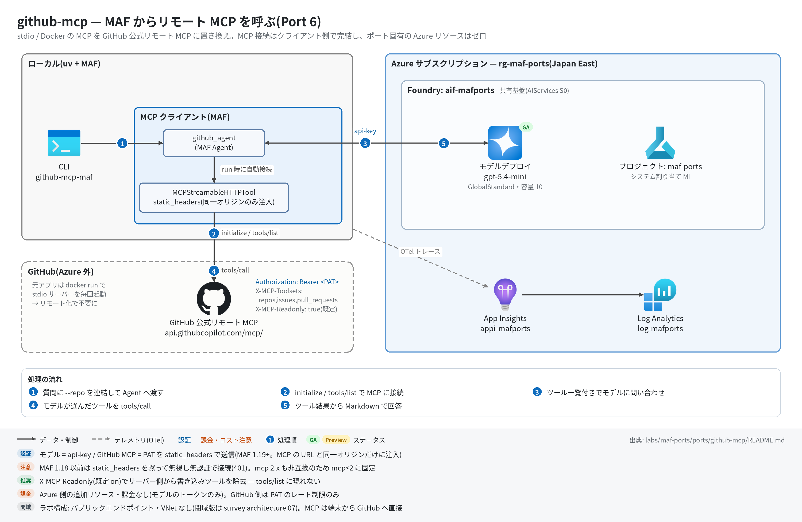

# github-mcp 実行ガイド

> **対象:** `labs/maf-ports/ports/github-mcp/`(Port 6・パターン: リモート MCP — MAF クライアントから GitHub 公式リモート MCP サーバーへ streamable HTTP 接続)
> **最終確認:** 2026-09-29 オフライン(21 passed・`ruff check .` clean・依存 agent-framework-core 1.19.0 / agent-framework-openai 1.14.4 / openai 3.20.0 / mcp 1.30.0)/ ライブ: 2026-07-31(当時の構成 core 1.13.0 / mcp 1.29.0、PAT は自前 httpx クライアントのヘッダー。**2026-09-29 に `static_headers` へ切り替えた後のライブは未実施**。Azure リソースは削除済み — 再デプロイ手順は §5)
> **正は本 Markdown。** 人間用 HTML(同じディレクトリの `runbook.html`)は `python3 labs/tools/build_runbooks.py` で生成する(HTML は直接編集しない)。設計判断と移植の学びは [README](../README.md)。

## 1. このパターンで確かめること

- Docker(stdio)なしで、GitHub 公式リモート MCP サーバー(`https://api.githubcopilot.com/mcp/`)に PAT ヘッダー付きで接続し(initialize / tools/list)、エージェントがそのツール(`list_issues` / `search_pull_requests` など)を呼んで実データに基づく Markdown 回答を返すこと。
- 元アプリの環境変数(`GITHUB_PERSONAL_ACCESS_TOKEN` / `GITHUB_TOOLSETS`)が **HTTP ヘッダー**(`Authorization: Bearer` / `X-MCP-Toolsets`)に移り、`X-MCP-Readonly: true`(既定 on)でサーバー側から書き込みツールが消えること。
- 技術選定上の意味: MCP 呼び出しの実行点と秘密の置き場所がクライアント側(開発者マシン / 自前ランタイム)にある構成。Foundry Agent Service の MCP ツールや Toolbox(GA)に寄せると PAT をサービス側の接続に移せる(README の学び 3 と「今後の選択肢」)。

## 2. 構成



```text
質問(+ --repo)─▶ build_full_query("{質問} in {repo}")
             ─▶ github_agent(MAF Agent)────────────────▶ Responses API(共有基盤のモデル、api-key)
                   └─ MCPStreamableHTTPTool("github", https://api.githubcopilot.com/mcp/)
                        └─ static_headers: Authorization / X-MCP-Toolsets / X-MCP-Readonly(同一オリジンのみ注入)
             ─▶ tools/call(list_issues / search_pull_requests / ...)× n ─▶ Markdown 回答
```

| コンポーネント | 役割 | 課金 |
| --- | --- | --- |
| CLI / `query.run_query`(ローカル) | リポジトリ連結と 120 秒タイムアウト(元アプリと同値) | なし |
| MAF `Agent` github_agent(`agents.py`) | `OpenAIChatClient`(Responses API)。MCP ツールは `agent.mcp_tools` に分離保持され、`async with agent:` で接続・切断 | — |
| モデルデプロイ(共有基盤、既定 gpt-5.4-mini) | ツール選択と回答生成 | トークン従量 |
| `MCPStreamableHTTPTool`(`tools.py`) | リモート MCP への streamable HTTP クライアント。HTTP クライアントはツールが生成・破棄(タイムアウト 30 秒 / SSE 300 秒) | なし |
| GitHub 公式リモート MCP サーバー(GitHub ホスト、GA) | GitHub API をツールとして公開 | なし(PAT のレート制限のみ) |
| App Insights(共有基盤) | OTel トレースの送信先(任意) | 取り込み量従量 |

## 3. 前提

| 区分 | 必要なもの | 備考 |
| --- | --- | --- |
| ツール | uv(Python 3.11 以上。uv が取得。検証は 3.13)| オフライン実行はこれだけ |
| ツール(ライブ) | GitHub CLI(`gh auth login` 済み)または PAT | 2026-07-31 は `gh auth token`(gh の OAuth トークン)で接続実績あり |
| Azure(ライブのみ) | 共有基盤([infra/shared.bicep](../../../infra/shared.bicep))のみ。本ポート固有のリソースはない | モデルのトークン従量+トレース取り込み |
| 権限 | モデル呼び出しは api-key なので**データプレーンの RBAC は不要**。GitHub 側は対象リポジトリの読み取り権限(公開リポジトリなら通常の PAT で可) | roles.bicep(MI 向け)も本ポートには不要 |
| ネットワーク(ライブのみ) | `api.githubcopilot.com` への外向き HTTPS | 社内プロキシで SSE / 長時間接続が切られると tools/call が失敗する |

環境変数(`labs/maf-ports/.env`。雛形は `.env.example`。**ライブ実行時のみ必要**。読み込み順はカレントの `.env` → lab ルートの `.env` で、既にシェルにある値が優先):

| 変数 | 用途 | 取得元 |
| --- | --- | --- |
| `FOUNDRY_OPENAI_V1_ENDPOINT` | モデル呼び出し先(`https://<foundry>.openai.azure.com/openai/v1`)。必須 | shared.bicep の出力 `openaiV1Endpoint` |
| `FOUNDRY_MODEL` | モデルデプロイ名(既定 gpt-5.4-mini)。必須 | shared.bicep の出力 `modelDeploymentName` |
| `FOUNDRY_API_KEY` | api-key 認証。必須 | `az cognitiveservices account keys list -n <foundryName> -g <rg> --query key1 -o tsv` |
| `GITHUB_TOKEN` | リモート MCP の PAT(`Authorization: Bearer`)。必須。`.env` に書かずシェルで渡すのを推奨 | `export GITHUB_TOKEN="$(gh auth token)"` または PAT を発行 |
| `GITHUB_MCP_URL` | 接続先。任意(既定 `https://api.githubcopilot.com/mcp/`) | — |
| `GITHUB_TOOLSETS` | `X-MCP-Toolsets` の値。任意(既定 `repos,issues,pull_requests` — 元アプリと同値)。空文字でヘッダーを送らない | — |
| `GITHUB_MCP_READONLY` | `X-MCP-Readonly`。任意(既定 true。`false` / `0` / `no` / `off` で解除) | — |
| `APPLICATIONINSIGHTS_CONNECTION_STRING` | トレース送信先。任意(未設定ならトレース無効で実行は続く) | shared.bicep の出力 `appInsightsConnectionString` |

## 4. オフライン実行(Azure 不要・無料)

```bash
cd labs/maf-ports/ports/github-mcp
uv sync --extra dev
uv run pytest            # 期待: 21 passed, 1 deselected(live は既定で除外。ネットワーク不要)
uv run ruff check .      # 期待: All checks passed!(図スクリプト docs/architecture.py を含む)
```

オフラインテストが固定している主な挙動:

- [ ] ヘッダーの対応: PAT → `Authorization: Bearer`、`GITHUB_TOOLSETS` → `X-MCP-Toolsets`、readonly → `X-MCP-Readonly: true`(off / 空なら送らない)(`test_build_headers_*`)
- [ ] ツールは `static_headers` で組み立てられ、自前 `http_client` は渡さない。`load_prompts=False`(`test_tool_cls_injection_receives_name_url_and_static_headers`)
- [ ] **接続段階(initialize / tools/list)にも 3 ヘッダーが載る** — httpx MockTransport のスタブ MCP サーバーで検証(`test_static_headers_reach_initialize_and_tools_list`。旧版の「header_provider では接続時 401」の回帰防止)
- [ ] MCP ツールは `agent.mcp_tools` に分離保持され、instructions は元アプリ原文(`test_agent_holds_mcp_tool_separately_from_plain_tools` / `test_agent_instructions_match_original_app`)
- [ ] `--repo` は質問文に含まれないときだけ ` in <repo>` を連結、既定タイムアウト 120 秒、空応答は例外にしない(`test_repo_is_*` / `test_default_timeout_matches_original_app` / `test_run_query_empty_reply_returns_empty_string`)
- [ ] `GITHUB_TOKEN` 欠落時のエラーに `gh auth token` の案内が出る(`test_missing_github_token_mentions_gh_auth_token`)

## 5. ライブ実行(Azure 必要・課金あり)

### 5.1 デプロイ

```bash
# 共有基盤が未作成なら先に作る(→ labs/maf-ports/infra/docs/runbook.md)。本ポート固有のリソースはない。
# 任意: 共有基盤の存在確認とエンドポイント取得(existing 参照+出力のみのテンプレート)
cd labs/maf-ports/ports/github-mcp
az deployment group create -g <rg> -f infra/main.bicep -p baseName=<baseName> \
  --query properties.outputs -o json   # 期待: openaiV1Endpoint / projectEndpoint が返る
```

### 5.2 実行

```bash
uv sync --extra dev --extra live          # live = azure-monitor-opentelemetry(トレース送信)
export GITHUB_TOKEN="$(gh auth token)"    # または PAT
uv run github-mcp-maf --repo microsoft/agent-framework "Show me recent merged PRs"
uv run github-mcp-maf "Find issues labeled as bugs in microsoft/agent-framework"
uv run pytest -m live                     # ライブスモーク(1 passed が期待。2026-07-31 は 18.8 秒)
```

期待される出力の例(値は実行ごとに変わる。PR の中身は実リポジトリの状態次第):

```text
tracing: App Insights 有効                                                    ← stderr(任意)
[mcp] https://api.githubcopilot.com/mcp/ (toolsets=repos,issues,pull_requests, readonly=on)   ← stderr
## Recently merged PRs in microsoft/agent-framework                            ← stdout(Markdown)
| # | Title | Merged | Link |
| --- | --- | --- | --- |
| 1234 | ... | 2026-09-.. | https://github.com/microsoft/agent-framework/pull/1234 |
```

終了コードは 正常 0 / 環境変数不足 2 / タイムアウト 1(`error: request timed out after 120 seconds`)。MCP 接続の失敗(401 など)は `ToolException`(`MCP server failed to initialize: ...`)のトレースバックで終わる。

## 6. 確認観点

| 確認 | # | 観点 | 確認方法 | 期待結果 |
| --- | --- | --- | --- | --- |
| [ ] | 1 | 正常系: リモート MCP 経由の回答 | §5.2 の 1 本目 | stderr に `[mcp] ... readonly=on`、stdout にマージ済み PR のタイトルと `https://github.com/...` リンク(表形式が多い)。捏造でなく実在の PR 番号 |
| [ ] | 2 | パターン固有: `static_headers` での接続(2026-09-29 の改修点) | `uv run pytest -m live` | 1 passed。テスト内で `tool.is_connected` と `tool.functions`(非空)を確認している = PAT 付きで initialize / tools/list が通った。**切り替え後の初回ライブで必ず確認する** |
| [ ] | 3 | 読み取り専用ガード | `uv run github-mcp-maf --repo microsoft/agent-framework "Close issue #1"` | 書き込みは実行されず、書き込みツールが公開されていない旨の説明+代替案。§7 のトレースで `tools/call` に create / update / close 系が 1 件もない |
| [ ] | 4 | ツール面の絞り込み | `GITHUB_TOOLSETS=repos uv run github-mcp-maf "Find issues labeled as bugs in microsoft/agent-framework"` | issues 系ツールが tools/list に現れないため、issue を列挙できない旨の回答になる(または repos 系だけで答える)。`tools/list` の結果が既定より少ない |
| [ ] | 5 | 異常系: トークン未設定 | `GITHUB_TOKEN= uv run github-mcp-maf x`(空文字はシェル側の値が優先され .env で上書きされない) | 終了コード 2、stderr に `error: 環境変数が未設定: GITHUB_TOKEN(labs/maf-ports/.env を確認。GITHUB_TOKEN は …` で始まり、`gh auth token` での取得方法が案内される |
| [ ] | 6 | 異常系: 無効なトークン | `GITHUB_TOKEN=ghp_invalid uv run github-mcp-maf --repo microsoft/agent-framework "hi"` | initialize が 401 で失敗し `ToolException: MCP server failed to initialize ...` で終了(モデルは呼ばれない。ライブ未確認) |
| [ ] | 7 | 異常系: タイムアウト | `uv run github-mcp-maf --timeout 5 --repo microsoft/agent-framework "Show repository health metrics and activity patterns"` | 終了コード 1、`error: request timed out after 5 seconds` |
| [ ] | 8 | 観測: トレース着信 | §7 の KQL | `invoke_agent github_agent` / `chat <デプロイ名>` / `initialize` / `tools/list` / `tools/call <ツール名>` / `execute_tool <ツール名>` が出る |
| [ ] | 9 | コスト・後片付け | ポータルのデプロイのトークンメトリック。テスト用に PAT を発行した場合は GitHub 側で失効 | Azure 側の追加リソース・課金はゼロ(モデルのトークンのみ)。1 質問 = chat 2〜6 回程度(ツール往復回数次第) |

## 7. トレース・評価の確認

```bash
# スパン名ごとの件数(送信から着信まで数分かかることがある)
az monitor app-insights query --app appi-<baseName> -g <rg> \
  --analytics-query "dependencies | where timestamp > ago(30m) | summarize count() by name"

# どの MCP ツールが呼ばれたか
az monitor app-insights query --app appi-<baseName> -g <rg> \
  --analytics-query "dependencies | where timestamp > ago(30m) and name startswith 'tools/call' | summarize count() by name"
```

- 期待するスパン名(agent-framework-core 1.19.0 のソースで確認。MCP スパンは `{mcp.method.name} {target}` 形式の CLIENT スパン): `invoke_agent github_agent` / `chat <デプロイ名>` / `initialize` / `tools/list` / `tools/call list_issues` など / `execute_tool list_issues` など。azure-monitor-opentelemetry 1.8.10 は httpx を既定で計装するため、`api.githubcopilot.com` と Responses API への HTTP 呼び出しも依存関係として並ぶ(1.8.9 時代のライブより行が増える。名前はライブ未確認)。
- 評価: [tests/eval_dataset.jsonl](../tests/eval_dataset.jsonl)(5 ケース: Issues / PRs / Repository Activity / レビュー待ち PR / readonly ガード)。回答は実リポジトリに依存するため期待値は traits(実データ準拠・リンク付与・表形式・捏造なし)で記述。上の `tools/call` の列と突き合わせる。クラウド評価の実装はない。

## 8. 片付け

```bash
# 本ポート固有のリソースはない。共有基盤ごと消す場合:
az group delete -n <rg> --yes --no-wait
unset GITHUB_TOKEN   # シェルに残したトークンを消す
```

- `.env` に PAT を書いた場合は削除する(共有 `.env` は全ポートが読む)。

## 9. トラブルシューティング

| 症状 | 原因 | 対処 |
| --- | --- | --- |
| `error: 環境変数が未設定: GITHUB_TOKEN ...`(終了コード 2) | トークン未設定 | `export GITHUB_TOKEN="$(gh auth token)"` |
| `MCP server failed to initialize: 'InitializeResult' object has no attribute 'protocolVersion'` | mcp 2.x が入った(agent-framework-core 1.19 は mcp 1.x 前提) | pyproject の `mcp>=1.30,<2` を外していないか確認し `uv sync --extra dev` |
| `MCP server failed to initialize`(401 / 403) | PAT が無効・期限切れ・権限不足 | `gh auth status` で確認、トークンを再取得 |
| PAT は正しいのに initialize が 401 | agent-framework-core が 1.19 未満(1.18 以前の `MCPStreamableHTTPTool` は未知の引数を `**kwargs` で黙って捨てるため、`static_headers` が無視されて**無認証で接続**する) | `uv sync --extra dev`(pyproject の下限は 1.19)。オフラインの `test_static_headers_reach_initialize_and_tools_list` が落ちるのが検知の目印 |
| `error: request timed out after 120 seconds` | ツール往復が多い質問 / GitHub 側の遅延 | `--timeout 300` で再実行、質問を絞る |
| 401 / `invalid api key`(モデル側) | `FOUNDRY_API_KEY` の誤り、または `disableLocalAuth: true` | キーを再取得。共有基盤は `disableLocalAuth: false` が前提 |
| 回答が「ツールがない」と言う | `GITHUB_TOOLSETS` で必要な toolset を外している / readonly で書き込み系が消えている(想定どおり) | 既定の `repos,issues,pull_requests` に戻す |
| KQL で MCP スパンが 0 件 | 着信遅延 / `--extra live` 未導入 / 別の App Insights を見ている | 数分待つ。`uv sync --extra dev --extra live` と接続文字列を確認 |

## 10. 関連・更新履歴

- 設計判断と学び(`static_headers` への切り替え理由、mcp<2 の上限ピン、Toolbox という今後の選択肢): [README](../README.md)
- 共有基盤(デプロイ・.env・削除): [共有基盤の実行ガイド](../../../infra/docs/runbook.md)
- MCP / Toolbox の機能状況: [features/04-tools-knowledge.md](../../../../../docs/survey/features/04-tools-knowledge.md)
- 前後のパターン: [travel-memory(Port 5・Foundry Memory)](../../travel-memory/docs/runbook.md) / [data-analysis-ci(Port 8・Code Interpreter)](../../data-analysis-ci/docs/runbook.md)

| 日付 | 内容 |
| --- | --- |
| 2026-09-29 | 初版(依存を agent-framework-core 1.19.0 / openai 3.20.0 / mcp 1.30.0 に更新。PAT の載せ方を自前 httpx クライアントから `static_headers` に改修。mcp 2.2.0 は引き続き非互換を実測。構成図を v2(日本語・処理順バッジ・タグ付き注記)に更新し、図スクリプトも ruff clean に) |
