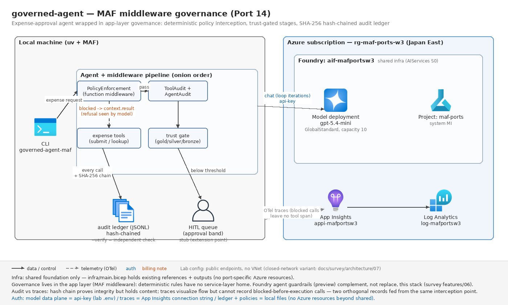

# governed-agent — ガバナンス層 2 本を MAF middleware に統合移植(Port 14)

元(2 本を 1 つの題材アプリに統合):

- [`advanced_ai_agents/single_agent_apps/ai_agent_governance`](https://github.com/Shubhamsaboo/awesome-llm-apps/tree/main/advanced_ai_agents/single_agent_apps/ai_agent_governance)(約 600 行。ツール実行前に決定論ポリシーを強制するガバナンス層)
- [`advanced_ai_agents/multi_agent_apps/trust_gated_agent_team`](https://github.com/Shubhamsaboo/awesome-llm-apps/tree/main/advanced_ai_agents/multi_agent_apps/trust_gated_agent_team)(約 650 行。信頼スコアゲート付き逐次チーム+ハッシュ連鎖監査)

Wave 3 のポート。核心は **MAF の middleware サーフェス(agent / chat / function の 3 種)でガバナンス層を実装する**こと — Wave 1-2 で未検証だった唯一の主要拡張点。題材は経費精算エージェント(申請 → 検査 → 承認)で、(1) ツール実行前の決定論ポリシー、(2) 段間の信頼スコアゲート+HITL、(3) 全操作のハッシュ連鎖監査、の 3 機構を 1 本に束ねた。

## 元の構成(5行)

- **ai_agent_governance**: ツールをデコレータ(`governed_tool`)で包み、実行前に `PolicyEngine`(YAML 定義のルール列: filesystem / network / rate limit / 承認必須)を評価。判定は 3 値(ALLOW / DENY / REQUIRE_APPROVAL)で、DENY は `PolicyViolation` 例外、承認は `input()` の対話プロンプト。全判定を audit log(平文リスト)へ記録
- LLM 面は「ツール呼び出しをテキストで書かせて正規表現でパース」という手作りループ(function calling 未使用)
- **trust_gated_agent_team**: Researcher → Analyst → Writer の逐次パイプライン。各エージェントは registry の静的信頼スコア(0-100、gold/silver/bronze 階層)を持ち、閾値未満は**参加前にブロック**
- 全アクション(信頼検証・各段の実行)を SHA-256 ハッシュ連鎖(`prev_hash` + 全フィールド)の `AuditTrail` に記録し、`verify_chain()` で改ざん検知。JSON エクスポートは単独で再検証可能
- UI は Streamlit(スコアのスライダー・監査チェーンビューア)。LLM は OpenAI 直

## 実装前調査の結果(2026-07、installed package `agent_framework` 1.13.0 の `_middleware.py`(1,567 行)+ `_tools.py` / `_agents.py` / `_clients.py` 精読)

### middleware は 3 種(介入面)× 2 形態(クラス/関数)

| 種類 | 包む単位 | context | 発火頻度(実測) |
| --- | --- | --- | --- |
| `AgentMiddleware` | `agent.run` 全体 | `AgentContext`(agent / messages / session / tools / options / stream / metadata / result) | run につき 1 回 |
| `ChatMiddleware` | モデル呼び出し | `ChatContext`(client / messages / options / result ...) | **function-calling ループの各反復ごと** |
| `FunctionMiddleware` | ツール呼び出し 1 件 | `FunctionInvocationContext`(function / arguments / metadata / result / **tools**=実行中 run の生ツールリスト) | ツール呼び出しごと |

- 全種とも `async def process(context, call_next)` のオニオン合成。**戻り値は使わずすべて context 経由**(`call_next()` は None を返す)
- 形態は (a) ABC 継承クラス、(b) 素の async 関数。関数形態の種別判定は「デコレータ(`@function_middleware` 等)」または「第 1 引数の型注釈名」— **`from __future__ import annotations` 下では注釈が文字列になり型注釈判定が壊れる**(`MiddlewareException` で即死)。既知の罠 3(c) の middleware 版。デコレータ明示が安全(test_middleware.py で再現を固定)
- 登録は `Agent(middleware=[...])`(基底)と `run(middleware=[...])`(実行時)の 2 層で、`categorize_middleware` が 3 種に自動仕分け。**agent 種は Agent 側のパイプライン、function/chat 種は実行時に `client_kwargs["middleware"]` としてチャットクライアントへ転送される**(`AgentMiddlewareLayer.run` → `FunctionInvocationLayer` / `ChatMiddlewareLayer`)。リスト内の同種 middleware は列挙順 = 外→内

### short-circuit は 2 方式で、意味がまったく違う(本ポートの分岐点)

1. **`context.result` をセットして `call_next()` を呼ばず return**: FunctionMiddleware ではその値が `Content.from_function_result` に包まれて**そのままツール結果としてモデルに渡り**、ツール本体は実行されず、**ループは続行**する(モデルは拒否理由を説明できる)。ポリシー拒否はこちら
2. **`MiddlewareTermination` を raise**: agent/chat パイプラインは `execute()` が suppress して後処理スキップだが、**function パイプラインは意図的に suppress しない**(`_tools.py` に "MiddlewareTermination bubbles up to signal loop termination" と明記)— function-calling ループ全体が停止し、次のモデル呼び出しは発生しない。`exc.result` に詰めた値は messages に function_result として残るが最終応答は空。暴走停止・予算超過のkill switch 用

### その他の発見

- `FunctionInvocationContext.arguments` は**検証済みの素の dict**(pydantic input_model で validate 済み)— ポリシー判定に十分
- `context.metadata` は同一パイプライン内の middleware 間共有 dict。フレームワーク自身も `call_id` / `approval_response` をここに載せる(→ ポリシー判定を監査 middleware へ渡すのに使用)
- `FunctionInvocationContext.tools` は実行中 run の**生ツールリスト**(experimental)。`add_tools` / `remove_tools` で次反復から動的に増減できる(progressive tool exposure)— 本ポート未使用だが「違反を繰り返すツールを run 途中で剥奪する」拡張点
- MAF ネイティブの承認フロー `@tool(approval_mode="always_require")` が既にある。ただし**ツール単位の静的宣言**で、「金額 $1,000 超だけ承認必須」のような**引数依存の動的判定**は表現できない → 本ポートは FunctionMiddleware + 自前キューで実装(hitl.py)
- チャットクライアントの層合成は `FunctionInvocationLayer → ChatMiddlewareLayer → (Telemetry) → BaseChatClient` の MRO。**この合成を自前クラスで再現すれば、scripted なチャットクライアントの上で本物の function-calling ループ+middleware パイプラインが回る** → オフラインテスト戦略の根拠(下記)

## 移植後の構成



```
経費申請テキスト
  │
  ▼ intake Agent(構造化出力 ExpenseClaim)────────┐
  ▼ 信頼ゲート①(決定論: 欠落・領収書・不確定で減点)│ スコア < 閾値
  ▼ inspector Agent(構造化出力 InspectionReport)──┤──▶ 人間承認キュー
  ▼ 信頼ゲート②(決定論: 確信度・所見の重さで減点)─┘    (HITL スタブ)
  ▼ approver Agent + ツール束
  │    middleware(外→内):
  │      AgentAuditMiddleware      … run 全体を監査連鎖へ
  │      ToolAuditMiddleware       … 全ツール呼び出し(遮断含む)を監査連鎖へ
  │      PolicyEnforcementMiddleware … 決定論ルール(許可リスト/営業時間/金額)
  │         ├ ALLOW → ツール実行(台帳に支払い)
  │         ├ DENY → 構造化拒否をツール結果として返す(実行せず・ループ続行)
  │         └ REQUIRE_APPROVAL → HITL チケット発行+保留を返す
  ▼
CaseResult(status / 信頼スコア / 支払い / チケット / 監査連鎖の検証結果)

横串: AuditTrail(SHA-256 ハッシュ連鎖)= 全 agent_run・全 tool・全ゲート判定・
      ケース開閉を 1 本の連鎖に記録。verify_entries() は dict 列だけで動く
      独立検証関数(CLI --verify でエクスポート JSON を後日検証できる)
```

### 元 → MAF 対応表

| 元 | 移植後 | 備考 |
| --- | --- | --- |
| `governed_tool` デコレータ(実行前検査) | `PolicyEnforcementMiddleware`(FunctionMiddleware) | 介入点がアプリ定義の wrapper → フレームワークの正式サーフェスへ |
| `PolicyEngine`(YAML ルール列・最初の確定判定が勝つ) | `PolicyEngine`(dataclass 設定・同じ first-terminal-wins) | filesystem/network → 経費ドメインの許可リスト/営業時間/金額に移設。rate limit は原理同一のため省略 |
| `PolicyViolation` 例外(DENY でループ破壊) | 構造化拒否をツール結果として返す short-circuit | モデルが拒否理由をユーザーに説明できる(下記 学び 1) |
| `input()` による対話承認(REQUIRE_APPROVAL) | `ApprovalQueue`(HITL スタブ、チケット発行) | 非対話 CLI 前提。MAF ネイティブ `approval_mode` は静的すぎて不採用(調査結果参照) |
| `TrustRegistry`(エージェントの静的スコアで参加前ブロック) | 段の**出力**の決定論検査でスコア化+閾値未満はエスカレーション | 「誰を信じるか」→「この出力を次段に渡すか」への意味の移動(設計判断) |
| gold/silver/bronze 階層(60/40/20) | `score_to_tier` そのまま | 挙動互換 |
| `AuditTrail`(SHA-256 連鎖+verify_chain) | `audit.py` ほぼ直訳 | `trust_score: int` → 汎用 `detail: str`(ポリシー判定と信頼判定を同じ連鎖に載せる)。検証をモジュール関数化し JSON 単独で再検証可能に |
| Researcher→Analyst→Writer(自由文リレー) | intake→inspector→approver(型付き構造化出力リレー) | 段間が `ExpenseClaim` / `InspectionReport` の型で繋がる |
| 手作りツール呼び出しパース(`TOOL: name(...)` を regex) | MAF の function-calling ループ | 元の最脆弱部が丸ごと消える |
| Streamlit UI(スライダー・チェーンビューア) | CLI 化(`--threshold` / `/audit` / `--verify`) | PORTING.md 規約 |

## 設計判断

### fake の注入点を「エージェント境界」から「チャットクライアント境界」へ一段下げた

他ポートのオフラインテストは `SupportsRun` の scripted fake で **Agent ごと**差し替えてきた(罠 12)。本ポートの検証対象は Agent の内側にある middleware パイプラインなので、それでは肝心の機構がテストから消える。調査で層合成(`FunctionInvocationLayer + ChatMiddlewareLayer + BaseChatClient`)を確認し、`ScriptedChatClient`(conftest.py、約 30 行)を同じ合成で組んだ結果、**実 `Agent` + 本物の function-calling ループ + 本物の middleware パイプライン**がネットワークなしで回る。「ポリシー違反のツールが実行されない」ことを、モック越しでなく実機構+台帳の生記録(`ledger.executed_calls`)で証明できる。

### DENY は例外ではなく「構造化拒否のツール結果」

元 ai_agent_governance は DENY で例外を投げてエージェントループを壊し、拒否理由は人間側のログにしか残らなかった。MAF の short-circuit は拒否をツール結果としてモデルに返せるので、**モデル自身が「AMT-001 により実行されませんでした」と説明して会話を続ける**。`MiddlewareTermination` は「説明の機会を与えず止める」kill switch として意味が別(テストで両方の挙動を固定)。

### 監査 middleware はポリシー middleware の外側

合成順 `[ToolAudit, PolicyEnforcement]`(列挙順=外→内)により、**遮断された呼び出しも監査連鎖に載る**。判定内容は `context.metadata`(middleware 間共有)で内→外に受け渡す。連鎖には生の入出力を置かずハッシュのみ(元と同じ)— 内容の追跡はトレースの仕事、連鎖は順序と非改ざんの証明(学び 4)。

### 信頼スコアの意味を「エージェントの属性」から「出力の検査結果」へ

元の registry(Writer=45 点、rogue-bot=5 点)はデモとしては良いが、静的スコアは「そのエージェントを使うか」という設計時判断で、実行時ゲートの題材として弱い。移植では段のベーススコア(intake 75 / inspection 70 — 元 registry の Researcher/Analyst に対応)から**出力の決定論検査**(欠落項目・領収書なし・低確信・critical 所見)で減点する方式にした。ゲートに落ちた段は先へ進まず HITL キューへ — 「低信頼はブロック」から「低信頼は人間へ」に更新。閾値・階層境界は元の互換。

### 最終ステータスは 2 経路で導出し、一致をテストで固定

実行経路(approver のツール呼び出しが台帳・キュー・監査連鎖に残した副作用から導出)と、決定論経路(`adjudicate()` 純関数)。eval_dataset.jsonl は決定論経路を駆動し、test_pipeline が両経路の一致を検証する。ライブで検証すべき残余は「申請テキストから期待の claim / inspection が出るか」だけに縮む(Port 12 と同じ縮約戦略)。

## アプリ層ガバナンス vs Foundry ガードレール(プレビュー)の対比

[docs/survey/features/06-safety-guardrails.md](../../../../docs/survey/features/06-safety-guardrails.md) の調査に基づく整理。**本ポートの実構成は自前 middleware のみで、ガードレールの実機検証はスコープ外**(tech-selection-guide「未検証領域」のまま)。

| 観点 | 自前 middleware(本ポート/アプリ層) | Foundry ガードレール(サービス層) |
| --- | --- | --- |
| 成熟度 | GA の SDK 機能(agent-framework 1.x) | モデル向け GA / **エージェント向け+コントロールと介入はプレビュー** |
| 介入ポイント | agent run / モデル呼び出し / ツール呼び出しの 3 面(コードで任意) | User input / **Tool call(プレビュー)** / **Tool response(プレビュー)** / Output の 4 点 |
| 判定の中身 | **任意の決定論ロジック**(金額上限・営業時間・許可リスト等の業務ルール) | Content Safety 分類器ベース(有害・Prompt Shields・PII・Task adherence 等)。**業務ルールは書けない** |
| アクション | 任意(構造化拒否・HITL キュー・kill switch・書き換え) | Annotate / Annotate and block の 2 択 |
| 適用範囲 | この MAF アプリのプロセス内のみ。**アプリを迂回した API 直叩きには無力** | デプロイ/エージェント単位でサービス側に強制。迂回不可。レイテンシ約 50-100ms/介入点 |
| 構成サーフェス | コード(テスト可能・バージョン管理可能) | 新ポータル(Build > Guardrails)+ REST(ARM の RAI policy)。CLI/SDK の管理面は現状記載なし |
| 落とし穴 | プロセス内で完結する分、組織的強制力がない | エージェントに明示割当てするとモデル側設定を**完全上書き**(Tool call/response のコントロール漏れ = 未スキャン経路) |

結論: 両者は代替ではなく**積層**。有害性・注入攻撃・PII はサービス層(ガードレール)に寄せ、**決定論の業務ポリシー(本ポートの 3 ルールすべて)と監査・HITL はアプリ層にしか置けない**。Tool call 介入点(プレビュー)が GA しても、判定語彙が Content Safety 系である限りこの分担は変わらない — SI 提案では「ガードレールがあるからアプリ層ガバナンス不要」という誤読を防ぐのが要点。

## 実行

```bash
uv sync --extra dev
uv run pytest            # オフライン(ネットワーク不要・65 件)

# --- ライブ(要 共有基盤 + ../../.env)---
uv run governed-agent-maf --request "Client dinner \$180 on 2026-07-24, receipt RCPT-2201, employee E-1042, sales, meals."
uv run governed-agent-maf --script tests/data/expense_requests.txt --audit-export runs/audit.json
uv run governed-agent-maf            # 対話(1 行 = 1 申請。/audit /queue /quit)
uv sync --extra dev --extra live && uv run pytest -m live   # スモーク 2 本

# --- 監査連鎖の独立検証(モデル・Foundry 不要)---
uv run governed-agent-maf --verify runs/audit.json   # 改ざんがあれば exit 1
```

主なオプション: `--threshold`(信頼ゲート閾値、既定 40)/ `--auto-approve-limit`(既定 $1,000)/ `--hard-limit`(既定 $5,000)/ `--now 2026-08-01T22:00`(営業時間ルールのデモ用に時刻固定)/ `--json --output`。

営業時間ポリシーは意図的に naive なローカル時刻(組織の壁時計)で判定する(`clock` 注入で決定論化。実運用では zoneinfo で tz-aware 化する)。

## 評価

[tests/eval_dataset.jsonl](./tests/eval_dataset.jsonl)(7 ケース)は「構造化済み claim + inspection + 提案アクション → ゲート判定・ポリシー判定・最終ステータス」のデータ駆動検証で、LLM 3 段の**後段すべて**を決定論として固定する: 正常承認 / ハード上限超過 / 承認バンド(HITL)/ 非許可ツール / 低信頼申請エスカレーション / 低信頼検査エスカレーション / 営業時間外遮断。

## 検証結果(2026-07-31 オフライン)

- オフラインテスト **65 passed**(ポリシー 18 / middleware 10 / 信頼 9 / 監査連鎖 9 / パイプライン 8 / データセット 8 / 設定 3)/ ruff clean / `az bicep build` OK(生成 json は削除)
- middleware の挙動(short-circuit で実行されない・発火順序・MiddlewareTermination のループ停止・metadata 共有)はすべて**実 `Agent` + 実 middleware パイプライン**で検証済み(scripted なのはモデル応答のみ)
- CLI の `--verify`(正常連鎖 exit 0 / 改ざん連鎖 exit 1)は手動確認済み
- ライブスモークは未実施(呼び出し元が実施)。**未検証の残リスク**:
  1. 実モデル(gpt-5.4-mini)が approver 指示どおり `submit_reimbursement` を呼ぶか(ツール選択はモデル裁量。呼ばない場合スモーク 1 は `status != "paid"` で fail し得る — その場合は指示の強化で対処)
  2. 拒否ペイロード受領後にモデルがリトライしないか(指示で禁止済み。リトライしても毎回遮断されるため安全性は不変、監査連鎖に deny が複数残るだけ)
  3. 検査段の confidence / findings の出方(低すぎるとゲート②で意図せずエスカレーション)。スモークは書類完備の題材にして閾値 40 に対し十分な余裕を持たせた

## 検証結果(ライブ)

(未実施 — 呼び出し元が `uv run pytest -m live` 実行後に記入)

## 検証結果(2026-07-31 ライブ)

- オフライン **65 passed** / ruff clean / bicep build OK
- ライブスモーク **2 passed(20.1s)**: 実モデルで (1) 正常経費が承認まで完走し監査台帳が検証可能(`--verify` exit 0)、(2) 上限超過がポリシー middleware で**実行前遮断**され、拒否理由がモデルに戻り会話が継続(short-circuit の result 方式が実機で機能)

## 学び(MAF/Foundry vs 元構成)

1. **MAF middleware の実際の DX: 「3 種 × 2 形態 × 2 短絡」を掴めば書き味は良い。ただし型推定の罠が 1 つ。**介入面が agent / chat / function に最初から分かれているのは、元アプリが自前で作っていた「wrapper デコレータ+手作りループ」より明確に上等で、ポリシー強制(function)・監査(agent+function)・発火順序の検証(3 種混在)がそれぞれ 30〜60 行のクラスに収まった。合成もリスト列挙順=外→内、と素直。一方で短絡が 2 方式あり意味が全く違う(`context.result`+return = 「拒否を返して**会話は続く**」/ `MiddlewareTermination` = 「ループごと**止める**」— function パイプラインだけ後者を suppress しない実装意図が `_tools.py` にコメントで明記されている)。この選択はガバナンス設計そのもの(拒否を説明させるか、即断させるか)で、両方をテストで固定した。罠は関数形態の型推定: `from __future__ import annotations` があると第 1 引数の型注釈判定が壊れて `MiddlewareException` になる — デコレータ明示(`@function_middleware`)で回避。既知の罠 3(c)(future annotations × get_type_hints)の middleware 版で、全ファイルに future import を置く本ラボの規約とは相性が悪い。
2. **アプリ層ガバナンスとFoundry ガードレールは代替ではなく積層 — 「決定論の業務ルール」はサービス層に置き場がない。**移植した 3 ルール(許可ツールリスト・金額上限・営業時間)は、ガードレールの語彙(Content Safety 分類器によるリスク検出+Annotate/Block)では 1 つも表現できない。逆に有害性・Prompt Shields・PII はアプリ層で自作すべきでない(分類器の質と迂回耐性でサービス層が勝つ)。介入ポイントの対応も非対称で、ガードレールの Tool call / Tool response(エージェント向け・プレビュー)は本ポートの FunctionMiddleware と同じ場所に立つが、判定できる中身が違う。さらに survey 06 の重要注意 2 点 — エージェントへの明示割当てはモデル側設定を**完全上書き**(コントロール漏れ経路が未スキャンになる)、Claude や managed compute は組み込みフィルタ適用外 — を合わせると、SI の設計指針は「ガードレール=コンテンツ安全の下層、middleware=業務ガバナンスの上層、監査・HITL は常にアプリ層」に落ちる。本ポートは前者の実機検証をスコープ外とした(プレビュー+ポータル/REST 主体でコード検証に馴染まない)。
3. **「fake をどの境界に注入するか」は検証対象で決まる — middleware の検証には ScriptedChatClient(層合成の再現)が正解だった。**罠 12 の Protocol 注入(SupportsRun)は Agent の外側で差し替えるため、Agent 内部の middleware パイプラインごとテストから消してしまう。installed package の精読で公開クラスの層合成(`FunctionInvocationLayer + ChatMiddlewareLayer + BaseChatClient`、OpenAIChatClient と同じ MRO)を確認し、`_inner_get_response` だけ台本化した自前クライアント(約 30 行)を組んだ結果、**「ポリシー違反のツールが実行されない」ことを本物の function-calling ループで証明**できた(台帳の生記録が空 = 実行なし、モデルへの 2 回目リクエストに構造化拒否が function_result として渡っている、まで検証)。発火順序も実測で確定: `agent_pre → [chat_pre → chat_post](モデル呼び出しごと) → function_pre/post(ツールごと) → agent_post`。chat middleware が「ループ各反復」で発火する事実は、トークン課金の監視やプロンプト注入検査をどこに置くかの判断材料になる。
4. **監査ログ(ハッシュ連鎖)とトレース(App Insights)は役割が直交する — 「内容の追跡」と「順序・非改ざんの証明」。**トレースは配線 2 行(罠にすらならない、Port 1 以来の定型)で invoke_agent / execute_tool スパンが出て、**遮断されたツール呼び出しはスパン自体が出ない**(実行されていないから)。つまりトレースだけでは「呼ばれなかった」と「遮断された」を区別できない。ハッシュ連鎖は逆で、遮断も保留も 1 本の連鎖に `deny:AMT-001` として残り、エクスポート JSON は SHA-256 だけで後日・別プロセスで再検証できる(`--verify`、改ざん・削除・並べ替えを検知)が、生の入出力はハッシュしか持たない(内容は追えない。これは元設計の意図的な性質で、監査ログに PII を残さない利点でもある)。実運用の形は「トレース=調査ツール、監査連鎖=コンプライアンス証跡(内容が要るときはハッシュでトレースと突合)」の 2 本立て。middleware はこの 2 本を**同じ介入点から**同時に給餌できる位置にあり、これが「ガバナンスは middleware で書く」ことの隠れた配当だった。
5. **元アプリ 2 本の統合で「ガバナンスの 3 層」が 1 つの器に収まった — 移植はここでも設計レビューとして機能した。**ai_agent_governance の弱点は LLM 面(function calling 不使用の regex パース)で、trust_gated の弱点はゲートの静的さ(スコアがハードコードの属性)だった。MAF に載せ替える過程で、前者はフレームワークのループに置換されて消滅し、後者は「段の出力の決定論検査」に再定義されて業務的な意味を獲得した(欠落・低確信で減点 → 閾値未満は人間へ)。逆に元から強かった部分 — ポリシーの first-terminal-wins 評価、ハッシュ連鎖の検証アルゴリズム、gold/silver/bronze 境界 — はフレームワーク非依存の純関数としてほぼ直訳で生き残っている。「フレームワークが吸収する部分(ループ・介入点・型)」と「アプリが持ち続ける部分(業務ルール・監査・信頼の定義)」の線引きが、この 2 本を並べて移植すると最も鮮明に見える。
