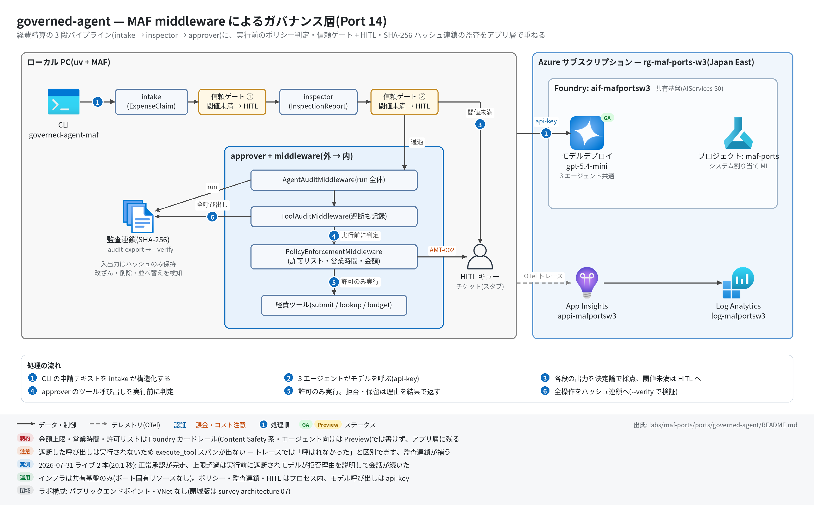

# governed-agent 実行ガイド

> **対象:** `labs/maf-ports/ports/governed-agent/`(Port 14・パターン: MAF middleware によるガバナンス層 — ツール実行前の決定論ポリシー + 段間の信頼ゲート / HITL + ハッシュ連鎖監査)
> **最終確認:** 2026-09-29 オフライン(65 passed・ruff clean・依存 agent-framework-core 1.19.0 / agent-framework-openai 1.14.4 / openai 3.20.0)/ ライブ: 2026-07-31(当時の構成 = agent-framework-core 1.13 / openai 2.51。Azure リソースは削除済み — 再デプロイ手順は §5)
> **正は本 Markdown。** 人間用 HTML(同じディレクトリの `runbook.html`)は `python3 labs/tools/build_runbooks.py` で生成する(HTML は直接編集しない)。設計判断と移植の学びは [README](../README.md)。

## 1. このパターンで確かめること

- 経費申請 1 件が intake(構造化)→ 信頼ゲート ① → inspector(構造化)→ 信頼ゲート ② → approver(ツール付き)と流れ、**approver のツール呼び出しは実行前に `PolicyEnforcementMiddleware` が判定**すること: 許可 → 支払い / 拒否(`TOOL-001` 非許可ツール・`HOURS-001` 営業時間外・`AMT-001` ハード上限超過・`AMT-003` 不正金額)→ ツール本体は実行されず、拒否理由が**ツール結果としてモデルに戻って会話が続く** / 承認必須(`AMT-002` 自動承認上限超過)→ HITL チケット発行。
- 全操作(ケース開閉・各エージェント実行・ゲート判定・遮断を含む全ツール呼び出し)が 1 本の SHA-256 ハッシュ連鎖に載り、エクスポート JSON を**モデルも Foundry もなしで**後から `--verify` で検証できること(改ざん・削除・並べ替えを検知)。
- 技術選定上の意味: 金額上限・営業時間のような**決定論の業務ルールは Foundry ガードレール(Content Safety 系の判定語彙)では書けず、アプリ層(middleware)に残る**。ガードレールとは代替ではなく積層([README の対比表・学び 2](../README.md))。

## 2. 構成



| コンポーネント | 役割 | 課金 |
| --- | --- | --- |
| MAF Agent ×3(ローカル: intake / inspector / approver) | 構造化出力 2 段 + ツール付き承認。approver に middleware 3 つ(外 → 内: `AgentAuditMiddleware` → `ToolAuditMiddleware` → `PolicyEnforcementMiddleware`) | なし |
| ガバナンスランタイム(ローカル、プロセス内) | `PolicyEngine`・`TrustGate`・`ApprovalQueue`(HITL スタブ)・`ExpenseLedger`(支払い台帳)・`AuditTrail`(ハッシュ連鎖) | なし |
| モデルデプロイ(共有基盤、gpt-5.4-mini) | 3 エージェントの呼び出し(1 ケース 3〜5 回程度。ゲートで止まれば減る) | トークン従量 |
| Application Insights(共有基盤) | OTel トレース | 取り込み量従量 |
| 本ポート固有の Azure リソース | **なし**(`infra/main.bicep` は existing 参照と出力のみ) | — |

## 3. 前提

| 区分 | 必要なもの | 備考 |
| --- | --- | --- |
| ツール | uv(Python 3.11 以上。uv が取得。検証は 3.13) | オフライン実行と `--verify` はこれだけ |
| Azure(ライブのみ) | 共有基盤([infra/shared.bicep](../../../infra/shared.bicep))。本ポート固有リソースなし | 課金あり |
| 権限 | API キー(`FOUNDRY_API_KEY`)のみ | Entra ID の RBAC は不要 |

環境変数(`labs/maf-ports/.env`。雛形は `labs/maf-ports/.env.example`。**ライブ実行時のみ必要**):

| 変数 | 用途 | 取得元 |
| --- | --- | --- |
| `FOUNDRY_OPENAI_V1_ENDPOINT` | チャット呼び出し先(`https://<foundry>.openai.azure.com/openai/v1`) | shared.bicep 出力 `openaiV1Endpoint` |
| `FOUNDRY_MODEL` | モデルデプロイ名 | shared.bicep 出力 `modelDeploymentName` |
| `FOUNDRY_API_KEY` | API キー | `az cognitiveservices account keys list -n aif-<baseName> -g <rg>` |
| `APPLICATIONINSIGHTS_CONNECTION_STRING` | トレース送信先(未設定ならトレース無効) | shared.bicep 出力 `appInsightsConnectionString` |

## 4. オフライン実行(Azure 不要・無料)

```bash
cd labs/maf-ports/ports/governed-agent
uv sync --extra dev
uv run pytest                # 期待: 65 passed, 2 deselected(ネットワーク不要)
uv run ruff check .          # 期待: All checks passed!
```

オフラインテストは fake を**チャットクライアント境界**に置く(`tests/conftest.py` の `ScriptedChatClient`)ので、実 `Agent` + 本物の function-calling ループ + 本物の middleware パイプラインが回る。固定している主な挙動:

- [ ] 拒否されたツールは本体が実行されず(台帳の `executed_calls` が空)、2 回目のモデル呼び出しに構造化拒否が function_result として渡る(`test_denied_tool_is_never_executed` / `test_hard_limit_denial_blocks_payment`)
- [ ] 営業時間外は `HOURS-001`、承認バンドは HITL チケット付きの保留(`test_after_hours_denial` / `test_approval_band_enqueues_hitl_ticket`)
- [ ] middleware の発火順序 `agent_pre → [chat_pre → chat_post](モデル呼び出しごと)→ function_pre/post(ツールごと)→ agent_post`(`test_middleware_firing_order`)
- [ ] `MiddlewareTermination` は short-circuit と違い function-calling ループ全体を止める(`test_middleware_termination_stops_the_whole_loop`)
- [ ] 監査は遮断された呼び出しも記録し、ポリシー判定は `context.metadata` で内 → 外に渡る(`test_audit_chain_records_denied_and_allowed_calls` / `test_pending_call_detail_includes_ticket_id`)
- [ ] ハッシュ連鎖は改ざん・削除・並べ替えを検知し、エクスポート単体で再検証できる(`tests/test_audit.py`)
- [ ] ルール評価順は「許可リスト → 営業時間 → 金額」の first-terminal-wins(`test_allowlist_wins_over_amount` / `test_business_hours_wins_over_amount`)
- [ ] 評価データ 7 ケースの決定論経路(ゲート・ポリシー・最終ステータス)と実行経路の一致(`tests/test_eval_dataset.py` / `tests/test_pipeline.py`)

監査連鎖の検証だけはモデルなしで試せる(エクスポート JSON はライブ実行の `--audit-export` で作る):

```bash
uv run governed-agent-maf --verify runs/audit.json   # 期待: chain OK: <N> entries, no tampering detected(exit 0)
```

## 5. ライブ実行(Azure 必要・課金あり)

### 5.1 デプロイ

```bash
# 共有基盤が未作成なら先に作る(labs/maf-ports/README.md「実行の前提」と infra/shared.bicep 冒頭コメント)
cd labs/maf-ports
az group create -n <rg> -l japaneast
az deployment group create -g <rg> -f infra/shared.bicep \
  -p baseName=<baseName> modelName=gpt-5.4-mini modelVersion=<版> modelCapacity=10

# 本ポートの Bicep は existing 参照と出力だけ(新規リソースなし)
cd ports/governed-agent
az deployment group create -g <rg> -f infra/main.bicep -p baseName=<baseName>
```

出力を `labs/maf-ports/.env` に転記する(§3 の表)。

### 5.2 実行

**営業時間ルール(平日 9〜18 時、ローカルの壁時計)があるので、夜間・週末に既定のまま実行すると支払いが全部 `HOURS-001` で遮断される。**再現性のため `--now` で平日の昼に固定するのが基本。

```bash
cd labs/maf-ports/ports/governed-agent
uv sync --extra dev --extra live

# 1 件
uv run governed-agent-maf --now 2026-07-29T10:30 \
  --request "Client dinner \$180 on 2026-07-24, receipt RCPT-2201, employee E-1042, sales, meals."

# デモ 4 件(正常 / 承認バンド / ハード上限超過 / 曖昧な申請)+ 監査連鎖のエクスポート → 独立検証
uv run governed-agent-maf --now 2026-07-29T10:30 --script tests/data/expense_requests.txt \
  --audit-export runs/audit.json --json --output runs/cases.json
uv run governed-agent-maf --verify runs/audit.json

# 対話(1 行 = 1 申請。/audit で連鎖の要約、/queue で承認待ち、/quit で終了)
uv run governed-agent-maf --now 2026-07-29T10:30

uv run pytest -m live   # 期待: 2 passed(7 月の実測 20.1 秒。時刻は内部で平日昼に固定済み)
```

主なオプション: `--threshold`(信頼ゲート閾値、既定 40)/ `--auto-approve-limit`(既定 1000 USD)/ `--hard-limit`(既定 5000 USD)/ `--now`(ISO 形式の現在時刻)/ `--timeout`(1 ケースの秒数、既定 180)/ `--json` / `--output` / `--audit-export` / `--verify`。

期待される出力の例(書式は CLI どおり。値はオフラインの scripted 実行で作った**例** — approver の文面はモデル次第):

```text
=== case-001: paid ===
  claim: E-1042 / meals / $180.00
  intake trust: 75 (gold) -> pass:75
  inspection: approve / trust 70 (gold) -> pass:70
  payment: PAY-0001 $180.00
  approver: Approved and paid (PAY-0001).
  audit: 8 entries, chain OK
```

デモスクリプト 4 件の期待ステータス(平日昼に固定した場合):

| 申請 | 期待ステータス | 決め手 |
| --- | --- | --- |
| client dinner $180(領収書あり) | `paid`(`PAY-0001`) | 全ルール通過(`allow:POLICY-DEFAULT`) |
| conference trip $3,200 | `pending_human_approval`(`HITL-0001`) | `AMT-002`(自動承認上限 $1,000 超) |
| workstation $12,000 | `blocked_by_policy` | `AMT-001`(ハード上限 $5,000 超)— 支払いツールは実行されない |
| "I spent some money on stuff..." | `escalated_low_trust` | 信頼ゲート ① で減点(金額・社員 ID・領収書なし)→ inspector に進まない |

## 6. 確認観点

| 確認 | # | 観点 | 確認方法 | 期待結果 |
| --- | --- | --- | --- | --- |
| [ ] | 1 | 正常系: 承認まで完走 | §5.2 の 1 件実行(`--now` 付き) | `=== case-001: paid ===`、`payment: PAY-0001 $180.00`、`audit: ... chain OK` |
| [ ] | 2 | 分岐: 実行前遮断 | デモ 3 件目($12,000) | `blocked_by_policy`。`payment:` 行がなく、approver の返答が `AMT-001` と理由に触れている(拒否がツール結果としてモデルに戻り会話が続いた証拠) |
| [ ] | 3 | 分岐: HITL | デモ 2 件目($3,200)→ 対話モードなら `/queue` | `pending_human_approval` と `HITL: HITL-0001 [tool_call] Amount $3,200.00 exceeds the auto-approve limit ...` |
| [ ] | 4 | 分岐: 信頼ゲート | デモ 4 件目(曖昧な申請) | `escalated_low_trust`、`inspection:` 行が出ない(ゲート ① で止まる) |
| [ ] | 5 | 分岐: 営業時間 | `--now 2026-08-01T22:00` で 1 件目を実行 | `blocked_by_policy`(`HOURS-001`)。同じ申請が時刻だけで結果を変える |
| [ ] | 6 | 監査連鎖の独立検証 | `--verify runs/audit.json` → JSON の任意エントリの `detail` を 1 文字書き換えて再度 `--verify` | 1 回目 `chain OK: ...`(exit 0)、改ざん後 `chain BROKEN: ...`(exit 1) |
| [ ] | 7 | パターン固有: 監査とトレースの違い | `runs/audit.json` の `tool:submit_reimbursement` エントリと §7 の KQL を突き合わせる | 監査連鎖には `deny:AMT-001` のエントリがあるのに、トレースには遮断した呼び出しの `execute_tool` スパンが**ない**(実行されていないから)— README 学び 4 |
| [ ] | 8 | 観測: トレース到達 | §7 の KQL | `invoke_agent expense_intake` / `expense_inspector` / `expense_approver` と、支払えたケースの `execute_tool submit_reimbursement` |
| [ ] | 9 | コスト・後片付け | §8 | 本ポート固有リソースはない。使わない期間は共有基盤の RG ごと削除 |

## 7. トレース・評価の確認

```bash
az monitor app-insights query --app appi-<baseName> -g <rg> \
  --analytics-query "dependencies | where timestamp > ago(30m) | summarize count() by name | order by name asc"
```

- 期待するスパン名: `invoke_agent expense_intake` / `invoke_agent expense_inspector` / `invoke_agent expense_approver`、`chat <モデル名>`(approver は function-calling ループの反復ごとに複数)、`execute_tool submit_reimbursement`(許可されたときだけ)/ `execute_tool lookup_expense_policy` / `execute_tool check_budget`(モデルが呼んだとき)
- ハッシュ連鎖には生の入出力は入らない(ハッシュのみ)。内容を追うのはトレース、順序と非改ざんの証明は連鎖、という役割分担
- 評価: `tests/eval_dataset.jsonl`(7 ケース)はオフラインの決定論検証用(§4)。クラウド評価は本ポートでは実施していない

## 8. 片付け

```bash
az group delete -n <rg> --yes --no-wait   # 共有基盤ごと削除(ステートレス。Bicep で再現可)
```

ローカルの `runs/*.json`(申請テキストを含むケース結果と監査連鎖)は不要なら削除する。

## 9. トラブルシューティング

| 症状 | 原因 | 対処 |
| --- | --- | --- |
| 全ケースが `blocked_by_policy` になる | 営業時間外に `--now` なしで実行した(`HOURS-001`) | `--now 2026-07-29T10:30` のように平日の昼を指定 |
| 1 件目が `paid` にならず `no_action` | approver が `submit_reimbursement` を呼ばなかった(ツール選択はモデル裁量)、または inspector が `needs_information` を出した | `--json` で `report.recommendation` と approver の返答を確認。申請文に社員 ID・金額・日付・領収書番号を揃える |
| 意図せず `escalated_low_trust` になる | inspector の確信度が低い・critical 所見でゲート ② が落ちた | `--threshold 30` などで閾値を下げて挙動を比較(既定 40) |
| 自作の関数 middleware を足したら `MiddlewareException: Cannot determine middleware type` | `from __future__ import annotations` 下では第 1 引数の型注釈で種別を判定できない(1.19 でも同じ)([casebook P-F04](../../../../../docs/survey/casebook/02-pitfalls-index.md#i-maf-とフレームワーク)) | `@function_middleware` / `@agent_middleware` / `@chat_middleware` を明示するかクラス形態にする |
| `error: 環境変数が未設定: ...` | `labs/maf-ports/.env` に 3 点がない | §3 の表どおり転記(`--verify` だけなら不要) |
| `TimeoutError`(1 ケース 180 秒超) | モデル応答の遅延 | `--timeout 300` で再実行 |

## 10. 関連・更新履歴

- 設計判断と学び: [README](../README.md)
- ガードレール(サービス層)の GA / プレビューと介入ポイント: [features/06 安全性・ガードレール](../../../../../docs/survey/features/06-safety-guardrails.md)
- 詰まりどころ(middleware の型推定・short-circuit の 2 方式): [casebook 02 I. MAF とフレームワーク](../../../../../docs/survey/casebook/02-pitfalls-index.md#i-maf-とフレームワーク)
- 今後の選択肢(README「検証結果(2026-09-29 最新化チェック)」): MAF 1.19 の `MiddlewareFailure`(fail-closed の中断)・`MiddlewareBundle` / AGENT-HOOKS(実験的)・`agent_framework.security`(実験的)

| 日付 | 内容 |
| --- | --- |
| 2026-09-29 | 初版(依存を agent-framework-core 1.19.0 / openai 3.20.0 に更新。middleware API は 1.13 と同一でコード改修なし。構成図を v2(日本語・処理順バッジ・注記帯)に更新) |
