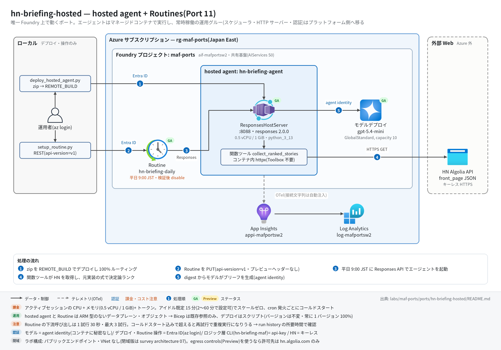

# hn-briefing-hosted 実行ガイド

> **対象:** `labs/maf-ports/ports/hn-briefing-hosted/`(Port 11・パターン: hosted agent + Routines — 同じ決定論ロジックを「クライアント実行の MAF ワークフロー」と「Foundry 上の hosted agent(スケジュール起動)」の二形態で動かす)
> **最終確認:** 2026-09-29 オフライン(48 passed・`ruff check .` clean・依存 agent-framework-core 1.19.0 / agent-framework-foundry-hosting 1.0.0b260918 / azure-ai-agentserver-responses 2.2.0 / azure-ai-projects 2.6.1)/ ライブ: 2026-07-31(当時の構成 core 1.13 / hosting 1.0.0b260730 / Routines プレビュー+`Routines=V1Preview` ヘッダー。Azure リソースは削除済み — 再デプロイ手順は §5)
> **正は本 Markdown。** 人間用 HTML(同じディレクトリの `runbook.html`)は `python3 labs/tools/build_runbooks.py` で生成する(HTML は直接編集しない)。設計判断と移植の学びは [README](../README.md)。

## 1. このパターンで確かめること

- **ロジック層(CLI)**: `collect`(HN Algolia・httpx)→ `rank`(元実装の決定論スコア式)→ `brief`(MAF `Agent`)が直列に 1 回ずつ動き、スコア降順の記事 + LLM が編集したブリーフ本文(`brief_md`)が出ること。
- **ホスティング層**: 同じ決定論コードを関数ツール `collect_ranked_stories` に包んだエージェントが **hosted agent(Responses protocol 2.0.0)**として動き、コンテナ内の httpx で HN を取りに行けること(= 「hosted はツールを定義に直付けできない」制約は Foundry 管理ツールの話で、自前コードのツールには効かない)。
- **Routine(2026-09 GA)**: schedule トリガーの Routine が hosted agent を Responses API 経由で起動し、手動発火(`:dispatch_async`)の結果が run history に `FINISHED` で残ること。
- 技術選定上の意味: 常時稼働の運用グルー(HTTP サーバー・スケジューラ・認証)が Foundry 側へ移り、代わりに「zip 規約+provisioning ポーリング+不変バージョン」というデプロイ語彙とコールドスタートを引き受ける(README の学び 1・2・4)。

## 2. 構成



```text
【ロジック層(CLI・ローカル実行)】
BriefingRequest ─▶ collect(HN Algolia)─▶ rank(決定論)─▶ brief(MAF Agent)─▶ Brief
                   └ StageDone 進捗(collect / rank)→ stderr

【ホスティング層(Foundry)】
Routine hn-briefing-daily(schedule 0 9 * * 1-5, Asia/Tokyo, api-version=v1)
  └─▶ invoke_agent_responses_api ─▶ hosted agent hn-briefing-agent
        hosting/main.py: ResponsesHostServer(Agent(FoundryChatClient(agent identity)))
          └ 関数ツール collect_ranked_stories(コンテナ内 httpx → Algolia → 決定論ランク → digest)
```

| コンポーネント | 役割 | 課金 |
| --- | --- | --- |
| MAF Workflow(ローカル、`workflow.py`) | `collect` / `rank` / `brief` の 3 Executor 直列 | なし |
| HN Algolia API(`hn.algolia.com`) | `tags=front_page` の JSON をキーレスで取得 | なし(外部サイト) |
| モデルデプロイ(共有基盤、既定 gpt-5.4-mini) | CLI のブリーフ本文 / hosted エージェントの推論 | トークン従量 |
| hosted agent `hn-briefing-agent`(0.5 vCPU / 1 GiB・`python_3_13`・REMOTE_BUILD) | `ResponsesHostServer` が :8088 で Responses を受け、関数ツールで digest を取って応答 | アクティブセッション中の CPU/メモリ(idle timeout 既定 15 分でスケールゼロ) |
| Routine `hn-briefing-daily` | 平日 9:00 JST に hosted agent を起動(1 トリガー+1 アクション) | 起動ごとに hosted のセッション+トークン |
| App Insights(共有基盤) | CLI は `configure_azure_monitor`、hosted はプラットフォームが接続文字列を自動注入 | 取り込み量従量 |

## 3. 前提

| 区分 | 必要なもの | 備考 |
| --- | --- | --- |
| ツール | uv(Python 3.11 以上。uv が取得。検証は 3.13)。ライブは Azure CLI(`az login`) | オフライン実行は uv だけ |
| Azure(ライブのみ) | 共有基盤([infra/shared.bicep](../../../infra/shared.bicep))のみ。**本ポート固有の ARM リソースはない**(hosted agent と Routine はデータプレーンのオブジェクト。`infra/main.bicep` は existing 参照+出力だけ) | hosted のセッション課金+トークン |
| リージョン | 共有基盤の Japan East で両機能とも可(hosted agents 対応リージョン / Routines は UK West・Switzerland West・Japan West・UAE North・Norway East **以外**) | Japan West を選ぶと Routines 不可 |
| 権限 | デプロイ実行者: **Foundry Project Manager**(プロジェクト。`create_version_from_code` / `update_details`)。Routine 操作: **Foundry User** 以上。hosted の agent identity はプロジェクト内のモデル推論に暗黙アクセスがありロール割り当て不要。CLI のモデル呼び出しは api-key | RBAC 伝播に 5〜15 分 |
| ネットワーク | ローカルとコンテナの双方から `hn.algolia.com` への外向き HTTPS | egress controls(プレビュー)を使う場合はこのホストを Allow |

環境変数(`labs/maf-ports/.env`。雛形は `.env.example`。読み込み順はカレントの `.env` → lab ルートの `.env` で、既にシェルにある値が優先):

| 変数 | 用途 | 取得元 |
| --- | --- | --- |
| `FOUNDRY_OPENAI_V1_ENDPOINT` | CLI のモデル呼び出し先。**必須**(deploy / routine スクリプトも起動時に検証する) | shared.bicep の出力 `openaiV1Endpoint` |
| `FOUNDRY_MODEL` | モデルデプロイ名。**必須**。deploy 時はコンテナの `FOUNDRY_MODEL_NAME` にも転記される | shared.bicep の出力 `modelDeploymentName` |
| `FOUNDRY_API_KEY` | CLI の api-key 認証。**必須**(hosted には渡さない) | `az cognitiveservices account keys list -n <foundryName> -g <rg> --query key1 -o tsv` |
| `FOUNDRY_PROJECT_ENDPOINT` | hosted のデプロイ・Routine 操作・hosted スモーク。CLI には不要 | shared.bicep の出力 `projectEndpoint` |
| `HN_BRIEFING_AGENT_NAME` | hosted agent 名(既定 `hn-briefing-agent`)。デプロイ・Routine・スモークで共有 | 任意 |
| `APPLICATIONINSIGHTS_CONNECTION_STRING` | CLI のトレース送信先(任意。hosted は自動注入) | shared.bicep の出力 `appInsightsConnectionString` |
| `HN_BRIEFING_HOSTED_SMOKE` | `1` のときだけ hosted のライブスモークを実行 | 手で設定 |

コンテナ側の環境変数(`.env` ではなくデプロイ定義で渡る。バージョンごとに不変): `FOUNDRY_PROJECT_ENDPOINT` / `FOUNDRY_MODEL_NAME`(`hosting/main.py` は `AZURE_AI_MODEL_DEPLOYMENT_NAME` も受ける)。API キーは渡さない。

## 4. オフライン実行(Azure 不要・無料)

```bash
cd labs/maf-ports/ports/hn-briefing-hosted
uv sync --extra dev --extra hosting     # hosting = ResponsesHostServer の実構築テストに必要(無いと 1 件 skip)
uv run pytest                           # 期待: 48 passed, 2 deselected(live は既定で除外。ネットワーク不要)
uv run ruff check .                     # 期待: All checks passed!(図生成スクリプト docs/architecture.py を含む)
```

送信せずに中身だけ確かめる(Azure 呼び出しなし。ただし設定検証のため必須 3 変数+`FOUNDRY_PROJECT_ENDPOINT` は要る — 未作成ならダミー値でよい):

```bash
uv run python hosting/deploy_hosted_agent.py --dry-run    # zip 内容とバージョン定義
uv run python scripts/setup_routine.py create --dry-run   # Routine のペイロード
```

期待される出力の例(`--dry-run`。エンドポイントはダミー):

```text
zip: 14 files — hn_briefing_maf/__init__.py, hn_briefing_maf/agents.py, ... ← stderr
{
  "agent_name": "hn-briefing-agent",
  "cpu": "0.5",
  "memory": "1Gi",
  "runtime": "python_3_13",
  "entry_point": ["python", "main.py"],
  "environment_variables": {"FOUNDRY_PROJECT_ENDPOINT": "https://...", "FOUNDRY_MODEL_NAME": "gpt-5.4-mini"},
  "protocols": [["responses", "2.0.0"]]
}
```

コンテナ相当をローカルで起動する(`/readiness` まではオフラインで確認できる。`POST /responses` はモデル呼び出しに Entra 認証と共有基盤が要る):

```bash
PORT=8088 FOUNDRY_PROJECT_ENDPOINT=https://<foundry>.services.ai.azure.com/api/projects/maf-ports \
  FOUNDRY_MODEL_NAME=gpt-5.4-mini uv run python hosting/main.py &
curl -sS -i http://localhost:8088/readiness   # 期待: HTTP 200、x-platform-server に azure-ai-agentserver-core/2.2.0 … responses/2.2.0
# 共有基盤があり az login 済みなら本物の応答も取れる:
curl -sS -H "Content-Type: application/json" -X POST http://localhost:8088/responses \
  -d '{"input": "Give me today'\''s brief (top 3).", "stream": false}'
```

オフラインテストが固定している主な挙動:

- [ ] 収集: Algolia の hit を `Story` に写像して応答順で rank を振り、`url` が null なら HN の URL に、HTTP エラーは `CollectError` にする(`test_parse_maps_hit_fields_and_assigns_positional_rank` / `test_parse_falls_back_to_hn_url_when_url_is_null` / `test_fetch_raises_collect_error_on_http_error`)
- [ ] ランキング: 元実装を実行して採ったゴールデンスコアを再現し、入力順をシャッフルしても結果が同じ。ノイズ除去と `top_n` を守る(`test_golden_scores_match_original_implementation` / `test_curate_is_deterministic_under_input_shuffle` / `test_curate_drops_noise_and_respects_top_n`)
- [ ] 元実装の癖の保存: キーワード 0 件の記事も fallback summary 経由でフィルタを通る(`test_keywordless_story_passes_filter_via_fallback_summary`)
- [ ] ワークフロー: `collect → rank → brief` の順に動き、進捗 `StageDone` が流れ、`CollectError` は握りつぶさず伝播する(`test_sequential_flow_collect_rank_brief` / `test_collect_error_propagates`)
- [ ] hosted 配線: 関数ツールが digest を返し `top_n` を 1〜10 にクランプ、エージェントは instructions+ツール 1 本+`store=False`、`hosting/main.py` を実 import して `ResponsesHostServer` を構築できる(`test_collect_tool_returns_ranked_digest` / `test_agent_wires_instructions_and_collect_tool` / `test_hosting_main_imports_and_builds_server_without_running`)
- [ ] デプロイ zip 規約: zip ルートに `main.py` / `requirements.txt` / `hn_briefing_maf/`、`__pycache__` と deploy スクリプトは入れない。定義は responses **2.0.0**、コンテナ環境変数はエンドポイントとモデル名だけ(`test_staged_zip_places_entrypoint_and_package_at_root` / `test_definition_kwargs_encode_container_protocol_2_and_keyless_env`)
- [ ] Routine 契約: schedule トリガー+`invoke_agent_responses_api`、既定 cron は平日 9:00 JST、URL は `?api-version=v1`、ヘッダーは Bearer のみ(`Foundry-Features` なし)(`test_routine_payload_matches_rest_schema` / `test_routine_url_and_headers`)
- [ ] 評価データセット 8 ケース(keyword 4 / noise 2 / rank_order 2)がランキング実装と一致する(`test_eval_dataset.py`)

## 5. ライブ実行(Azure 必要・課金あり)

### 5.1 デプロイ

共有基盤(Foundry アカウント+プロジェクト+モデル+App Insights)が未作成なら先に [共有基盤の実行ガイド](../../../infra/docs/runbook.md) §5 で作り、§5.5 の手順で `.env` に転記する。

```bash
# 共有基盤が未作成なら先に作る(→ labs/maf-ports/infra/docs/runbook.md)。本ポート固有の ARM リソースはない。
cd labs/maf-ports/ports/hn-briefing-hosted
az deployment group create -g <rg> -f infra/main.bicep -p baseName=<baseName> \
  --query properties.outputs -o json      # 期待: openaiV1Endpoint / projectEndpoint(.env に転記)

az login                                  # Foundry Project Manager 以上
uv sync --extra dev --extra hosting --extra live
uv run python hosting/deploy_hosted_agent.py --invoke "Give me today's brief (top 3)."
```

期待される出力の例(provisioning は数分。REMOTE_BUILD が `hosting/requirements.txt` を pip で解決する):

```text
zip: 14 files — hn_briefing_maf/__init__.py, ...            ← stderr
created version 1 — provisioning...                          ← stderr
  status=creating                                            ← stderr(10 秒間隔でポーリング)
  status=active
routed 100% -> version 1                                     ← stderr
agent endpoint: {...version_selector... FixedRatio 100 ...}   ← stdout
(--invoke の応答: digest の順に並んだ 3 記事の解説+ "Next actions")
```

### 5.2 実行

```bash
# ロジック層(CLI・クライアント実行)
uv run hn-briefing-maf --top-n 3
uv run hn-briefing-maf --json --output runs/brief.json
uv run pytest -m live -k workflow                      # 実 HN + 実モデル(1 passed が期待)

# ホスティング層(デプロイ済みの hosted agent を 1 回叩く)
HN_BRIEFING_HOSTED_SMOKE=1 uv run pytest -m live -k hosted

# Routine(GA)
uv run python scripts/setup_routine.py create          # 平日 9:00 JST(--cron / --time-zone / --input で変更)
uv run python scripts/setup_routine.py dispatch        # 手動発火(:dispatch_async)
uv run python scripts/setup_routine.py runs            # 実行履歴
uv run python scripts/setup_routine.py disable         # 検証後は必ず停止(delete で削除、enable で再開)
```

期待される出力の例(値は実行ごとに変わる):

```text
[collect] 30 stories                                   ← stderr(Algolia の hitsPerPage=30)
[rank] 3 stories                                       ← stderr
AgentScout Hacker News brief - 2026-09-29              ← stdout(日付は America/Los_Angeles 基準)

## 1. <記事タイトル> ...                                ← brief_md(digest の順を保った解説+ Next actions)
```

```text
HTTP 200                                               ← setup_routine.py create(201 もありうる。stderr)
{ "name": "hn-briefing-daily", "enabled": true, "triggers": {...}, "created_at": ..., ... }
HTTP 200                                               ← dispatch
{ "dispatch_id": "...", "action_correlation_id": "...", "task_id": "..." }
HTTP 200                                               ← runs
{ "data": [ { "status": "FINISHED", "phase": "completed", "trigger_type": ..., "started_at": ..., "ended_at": ..., "dispatch_id": ..., "response_id": ... } ] }
```

終了コード: CLI は 正常 0 / 設定不足 2 / 収集失敗・タイムアウト(既定 180 秒)・ブリーフなし 1。スクリプトは HTTP 4xx/5xx で 1、設定不足で 2。

## 6. 確認観点

| 確認 | # | 観点 | 確認方法 | 期待結果 |
| --- | --- | --- | --- | --- |
| [ ] | 1 | 正常系: CLI のブリーフ生成 | `uv run hn-briefing-maf --json --output runs/brief.json` | `stories` がスコア降順(`test_live_workflow_generates_brief` と同じ判定)、`brief_md` が digest の記事順を守り(並べ替え・追加なし)、末尾に Next actions |
| [ ] | 2 | 正常系: hosted のデプロイと応答 | §5.1 の `--invoke` / hosted スモーク | version が `active` になり、応答にランク付き記事(`1.` やポイント数)が現れる。コンテナに API キーを渡していない(定義の環境変数はエンドポイントとモデル名だけ) |
| [ ] | 3 | 正常系: Routine の手動発火 | `dispatch` → 数十秒後に `runs` | 最新の run が `status: FINISHED` / `phase: completed`。`response_id` からエージェント応答とトレースに辿れる |
| [ ] | 4 | Routine のタイムアウト余裕 | `runs` の `started_at` / `ended_at`、または ポータルの Routines 画面の所要時間 | 1 試行 30 秒以内に収まる(docs の既定は 1 試行 30 秒・最大 3 試行)。超えると失敗・再試行で hosted が重複実行されうる — コールドスタート込みで測る |
| [ ] | 5 | 異常系: 設定不足 | `FOUNDRY_PROJECT_ENDPOINT` を空にして `setup_routine.py show`(空文字はシェルの値が優先される) | 終了コード 2、stderr に `error: FOUNDRY_PROJECT_ENDPOINT が未設定(...)` |
| [ ] | 6 | 異常系: HN 取得失敗 | ネットワーク遮断下で `uv run hn-briefing-maf`(オフラインでは `test_fetch_raises_collect_error_on_http_error` が同じ経路) | 終了コード 1、stderr に `error: Could not fetch Hacker News (Algolia): ...` または `HN Algolia API returned HTTP <code>` |
| [ ] | 7 | 観測: トレース着信 | §7 の KQL | CLI: `executor.process collect|rank|brief` と `invoke_agent hn_briefing_writer`。hosted: Responses ホストの `invoke_agent` スパンと MAF の `execute_tool collect_ranked_stories`(ライブ未確認) |
| [ ] | 8 | パターン固有: ツールはコンテナ内で動く | hosted 応答の記事タイトルを当日の HN と照合、またはトレースの `execute_tool` | Toolbox なしでコンテナ内 httpx の関数ツールが実行されている(Foundry 管理ツールの直付け制約に該当しない) |
| [ ] | 9 | コスト・後片付け | `setup_routine.py show` の `enabled`、ポータルのエージェント一覧 | 検証後は Routine が `enabled: false`(または削除)。使わない期間は RG ごと削除(§8) |

## 7. トレース・評価の確認

```bash
az monitor app-insights query --app appi-<baseName> -g <rg> \
  --analytics-query "dependencies | where timestamp > ago(30m) | summarize count() by name"
```

- CLI(クライアント実行)で期待するスパン名(2026-09-29 にインメモリ OTel で確認。`invoke_agent` / `chat` は実モデル時のみ): `workflow.build` / `workflow.run` / `executor.process collect|rank|brief` / `invoke_agent hn_briefing_writer` / `chat <デプロイ名>` / `edge_group.process ...` / `message.send`。
- hosted: 接続文字列はプラットフォームが注入し、protocol ライブラリが OTel を既定発信する(配線コードなし)。Responses ホストの `invoke_agent` スパン(`gen_ai.system=responses`)と MAF の `invoke_agent hn_briefing_agent` / `execute_tool collect_ranked_stories` / `chat` が期待値。**azure-ai-agentserver-core 2.2 系は既定で HTTPX / Azure SDK の計装を無効化**したため、コンテナ内の Algolia GET は dependency として出ない見込み(ライブ未確認。必要なら `configure_observability` に `instrumentation_options={"httpx": {"enabled": True}}`)。
- 評価: `tests/eval_dataset.jsonl`(8 ケース)は決定論部分のデータ駆動検証。LLM 部分は `--output` の Brief を「digest に忠実か」の rubric 1 本で評価する想定(評価 API の使い方は Port 9 critique-loop)。

## 8. 片付け

```bash
uv run python scripts/setup_routine.py disable   # まず無人起動を止める(delete で定義ごと削除)
az group delete -n <rg> --yes --no-wait           # 使わない期間は共有基盤の RG ごと削除(hosted agent・Routine も消える)
```

- 再構築は §5.1 の 2 コマンド(deploy → `setup_routine.py create`)で戻る(ステートレス)。共有基盤を同じ `baseName` で作り直すときの soft delete の注意は [共有基盤の実行ガイド](../../../infra/docs/runbook.md) §8。
- hosted agent だけ消す場合、アクティブなセッションがあると DELETE が 409 になる(アイドル化を待つか `force=true`)。

## 9. トラブルシューティング

| 症状 | 原因 | 対処 |
| --- | --- | --- |
| Routine の REST が HTTP 400 | `?api-version=v1` の欠落 | `routine_url()` / `routines_collection_url()` を通す(直書きしない) |
| Routine の REST が 4xx で `Foundry-Features` の値に言及(想定・未観測) | 旧版のスクリプトが `Routines=V1Preview` を送っている(2026-08 に REST 仕様から削除されたキー) | ヘッダーを外す(本ポートは 2026-09-29 に削除済み)。SDK `client.beta.routines` は任意ヘッダー `Routines=V2Preview` を自動付与する |
| ポータルに Routines が出ない / create が失敗 | リージョン・サブスクリプションで未有効 | 対応リージョン(§3)を確認。出ない場合はアカウントチームへ |
| version が `failed` | zip レイアウト、または REMOTE_BUILD の pip 解決失敗 | `get_version` の `error.message`(pip の最終エラー行が入る)を見る。依存は `hosting/requirements.txt` と pyproject の hosting extra を揃える |
| version が `creating` のまま 10 分超 | リモートビルドが `requirements.txt` を解決できない | `dependency_resolution="bundled"` でローカルビルドした依存を同梱する(docs の Troubleshooting) |
| `--invoke` / スモークが 401・403 | デプロイ実行者のロール不足、または RBAC 伝播待ち | Foundry Project Manager(プロジェクト)を付与して 5〜15 分待つ |
| Routine の run が FAILED(タイムアウト) | 1 試行 30 秒を超過(コールドスタート+HN+ブリーフ生成) | run history で所要時間を確認。`--input` で記事数を減らす等で短縮 |
| ローカルの `hosting/main.py` が起動しない | `FOUNDRY_PROJECT_ENDPOINT` / `FOUNDRY_MODEL_NAME` 未設定、または hosting extra 未導入 | 両変数を渡し、`uv sync --extra dev --extra hosting` |

## 10. 関連・更新履歴

- 設計判断と学び: [README](../README.md)
- hosted agent / Routines の機能・GA 状況: [features/03-agent-service.md](../../../../../docs/survey/features/03-agent-service.md)
- 詰まりどころ(P-A11 Routines / P-H13 コールドスタート / P-H20 プレリリースのホスティングライブラリ / P-N07 egress controls): [casebook/02-pitfalls-index.md](../../../../../docs/survey/casebook/02-pitfalls-index.md)
- 公式: [use-routines](https://learn.microsoft.com/en-us/azure/foundry/agents/how-to/use-routines) / [deploy-hosted-agent-code](https://learn.microsoft.com/en-us/azure/foundry/agents/how-to/deploy-hosted-agent-code) / [manage-hosted-sessions](https://learn.microsoft.com/en-us/azure/foundry/agents/how-to/manage-hosted-sessions)

| 日付 | 内容 |
| --- | --- |
| 2026-09-29 | 初版(依存を agent-framework-core 1.19 / foundry-hosting b260918 / agentserver 2.2 へ更新。Routines GA に合わせて `Foundry-Features` ヘッダーを削除、hosted の requirements に agentserver 3 点を明示。構成図を v2 スタイル(日本語・処理順バッジ)に更新し `ruff check .` を clean に) |
