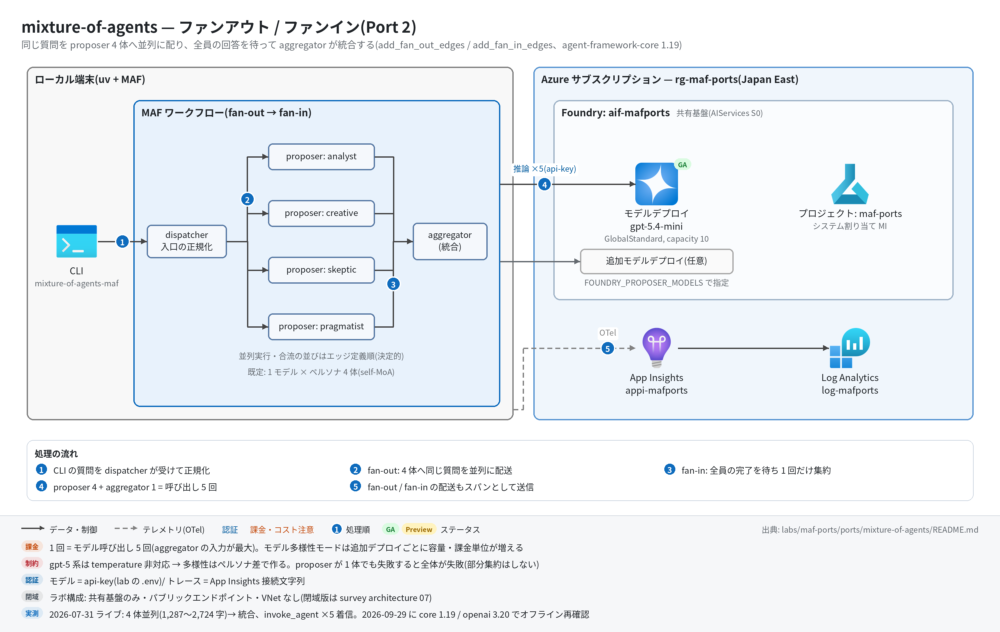

# mixture-of-agents 実行ガイド

> **対象:** `labs/maf-ports/ports/mixture-of-agents/`(Port 2・パターン: ファンアウト/ファンイン — 同一質問を proposer N 体へ並列送信し、全回答を待って aggregator が統合)
> **最終確認:** 2026-09-29 オフライン(13 passed・ruff clean・依存 agent-framework-core 1.19.0 / agent-framework-openai 1.14.4 / openai 3.20.0)/ ライブ: 2026-07-31(当時の構成 core 1.12.1 / openai 2.51.0。Azure リソースは削除済み — 再デプロイ手順は §5)
> **正は本 Markdown。** 人間用 HTML(同じディレクトリの `runbook.html`)は `python3 labs/tools/build_runbooks.py` で生成する(HTML は直接編集しない)。設計判断と移植の学びは [README](../README.md)。

## 1. このパターンで確かめること

- 質問 1 つが dispatcher から proposer 4 体(既定はペルソナ analyst / creative / skeptic / pragmatist)に**同時に**配られ、4 体すべての完了を待ってから aggregator が **1 回だけ**呼ばれ、統合回答が出ること。
- fan-in で aggregator に届く `list[ProposerReply]` の並びは**到着順でなくエッジ定義順**(analyst → creative → skeptic → pragmatist)で決定的であること。aggregator には質問本文と proposer 名ラベル付きの回答が渡る(元アプリのカンマ結合を修正した点。README の学び 4)。
- 技術選定上の意味: MoA の本質はモデル多様性だが、Foundry では「モデルを増やす」= デプロイ作業(容量・課金単位)になる。既定の同一モデル×ペルソナ(self-MoA)は共有基盤の制約による弱い代替(README の学び 2・3)。

## 2. 構成



```text
                ┌─▶ Proposer(analyst)    ─┐
question ──▶ Dispatcher ─▶ Proposer(creative)   ─┼─▶ Aggregator ──▶ MoAResult
                ├─▶ Proposer(skeptic)    ─┤      (list[ProposerReply] を合流)
                └─▶ Proposer(pragmatist) ─┘
進捗: 各 proposer の yield_output → type="intermediate"(ProposerDone)→ CLI の stderr
```

| コンポーネント | 役割 | 課金 |
| --- | --- | --- |
| MAF Workflow(ローカル、`workflow.py`) | `add_fan_out_edges`(dispatcher → proposer)+ `add_fan_in_edges`(proposer → aggregator) | なし |
| MAF `Agent`(`agents.py`) | proposer ×4(ペルソナ)または ×N(モデル多様性モード)+ aggregator。`OpenAIChatClient`(Responses API)はモデルごとに 1 つを共有 | — |
| モデルデプロイ(共有基盤、既定 gpt-5.4-mini) | 既定は全 proposer と aggregator が同じデプロイ | トークン従量(1 回の実行で 5 呼び出し) |
| 追加モデルデプロイ(任意) | モデル多様性モード用。共有基盤の Foundry アカウントに追加する(本ポートの Bicep には置かない) | トークン従量(デプロイごと) |
| App Insights(共有基盤) | OTel トレースの送信先(任意) | 取り込み量従量 |

## 3. 前提

| 区分 | 必要なもの | 備考 |
| --- | --- | --- |
| ツール | uv(Python 3.11 以上。uv が取得。検証は 3.13) | オフライン実行はこれだけ |
| Azure(ライブのみ) | 共有基盤([infra/shared.bicep](../../../infra/shared.bicep))のみ。モデル多様性モードでは追加のモデルデプロイ(§5.1) | トークン従量+トレース取り込み |
| 権限 | モデル呼び出しは api-key なので**データプレーンの RBAC は不要**。追加デプロイを作る場合は Foundry アカウントへの書き込み権限(共同作成者など) | roles.bicep(MI 向け)も不要 |

環境変数(`labs/maf-ports/.env`。雛形は `.env.example`。**ライブ実行時のみ必要**。シェルの値が `.env` より優先):

| 変数 | 用途 | 取得元 |
| --- | --- | --- |
| `FOUNDRY_OPENAI_V1_ENDPOINT` | モデル呼び出し先。必須 | shared.bicep の出力 `openaiV1Endpoint` |
| `FOUNDRY_MODEL` | 既定のモデルデプロイ名。必須 | shared.bicep の出力 `modelDeploymentName` |
| `FOUNDRY_API_KEY` | api-key 認証。必須 | `az cognitiveservices account keys list -n <foundryName> -g <rg> --query key1 -o tsv` |
| `APPLICATIONINSIGHTS_CONNECTION_STRING` | トレース送信先。任意 | shared.bicep の出力 `appInsightsConnectionString` |
| `FOUNDRY_PROPOSER_MODELS` | 本ポート固有・任意。カンマ区切りのデプロイ名。**2 つ以上**で「1 モデル = 1 proposer」(名前は `m1-<slug>`、`m2-<slug>` …、instructions は中立)。1 つだけならそのモデルでペルソナ 4 体 | 追加したデプロイ名 |
| `FOUNDRY_AGGREGATOR_MODEL` | 本ポート固有・任意。aggregator のデプロイ名(既定 `FOUNDRY_MODEL`) | 同上 |

空文字(`FOUNDRY_PROPOSER_MODELS=`)は「未設定」と同じ扱いで、`.env` の値も上書きされない。

## 4. オフライン実行(Azure 不要・無料)

```bash
cd labs/maf-ports/ports/mixture-of-agents
uv sync --extra dev
uv run pytest            # 期待: 13 passed, 1 deselected(live は既定で除外。ネットワーク不要)
uv run ruff check .      # 期待: All checks passed!(図生成スクリプト docs/architecture.py も対象)
```

オフラインテストが固定している主な挙動:

- [ ] fan-out: 全 proposer が同じ質問で 1 回ずつ呼ばれる(`test_fan_out_calls_every_proposer_once_with_the_question`)
- [ ] 並列性: バリア同期(全員が開始するまで待つ fake。逐次なら 5 秒でタイムアウト)でも完走する(`test_proposers_run_concurrently`)
- [ ] fan-in: aggregator は 1 回だけ呼ばれ、プロンプトに質問本文と `Response from <name>` ラベル付きの全回答が入る(`test_fan_in_aggregator_prompt_contains_all_proposals`)
- [ ] 出力の並びはエッジ定義順で決定的、進捗イベントは proposer ごとに 1 件(`test_final_output_structure_and_deterministic_order` / `test_progress_events_one_per_proposer`)
- [ ] 構成ロジック: 既定はペルソナ 4 体、複数モデル指定で 1 モデル = 1 proposer(重複モデルでも名前は一意)、1 モデル指定はペルソナに戻る(`tests/test_agents_config.py` の 3 件)
- [ ] 設定: カンマ区切りの空要素・前後空白を除去、空文字は既定に倒す(`test_from_env_parses_proposer_and_aggregator_models` / `test_from_env_defaults_when_optional_vars_empty`)
- [ ] proposer 0 体は `ValueError` で組み立てを拒否(`test_empty_proposers_rejected`)

## 5. ライブ実行(Azure 必要・課金あり)

### 5.1 デプロイ

```bash
# 共有基盤が未作成なら先に作る(→ labs/maf-ports/infra/docs/runbook.md §5)。本ポート固有のリソースはない。
cd labs/maf-ports/ports/mixture-of-agents
az deployment group create -g <rg> -f infra/main.bicep -p baseName=<baseName> \
  --query properties.outputs -o json   # 任意: 共有基盤の存在確認(existing 参照+出力のみ)

# モデル多様性モードを試す場合のみ: 共有基盤の Foundry アカウントにデプロイを追加(課金単位が増える)
az cognitiveservices account list-models -n <foundryName> -g <rg> -o table     # 使えるモデル・形式・版を確認
az cognitiveservices account deployment create -n <foundryName> -g <rg> \
  --deployment-name <name> --model-name <model> --model-version <version> \
  --model-format <OpenAI など、list-models の format> --sku-name GlobalStandard --sku-capacity 10
```

### 5.2 実行

```bash
uv sync --extra dev --extra live
uv run mixture-of-agents-maf "When should a team choose a monolith over microservices?"
uv run mixture-of-agents-maf --show-proposals "..."   # 個別回答(## Response from <name>)も表示
uv run mixture-of-agents-maf --json "..." > moa.json  # {question, proposals[], final_md}
FOUNDRY_PROPOSER_MODELS=gpt-5.4-mini,<追加デプロイ名> uv run mixture-of-agents-maf "..."   # モデル多様性モード
uv run pytest -m live   # ライブスモーク(4 体並列 → 集約。1 passed が期待)
```

期待される出力の例(値は実行ごとに変わる。文字数は 2026-07-31 のライブ実測):

```text
proposers: analyst, creative, skeptic, pragmatist     ← stderr(構成の確認)
[analyst] done (1305 chars)                            ← stderr。完了順なので並びは毎回変わる
[pragmatist] done (1287 chars)
[skeptic] done (1630 chars)
[creative] done (2724 chars)
<統合回答の Markdown>                                   ← stdout(final_md)
```

`--show-proposals` では stdout に `## Response from analyst` … `## Response from pragmatist`(エッジ定義順)→ `## Aggregated response` → 統合回答の順で出る。

## 6. 確認観点

| 確認 | # | 観点 | 確認方法 | 期待結果 |
| --- | --- | --- | --- | --- |
| [ ] | 1 | 正常系: 並列 4 体+集約 | §5.2 の 1 行目を実行 | stderr に `proposers: analyst, creative, skeptic, pragmatist` と `[<name>] done` が 4 行、stdout に統合回答 |
| [ ] | 2 | 並列に動いている | §7 の時系列 KQL で `invoke_agent` の開始時刻と所要時間を見る | proposer 4 体の開始時刻がほぼ同時で区間が重なり、`invoke_agent aggregator` は 4 体すべての終了後に始まる |
| [ ] | 3 | fan-in の決定的な並び | `--json` の `proposals[].proposer` を複数回見比べる | stderr の完了順が毎回変わっても、`proposals` は常に analyst → creative → skeptic → pragmatist |
| [ ] | 4 | 統合の質(移植での修正点) | `--show-proposals` で個別回答と統合回答を読み比べる | 統合回答が 1 体のコピーでなく、複数ペルソナの観点(誤りの指摘・具体手順など)を取り込んでいる。`tests/eval_dataset.jsonl` の `single_vs_aggregate` が比較の観点 |
| [ ] | 5 | モデル多様性モード | `FOUNDRY_PROPOSER_MODELS=a,b` と `FOUNDRY_AGGREGATOR_MODEL=c` で実行し、§7 で `chat` スパン名を見る | stderr が `proposers: m1-a, m2-b`。`chat a` / `chat b` / `chat c` がそれぞれ出る(モックで振り分けを確認済み・ライブ未確認) |
| [ ] | 6 | 異常系: proposer 1 体の失敗 | `FOUNDRY_PROPOSER_MODELS=<存在するデプロイ>,nope` で実行 | **全体が失敗する**(404 DeploymentNotFound の `ChatClientException` で終了し、aggregator は動かない。部分回答での集約はしない設計 — 2026-09-29 モックで確認) |
| [ ] | 7 | 観測: トレース着信 | §7 の件数 KQL | `invoke_agent` 5 件(proposer 4 + aggregator)、`edge_group.process FanOutEdgeGroup` / `FanInEdgeGroup`、`executor.process proposer_<name>` 4 件 |
| [ ] | 8 | コスト | §7 のトークン集計 KQL | 1 回 = `chat` 5 回。aggregator の入力トークンが最大(4 回答を全部受け取るため)。モデル多様性モードは追加デプロイ分の課金が別に立つ |
| [ ] | 9 | 後片付け | 追加デプロイの一覧 | モデル多様性モードで足したデプロイは `az cognitiveservices account deployment delete -n <foundryName> -g <rg> --deployment-name <name>` で消す(共有基盤ごと消すなら §8) |

## 7. トレース・評価の確認

```bash
# スパン名ごとの件数
az monitor app-insights query --app appi-<baseName> -g <rg> \
  --analytics-query "dependencies | where timestamp > ago(30m) | summarize count() by name"

# 並列性の確認(開始時刻と所要時間。proposer 4 体の区間が重なるか)
az monitor app-insights query --app appi-<baseName> -g <rg> \
  --analytics-query "dependencies | where timestamp > ago(30m) and name startswith 'invoke_agent' | project timestamp, name, duration | order by timestamp asc"

# トークン使用量(chat スパンの GenAI 属性。モデル別)
az monitor app-insights query --app appi-<baseName> -g <rg> \
  --analytics-query "dependencies | where timestamp > ago(30m) and name startswith 'chat' | summarize input=sum(toint(customDimensions['gen_ai.usage.input_tokens'])), output=sum(toint(customDimensions['gen_ai.usage.output_tokens'])) by name"
```

- 期待するスパン名(2026-09-29 に agent-framework-core 1.19.0 のインメモリ OTel で確認): `workflow.run` / `executor.process dispatcher|proposer_<name>|aggregator` / `edge_group.process FanOutEdgeGroup|FanInEdgeGroup` / `invoke_agent <proposer 名>|aggregator` / `chat <デプロイ名>` / `message.send`。2026-07-31 のライブでは `invoke_agent` ×5 の着信を確認済み。
- 評価: `tests/eval_dataset.jsonl` は各ケースに `single_vs_aggregate`(誤情報の抑制・観点カバレッジ・数値不一致の解決・集約が割に合わない対照ケース)を記述。クラウド評価は未実装(評価 API の使い方は Port 9 critique-loop)。

## 8. 片付け

```bash
# モデル多様性モードで追加したデプロイだけ消す
az cognitiveservices account deployment delete -n <foundryName> -g <rg> --deployment-name <name>
# 共有基盤ごと消す
az group delete -n <rg> --yes --no-wait
```

同じ `baseName` で作り直す場合の soft delete(48 時間)は [共有基盤の実行ガイド](../../../infra/docs/runbook.md) §8。

## 9. トラブルシューティング

| 症状 | 原因 | 対処 |
| --- | --- | --- |
| `error: 環境変数が未設定: ...`(終了コード 2) | `labs/maf-ports/.env` がない / 変数名の誤り | `.env.example` をコピーして共有基盤の出力を転記 |
| `ChatClientException ... 404 DeploymentNotFound` | `FOUNDRY_PROPOSER_MODELS` / `FOUNDRY_AGGREGATOR_MODEL` に存在しないデプロイ名 | `az cognitiveservices account deployment list -n <foundryName> -g <rg> -o table` の名前に合わせる。1 体でも失敗すると全体が止まる |
| 429 Too Many Requests | 5 呼び出しのうち 4 つが同時に飛ぶため、容量 10K TPM だと当たりやすい | 少し待って再実行。常用するなら shared.bicep の `modelCapacity` を上げるか、proposer ごとに別デプロイ |
| temperature 等を足したら 400 | gpt-5 系(reasoning)モデルは temperature を受け付けない | 多様性はペルソナ(instructions)かモデル差で作る(README 学び 3) |
| `proposers:` が想定と違う | `FOUNDRY_PROPOSER_MODELS` が 1 つだけ(→ ペルソナ 4 体)、または `.env` の値が効いている | 2 つ以上カンマ区切りで指定。無効化はシェルで `FOUNDRY_PROPOSER_MODELS=` |
| KQL で 0 件 | 着信遅延 / 接続文字列未設定 / `--extra live` 未導入 | 数分待つ。`tracing: App Insights 有効` が stderr に出ているか確認 |

## 10. 関連・更新履歴

- 設計判断と学び: [README](../README.md)
- 共有基盤(デプロイ・.env・RBAC・削除): [共有基盤の実行ガイド](../../../infra/docs/runbook.md)
- モデルの選定・デプロイ種別: [features/02-models.md](../../../../../docs/survey/features/02-models.md)
- 前後のパターン: [trend-analysis(Port 1・逐次)](../../trend-analysis/docs/runbook.md) / [research-handoff(Port 3・handoff)](../../research-handoff/docs/runbook.md)

| 日付 | 内容 |
| --- | --- |
| 2026-09-29 | 初版。構成図を v2(日本語・処理順バッジ)に更新(依存を agent-framework-core 1.19.0 / openai 3.20.0 に更新、コード改修なし。モックで両モードの振り分け・proposer 失敗時の挙動・スパン名を確認) |
