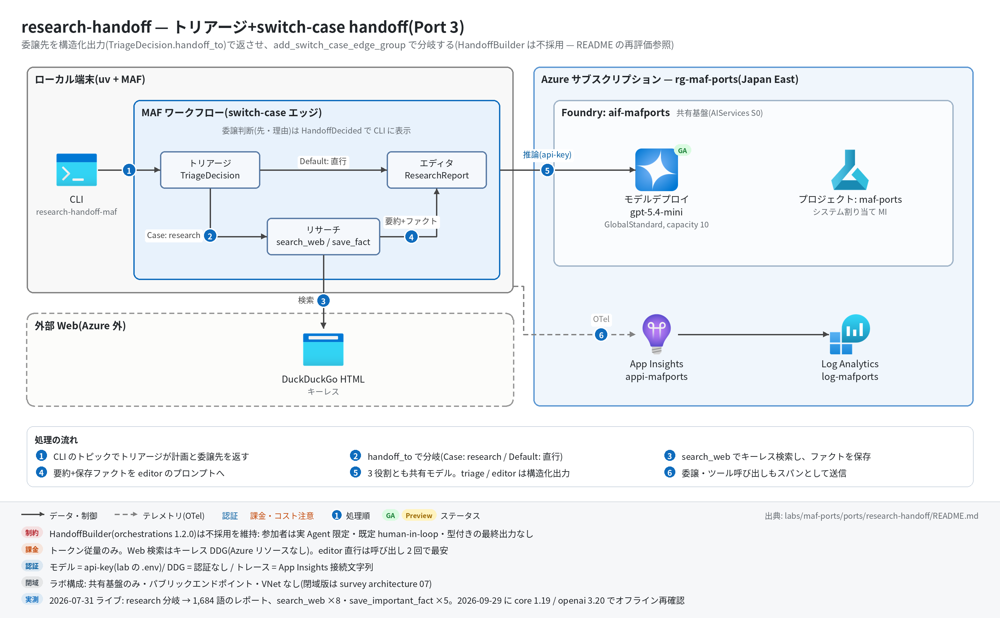

# research-handoff 実行ガイド

> **対象:** `labs/maf-ports/ports/research-handoff/`(Port 3・パターン: handoff/トリアージ — 構造化出力の委譲判断+ switch-case エッジ)
> **最終確認:** 2026-09-29 オフライン(31 passed・ruff clean・依存 agent-framework-core 1.19.0 / agent-framework-openai 1.14.4 / openai 3.20.0)/ ライブ: 2026-07-31(当時の構成 core 1.12.1 / openai 2.51.0。Azure リソースは削除済み — 再デプロイ手順は §5)
> **正は本 Markdown。** 人間用 HTML(同じディレクトリの `runbook.html`)は `python3 labs/tools/build_runbooks.py` で生成する(HTML は直接編集しない)。設計判断と移植の学び(HandoffBuilder を採用しなかった理由と 2026-09-29 の再評価を含む)は [README](../README.md)。

## 1. このパターンで確かめること

- triage が**計画+委譲先(`handoff_to`)+理由**を 1 つの構造化出力(`TriageDecision`)で返し、`handoff_to == "research"` なら research → editor、それ以外(`"editor"`)なら editor 直行に**グラフのエッジ条件で**分岐すること。委譲判断は `[triage] handoff → ...` として必ず可視化される。
- handoff 先が受け取るコンテキストが型付きメッセージとして明示されること: research は計画のクエリ・focus areas、editor は元クエリ+research 要約+`save_important_fact` で保存されたファクト(元 SDK の「会話履歴の暗黙引き継ぎ」の置き換え)。
- 構造化出力が崩れても止まらないこと: triage のパース失敗 → 既定計画で research に倒す / editor のパース失敗 → 生テキストを本文に(元アプリのフォールバックの踏襲)。
- 技術選定上の意味: 委譲先を**事前に列挙できる業務フロー**なら構造化出力+条件エッジでテスト可能に書ける。列挙できない会話型なら HandoffBuilder(別パッケージ)や元 SDK が有利(README の学び 1・2、再評価節)。

## 2. 構成



```text
                  ┌─[handoff_to == "research"]─▶ Research ──▶ Editor ─▶ ResearchHandoffResult
topic ─▶ Triage ──┤   (search_web +                (要約+facts を
         (構造化出力)  save_important_fact)          プロンプトで受領)
                  └─[Default("editor" 直行)]──────▶ Editor
進捗: HandoffDecided(triage)/ StageDone(research)→ type="intermediate" → CLI の stderr
```

| コンポーネント | 役割 | 課金 |
| --- | --- | --- |
| MAF Workflow(ローカル、`workflow.py`) | `add_switch_case_edge_group(triage, [Case(research), Default(editor)])` + `add_edge(research, editor)` | なし |
| MAF `Agent` ×3(`agents.py`) | triage_agent(`response_format=TriageDecision`)/ research_agent(ツール 2 種)/ editor_agent(`response_format=ResearchReport`)。`OpenAIChatClient`(Responses API) | — |
| モデルデプロイ(共有基盤、既定 gpt-5.4-mini) | 3 役割で 1 デプロイを共用。構造化出力は `text.format = json_schema`(strict)で送られる | トークン従量(editor は 1,000 語超の長文出力) |
| search_web(`search.py` / `tools.py`) | DuckDuckGo HTML をキーレスで検索(元の `WebSearchTool` の置き換え) | なし(外部サイト) |
| save_important_fact + `FactStore`(`tools.py`) | research 中のファクトを実行単位のストアに保存(元の Streamlit session_state の置き換え) | なし |
| App Insights(共有基盤) | OTel トレースの送信先(任意) | 取り込み量従量 |

## 3. 前提

| 区分 | 必要なもの | 備考 |
| --- | --- | --- |
| ツール | uv(Python 3.11 以上。uv が取得。検証は 3.13) | オフライン実行はこれだけ |
| Azure(ライブのみ) | 共有基盤([infra/shared.bicep](../../../infra/shared.bicep))のみ。本ポート固有のリソースはない | トークン従量+トレース取り込み |
| 権限 | モデル呼び出しは api-key なので**データプレーンの RBAC は不要** | roles.bicep(MI 向け)も不要 |
| ネットワーク(ライブのみ) | `html.duckduckgo.com` への外向き HTTPS | research 分岐でのみ使う |

環境変数(`labs/maf-ports/.env`。雛形は `.env.example`。**ライブ実行時のみ必要**。本ポート固有の変数はない):

| 変数 | 用途 | 取得元 |
| --- | --- | --- |
| `FOUNDRY_OPENAI_V1_ENDPOINT` | モデル呼び出し先。必須 | shared.bicep の出力 `openaiV1Endpoint` |
| `FOUNDRY_MODEL` | モデルデプロイ名。必須。構造化出力(json_schema strict)に対応したモデルであること | shared.bicep の出力 `modelDeploymentName` |
| `FOUNDRY_API_KEY` | api-key 認証。必須 | `az cognitiveservices account keys list -n <foundryName> -g <rg> --query key1 -o tsv` |
| `APPLICATIONINSIGHTS_CONNECTION_STRING` | トレース送信先。任意 | shared.bicep の出力 `appInsightsConnectionString` |

## 4. オフライン実行(Azure 不要・無料)

```bash
cd labs/maf-ports/ports/research-handoff
uv sync --extra dev
uv run pytest            # 期待: 31 passed, 1 deselected(live は既定で除外。ネットワーク不要)
uv run ruff check .      # 期待: All checks passed!(図生成スクリプト docs/architecture.py も対象)
```

オフラインテストが固定している主な挙動:

- [ ] 両分岐: `research` なら triage → research → editor が 1 回ずつ、`editor` なら research を呼ばず直行し、直行プロンプトに `No web research was performed` が入る(`test_research_route_runs_research_then_editor` / `test_editor_route_skips_research`)
- [ ] handoff 先のコンテキスト: research に計画のクエリと focus areas、editor に元クエリ・research 要約・保存ファクトと出典が渡る(`test_research_prompt_carries_plan_context` / `test_editor_prompt_carries_query_summary_and_facts`)
- [ ] 構造化出力の 3 経路: ネイティブ `.value` 優先 / 散文包み JSON の抽出 / パース失敗・未知の `handoff_to` は既定計画で research に fallback(`test_triage_native_value_path` / `test_triage_json_wrapped_in_prose` / `test_triage_parse_failure_falls_back_to_research` / `test_triage_unknown_route_falls_back`)
- [ ] editor のレポートは構造化出力から取り、崩れたら生テキストを本文にする(`test_editor_report_parsed_from_structured_output` / `test_editor_parse_failure_falls_back_to_raw_report`)
- [ ] 進捗イベント: research 経由は `HandoffDecided` 1 件+`StageDone("research")` 1 件、editor 直行は `StageDone` なし(`test_progress_events_research_route` / `test_progress_events_editor_route`)
- [ ] 実 `Agent` での配線: triage / editor に `response_format`、research に `search_web` と `save_important_fact`(`tests/test_agents_build.py`)
- [ ] `--json` 用の `to_dict()` が JSON 直列化できる(`test_result_to_dict_is_json_serializable`)

## 5. ライブ実行(Azure 必要・課金あり)

### 5.1 デプロイ

```bash
# 共有基盤が未作成なら先に作る(→ labs/maf-ports/infra/docs/runbook.md §5)。本ポート固有のリソースはない。
cd labs/maf-ports/ports/research-handoff
az deployment group create -g <rg> -f infra/main.bicep -p baseName=<baseName> \
  --query properties.outputs -o json   # 任意: 共有基盤の存在確認(existing 参照+出力のみ)
```

### 5.2 実行

```bash
uv sync --extra dev --extra live
# research 分岐が期待されるトピック(鮮度依存)
uv run research-handoff-maf "best affordable espresso machines for a French press upgrader"
# editor 直行が期待されるトピック(教科書的知識)
uv run research-handoff-maf "Explain the difference between TCP and UDP for a junior engineer"
# 保存ファクトも表示 / 全出力を JSON で
uv run research-handoff-maf --show-facts "..."
uv run research-handoff-maf --json "..." > result.json
uv run pytest -m live   # ライブスモーク(topic "Recent developments in AI coding agents for enterprises"。1 passed が期待)
```

期待される出力の例(値は実行ごとに変わる。語数は 2026-07-31 のライブ実測):

```text
[triage] handoff → research (<triage が返した 1 文の理由>)    ← stderr
[research] done (<N> chars)                                   ← stderr(editor 直行では出ない)
# <レポートのタイトル>                                          ← stdout
## Outline
1. ...
<本文(Markdown、長文)>
## Sources
1. https://...
(word count: 1684)                                            ← stderr
```

`--json` の形: `{"topic", "handoff_to", "reason", "plan": {"topic", "search_queries", "focus_areas"}, "research_md", "facts": [{"fact", "source", "timestamp"}], "report": {"title", "outline", "report", "sources", "word_count"}}`(editor 直行では `research_md` が `null`、`facts` が空)。

## 6. 確認観点

| 確認 | # | 観点 | 確認方法 | 期待結果 |
| --- | --- | --- | --- | --- |
| [ ] | 1 | 正常系: research 経由 | §5.2 の espresso トピック | stderr に `[triage] handoff → research (...)` と `[research] done`、stdout にタイトル・Outline・本文・Sources のレポート |
| [ ] | 2 | 分岐: editor 直行 | §5.2 の TCP/UDP トピック | `[triage] handoff → editor (...)`、`[research] done` は出ない。`--json` で `research_md: null` / `facts: []`。Sources に架空の URL が並んでいないかも見る(eval の `no fabricated sources`) |
| [ ] | 3 | 分岐の妥当性(評価データ) | `tests/eval_dataset.jsonl` の 6 トピックを順に実行し、`handoff_to` と `expected_route` を突き合わせる | 鮮度依存(価格・規制・旅行)は research、教科書的(TCP/UDP・TPS)は editor。境界ケースのぶれは記録する(合否ラインは設けない) |
| [ ] | 4 | handoff 先のコンテキスト | `--show-facts` / `--json` の `facts` と `report.sources` | research 中に保存されたファクト(出典 URL 付き)があり、レポートの Sources に反映されている |
| [ ] | 5 | 構造化出力の成立 | `--json` の `report.outline` と `report.word_count` | outline が空でなく word_count が 1,000 前後以上(生テキスト fallback だと outline が空・title がトピック文そのものになる) |
| [ ] | 6 | 異常系: fallback | ライブでは狙って起こしにくい。オフラインの fallback テスト(§4)で担保し、ライブでは `reason` を見る | `reason` が `fallback: triage output was not parseable` なら triage の構造化出力が崩れた(既定計画で research 続行)。頻発するならモデルの構造化出力対応を確認 |
| [ ] | 7 | 観測: トレース着信 | §7 の件数 KQL | `invoke_agent` 3 種(triage_agent / research_agent / editor_agent)、`execute_tool search_web` / `save_important_fact`、`edge_group.process SwitchCaseEdgeGroup` が出る(2026-07-31 実測: `invoke_agent` ×3・`search_web` ×8・`save_important_fact` ×5) |
| [ ] | 8 | コスト | §7 のトークン集計 KQL | research 経由は `chat` 呼び出しが多く(ツール往復分)、editor の出力トークンが最大。editor 直行は `chat` 2 回で最安 |
| [ ] | 9 | 後片付け | 本ポート固有のリソースはない | 共有基盤を使い終えたら [共有基盤の実行ガイド](../../../infra/docs/runbook.md) §8 |

## 7. トレース・評価の確認

```bash
# スパン名ごとの件数
az monitor app-insights query --app appi-<baseName> -g <rg> \
  --analytics-query "dependencies | where timestamp > ago(30m) | summarize count() by name"

# トークン使用量(chat スパンの GenAI 属性)
az monitor app-insights query --app appi-<baseName> -g <rg> \
  --analytics-query "dependencies | where timestamp > ago(30m) and name startswith 'chat' | summarize calls=count(), input=sum(toint(customDimensions['gen_ai.usage.input_tokens'])), output=sum(toint(customDimensions['gen_ai.usage.output_tokens']))"
```

- 期待するスパン名(2026-09-29 に agent-framework-core 1.19.0 のインメモリ OTel で確認): `workflow.run` / `executor.process triage|research|editor` / `edge_group.process SwitchCaseEdgeGroup` / `invoke_agent triage_agent|research_agent|editor_agent` / `chat <デプロイ名>` / `execute_tool search_web|save_important_fact` / `message.send`。
- 委譲判断の理由はトレースでなく CLI の `[triage] handoff → ...` と `--json` の `reason` に残る(データとして残すのがこのパターンの利点)。
- 評価: `tests/eval_dataset.jsonl`(6 ケース、`expected_route` + `expected_traits`)。クラウド評価は未実装(評価 API の使い方は Port 9 critique-loop)。

## 8. 片付け

```bash
# 本ポート固有のリソースはない。共有基盤ごと消す場合:
az group delete -n <rg> --yes --no-wait
```

- 同じ `baseName` で作り直す場合の soft delete(48 時間)は [共有基盤の実行ガイド](../../../infra/docs/runbook.md) §8。
- ローカルの生成物(`result.json` など)は手で削除する。

## 9. トラブルシューティング

| 症状 | 原因 | 対処 |
| --- | --- | --- |
| `error: 環境変数が未設定: ...`(終了コード 2) | `labs/maf-ports/.env` がない / 変数名の誤り | `.env.example` をコピーして共有基盤の出力を転記 |
| 400 で `response_format` / `json_schema` に関するエラー | デプロイしたモデルが構造化出力(strict json_schema)に非対応 | 構造化出力対応モデル(既定 gpt-5.4-mini)に戻す。モデルの対応状況は [features/02-models.md](../../../../../docs/survey/features/02-models.md) |
| 毎回 `fallback: triage output was not parseable` | triage の応答が `TriageDecision` に合わない(未知の `handoff_to` など) | `--json` の `plan` が既定計画(`Researching <topic>`)になっているか確認。モデル・プロンプトを見直す |
| レポートの outline が空・タイトルがトピック文 | editor の構造化出力が崩れて生テキスト fallback | 上と同じ。レポート本文自体は出ているので致命ではない |
| 研究分岐で Sources が空・ファクト 0 件 | DDG が 202/403 でブロック(ツールは `Error: Function failed.` を返す) | 時間をおく / 別ネットワーク。研究なしでも editor までは完走する |
| 401 / 404 / 429 | キー誤り / `FOUNDRY_MODEL` とデプロイ名の不一致 / 容量超過 | [trend-analysis の実行ガイド](../../trend-analysis/docs/runbook.md) §9 と同じ |

## 10. 関連・更新履歴

- 設計判断と学び(HandoffBuilder 不採用の理由と 2026-09-29 再評価): [README](../README.md)
- HandoffBuilder を実際に組んだ比較: [game-design-team(Port 7)の README](../../game-design-team/README.md)
- 共有基盤(デプロイ・.env・RBAC・削除): [共有基盤の実行ガイド](../../../infra/docs/runbook.md)
- 前のパターン: [mixture-of-agents(Port 2・並列+集約)](../../mixture-of-agents/docs/runbook.md)

| 日付 | 内容 |
| --- | --- |
| 2026-09-29 | 初版。構成図を v2(日本語・処理順バッジ)に更新(依存を agent-framework-core 1.19.0 / openai 3.20.0 に更新、コード改修なし。モックで両分岐・構造化出力の要求形・スパン名を確認。HandoffBuilder 1.2.0 を再評価し不採用を維持) |
