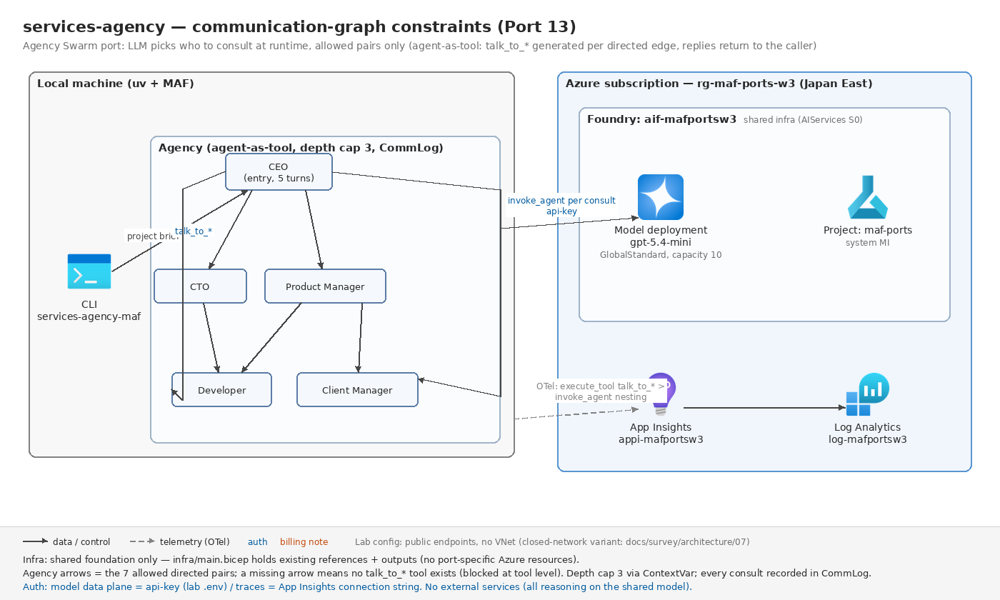

# services-agency — Agency Swarm 通信グラフの agent-as-tool 移植(Port 13)

元: [`advanced_ai_agents/multi_agent_apps/agent_teams/ai_services_agency`](https://github.com/Shubhamsaboo/awesome-llm-apps/tree/main/advanced_ai_agents/multi_agent_apps/agent_teams/ai_services_agency)(Agency Swarm 1.7 + Streamlit、約 370 行)

Wave 3 の初回ポート。核心は **「動的な会話開始 × 通信グラフ制約」を MAF でどう表現するか**の境界測定 — LLM が実行時に通信相手を選び(固定シーケンスではない)、選択肢は `communication_flows` の有向グラフで制約され、会話は「送信側が受信側をツールとして呼び、応答を自分の応答に統合する」再帰呼び出しになる。結論: **MAF のグラフ Workflow には載らず、Agent+関数ツールだけの agent-as-tool 方式が主実装になる**(学び 1)。

## 元の構成(5行)

- ソフトウェア受託エージェンシーの 5 役: CEO(Project Director)/ CTO(Technical Architect)/ PM / Lead Developer / Client Success Manager。Streamlit フォームで案件を受け、5 役の分析を 5 タブに表示
- 協調は Agency Swarm の `communication_flows`(有向ペア 7 本): CEO→全員、CTO→Dev、PM→Dev、PM→CS。各ペアに SendMessage ツールが自動注入され、**LLM が実行時に相談相手を選ぶ**
- BaseTool 2 つが shared context で順序を強制: `analyze_project`(CEO。分析済みなら ValueError)→ `create_technical_spec`(CTO。分析が無ければ ValueError)
- トップレベルは 5 回の `get_response_sync`(ceo → cto → pm → dev → cs の固定順)。エージェント間通信は各ターンの**中で**モデルの裁量により発生する
- モデル設定は役割別 temperature(0.7/0.5/0.4/0.3/0.6)+ max_tokens=25000(OpenAI 直)

## 移植後の構成



```
CLI: services-agency-maf "プロジェクト依頼文" [--name/--type/--budget/...]
  └ run_agency: トップレベル 5 ターン(元の 5 タブと同順)
       │
  Agency(登録簿+通信グラフ+共有 ProjectState+CommLog)
       │  build_agency が COMMUNICATION_FLOWS から talk_to_* ツールを生成
       ▼
  ceo   ── talk_to_cto / talk_to_product_manager / talk_to_developer /
       │    talk_to_client_manager + analyze_project
  cto   ── talk_to_developer + create_technical_spec
  pm    ── talk_to_developer / talk_to_client_manager
  dev   ── (ツールなし。出次数 0)
  cs    ── (ツールなし。出次数 0)

  talk ツールの実装 = agency.call(sender, recipient, message):
    グラフ再検査 → 深度判定(ContextVar、上限 3)→ CommLog 記録
    → 相手 Agent.run(message) → 応答文字列をツール結果として返す(再帰)
```

### Agency Swarm → MAF 対応表

| 元(Agency Swarm 1.7) | 移植後(MAF) | 備考 |
| --- | --- | --- |
| `Agency(communication_flows=[(a,b),...])` | `flows.py` のタプル列(データ)+ `Agency.talk_tools()` が **talk_to_\<recipient\> を生成** | 許可ペアのみ生成 = 非許可は「ツール不在」の構造制約 |
| SendMessage ツール(自動注入・共通装置) | `make_talk_tool()` のクロージャ(`__name__`/`__doc__` を動的付与) | 約 20 行。docstring に相手の表示名+description |
| ネストした会話スレッド(FW 内部) | `agency.call()` の再帰 `Agent.run` + **ContextVar 深度制御(上限 3)** | 元は上限なし。実グラフは DAG 最長 2 ホップなので 3 は安全弁 |
| shared context(`self.context`) | `ProjectState`(クロージャ束縛。5 ターン+入れ子会話で共有) | context キー名(project_analysis 等)も保存 |
| `BaseTool` 2 つ(Pydantic Field + ToolConfig) | 素の関数+`Literal` 型(MAF がシグネチャ/docstring から推論) | enum・必須項目はスキーマ検証で同等(実機確認済み) |
| ツールの `raise ValueError(msg)` → FW が msg をモデルへ返す | **raise せず同文言を return** | MAF はツール例外を "Error: Function failed." に丸めるため(include_detailed_errors 既定 False) |
| `get_response_sync(recipient_agent=...)` ×5 | `run_agency()` の 5 ターン(同順・同文言) | `additional_instructions` はメッセージ末尾への追記に翻訳 |
| 役割別 temperature + max_tokens | **落とした** | gpt-5.4-mini は reasoning 系で temperature 不可(罠 6)。個性は instructions のペルソナが担う |
| Streamlit フォーム+5 タブ | CLI(引数+Markdown レポート) | PORTING.md 規約 |
| (可視化なし) | **CommLog**: 全通信の構造化記録(seq/sender/recipient/depth/message/reply/blocked)+ listener で逐次表示 | トレースの見どころと対になる移植側の追加 |

## 設計判断

### 主実装は agent-as-tool(グラフ Workflow を使わない)

`WorkflowBuilder` のエッジは「メッセージが流れる固定経路」で、(1) エッジを通るかは送信側 Executor のコードが決め、(2) メッセージは**一方向に流れて戻らない**。本アプリの通信は (1) 呼ぶかどうか・誰を・何度でもを **LLM がターン中に決め**、(2) 応答が**呼び出し元に戻って**その応答に統合される(呼び出し規約が関数呼び出し)。この 2 点はエッジの意味論と合わず、MAF で自然に載る器は「関数ツール」だけだった(詳細は学び 1)。

### グラフ制約は「プロンプト」でなく「ツールの不在」で構造化する

`communication_flows` にあるペアの分しか talk ツールを**生成しない**。非許可ペア(例: CTO→CEO、CS→誰か)はツールが存在しないため、モデルがどう指示されても通信できない。テストは全 25 ペア(5×5)を総当たりし、許可 7 ペアのみツールが存在することを固定する(`test_flows.py` / `test_agents_build.py`)。有向性も保存 — 元 README の「CEO ↔ All Agents」の双方向矢印はコード上一方向で、移植では `is_allowed("cto","ceo") == False` として明文化した。

### 再帰深度は ContextVar、打ち切りは「例外」でなく「ブロック通知の return」

元実装に再帰上限はない(実グラフが DAG なので実質有限)。移植は課題指定どおり深度 3 で打ち切る。深度は `contextvars.ContextVar` で追跡 — LLM が並列ツール呼び出しを出して asyncio が分岐しても枝ごとに正しく数えられる。打ち切り時は `[communication blocked] ...` を**ツール結果として返す**: MAF はツール例外の詳細をモデルに見せないため、例外だとモデルは「なぜ失敗したか」を知れず再試行ループに入るリスクがある。深度は連鎖の深さだけを制限し、同一深度の呼び出し回数(幅)は MAF 側の `max_iterations` が実質の上限になる。なお実グラフで深度打ち切りは発生し得ないため、検証は循環グラフ(ceo⇄cto)を注入して行う(`test_comms.py`)— グラフをデータにした設計の副産物。

### 通信ログ(CommLog)を一級市民にする

元 Agency Swarm では「誰が誰に何を聞いたか」は FW 内部のスレッド管理に埋もれる。移植では通信 1 件 = `CommEvent`(seq / sender / recipient / depth / message / reply / blocked)として必ず記録し、(a) CLI の stderr に逐次表示、(b) 最終レポートの Communication Log セクション、(c) JSON 出力、の 3 面に出す。App Insights 側では `execute_tool`(talk_to_*)の下に相手の `invoke_agent` がぶら下がる**入れ子スパン**が同じ情報のトレース表現になる。

### 元実装の癖の発見と保存(移植はコードレビュー)

- `analyze_project` は **project_description と budget_range をどこにも保存せず**、分析結果は完全に canned(complexity=high / timeline=6 months / budget_feasibility=within range)。「分析ツール」の実体は shared context に印を付ける順序制御装置だった(`test_analyze_preserves_original_quirk_description_not_stored` で固定)
- `create_technical_spec` の technologies は素の `split(",")` で strip しない(`"python, fastapi ,react"` → `[" fastapi "]`)— 挙動互換で保存
- CEO の instructions は「AnalyzeProjectRequirements tool」とクラス名で呼ぶが、モデルに見えるツール名は `analyze_project`(ToolConfig.name)。原文どおり保存(ツールが 1 つなので実害なし)

### 元との差分(意図的)

- **ペア別会話スレッドの永続なし**: Agency Swarm は sender-recipient ペアごとに会話スレッドを保持し、2 回目の相談は続きから始まる。移植の talk は毎回 one-shot の `Agent.run`(メッセージに全文脈を含めるよう instructions で指示)。本アプリの使い方(単発分析)では差が出ないため省いたが、長い協調では `AgentThread` をペアごとに Agency が保持する拡張が対応点になる
- `additional_instructions`(実行時の指示追記)は `Agent.run(message)` に相当口が無いため、メッセージ末尾の「Additional instructions:」に翻訳

## 実行

```bash
uv sync --extra dev
uv run pytest              # オフライン(ネットワーク不要・69 件)
uv run ruff check src tests

# --- ライブ(要 共有基盤 + ../../.env)---
uv run services-agency-maf "AI-assisted note sharing SaaS for university students." \
    --name NoteHub --type "Web Application" --budget "\$25k-\$50k"
uv run services-agency-maf "..." --json --output runs/report.json
uv sync --extra dev --extra live && uv run pytest -m live   # スモーク
```

インフラは共有基盤のみで動く(`infra/main.bicep` は existing 参照+出力のみ。`az deployment group create -g rg-maf-ports -f infra/main.bicep -p baseName=mafportsw3`)。

## 評価

[tests/eval_dataset.jsonl](./tests/eval_dataset.jsonl)(5 ケース)は「案件 → **どの役割間通信が発生すべきか**」を定義する: `must_comms`(期待される通信ペア)と `forbidden_comms`(グラフが構造的に禁止するペア)。オフラインでは (1) must がグラフ上達成可能、(2) forbidden が実際にツール不在、(3) 案件フィールドが元フォームの選択肢に収まる、を固定する。ライブでは実行後の `agency.log.agent_pairs()` を must_comms と突き合わせる(発生は LLM の裁量なので、PORTING §3 に従い合否ラインは設けず観察記録とする)。

## 検証結果(2026-07-31 オフライン)

- オフラインテスト **69 passed**(グラフ+ツール生成 12 / 通信ログ・深度制御 14 / 多段会話フロー 8 / 実 Agent 配線 4 / 役割ツール 7 / データセット 21 / 設定 3)/ ruff clean / `az bicep build` OK(生成 json は削除)
- 実 MAF `Agent` での配線はオフラインで確認済み: 動的クロージャの `__name__`/`__doc__` からのスキーマ推論(talk_to_* の message パラメータ)、`Literal` → enum(project_type / budget_range / architecture_type)を installed package で実機突合済み
- ライブスモークは未実施(呼び出し元が実施)。**未検証の残リスク**:
  1. 実モデルが talk_to_* を実際に選ぶか(エージェント間通信ゼロだとスモークの assert `pairs` が落ちる設計。instructions の "coordinate with ..." と entry prompt が誘導するが、モデル裁量)
  2. CEO が analyze_project を確実に呼ぶか(元アプリと同じ「FIRST, use the ... tool」指示に依存)
  3. 深度打ち切りは実グラフでは発生しないため、ライブでは観察対象外(オフラインの循環グラフ注入でのみ検証)

## 検証結果(2026-07-31 ライブ)

- オフライン **69 passed** / ruff clean / bicep build OK
- ライブスモーク **1 passed(75s)**: 実モデルが 5 ターンのプロジェクト遂行中に `talk_to_*` ツールを自発的に選択し、**許可グラフ内の通信のみ**が発生(CommLog で全通信を検証)
- トレース: `execute_tool talk_to_*` の中に `invoke_agent <役割>` が入れ子になるスパン構造で「誰が誰に相談したか」がそのまま可視化(下記クエリで確認)

## 学び(MAF/Foundry vs 元構成)

1. **「動的通信 × グラフ制約」は MAF ではグラフ Workflow でなく agent-as-tool になる — 理由は制御の所在と呼び出し規約の 2 点。**MAF Workflow のエッジは「どこへ送るか」をコード(Executor / switch-case 条件)が決める静的経路であり、①本アプリの「相談するかどうか・誰に・何度でも」という**実行時の LLM 裁量**をエッジに載せるには、全許可ペア分のエッジ+選択を構造化出力で返させる Executor を書くことになり、それはもはや「LLM がツールを選ぶ」ことのグラフによる再実装でしかない。②さらに致命的なのは呼び出し規約: エッジはメッセージが**一方向に流れて戻らない**が、本アプリの通信は「聞いて、答えが**返ってきて**、自分の応答に統合する」**関数呼び出し**の形をしている。関数呼び出しの意味論を持つ器は MAF では関数ツールそのもので、だから `talk_to_x(message) -> str` の中で相手 `Agent.run` を await する 20 行(`agency.call`)が全部になる。逆に言えば、Port 3(research-handoff)で「handoff をグラフ化して得をした」のは委譲が**戻らない**one-way だったから — **戻るか戻らないかが Workflow に載るかの試金石**というのが本ポートの最大の発見。
2. **三つ巴比較(グラフ Workflow / HandoffBuilder / agent-as-tool)は「制御が誰にあり、応答がどこへ行くか」の 2 軸で整理できる。**グラフ Workflow: 制御=コード、応答=次ノードへ(戻らない)。決定的・型付き・スパン自動 — 委譲先が仕様で決まるとき最強(Port 1-12 の主力)。HandoffBuilder(orchestrations): 制御=LLM、応答=**会話全体**へ(handoff_to_* を呼ぶと制御ごと相手に移り、元エージェントには戻らない)。会話の主導権交代を表現する器であり、human-in-loop 既定で one-shot には向かない(Port 7 で実証)。agent-as-tool(本ポート): 制御=LLM、応答=**呼び出し元へ戻る**。相談された側は主導権を持たず、聞かれたことに答えるだけ — 組織のメタファーで言えば handoff は「担当交代」、agent-as-tool は「部下への相談」。Agency Swarm の communication_flows は後者で、HandoffBuilder で真似ようとすると「CEO に必ず戻ってくる handoff」をプロンプトで祈ることになる。**協調パターンの語彙は handoff 1 語では足りず、consultation(相談型)を別の型として扱うべき**。
3. **Agency Swarm との表現力差: フレームワークの「装置」は 3 つの手書きに分解されたが、失ったのは行数でなくスレッド永続だった。**Agency Swarm の `communication_flows=[(a,b)]` 1 行は、(i) SendMessage ツールの生成・注入、(ii) 通信可能な相手のプロンプト案内、(iii) ペア別の**会話スレッド管理**、を自動でやる。MAF 移植では (i) がクロージャ生成 20 行、(ii) が instructions への明示追記(書き忘れるとツールが使われない=移植の罠)、(iii) は **one-shot の `Agent.run` に落とした**(2 回目の相談が続きから始まらない)。(i)(ii) は手書きになった分、「モデルに何が見えているか」がコードから読め、CommLog・深度制御・グラフ検証テストを差し込む場所ができた — ScriptedAgent での多段会話フロー 69 テストがネットワークなしで回るのは Agency Swarm 側では難しい。(iii) だけは本質的な損失で、長期協調を移植するなら `AgentThread` のペア別保持を自作することになる。**「フレームワークの魔法 1 行 vs 分解された 20 行×3」の選択は、テスト可能性とスレッド管理のどちらを買うかのトレードオフ**。
4. **tech-selection-guide 1-1(handoff 分水嶺)の更新提案: 分水嶺は 2 値でなく 3 値にすべき。**現行の「委譲先が仕様で決まるならグラフ、会話の流れで決まるなら handoff 基盤」に、本ポートで第 3 の型が加わった: **「会話の流れで決まるが、制御が呼び出し元に戻る(相談型)なら agent-as-tool」**。判定手順の提案 — ①委譲先は実行時に LLM が決めるか? No → グラフ Workflow。②Yes: 応答は呼び出し元に戻るか? 戻る(相談・諮問・下請け)→ agent-as-tool(MAF core の Agent+関数ツールだけで組める。orchestrations 不要)。戻らない(担当交代・エスカレーション)→ HandoffBuilder / OpenAI Agents SDK 系。付記として「元アプリの多くの『マルチエージェント通信』は相談型」も価値がある — Agency Swarm 系のアプリはこの分類で全部 agent-as-tool に落ち、グラフ化(決定論化)も handoff 基盤も要らない。
5. **深度制御と可観測性は「フレームワークが隠すもの」を移植側で一級市民にする好例。**再帰 agent-as-tool は原理的に無限再帰し得るが(循環グラフ+従順なモデル)、ContextVar 1 本で並列ツール呼び出しにも安全な深度追跡ができ、打ち切りを「例外」でなく「ブロック通知の return」にすることで**モデル自身が打ち切りを知って続行できる**(MAF がツール例外を "Error: Function failed." に丸める仕様への適応でもある — 罠 12 点に追加候補)。CommLog は同じ情報の CLI/JSON 表現、App Insights の execute_tool→invoke_agent 入れ子スパンはトレース表現で、「通信グラフの発火経路」という本ポート固有の関心事が 3 面すべてで見える。元 Agency Swarm ではこのどれも外から見えない。
