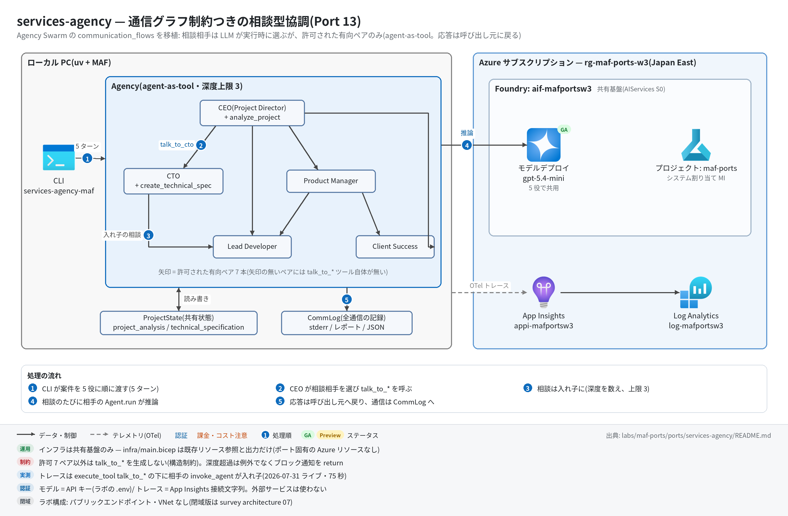

# services-agency 実行ガイド

> **対象:** `labs/maf-ports/ports/services-agency/`(Port 13・パターン: 通信グラフ制約つきの相談型協調 — agent-as-tool)
> **最終確認:** 2026-09-29 オフライン(69 passed・ruff clean・依存 agent-framework-core 1.19.0 / agent-framework-openai 1.14.4 / openai 3.20.0)/ ライブ: 2026-07-31(スモーク 1 passed・75 秒。当時の構成。Azure リソースは削除済み — 再デプロイ手順は §5)
> **正は本 Markdown。** 人間用 HTML(同じディレクトリの `runbook.html`)は `python3 labs/tools/build_runbooks.py` で生成する(HTML は直接編集しない)。設計判断と移植の学びは [README](../README.md)。

## 1. このパターンで確かめること

- 5 役(CEO / CTO / PM / Lead Developer / Client Success)が、トップレベル 5 ターンの**中で** LLM の裁量により相談相手を選び(`talk_to_*` ツール)、相手の応答が**呼び出し元に戻って**自分の回答に統合されること(agent-as-tool。グラフ Workflow には載らない理由は README 学び 1)。
- 通信は元アプリの `communication_flows`(有向 7 ペア)の中でだけ起きること。非許可ペアは**ツール自体が生成されない**ので、プロンプトの出来に関係なく通信できない(構造制約)。
- 入れ子の相談は ContextVar で深度を数え、上限を超えると例外でなく**ブロック通知を return** してモデルが続行できること。通信はすべて CommLog(stderr・レポート・JSON)とトレース(`execute_tool` の下に相手の `invoke_agent`)の両方に残ること。

## 2. 構成



| コンポーネント | 役割 | 課金 |
| --- | --- | --- |
| Agency(ローカル、`agency.py`) | 5 役の登録簿+通信グラフ+共有状態(`ProjectState`)+CommLog。`talk_to_*` を許可ペア分だけ生成し、相手の `Agent.run` を再帰的に呼ぶ | なし |
| 役割ツール(`project.py`) | CEO: `analyze_project` / CTO: `create_technical_spec`(共有状態で「分析 → 仕様」の順序を強制) | なし |
| モデルデプロイ gpt-5.4-mini(共有基盤) | 5 役で共用。呼び出し回数はモデルの相談の仕方しだい(5 ターン+相談ぶん) | トークン従量 |
| App Insights `appi-<baseName>`(共有基盤) | OTel トレースの送信先 | 取り込み量従量(少量) |

本ポート固有の Azure リソースはない([infra/main.bicep](../infra/main.bicep) は共有基盤の existing 参照と出力だけ)。

通信グラフ(sender → recipient。これ以外のペアにはツールが無い):

```text
ceo ──▶ cto ──▶ developer
 │ ├──▶ product_manager ──▶ developer
 │ │                    └─▶ client_manager
 │ ├──▶ developer
 │ └──▶ client_manager
developer / client_manager は出次数 0(誰にも話しかけない)。最長 2 ホップの DAG
```

## 3. 前提

| 区分 | 必要なもの | 備考 |
| --- | --- | --- |
| ツール | uv(Python は uv が取得。検証は 3.13) | オフライン実行はこれだけ |
| Azure(ライブのみ) | 共有基盤([infra/shared.bicep](../../../infra/shared.bicep))のみ | 課金はモデルのトークンと App Insights の取り込み |
| 権限 | 実行時の認証は **API キー**(`FOUNDRY_API_KEY`)なのでデータプレーンの RBAC 付与は不要。デプロイには RG の共同作成者 | — |

環境変数(`labs/maf-ports/.env`。雛形は [.env.example](../../../.env.example)。**ライブ実行時のみ必要**。本ポート固有の変数はない):

| 変数 | 用途 | 取得元 |
| --- | --- | --- |
| `FOUNDRY_OPENAI_V1_ENDPOINT` | モデルの呼び先(`https://<foundry>.openai.azure.com/openai/v1`) | shared.bicep / main.bicep の出力 `openaiV1Endpoint` |
| `FOUNDRY_MODEL` | モデルのデプロイ名(例: `gpt-5.4-mini`) | shared.bicep の出力 `modelDeploymentName` |
| `FOUNDRY_API_KEY` | Foundry の API キー | `az cognitiveservices account keys list -n aif-<baseName> -g <rg>` |
| `APPLICATIONINSIGHTS_CONNECTION_STRING`(任意) | トレース送信先。未設定ならトレース無効で実行は続く | shared.bicep の出力 `appInsightsConnectionString` |

## 4. オフライン実行(Azure 不要・無料)

```bash
cd labs/maf-ports/ports/services-agency
uv sync --extra dev
uv run pytest                                  # 期待: 69 passed, 1 deselected(ネットワーク不要)
uv run pytest -W error::DeprecationWarning     # 期待: 69 passed
uv run ruff check .                            # 期待: All checks passed!
```

オフラインテストが固定している主な挙動:

- [ ] 全 25 ペア(5×5)を総当たりし、許可 7 ペアにだけ `talk_to_*` が生成される / 向きが保存される(`test_no_tool_exists_for_disallowed_pairs` / `test_direction_matters`)。実 `Agent` 上のツール構成も同じ(`test_real_agents_carry_graph_generated_tools`)
- [ ] 多段の相談で応答が呼び出し連鎖を遡って統合される(`test_replies_integrate_up_the_call_chain`)。全通信がグラフ内(`test_all_agent_pairs_stay_within_graph`)
- [ ] 循環グラフ(ceo⇄cto)を注入すると深度上限で打ち切られ、ブロック通知が**例外でなく文字列**で返る(`test_infinite_ping_pong_is_cut_at_max_depth` / `test_blocked_call_returns_notice_not_exception`)
- [ ] トップレベル 5 ターンが元アプリと同じ順・同じ文言で走り、共有状態がターンをまたいで見える(`test_run_agency_runs_five_turns_in_original_order` / `test_shared_state_visible_across_turns`)
- [ ] 役割ツールの順序制御(分析前の仕様作成・二重分析はエラー文言を return)と元実装の癖の保存(`tests/test_project_tools.py`)
- [ ] 評価データセットの `must_comms` がグラフ上達成可能で、`forbidden_comms` は構造的に不可能(`tests/test_eval_dataset.py`)

## 5. ライブ実行(Azure 必要・課金あり)

### 5.1 デプロイ

```bash
# 共有基盤が未作成なら作る(詳細は labs/maf-ports/README.md「実行の前提」)
cd labs/maf-ports
az group create -n rg-maf-ports -l japaneast
az deployment group create -g rg-maf-ports -f infra/shared.bicep \
  -p baseName=mafports modelName=gpt-5.4-mini modelVersion=2026-03-17 modelCapacity=10
#   モデル名・版は docs/survey/features/02-models.md で現行を確認(上は 2026-09-29 時点の例)

# 本ポートの main.bicep は出力の再掲だけ(リソースを作らない)。.env の値の確認用
cd ports/services-agency
az deployment group create -g rg-maf-ports -f infra/main.bicep -p baseName=mafports
```

2026-07-31 の Wave 3 検証は RG `rg-maf-ports-w3`・`baseName=mafportsw3` で行った(図の `aif-mafportsw3` / `appi-mafportsw3` はそのときの名前)。本ガイドの `rg-maf-ports` / `mafports` は自分の環境の名前に読み替える。

### 5.2 実行

```bash
uv sync --extra dev --extra live
uv run services-agency-maf "AI-assisted note sharing SaaS for university students." \
    --name NoteHub --type "Web Application" --budget '$25k-$50k'
uv run services-agency-maf "..." --json --output runs/report.json   # JSON(responses / communications / state)
uv run services-agency-maf "..." --max-depth 1                      # 深度制御をライブで観察(§6 #4)
uv run pytest -m live                                                # スモーク(NoteHub 案件)
```

選択肢つきの引数: `--type`(Web Application / Mobile App / API Development / Data Analytics / AI/ML Solution / Other)・`--timeline`(1-2 months / 3-4 months / 5-6 months / 6+ months)・`--budget`($10k-$25k / $25k-$50k / $50k-$100k / $100k+)・`--priority`(High / Medium / Low)。`$` を含む値はシェルで展開されないよう単引用符で囲む。

期待される出力の例(値と相談の有無は実行ごとに変わる。CLI の書式とテストの期待値から作った**形の例**):

```text
tracing: App Insights 有効
[comm] user -> ceo (depth 0): Analyze this project using the AnalyzeProjectRequirements tool: Project Name: NoteHub ...
[comm]   ceo -> cto (depth 1): We are scoping NoteHub, an AI-assisted note sharing SaaS ...
[comm]     cto -> developer (depth 2): Can the core features be delivered in 3-4 months ...
[comm]     developer -> cto: reply 1830 chars
[comm]   cto -> ceo: reply 2410 chars
[comm] ceo -> user: reply 3120 chars
[turn] ceo done (3120 chars)
[comm] user -> cto (depth 0): Review the project analysis and create technical specifications ...
...
[turn] client_manager done (2650 chars)
# AI Services Agency — NoteHub        ← ここから stdout(Markdown レポート)
## CEO's Strategic Analysis
...
## Communication Log
#1 user -> ceo [depth=0] '...' => reply 3120 chars
  #2 ceo -> cto [depth=1] '...' => reply 2410 chars
...
## Shared Project State
{"project_analysis": {"name": "NoteHub", "complexity": "high", ...}, "technical_specification": {...}}
```

## 6. 確認観点

| 確認 | # | 観点 | 確認方法 | 期待結果 |
| --- | --- | --- | --- | --- |
| [ ] | 1 | 正常系: 5 ターン完走 | §5.2 の 1 行目 | stderr に `[turn] ceo` → `cto` → `product_manager` → `developer` → `client_manager` の順に 5 行。stdout のレポートに 5 セクション+Communication Log+Shared Project State |
| [ ] | 2 | 役割ツールの順序制御 | レポート末尾の Shared Project State(または `--json` の `state`) | `project_analysis` が埋まる(CEO が `analyze_project` を呼んだ)。`technical_specification` も埋まれば CTO が分析後に仕様を作れた。canned 値(complexity=high / timeline=6 months)は元実装どおり |
| [ ] | 3 | 通信グラフの遵守 | `--json` の `communications` から sender ≠ `user` の (sender, recipient) を列挙 | すべて許可 7 ペアのどれか。1 件以上ある(0 件だとスモークの assert が落ちる。モデルの裁量なので案件を変えて再実行して観察) |
| [ ] | 4 | 異常系: 深度上限 | `--max-depth 1` で実行し stderr の `BLOCKED` を探す | 2 ホップ目(例: ceo→cto の中の cto→developer)が `[comm] ... BLOCKED (depth 2 exceeds limit)` になり、それでも 5 ターンは完走する(ブロック通知は文字列で返るのでモデルが続行できる)。モデルが 2 ホップの相談をしなかった回は BLOCKED が出ない |
| [ ] | 5 | 観測: 入れ子スパン | §7 の KQL とポータルのトレース詳細 | `execute_tool talk_to_cto` の子に `invoke_agent cto`、さらにその下に `execute_tool talk_to_developer` → `invoke_agent developer` がぶら下がる(CommLog の depth と一致) |
| [ ] | 6 | 評価データセットとの突き合わせ(任意) | `tests/eval_dataset.jsonl` の 5 案件を CLI に渡し、`communications` のペアを `must_comms` と比較 | 観察記録として残す(発生は LLM 裁量なので合否ラインは設けない)。`forbidden_comms` は構造上 0 件 |
| [ ] | 7 | コスト・後片付け | 1 実行のモデル呼び出し = トップレベル 5 ターン+相談ぶん(ツール呼び出し往復を含む。2026-07-31 のスモークは 75 秒) | 小さい案件で試す。使い終わったら §8 |

## 7. トレース・評価の確認

```bash
az monitor app-insights query --app appi-mafports -g rg-maf-ports \
  --analytics-query "dependencies | where timestamp > ago(30m) | where name startswith 'invoke_agent' or name startswith 'execute_tool' | summarize count() by name | order by name asc"
```

- 期待するスパン名: `invoke_agent ceo` / `cto` / `product_manager` / `developer` / `client_manager`(トップレベル 5 件+相談された回数)、`execute_tool analyze_project` / `execute_tool create_technical_spec` / `execute_tool talk_to_<recipient>`。
- `execute_tool talk_to_x` の件数と CommLog のエージェント間通信件数(ブロック分を除く)が一致する。親子関係はポータルのトレース詳細(エンドツーエンドのトランザクション)で見る。
- 取り込みには数分の遅延がある。0 件なら CLI の最初の行に `tracing: App Insights 有効` が出たかを確認。

## 8. 片付け

```bash
az group delete -n rg-maf-ports --yes --no-wait   # 本ポート固有のリソースはないので、共有基盤を使い終わったら RG ごと削除
```

`--output` で書き出した `runs/*.json` はローカルに残る(モデル出力を含むので共有時は注意)。

## 9. トラブルシューティング

| 症状 | 原因 | 対処 |
| --- | --- | --- |
| `error: 環境変数が未設定: ...`(終了コード 2) | `labs/maf-ports/.env` が無い / 値が空 | `.env.example` をコピーして shared.bicep の出力を転記 |
| `argument --budget: invalid choice` | `$25k-$50k` がシェルで展開された / 選択肢外の値 | 単引用符で囲む(`--budget '$25k-$50k'`) |
| ライブスモークが「エージェント間通信(talk_to_*)が 1 回も発生しなかった」で落ちる | 相談するかはモデルの裁量(README の残リスク 1) | 再実行して観察。常に落ちるなら instructions の "Team communication:" 案内が消えていないかを確認 |
| `project_analysis` が null のまま | CEO が `analyze_project` を呼ばなかった(元アプリと同じ指示依存) | 再実行して観察。CEO のエントリプロンプト(`roles.entry_prompt`)が原文どおりかを確認 |
| ツールが失敗して `Error: Function failed.` だけが見える | MAF はツール例外の詳細をモデルに返さない(`include_detailed_errors` 既定 False) | 本ポートのツールは例外を投げず文言を return する設計。自作ツールを足すときも同じ方針にする |
| 401 / 404(DeploymentNotFound) | API キーの誤り / `FOUNDRY_MODEL` とデプロイ名の不一致 | キーを取り直す。デプロイ名は shared.bicep の出力 `modelDeploymentName` |

## 10. 関連・更新履歴

- 設計判断と学び: [README](../README.md)(Agency Swarm → MAF 対応表・三つ巴比較・分水嶺の 2 軸 3 値)
- 協調パターンの分水嶺(グラフ / handoff / agent-as-tool): [tech-selection-guide 1-1](../../../../../docs/tech-selection-guide.md) / [architecture/11 判断フレームワーク](../../../../../docs/survey/architecture/11-decision-frameworks.md)
- A2A(別プロセス・別組織のエージェント呼び出し)の現状: [features/03 Agent Service](../../../../../docs/survey/features/03-agent-service.md)
- 関連ポート: [game-design-team(Port 7)](../../game-design-team/docs/runbook.md)・[research-handoff(Port 3)](../../research-handoff/README.md)

| 日付 | 内容 |
| --- | --- |
| 2026-09-29 | 初版(agent-framework-core 1.13→1.19 / openai 2.51→3.20 に更新、コード変更なし。`--max-depth 1` による深度制御のライブ観察手順を追加。図を v2〈日本語+処理順〉に更新) |
