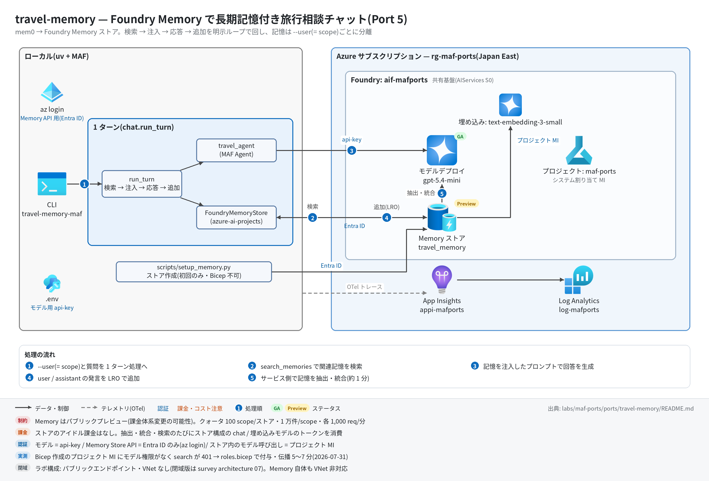

# travel-memory 実行ガイド

> **対象:** `labs/maf-ports/ports/travel-memory/`(Port 5・パターン: Foundry Memory による長期記憶 — 検索 → 注入 → 応答 → 追加の明示ループ)
> **最終確認:** 2026-09-29 オフライン(23 passed・`ruff check .` clean・依存 agent-framework-core 1.19.0 / agent-framework-openai 1.14.4 / azure-ai-projects 2.7.0 / openai 3.20.0)/ ライブ: 2026-07-31(当時の構成 core 1.12.1 / azure-ai-projects 2.4.0 / openai 2.51.0。Azure リソースは削除済み — 再デプロイ手順は §5)
> **正は本 Markdown。** 人間用 HTML(同じディレクトリの `runbook.html`)は `python3 labs/tools/build_runbooks.py` で生成する(HTML は直接編集しない)。設計判断と移植の学びは [README](../README.md)。

## 1. このパターンで確かめること

- 1 ターン目で伝えた嗜好(例: 窓側席・ベジタリアン)が、Foundry Memory の**非同期抽出(LRO)**を経て `--user` の scope に記憶として保存され、2 ターン目の `search_memories` でヒットして `Relevant past information:` としてプロンプトに注入されること。
- 記憶が `--user`(= Foundry の scope)単位で完全に分離され、`delete_scope` で丸ごと消せること。
- 技術選定上の意味: mem0 の `add` は同期だが Foundry は **LRO+debounce**(既定 `update_delay=300` 秒)。本ポートは `update_delay=0`+`previous_update_id` チェーンで毎ターン追加を近似するが、**「追加した事実がいつ検索に見えるか」の結果整合性は消えない**(README の学び 1)。Memory は**パブリックプレビュー**(VNet 非対応・課金体系変更の可能性あり)。

## 2. 構成



```text
質問 ─▶ MemoryStore.search(query, user)      Foundry: search_memories(scope=user, max_memories=5)
     ─▶ build_full_prompt                     "Relevant past information:\n- ...\n\nHuman: <質問>\nAI:"
     ─▶ travel_agent(MAF Agent)               Responses API(共有基盤のモデル)
     ─▶ MemoryStore.add(質問, role=user)      Foundry: begin_update_memories(update_delay=0, previous_update_id=…)
        MemoryStore.add(回答, role=assistant) (既定 fire-and-forget。--wait で LRO 完了まで待つ)
```

| コンポーネント | 役割 | 課金 |
| --- | --- | --- |
| CLI / `chat.run_turn`(ローカル) | 検索 → 注入 → 応答 → 追加の順序を保つ 1 ターン処理 | なし |
| MAF `Agent` travel_agent(`agents.py`) | `OpenAIChatClient`(Responses API)で共有基盤のモデルを api-key で呼ぶ | — |
| モデルデプロイ(共有基盤、既定 gpt-5.4-mini) | 回答生成+Memory ストアの chat_model(事実抽出・統合) | トークン従量 |
| 埋め込みデプロイ text-embedding-3-small | Memory ストアの embedding_model(記憶の検索) | トークン従量 |
| Foundry Memory ストア `travel_memory`(プロジェクトのデータプレーン、プレビュー) | 記憶の抽出・統合・検索。`scripts/setup_memory.py` で作成(Bicep 不可) | ストア自体のアイドル課金なし。抽出・検索時に上の 2 デプロイのトークンを消費 |
| App Insights(共有基盤) | OTel トレースの送信先(任意) | 取り込み量従量 |

クォータ(プレビュー): 100 scopes/ストア・10,000 memories/scope・search / update 各 1,000 req/min。

## 3. 前提

| 区分 | 必要なもの | 備考 |
| --- | --- | --- |
| ツール | uv(Python 3.11 以上。uv が取得。検証は 3.13)| オフライン実行はこれだけ |
| ツール(ライブ) | Azure CLI(`az login` 済み) | Memory Store API は **Entra ID 認証**(`DefaultAzureCredential`、audience `https://ai.azure.com/`)。チャットモデルは api-key |
| Azure(ライブのみ) | 共有基盤([infra/shared.bicep](../../../infra/shared.bicep))+第 2 段の [infra/roles.bicep](../../../infra/roles.bicep)+埋め込みデプロイ `text-embedding-3-small` | 埋め込みは Port 4 corrective-rag の `infra/main.bicep` が追加する(AI Search Free も一緒に作られる)。埋め込みだけ欲しい場合は §5.1 の az コマンド |
| 権限(サービス側) | プロジェクト MI とアカウント MI に **Cognitive Services OpenAI User+Foundry User**(roles.bicep が付与) | 欠けると `search_memories` が 401(Memory サービスがストア構成のモデルを MI で呼ぶため)。伝播に 5〜15 分 |
| 権限(実行ユーザー) | `az login` の ID にプロジェクト(またはアカウント)の **Foundry User**(旧名 Azure AI User、ロール ID `53ca6127-db72-4b80-b1b0-d745d6d5456d`) | Owner / Contributor はデータアクションを含まないため別途必要 |
| リージョン | 共有基盤は Japan East(Memory 対応 19 リージョンに含まれる) | VNet 統合は非対応 |

環境変数(`labs/maf-ports/.env`。雛形は `.env.example`。**ライブ実行時のみ必要**。読み込み順はカレントの `.env` → lab ルートの `.env` で、既にシェルにある値が優先):

| 変数 | 用途 | 取得元 |
| --- | --- | --- |
| `FOUNDRY_PROJECT_ENDPOINT` | Memory Store API の呼び先(`https://<foundry>.services.ai.azure.com/api/projects/maf-ports`)。必須 | shared.bicep の出力 `projectEndpoint`(本ポートの `infra/main.bicep` も同じ値を出力) |
| `FOUNDRY_OPENAI_V1_ENDPOINT` | モデル呼び出し先(`https://<foundry>.openai.azure.com/openai/v1`)。必須 | shared.bicep の出力 `openaiV1Endpoint` |
| `FOUNDRY_MODEL` | 回答用デプロイ名。`setup_memory.py` の chat_model の既定にもなる。必須 | shared.bicep の出力 `modelDeploymentName` |
| `FOUNDRY_API_KEY` | モデルの api-key 認証。必須(Memory API には使わない) | `az cognitiveservices account keys list -n <foundryName> -g <rg> --query key1 -o tsv` |
| `MEMORY_STORE_NAME` | Memory ストア名。任意(既定 `travel_memory`) | 自分で決める(`setup_memory.py` と CLI で同じ値) |
| `MEMORY_STORE_EMBEDDING_MODEL` | `setup_memory.py` が使う埋め込みデプロイ名。任意(既定 `text-embedding-3-small`) | 埋め込みデプロイ名 |
| `APPLICATIONINSIGHTS_CONNECTION_STRING` | トレース送信先。任意(未設定ならトレース無効で実行は続く) | shared.bicep の出力 `appInsightsConnectionString` |

## 4. オフライン実行(Azure 不要・無料)

```bash
cd labs/maf-ports/ports/travel-memory
uv sync --extra dev
uv run pytest                        # 期待: 23 passed, 1 deselected(live は既定で除外。ネットワーク不要)
uv run ruff check .                  # 期待: All checks passed!(図スクリプト docs/architecture.py を含む)
```

オフラインテストが固定している主な挙動(記憶層は `InMemoryFakeStore` / SDK 互換スタブ、LLM は ScriptedAgent):

- [ ] 1 ターンの順序が「search → 応答 → add(user)→ add(assistant)」で、add 時点で応答が確定している(`test_turn_order_search_inject_respond_add`)
- [ ] プロンプト書式が元アプリと 1 文字単位で一致し、記憶 0 件でもヘッダーだけは注入される(`test_build_full_prompt_matches_original_format` / `test_no_memories_still_injects_header`)
- [ ] 空応答は `ValueError` で、記憶への追加は行われない(`test_empty_answer_raises_and_skips_memory_add`)
- [ ] alice の記憶が bob のプロンプト・検索・一覧に漏れない(`test_user_scope_isolation_end_to_end` / `test_user_id_scope_isolation`)
- [ ] SDK 呼び出しの写像: user_id → `scope`、テキスト → `{"role", "type": "message", "content"}`、limit → `MemorySearchOptions.max_memories`(`test_search_maps_arguments_and_results` / `test_add_sends_message_item_with_role`)
- [ ] `previous_update_id` が scope ごとにチェーンされ、`update_delay` 既定 0、`wait_for_update=True` のときだけ LRO を待つ(`test_add_chains_previous_update_id_per_scope` / `test_update_delay_defaults_to_immediate` / `test_wait_for_update_awaits_lro_result`)
- [ ] `delete_all` が `delete_scope` を呼び、その scope のチェーンをリセットする(`test_delete_all_calls_delete_scope_and_resets_chain`)

## 5. ライブ実行(Azure 必要・課金あり)

### 5.1 デプロイ

```bash
# 共有基盤+roles.bicep が未作成なら先に作る(→ labs/maf-ports/infra/docs/runbook.md)。
# 埋め込みデプロイ: Port 4 の infra を流す(AI Search Free も作られる)か、埋め込みだけを追加する(例):
az cognitiveservices account deployment create -n aif-<baseName> -g <rg> \
  --deployment-name text-embedding-3-small --model-name text-embedding-3-small \
  --model-version 1 --model-format OpenAI --sku-name GlobalStandard --sku-capacity 10

# 任意: 共有基盤の存在確認とエンドポイント取得(existing 参照+出力のみのテンプレート)
cd labs/maf-ports/ports/travel-memory
az deployment group create -g <rg> -f infra/main.bicep -p baseName=<baseName> \
  --query properties.outputs -o json   # 期待: openaiV1Endpoint / projectEndpoint が返る

# Memory ストア作成(データプレーン。1 回だけ。要 az login)
uv sync --extra dev --extra live
uv run python scripts/setup_memory.py            # 既存ならスキップ。--recreate で作り直し
```

`setup_memory.py` の出力例:

```text
created memory store: travel_memory (id=...)
  chat_model=gpt-5.4-mini embedding_model=text-embedding-3-small
```

(2 回目以降は `memory store already exists: travel_memory (id=...)` と定義が表示される)

### 5.2 実行

```bash
uv run travel-memory-maf --user alice --wait --once "長距離便は必ず窓側席、機内食はベジタリアンです"
uv run travel-memory-maf --user alice --once "東京からロンドンの航空券、何をリクエストすべき?"
uv run travel-memory-maf --user alice --memories     # 抽出された記憶の一覧(元アプリの View My Memory)
uv run travel-memory-maf --user alice                # 対話モード(/memories で一覧、/quit で終了)
uv run pytest -m live                                # ライブスモーク(1 passed が期待。2026-07-31 は 139 秒)
```

`--wait` は記憶追加の LRO(抽出・統合)完了まで待つ。1 ターンあたり 1 分程度かかることがある。付けないと fire-and-forget で即座に戻る。

期待される出力の例(値は実行ごとに変わる。抽出される記憶の文面と件数は LLM 依存):

```text
[memory] 0 hits                                   ← stderr(1 ターン目。まだ記憶がない)
承知しました。窓側席とベジタリアン機内食ですね…  ← stdout(回答)

[memory] 2 hits                                   ← stderr(2 ターン目)
  - User prefers window seats on long-haul flights
  - User requests vegetarian in-flight meals
航空会社には窓側席の指定とベジタリアンミール(VGML 等)を…

Memory history for alice:                         ← --memories
- User prefers window seats on long-haul flights [user_profile]
- ... [chat_summary]
```

終了コードは 正常 0 / 環境変数不足 2(`error: 環境変数が未設定: ...`)。Memory API のエラー(401 / 404 など)は azure-core の例外のトレースバックで終わる。

## 6. 確認観点

| 確認 | # | 観点 | 確認方法 | 期待結果 |
| --- | --- | --- | --- | --- |
| [ ] | 1 | 正常系: 記憶の往復 | §5.2 の 1〜2 行目(1 ターン目は `--wait`) | 2 ターン目の stderr が `[memory] 1 hits` 以上で、嗜好(窓側・ベジタリアン)を含む記憶が表示され、回答がそれを踏まえている |
| [ ] | 2 | 記憶の型付け・統合 | `--memories` | 各行末に `[user_profile]` / `[chat_summary]` / `[procedural]` のいずれかの kind。同じ嗜好を言い直しても重複行が増え続けない(統合)。抽出は LLM 依存なので件数は固定しない |
| [ ] | 3 | パターン固有: 結果整合性 | 新しい `--user` で `--wait` なしに嗜好を伝え、直後に関連質問 → 1〜2 分後に同じ質問 | 直後は `[memory] 0 hits` になり得る(LRO 未完了)。時間をおくとヒットする。「記憶の鮮度がターン単位で要るか」の判断材料 |
| [ ] | 4 | scope 分離 | `uv run travel-memory-maf --user bob --once "東京からロンドンの航空券、何をリクエストすべき?"` と `--user bob --memories` | bob は `[memory] 0 hits`、一覧は `(no memories for user 'bob')`。alice の嗜好が回答に出ない |
| [ ] | 5 | 異常系: 設定不足 | `FOUNDRY_PROJECT_ENDPOINT= uv run travel-memory-maf --user x --once hi`(空文字はシェル側の値が優先され .env で上書きされない) | 終了コード 2、stderr に `error: 環境変数が未設定: FOUNDRY_PROJECT_ENDPOINT(labs/maf-ports/.env を確認。…)` |
| [ ] | 6 | 異常系: ストア未作成 | `MEMORY_STORE_NAME=no_such_store uv run travel-memory-maf --user alice --once hi` | `search_memories` が 404 系の HttpResponseError で終了(ライブ未確認)。検索が先なのでモデルは呼ばれず、記憶も追加されない |
| [ ] | 7 | パターン固有: サービス側 RBAC | roles.bicep 直後に #1 を実行 | 401 が出る場合は MI への Cognitive Services OpenAI User / Foundry User の伝播待ち(5〜15 分。ノード間で不均一で、一度通っても数分 401 が混ざることがある) |
| [ ] | 8 | 観測: トレース着信 | §7 の KQL | `invoke_agent travel_agent` と `chat <デプロイ名>` がターン数分出る。Memory API の呼び出しは HTTP / Azure SDK の依存関係として出る(名前は未確認) |
| [ ] | 9 | コスト | ポータルで 2 デプロイ(gpt-5.4-mini / text-embedding-3-small)のトークンメトリック | 1 ターン = 回答の chat 1 回+検索 1 回+追加 LRO 2 回(user / assistant の抽出・統合でチャットモデルと埋め込みを消費)。ストアのアイドル課金はない |
| [ ] | 10 | 後片付け | `uv run python scripts/setup_memory.py --delete` | `deleted memory store: travel_memory`。ライブスモークはテスト scope を `delete_scope` で自動掃除済み |

## 7. トレース・評価の確認

```bash
# スパン名ごとの件数(送信から着信まで数分かかることがある)
az monitor app-insights query --app appi-<baseName> -g <rg> \
  --analytics-query "dependencies | where timestamp > ago(30m) | summarize count() by name"
```

- 期待するスパン名: `invoke_agent travel_agent` / `chat <デプロイ名>`(ツールは使わないので `execute_tool` は出ない)。azure-monitor-opentelemetry 1.8.10 は httpx と Azure SDK を既定で計装するため、Memory API(`…/memory_stores/travel_memory:search_memories` など)や Responses API の HTTP 呼び出しも依存関係として並ぶ(1.8.9 時代のライブより行が増える。名前はライブ未確認)。
- 評価: [tests/eval_dataset.jsonl](../tests/eval_dataset.jsonl)(5 ケース)は全て多ターンシナリオ(座席+機内食 / 低予算宿 / 甲殻類アレルギー / scope 分離 / 嗜好の更新)。`--wait` でターン間の抽出完了を保証して流し、`TurnResult.prompt`(注入済み全文)を Relevance / Task adherence 評価器に渡せる形。クラウド評価の実装はない(評価 API の使い方は Port 9 critique-loop)。

## 8. 片付け

```bash
uv run python scripts/setup_memory.py --delete   # Memory ストアを削除(全 scope の記憶が消える)
# 共有基盤ごと消す場合:
az group delete -n <rg> --yes --no-wait
```

- 特定ユーザーの記憶だけ消す(GDPR 的な削除要求の再現)なら、`FoundryMemoryStore.delete_all(user_id)`(= `delete_scope`)を使う。CLI にはこのサブコマンドはない(ライブスモークが使用)。
- Memory ストアはリソースグループ削除でプロジェクトごと消える。埋め込みデプロイを az で追加した場合もアカウントと一緒に消える。

## 9. トラブルシューティング

| 症状 | 原因 | 対処 |
| --- | --- | --- |
| `error: 環境変数が未設定: ...`(終了コード 2) | `labs/maf-ports/.env` がない / 変数名の誤り | `.env.example` をコピーし、共有基盤の出力を転記。`FOUNDRY_PROJECT_ENDPOINT` を忘れやすい |
| `DefaultAzureCredential failed to retrieve a token` | `az login` していない / テナント違い | `az login`(必要なら `--tenant`)。Memory API は API キーでは呼べない |
| `search_memories` が 401 `ResourceError` | サービス側がストア構成モデルをプロジェクト MI で呼べない(Bicep 作成プロジェクトは自動付与されない) | roles.bicep を流したか確認し、5〜15 分待って再実行 |
| 403 / `PermissionDenied`(自分の呼び出し) | 実行ユーザーにデータプレーンのロールがない | プロジェクト(またはアカウント)に Foundry User を付与 |
| 404(ストア) | `setup_memory.py` 未実行 / `MEMORY_STORE_NAME` の不一致 | `setup_memory.py` で作成、名前を揃える |
| `setup_memory.py` が 400 系で失敗 | chat / embedding のデプロイ名が存在しない | `az cognitiveservices account deployment list -n <foundryName> -g <rg> -o table` で確認し `--chat-model` / `--embedding-model` で指定 |
| 記憶がいつまでも 0 件 | LRO 未完了 / 抽出対象の情報がない発言だった | `--wait` を付けて再実行。`--memories` で保存状況を直接見る |
| `tracing: App Insights 有効` が出ない | 接続文字列が未設定、または `--extra live` 未導入 | `uv sync --extra dev --extra live` と `APPLICATIONINSIGHTS_CONNECTION_STRING` を確認 |

## 10. 関連・更新履歴

- 設計判断と学び: [README](../README.md)
- 共有基盤(デプロイ・.env・RBAC・削除): [共有基盤の実行ガイド](../../../infra/docs/runbook.md)
- Memory の機能状況(プレビュー・クォータ・リージョン): [features/03-agent-service.md](../../../../../docs/survey/features/03-agent-service.md)
- 次のパターン: [github-mcp(Port 6・リモート MCP)](../../github-mcp/docs/runbook.md)

| 日付 | 内容 |
| --- | --- |
| 2026-09-29 | 初版(依存を agent-framework-core 1.19.0 / azure-ai-projects 2.7.0 / openai 3.20.0 に更新。Memory Store API の変更なしを確認。`setup_memory.py` の TTL を `timedelta(0)` に。構成図を v2(日本語・処理順バッジ・タグ付き注記)に更新し、図スクリプトも ruff clean に) |
