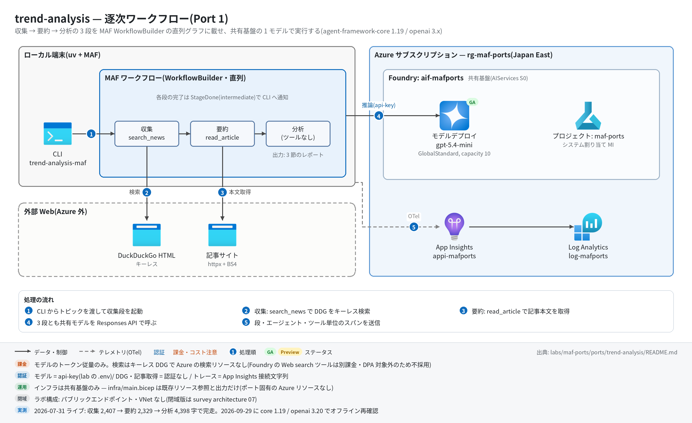

# trend-analysis 実行ガイド

> **対象:** `labs/maf-ports/ports/trend-analysis/`(Port 1・パターン: 逐次ワークフロー — 収集 → 要約 → 分析の 3 段直列)
> **最終確認:** 2026-09-29 オフライン(9 passed・ruff clean・依存 agent-framework-core 1.19.0 / agent-framework-openai 1.14.4 / openai 3.20.0)/ ライブ: 2026-07-31(当時の構成 core 1.12.1 / openai 2.51.0。Azure リソースは削除済み — 再デプロイ手順は §5)
> **正は本 Markdown。** 人間用 HTML(同じディレクトリの `runbook.html`)は `python3 labs/tools/build_runbooks.py` で生成する(HTML は直接編集しない)。設計判断と移植の学びは [README](../README.md)。

## 1. このパターンで確かめること

- トピック 1 つから、`CollectorExecutor`(search_news ツール)→ `SummarizerExecutor`(read_article ツール)→ `AnalyzerExecutor`(ツールなし)が**この順に 1 回ずつ**動き、前段の出力が次段のプロンプトに連鎖して、`## Emerging trends` / `## Startup opportunities` / `## Risks & unknowns` の 3 節を持つレポートが出ること。
- 段の完了が `stream=True` の intermediate イベント(`StageDone`)として CLI に流れ、トレース上も段(`executor.process`)・エージェント(`invoke_agent`)・ツール(`execute_tool`)単位に切れていること。
- 技術選定上の意味: この規模の直列処理をグラフ化する価値は「行数」ではなく**観測性と進捗イベント**にある(README の学び 1・4)。検索を Foundry の Web search ツールでなく自前キーレス DDG にした理由(DPA 対象外・別課金)は学び 2。

## 2. 構成



```text
topic ──▶ CollectorExecutor ──▶ SummarizerExecutor ──▶ AnalyzerExecutor ──▶ TrendReport
          (search_news tool)     (read_article tool)     (ツールなし)
進捗: collector / summarizer の yield_output → type="intermediate"(StageDone)→ CLI の stderr
```

| コンポーネント | 役割 | 課金 |
| --- | --- | --- |
| MAF Workflow(ローカル、`workflow.py`) | 3 Executor の直列グラフ(`WorkflowBuilder` + `add_edge` ×2) | なし |
| MAF `Agent` ×3(`agents.py`) | news_collector / summary_writer / trend_analyzer。`OpenAIChatClient`(Responses API)で共有基盤のモデルを呼ぶ | — |
| モデルデプロイ(共有基盤、既定 gpt-5.4-mini) | 3 役割で 1 デプロイを共用 | トークン従量 |
| search_news(`search.py` / `tools.py`) | DuckDuckGo HTML をキーレスで検索 | なし(外部サイト) |
| read_article(`tools.py`) | 記事 HTML を httpx で取得し本文を 6,000 字に切り詰め | なし(外部サイト) |
| App Insights(共有基盤) | OTel トレースの送信先(任意) | 取り込み量従量 |

## 3. 前提

| 区分 | 必要なもの | 備考 |
| --- | --- | --- |
| ツール | uv(Python 3.11 以上。uv が取得。検証は 3.13) | オフライン実行はこれだけ |
| Azure(ライブのみ) | 共有基盤([infra/shared.bicep](../../../infra/shared.bicep))のみ。本ポート固有のリソースはない(`infra/main.bicep` は existing 参照+出力だけ) | モデルのトークン従量+トレース取り込み |
| 権限 | モデル呼び出しは api-key(`FOUNDRY_API_KEY`)なので**データプレーンの RBAC は不要**。共有基盤のデプロイ権限は [共有基盤の実行ガイド](../../../infra/docs/runbook.md) §3 | roles.bicep(MI 向け)も本ポートには不要 |
| ネットワーク(ライブのみ) | `html.duckduckgo.com` と記事サイトへの外向き HTTPS | 社内プロキシ下では DDG がブロックされやすい(§9) |

環境変数(`labs/maf-ports/.env`。雛形は `.env.example`。**ライブ実行時のみ必要**。読み込み順はカレントの `.env` → lab ルートの `.env` で、既にシェルにある値が優先):

| 変数 | 用途 | 取得元 |
| --- | --- | --- |
| `FOUNDRY_OPENAI_V1_ENDPOINT` | モデル呼び出し先(`https://<foundry>.openai.azure.com/openai/v1`)。必須 | shared.bicep の出力 `openaiV1Endpoint` |
| `FOUNDRY_MODEL` | モデルデプロイ名(既定 gpt-5.4-mini)。必須 | shared.bicep の出力 `modelDeploymentName` |
| `FOUNDRY_API_KEY` | api-key 認証。必須 | `az cognitiveservices account keys list -n <foundryName> -g <rg> --query key1 -o tsv` |
| `APPLICATIONINSIGHTS_CONNECTION_STRING` | トレース送信先。任意(未設定ならトレース無効で実行は続く) | shared.bicep の出力 `appInsightsConnectionString` |

## 4. オフライン実行(Azure 不要・無料)

```bash
cd labs/maf-ports/ports/trend-analysis
uv sync --extra dev
uv run pytest            # 期待: 9 passed, 1 deselected(live は既定で除外。ネットワーク不要)
uv run ruff check .      # 期待: All checks passed!(図生成スクリプト docs/architecture.py も対象)
```

オフラインテストが固定している主な挙動:

- [ ] 3 段がこの順に 1 回ずつ呼ばれ、トピック → 収集結果 → 要約結果がプロンプトに連鎖し、分析にもトピックが渡る(`test_sequential_flow_and_prompt_chaining`)
- [ ] 進捗イベントは `["collect", "summarize"]` の 2 件、最終出力 `TrendReport` に全段の出力が残る(同上)
- [ ] `stream` なしの `workflow.run()` でも `TrendReport` が取れる(`test_run_without_stream_returns_output`)
- [ ] DDG の `/l/?uddg=` リダイレクトを実 URL に解決し、リンクのない結果・解決不能な href を捨てる(`test_parse_ddg_results_resolves_redirects` / `test_parse_ddg_skips_unresolvable_hrefs`)
- [ ] read_article が nav / script を除去して 6,000 字で切り詰め、HTTP エラーは例外でなく `(fetch failed: HTTP 404)` の文字列で返す(`test_read_article_strips_boilerplate_and_truncates` / `test_read_article_reports_http_error`)
- [ ] クロージャで作ったツールでも `__name__`・型ヒント・docstring が保たれ、MAF がツールスキーマを推論できる(`test_tool_signatures_are_introspectable`)

## 5. ライブ実行(Azure 必要・課金あり)

### 5.1 デプロイ

```bash
# 共有基盤が未作成なら先に作る(→ labs/maf-ports/infra/docs/runbook.md §5)。本ポート固有のリソースはない。
# 任意: 共有基盤の存在確認とエンドポイント取得(existing 参照+出力のみのテンプレート)
cd labs/maf-ports/ports/trend-analysis
az deployment group create -g <rg> -f infra/main.bicep -p baseName=<baseName> \
  --query properties.outputs -o json   # 期待: openaiV1Endpoint / projectEndpoint が返る
```

### 5.2 実行

```bash
uv sync --extra dev --extra live          # live = azure-monitor-opentelemetry(トレース送信)
uv run trend-analysis-maf "AI coding agents for enterprises"
uv run trend-analysis-maf --json "AI coding agents for enterprises" > report.json   # 全段の出力を JSON で
uv run pytest -m live                     # ライブスモーク(topic "AI coding agents"。1 passed が期待)
```

期待される出力の例(値は実行ごとに変わる。文字数は 2026-07-31 のライブ実測):

```text
tracing: App Insights 有効                 ← stderr(接続文字列があり live extra 導入時のみ)
[collect] done (2407 chars)               ← stderr
[summarize] done (2329 chars)             ← stderr
## Emerging trends                         ← stdout(analysis_md。この例は 4,398 chars)
- ...
## Startup opportunities
- ...
## Risks & unknowns
- ...
```

`--json` の形: `{"topic": ..., "articles_md": ..., "summaries_md": ..., "analysis_md": ...}`。終了コードは 正常 0 / 環境変数不足 2 / レポートなし 1。

## 6. 確認観点

| 確認 | # | 観点 | 確認方法 | 期待結果 |
| --- | --- | --- | --- | --- |
| [ ] | 1 | 正常系: 3 段完走 | §5.2 の CLI を実行 | stderr に `[collect] done` → `[summarize] done` の順で出て、stdout に 3 節(Emerging trends / Startup opportunities / Risks & unknowns)の Markdown |
| [ ] | 2 | プロンプト連鎖(段間の受け渡し) | `--json` の出力で `articles_md` と `summaries_md` を見比べる | `articles_md` の記事 URL が `summaries_md` にも残り、`analysis_md` の根拠が要約由来になっている(汎用論だけになっていない) |
| [ ] | 3 | ツール呼び出し | トレース(§7)で `execute_tool` の件数を数える | `execute_tool search_news` が 2〜3 件(指示は 2〜3 クエリ)、`execute_tool read_article` が 3〜5 件前後 |
| [ ] | 4 | 異常系: 設定不足 | `FOUNDRY_API_KEY= uv run trend-analysis-maf x`(空文字はシェル側の値が優先され .env で上書きされない) | 終了コード 2、stderr に `error: 環境変数が未設定: FOUNDRY_API_KEY(labs/maf-ports/.env を確認。雛形は .env.example)` |
| [ ] | 5 | 異常系: 検索・取得の失敗 | DDG が 202/403 を返す環境(プロキシ下など)で実行、または記事が 404 | ワークフローは落ちずに完走する。DDG 失敗時はツール例外がモデルに `Error: Function failed.` として返り(2026-09-29 モックで確認・ライブ未確認)、収集結果が薄くなる。記事取得失敗は `(fetch failed: ...)` を受けた summarizer がスニペットから要約する |
| [ ] | 6 | 観測: トレース着信 | §7 の KQL | `invoke_agent` 3 種(news_collector / summary_writer / trend_analyzer)、`executor.process` 3 種、`workflow.run` 1 件が数分以内に `dependencies` に出る |
| [ ] | 7 | コスト | §7 のトークン集計 KQL / ポータルのデプロイのメトリック | 1 回の実行 = `chat` 呼び出しが最小 5 回(3 役割+ツール往復 2 回。モデルがツールを分けて呼ぶほど増える)。検索・記事取得は無料 |
| [ ] | 8 | 後片付け | 本ポート固有のリソースはない | 共有基盤を使い終えたら [共有基盤の実行ガイド](../../../infra/docs/runbook.md) §8 で RG ごと削除 |

## 7. トレース・評価の確認

```bash
# スパン名ごとの件数(送信から着信まで数分かかることがある)
az monitor app-insights query --app appi-<baseName> -g <rg> \
  --analytics-query "dependencies | where timestamp > ago(30m) | summarize count() by name"

# トークン使用量(chat スパンの GenAI 属性)
az monitor app-insights query --app appi-<baseName> -g <rg> \
  --analytics-query "dependencies | where timestamp > ago(30m) and name startswith 'chat' | summarize input=sum(toint(customDimensions['gen_ai.usage.input_tokens'])), output=sum(toint(customDimensions['gen_ai.usage.output_tokens']))"
```

- 期待するスパン名(2026-09-29 に agent-framework-core 1.19.0 のインメモリ OTel で確認): `workflow.build` / `workflow.run` / `executor.process collector|summarizer|analyzer` / `invoke_agent news_collector|summary_writer|trend_analyzer` / `chat <デプロイ名>` / `execute_tool search_news|read_article` / `edge_group.process ...` / `message.send`。ポータルではプロジェクトの「トレース」(共有基盤の AppInsights 接続経由)でも見える。
- 評価: `tests/eval_dataset.jsonl`(5 ケース、`topic` + `expected_traits`)は期待する性質の記述。クラウド評価は未実装(スコアの合否ラインは設けない方針。評価 API の使い方は Port 9 critique-loop)。

## 8. 片付け

```bash
# 本ポート固有のリソースはない。共有基盤ごと消す場合:
az group delete -n <rg> --yes --no-wait
```

- 同じ `baseName` で作り直す場合は Foundry アカウントの soft delete(48 時間)に注意 — [共有基盤の実行ガイド](../../../infra/docs/runbook.md) §8。
- ローカルの生成物(`report.json` など)は手で削除する。

## 9. トラブルシューティング

| 症状 | 原因 | 対処 |
| --- | --- | --- |
| `error: 環境変数が未設定: ...`(終了コード 2) | `labs/maf-ports/.env` がない / 変数名の誤り | `.env.example` をコピーし、共有基盤の出力を転記(共有基盤の実行ガイド §5.5) |
| 401 / `invalid api key` | キーの誤り、または Foundry アカウントでローカル認証が無効(`disableLocalAuth: true`) | `az cognitiveservices account keys list` で再取得。共有基盤は `disableLocalAuth: false` が前提 |
| 404 `DeploymentNotFound` | `FOUNDRY_MODEL` がデプロイ名と一致しない | `az cognitiveservices account deployment list -n <foundryName> -g <rg> -o table` の名前に合わせる |
| 429 Too Many Requests | 共有基盤の容量(`modelCapacity` 既定 10 = 10K TPM)超過 | 少し待って再実行。常用するなら shared.bicep の `modelCapacity` を上げて再デプロイ |
| 収集結果が空・`Error: Function failed.` 相当 | DDG の HTML エンドポイントが 202/403 でブロック(レート制限・プロキシ) | 時間をおく / 別ネットワークで実行。恒久策は検索層の差し替え(README 学び 2 の比較を参照) |
| `tracing: App Insights 有効` が出ない | 接続文字列が未設定、または `--extra live` 未導入(警告ログのみで実行は続く) | `uv sync --extra dev --extra live` と `APPLICATIONINSIGHTS_CONNECTION_STRING` を確認 |
| KQL で 0 件 | 着信遅延 / 別の App Insights を見ている | 数分待つ。`--app` が `.env` の接続文字列と同じリソースか確認 |

## 10. 関連・更新履歴

- 設計判断と学び: [README](../README.md)
- 共有基盤(デプロイ・.env・RBAC・削除): [共有基盤の実行ガイド](../../../infra/docs/runbook.md)
- 観測性・評価の機能状況: [features/05-observability-evaluation.md](../../../../../docs/survey/features/05-observability-evaluation.md)
- 次のパターン: [mixture-of-agents(Port 2・並列+集約)](../../mixture-of-agents/docs/runbook.md)

| 日付 | 内容 |
| --- | --- |
| 2026-09-29 | 初版。構成図を v2(日本語・処理順バッジ)に更新(依存を agent-framework-core 1.19.0 / openai 3.20.0 に更新、コード改修なし。モックで Responses API の要求形とスパン名を再確認) |
